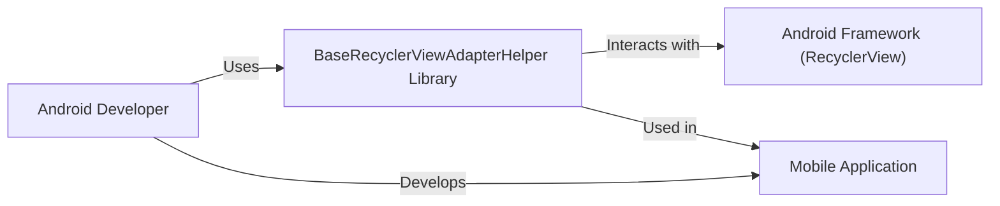
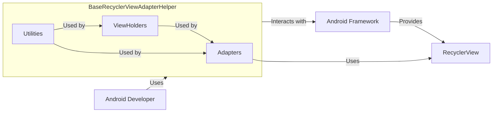
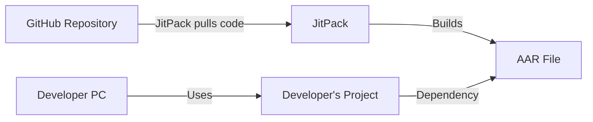
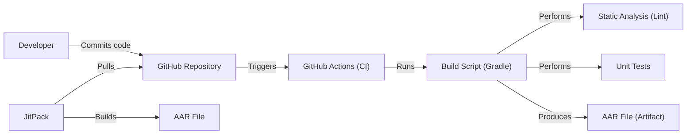

# BUSINESS POSTURE

Business Priorities and Goals:

*   Provide a reusable and easy-to-use library for Android developers to simplify the implementation of RecyclerView adapters.
*   Reduce boilerplate code for common RecyclerView operations.
*   Improve developer productivity and code maintainability.
*   Offer a flexible and customizable solution for various RecyclerView use cases.
*   Gain popularity and adoption within the Android development community.

Business Risks:

*   Low adoption rate due to lack of awareness or competition from similar libraries.
*   Bugs or performance issues that could frustrate users and damage the library's reputation.
*   Difficulty in maintaining the library and keeping it up-to-date with the latest Android versions and best practices.
*   Security vulnerabilities that could be exploited in applications using the library.
*   Lack of contribution from the community.

# SECURITY POSTURE

Existing Security Controls:

*   security control: The library itself does not handle sensitive data directly. It primarily deals with UI-related operations. (Implicit in the library's functionality)
*   security control: The library does not perform any network operations or data storage. (Implicit in the library's functionality)
*   security control: Code is publicly available on GitHub, allowing for community review and identification of potential issues. (GitHub repository)

Accepted Risks:

*   accepted risk: The library relies on the application developer to implement proper security measures for data handling, network communication, and other sensitive operations.
*   accepted risk: The library does not include specific security features like encryption or authentication, as these are outside its scope.

Recommended Security Controls:

*   security control: Implement static code analysis (e.g., using Android Lint or other tools) to identify potential vulnerabilities and code quality issues.
*   security control: Add unit tests and integration tests to ensure the library functions as expected and to prevent regressions.
*   security control: Document security considerations for developers using the library, emphasizing the importance of secure coding practices in their applications.
*   security control: Establish a process for handling security vulnerability reports from the community.
*   security control: Regularly review and update dependencies to address any known vulnerabilities.

Security Requirements:

*   Authentication: Not applicable, as the library does not handle user authentication.
*   Authorization: Not applicable, as the library does not handle user authorization.
*   Input Validation: The library should handle invalid input gracefully, such as null values or unexpected data types, to prevent crashes or unexpected behavior. It should not introduce any vulnerabilities through its handling of adapter data.
*   Cryptography: Not applicable, as the library does not handle encryption or decryption.

# DESIGN

## C4 CONTEXT

Element Descriptions:

*   Element:
    *   Name: Android Developer
    *   Type: Person
    *   Description: A software developer who builds Android applications.
    *   Responsibilities: Uses the BaseRecyclerViewAdapterHelper library to simplify RecyclerView implementation.
    *   Security controls: Implements application-level security controls.

*   Element:
    *   Name: BaseRecyclerViewAdapterHelper Library
    *   Type: Software System
    *   Description: A library that simplifies the implementation of RecyclerView adapters in Android applications.
    *   Responsibilities: Provides reusable components and utilities for RecyclerView.
    *   Security controls: Input validation, static code analysis, unit tests.

*   Element:
    *   Name: Android Framework (RecyclerView)
    *   Type: Software System
    *   Description: The standard Android UI component for displaying lists and grids.
    *   Responsibilities: Manages the display and scrolling of list items.
    *   Security controls: Relies on Android framework security features.

*   Element:
    *   Name: Mobile Application
    *   Type: Software System
    *   Description: Android application that is using BaseRecyclerViewAdapterHelper.
    *   Responsibilities: Provides application functionality to the end user.
    *   Security controls: Implements application-level security controls.

## C4 CONTAINER

Element Descriptions:

*   Element:
    *   Name: Android Developer
    *   Type: Person
    *   Description: A software developer who builds Android applications.
    *   Responsibilities: Uses the BaseRecyclerViewAdapterHelper library to simplify RecyclerView implementation.
    *   Security controls: Implements application-level security controls.

*   Element:
    *   Name: BaseRecyclerViewAdapterHelper Library
    *   Type: Software System
    *   Description: A library that simplifies the implementation of RecyclerView adapters in Android applications.
    *   Responsibilities: Provides reusable components and utilities for RecyclerView.
    *   Security controls: Input validation, static code analysis, unit tests.

*   Element:
    *   Name: Android Framework
    *   Type: Software System
    *   Description: The standard Android UI component for displaying lists and grids.
    *   Responsibilities: Manages the display and scrolling of list items.
    *   Security controls: Relies on Android framework security features.

*   Element:
    *   Name: Adapters
    *   Type: Container
    *   Description: Contains base adapter classes that extend RecyclerView.Adapter.
    *   Responsibilities: Provides core adapter functionality and customization options.
    *   Security controls: Input validation.

*   Element:
    *   Name: ViewHolders
    *   Type: Container
    *   Description: Contains base ViewHolder classes.
    *   Responsibilities: Holds and manages views for list items.
    *   Security controls: None.

*   Element:
    *   Name: Utilities
    *   Type: Container
    *   Description: Provides utility classes and helper methods.
    *   Responsibilities: Offers common functionalities used by adapters and ViewHolders.
    *   Security controls: None.

*   Element:
    *   Name: RecyclerView
    *   Type: Container
    *   Description: Android Framework RecyclerView.
    *   Responsibilities: Display list of items.
    *   Security controls: Relies on Android framework security features.

## DEPLOYMENT

Possible Deployment Solutions:

1.  JitPack: Developers can include the library in their projects by adding the JitPack repository and the library's dependency to their build.gradle file.
2.  Maven Central: The library can be published to Maven Central, a widely used repository for Java and Android libraries.
3.  Local build: Developers can clone the repository and build the library locally.

Chosen Deployment Solution (JitPack):

Element Descriptions:

*   Element:
    *   Name: GitHub Repository
    *   Type: Source Code Repository
    *   Description: The public repository hosting the library's source code.
    *   Responsibilities: Stores the code, manages versions, and allows for collaboration.
    *   Security controls: GitHub's built-in security features, access controls.

*   Element:
    *   Name: JitPack
    *   Type: Build Service
    *   Description: A build service that compiles code directly from GitHub repositories.
    *   Responsibilities: Builds the library into an AAR file.
    *   Security controls: JitPack's security measures, dependency scanning (if configured).

*   Element:
    *   Name: AAR File
    *   Type: Artifact
    *   Description: The compiled Android Archive file containing the library's code and resources.
    *   Responsibilities: Provides the library to be included in Android projects.
    *   Security controls: None.

*   Element:
    *   Name: Developer's Project
    *   Type: Software System
    *   Description: The Android application that uses the BaseRecyclerViewAdapterHelper library.
    *   Responsibilities: Implements the application's functionality.
    *   Security controls: Application-level security controls.

*   Element:
    *   Name: Developer PC
    *   Type: Device
    *   Description: Developer machine.
    *   Responsibilities: Used for development.
    *   Security controls: Application-level security controls.

*   Element:
    *   Name: Developer
    *   Type: Person
    *   Description: Android application developer.
    *   Responsibilities: Develops Android application.
    *   Security controls: Application-level security controls.

## BUILD

Build Process Description:

1.  Developer commits code changes to the GitHub repository.
2.  GitHub Actions (or a similar CI system) is triggered by the commit.
3.  The build script (using Gradle) is executed.
4.  Static analysis (using Android Lint) is performed to identify potential code quality and security issues.
5.  Unit tests are executed to verify the functionality of the library.
6.  If all checks pass, the build script produces an AAR file (Android Archive) as the build artifact.
7.  JitPack pulls code from GitHub repository and builds AAR file.

Security Controls in Build Process:

*   security control: Static Analysis (Lint): Identifies potential vulnerabilities and code quality issues.
*   security control: Unit Tests: Ensures code functionality and helps prevent regressions.
*   security control: GitHub Actions (CI): Automates the build process and ensures consistency.
*   security control: Dependency Management (Gradle): Manages external libraries and helps track their versions.

# RISK ASSESSMENT

Critical Business Processes:

*   Providing a stable and reliable library for RecyclerView implementation.
*   Maintaining the library's reputation and user trust.

Data Protection:

*   The library itself does not handle any sensitive data directly.
*   Data sensitivity is the responsibility of the applications that use the library. The library should not introduce any vulnerabilities that could compromise data handled by the application.

# QUESTIONS & ASSUMPTIONS

Questions:

*   Are there any specific performance requirements for the library?
*   Are there any plans to support other list-like UI components besides RecyclerView in the future?
*   What is the expected level of contribution from the community?

Assumptions:

*   BUSINESS POSTURE: The primary goal is to provide a utility library, not a full-fledged framework.
*   SECURITY POSTURE: The library will not handle sensitive data directly. Security is primarily the responsibility of the application using the library.
*   DESIGN: The library will be designed for ease of use and flexibility, with a focus on common RecyclerView use cases.