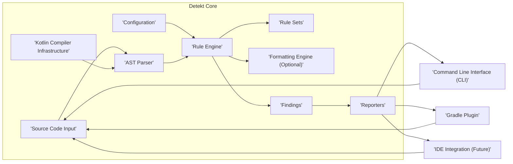
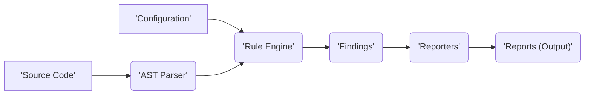

# Project Design Document: Detekt - Static Code Analysis for Kotlin

**Version:** 1.1
**Date:** October 26, 2023
**Author:** AI Software Architect

## 1. Introduction

This document provides an enhanced and detailed design overview of the Detekt project, a static code analysis tool for the Kotlin programming language. The primary goal of this document is to clearly articulate the architecture, components, and data flow within Detekt, specifically to facilitate comprehensive threat modeling activities.

Detekt empowers developers to proactively identify potential bugs, code style violations, and maintainability issues within their Kotlin codebase. Its design emphasizes configurability and extensibility, enabling users to tailor the analysis process to their unique requirements and coding standards.

## 2. Goals of this Document

*   Provide a comprehensive and refined architectural overview of the Detekt project.
*   Clearly identify key components, detailing their responsibilities and potential security relevance.
*   Precisely describe the data flow within the system, from initial input to final output, highlighting transformation points.
*   Serve as a robust foundation for subsequent threat modeling exercises, enabling identification of potential vulnerabilities.
*   Document the configuration and deployment aspects of Detekt, with a focus on elements relevant to security considerations.

## 3. Project Overview

Detekt functions by meticulously parsing Kotlin source code and subsequently applying a defined set of rules – either predefined or custom – to pinpoint potential issues. Its flexible design allows for seamless integration into diverse development workflows, encompassing command-line execution and build tool integrations like Gradle.

The core functionalities of Detekt encompass:

*   **Parsing:**  The conversion of Kotlin source code into a structured Abstract Syntax Tree (AST) representation.
*   **Rule Application:** The execution of a curated collection of rules against the generated AST to detect deviations from desired code quality or style.
*   **Reporting:** The generation of detailed reports outlining the identified issues, including their location and nature.
*   **Configuration:**  The mechanism by which users customize Detekt's behavior, including the selection of active rules, adjustment of severity levels, and specification of output formats.

## 4. Detailed Design

### 4.1. Component Diagram

### 4.2. Component Descriptions

*   **Source Code Input:** Represents the Kotlin files or directories that Detekt analyzes. This input can originate directly from the file system or be provided programmatically through integrations with build tools. *Security Relevance:* The integrity of the source code input is crucial. Maliciously crafted code could potentially exploit vulnerabilities in the parsing or rule execution stages.
*   **Configuration:** Encompasses the settings that govern Detekt's operational behavior. This includes specifying enabled rules, setting severity thresholds for violations, and defining output formats. Configuration can be supplied via YAML files, command-line arguments, or Gradle Domain Specific Language (DSL). *Security Relevance:* Improperly configured rules or the loading of untrusted configuration files could lead to bypassed security checks or unexpected behavior.
*   **Kotlin Compiler Infrastructure:**  Detekt leverages components from the official Kotlin compiler to perform the initial parsing and understanding of the source code. This ensures accurate representation of the code's structure. *Security Relevance:*  Detekt's reliance on the Kotlin compiler means it inherits any potential vulnerabilities present in the compiler itself.
*   **AST Parser:** This component is responsible for transforming the raw Kotlin source code into an Abstract Syntax Tree (AST). The AST provides a structured, hierarchical representation of the code's elements. *Security Relevance:*  Vulnerabilities in the AST parser could allow for denial-of-service attacks through specially crafted input that causes parsing errors or excessive resource consumption.
*   **Rule Engine:** The central component that orchestrates the analysis process. It iterates through the AST and applies the configured rules to each node, checking for violations. *Security Relevance:*  Bugs or vulnerabilities within the Rule Engine could lead to incorrect analysis results or the execution of unintended code if custom rules are permitted.
*   **Rule Sets:** Collections of individual rules, each designed to detect specific code quality or style issues. These rule sets can be the built-in defaults provided by Detekt or custom rules defined by users. *Security Relevance:*  Custom rules, if not carefully vetted, could introduce malicious logic or expose sensitive information. The integrity of built-in rule sets is also important.
*   **Formatting Engine (Optional):** An optional component that can automatically correct certain code style violations based on the active formatting rules. This is a distinct feature from the core analysis. *Security Relevance:* While primarily focused on formatting, vulnerabilities in this engine could potentially lead to unexpected code modifications.
*   **Findings:** Represents the identified violations of the defined rules. Each finding includes details about the location of the issue in the source code and a descriptive message explaining the violation. *Security Relevance:* The information contained in findings should be handled securely, especially if it reveals potential security flaws in the codebase.
*   **Reporters:** Components responsible for formatting and outputting the generated findings in various formats, such as plain text, XML, HTML, or JSON. *Security Relevance:* Reporters handle potentially sensitive information. Vulnerabilities could lead to information disclosure if output destinations are not properly secured.
*   **Command Line Interface (CLI):** Provides a direct command-line interface for executing Detekt. This offers flexibility for local analysis, scripting, and integration with other command-line tools. *Security Relevance:* The CLI needs to handle input parameters securely to prevent command injection or other vulnerabilities.
*   **Gradle Plugin:** Enables seamless integration of Detekt into Gradle-based Kotlin projects. This allows for automated code analysis as part of the standard build process. *Security Relevance:* The Gradle plugin interacts with the build system and needs to be secured against potential manipulation of the build process.
*   **IDE Integration (Future):** Represents potential future integrations with Integrated Development Environments (IDEs) to provide real-time feedback and analysis directly within the developer's coding environment. *Security Relevance:* IDE integrations would require secure communication and handling of code and analysis results within the IDE environment.

## 5. Data Flow

The primary data flow within Detekt follows these stages:

1. **Input:** The process commences with the ingestion of Kotlin source code and configuration settings.
    *   Source code is read from the specified file system locations or provided through build tool integrations.
    *   Configuration parameters are loaded from YAML files, command-line arguments, or Gradle build scripts.
2. **Parsing:** The Kotlin Compiler Infrastructure and the AST Parser collaborate to process the input source code, generating a detailed Abstract Syntax Tree (AST).
3. **Rule Application:** The Rule Engine takes the generated AST and iterates through its nodes. For each node, it applies the rules defined within the active Rule Sets.
4. **Finding Generation:** When a rule identifies a violation within the AST, a "Finding" object is created. This object encapsulates comprehensive details about the identified issue and its precise location within the source code.
5. **Reporting:** The collection of generated Findings is then passed to the configured Reporters.
6. **Output:** The Reporters format the Findings according to their specific output format and write the resulting reports to the designated output destinations, which can include the console, files, or other configured locations.

## 6. Key Components and their Interactions

*   **CLI/Gradle Plugin interacts with Core:** The CLI and Gradle plugin serve as the primary entry points for initiating Detekt analysis. Their responsibilities include:
    *   Loading and interpreting configuration settings.
    *   Locating the target Kotlin source code to be analyzed.
    *   Invoking the core Detekt engine to perform the analysis.
    *   Handling the output of generated reports.
*   **Core Engine orchestrates Analysis:** The Core Engine acts as the central orchestrator of the entire analysis process. Its key functions are:
    *   Receiving the source code and configuration from the entry points.
    *   Utilizing the AST Parser to create the code's structural representation.
    *   Managing the Rule Engine and the application of rules.
    *   Collecting the generated Findings from the Rule Engine.
    *   Invoking the configured Reporters to format and output the results.
*   **Rule Engine applies Rules:** The Rule Engine is specifically responsible for the core logic of code analysis:
    *   Loading and managing the active Rule Sets.
    *   Traversing the Abstract Syntax Tree (AST) of the source code.
    *   Executing individual rules against the nodes within the AST.
    *   Generating "Finding" objects whenever a rule violation is detected.
*   **Reporters format Output:** Reporters are responsible for presenting the analysis results in a user-friendly manner:
    *   Formatting the collected Findings according to the specified output format (e.g., plain text, XML, HTML).
    *   Writing the formatted reports to the designated output destination, which could be the console, a file, or another configured location.

## 7. Configuration

Detekt offers a flexible configuration system through several mechanisms:

*   **YAML Configuration Files (`detekt.yml`):** This is the primary and most comprehensive method for configuring Detekt's behavior. The YAML file allows for granular control over rules, thresholds, and various other settings.
    *   Users can selectively enable or disable individual rules within rule sets.
    *   Users can adjust the severity level assigned to findings generated by specific rules.
    *   Users can define custom threshold values for rules that rely on numerical limits.
    *   Users have the ability to define and include entirely custom rule sets. *Security Relevance:*  Care must be taken to ensure the integrity of `detekt.yml` files, as malicious modifications could disable important security checks or introduce vulnerabilities.
*   **Command-Line Arguments:** The Detekt CLI accepts various command-line arguments that can override settings defined in the YAML configuration file or provide basic configuration options directly.
    *   Specifying the path to alternative configuration files.
    *   Selecting the desired output format for reports.
    *   Filtering the set of rules to be executed during analysis. *Security Relevance:*  Command-line arguments should be handled carefully to prevent injection attacks or the unintended modification of analysis behavior.
*   **Gradle DSL:** When Detekt is integrated into a Gradle project, configuration can be managed directly within the `build.gradle.kts` (or `build.gradle`) file using a dedicated Detekt extension.
    *   Specifying the location of configuration files.
    *   Configuring the reporters to be used and their output destinations.
    *   Defining dependencies for custom rule sets or plugins. *Security Relevance:*  The security of the Gradle build script is paramount, as malicious modifications could compromise the Detekt analysis process.

## 8. Deployment

Detekt can be deployed and utilized in several common scenarios:

*   **Local Execution via CLI:** Developers can download the standalone Detekt CLI JAR file and execute it directly against their codebase from the command line. This is particularly useful for ad-hoc analysis during local development and for scripting automated checks.
*   **Integration with Gradle Builds:** The official Detekt Gradle plugin enables seamless integration into Gradle-based Kotlin projects. This allows for automated code analysis as an integral part of the software build process, ensuring consistent code quality checks.
*   **Integration in CI/CD Pipelines:** Detekt can be readily integrated into Continuous Integration/Continuous Deployment (CI/CD) pipelines. This enables automated analysis of code changes whenever new code is committed, helping to prevent the introduction of new code quality issues and potential vulnerabilities.
*   **Potential Future IDE Integration:** While not a primary deployment method currently, future development may include robust IDE plugins that provide real-time feedback and analysis directly within the developer's Integrated Development Environment.

## 9. Security Considerations (Detailed for Threat Modeling)

This section expands on potential security considerations to provide a more detailed foundation for subsequent threat modeling activities.

*   **Configuration Vulnerabilities:**
    *   **Malicious Configuration Files:**  If Detekt is configured to load configuration files from untrusted sources, a malicious actor could introduce a `detekt.yml` file that disables critical security rules, lowers severity thresholds to mask vulnerabilities, or configures reporters to exfiltrate sensitive information.
    *   **Configuration Injection:**  If configuration parameters are constructed from user-provided input without proper sanitization, it might be possible to inject malicious configuration settings that alter Detekt's behavior.
*   **Custom Rule Security:**
    *   **Malicious Custom Rules:**  The ability to define and load custom rules introduces a risk. A malicious user could create a custom rule that contains arbitrary code execution capabilities, potentially compromising the system running Detekt.
    *   **Vulnerable Custom Rules:** Even unintentionally, poorly written custom rules could introduce vulnerabilities, such as denial-of-service conditions or information leaks.
*   **Dependency Management:**
    *   **Vulnerable Dependencies:** Detekt relies on external libraries, including the Kotlin compiler. Vulnerabilities in these dependencies could be exploited if not properly managed and updated. This includes transitive dependencies.
    *   **Dependency Confusion:**  If Detekt's dependency resolution is not strictly controlled, there's a potential for dependency confusion attacks, where malicious packages with the same name as internal dependencies are introduced.
*   **Reporting Output Security:**
    *   **Information Disclosure:**  Detekt reports might inadvertently include sensitive information, such as file paths, internal code snippets, or potential vulnerability locations. If these reports are not stored or transmitted securely, this information could be exposed.
    *   **Report Tampering:** If report files are written to locations without proper access controls, malicious actors could tamper with the reports to hide evidence of vulnerabilities.
*   **Input Handling Vulnerabilities:**
    *   **Path Traversal:** If Detekt processes file paths provided as input without proper validation, attackers might be able to access or analyze files outside the intended project scope.
    *   **Denial of Service through Malformed Input:**  Specially crafted Kotlin source code could potentially exploit vulnerabilities in the parser or rule engine, leading to excessive resource consumption or crashes.
*   **CLI and Gradle Plugin Security:**
    *   **Command Injection (CLI):** If the CLI accepts user input that is not properly sanitized before being used in system commands, it could be vulnerable to command injection attacks.
    *   **Build Script Manipulation (Gradle Plugin):**  If the Gradle build script is compromised, an attacker could modify the Detekt plugin configuration or execution to bypass analysis or introduce malicious steps.

## 10. Future Considerations

*   **Enhanced Security Auditing Capabilities:** Implementing features to audit configuration changes and custom rule deployments.
*   **Improved Input Sanitization:** Strengthening input validation and sanitization across all input vectors.
*   **Secure Rule Distribution Mechanisms:** Exploring secure methods for distributing and verifying custom rule sets.
*   **Integration with Security Scanning Tools:**  Developing integrations with other security scanning tools to provide a more comprehensive security analysis workflow.
*   **Fine-grained Access Control for Configuration:** Implementing more granular access control mechanisms for managing Detekt configurations in larger teams.

This enhanced design document provides a more detailed and security-focused overview of the Detekt project. The expanded component descriptions, refined data flow diagrams, and detailed security considerations will serve as a valuable resource for conducting thorough threat modeling and identifying potential areas for security improvement.