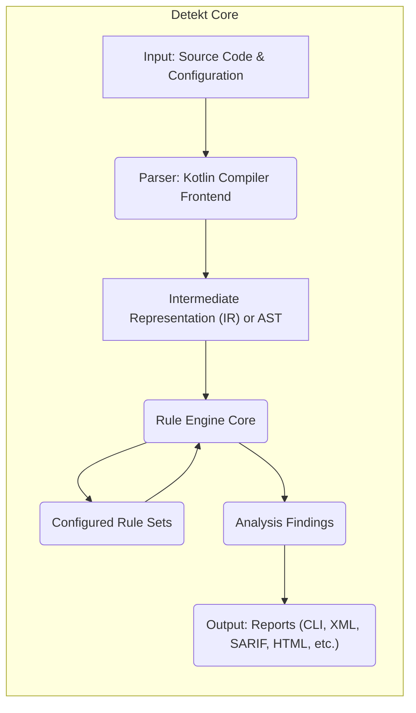
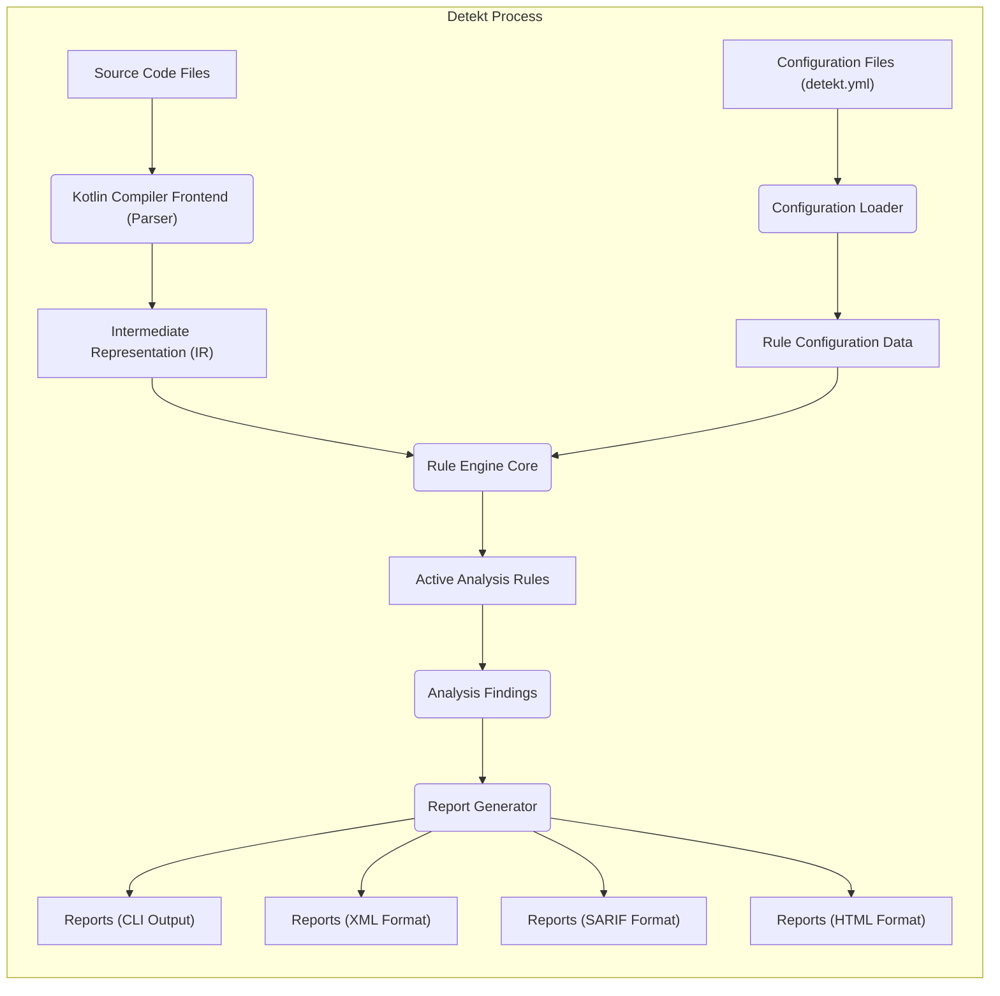

# Project Design Document: Detekt - Static Code Analysis for Kotlin

**Version:** 1.1
**Date:** October 26, 2023
**Author:** AI Software Architect

## 1. Project Overview

Detekt is a static code analysis tool specifically designed for the Kotlin programming language. Its primary objective is to enhance code quality and maintainability by automatically identifying potential bugs, stylistic inconsistencies, code smells, and complexity issues within Kotlin codebases. Detekt achieves this by parsing Kotlin source code and applying a highly configurable set of rules. The analysis results are presented in various report formats, enabling developers to proactively address identified problems.

This document provides a comprehensive architectural overview of Detekt, focusing on the key components, their interactions, and the flow of data. This information is crucial for subsequent threat modeling exercises.

## 2. Goals

* To present a clear and detailed overview of Detekt's architectural design.
* To precisely identify the key components within Detekt and elucidate their interactions.
* To thoroughly describe the data flow within the Detekt system, from input to output.
* To highlight potential areas of security concern and attack surfaces within Detekt, specifically for future threat modeling activities.

## 3. Non-Goals

* To provide an exhaustive, low-level implementation guide detailing Detekt's internal workings.
* To cover every single feature, configuration option, or rule available within Detekt.
* To include performance benchmarks, optimization strategies, or resource utilization analysis.
* To detail the specific implementation logic of each individual rule within Detekt's rule sets.

## 4. Target Audience

This document is primarily intended for:

- Security engineers tasked with performing threat modeling and security assessments on the Detekt project.
- Developers contributing to the Detekt project who require a high-level understanding of its architecture and data flow.
- DevOps engineers responsible for integrating Detekt into build pipelines and CI/CD environments.

## 5. System Architecture

Detekt's architecture can be conceptually divided into three primary stages:

- **Input Stage:**  The process of receiving Kotlin source code and configuration parameters.
- **Processing Stage:** The core analysis phase where code is parsed and rules are applied.
- **Output Stage:** The generation and presentation of analysis reports.

## 6. Detailed Component Descriptions

- **Input: Source Code & Configuration:**
    - **Description:** This component is responsible for accepting the Kotlin source code to be analyzed, which can be individual files or entire directories. It also handles loading configuration files (typically `detekt.yml`) that define the active rule sets, severity thresholds, custom rule paths, and other analysis settings.
    - **Functionality:**  Reads source code from the file system or input streams. Parses configuration files (YAML or potentially other formats). Resolves file paths and dependencies.
    - **Potential Security Concerns:** Vulnerabilities in file path handling could lead to path traversal issues. Maliciously crafted configuration files could potentially inject harmful data or exploit parsing vulnerabilities.

- **Parser: Kotlin Compiler Frontend:**
    - **Description:** Detekt leverages the frontend of the Kotlin compiler to parse the input Kotlin source code. This component transforms the raw source code into an internal representation suitable for analysis.
    - **Functionality:** Performs lexical analysis, syntactic analysis, and semantic analysis of the Kotlin code. Builds an Abstract Syntax Tree (AST) or an Intermediate Representation (IR) of the code.
    - **Potential Security Concerns:**  While leveraging the official compiler provides a degree of robustness, vulnerabilities in the specific compiler version used by Detekt could be a concern. Extremely large or deeply nested code structures could potentially lead to resource exhaustion during parsing.

- **Intermediate Representation (IR) or AST:**
    - **Description:** This is the central data structure representing the parsed Kotlin code. It provides a structured and programmatically accessible view of the code's syntax and semantics.
    - **Functionality:**  Represents the code's structure in a hierarchical manner. Allows traversal and inspection of code elements (classes, functions, statements, expressions).
    - **Potential Security Concerns:**  Bugs in the generation or handling of the IR/AST could potentially be exploited if external tools or plugins interact with it directly.

- **Rule Engine Core:**
    - **Description:** This is the heart of Detekt's analysis logic. The Rule Engine iterates through the IR/AST and applies a set of configured rules to identify potential issues.
    - **Functionality:** Manages the execution of individual rules. Provides mechanisms for traversing the IR/AST. Collects and aggregates the findings reported by the rules.
    - **Potential Security Concerns:**  Vulnerabilities within the Rule Engine itself could allow for bypassing of analysis or incorrect reporting. Inefficient rule execution could lead to performance issues or denial-of-service.

- **Configured Rule Sets:**
    - **Description:** Rule Sets are collections of individual rules, often grouped by category (e.g., potential bugs, code style, complexity). Users can configure which rule sets are active and customize rule parameters.
    - **Functionality:**  Organizes and manages individual analysis rules. Allows users to enable or disable specific rules. Provides configuration options for individual rules (e.g., setting thresholds).
    - **Potential Security Concerns:**  If custom rules are supported, malicious or poorly written custom rules could introduce vulnerabilities or consume excessive resources. Incorrectly configured rules could lead to false positives or negatives, impacting the effectiveness of the analysis.

- **Analysis Findings:**
    - **Description:** When a rule detects a violation or potential issue, it generates a "Finding." Each Finding contains information about the location of the issue (file, line, column), a description of the problem, and its severity.
    - **Functionality:** Stores details about identified code quality issues. Includes metadata such as rule ID, severity, and issue description.
    - **Potential Security Concerns:**  Sensitive information from the analyzed code could potentially be included in Findings. Vulnerabilities in the handling or serialization of Findings could lead to information disclosure.

- **Output: Reports (CLI, XML, SARIF, HTML, etc.):**
    - **Description:** This component is responsible for formatting and presenting the collected Findings in various report formats.
    - **Functionality:** Generates reports in different formats (e.g., plain text for the command line, XML for CI/CD integration, SARIF for standardized analysis results, HTML for user-friendly viewing).
    - **Potential Security Concerns:**  Vulnerabilities in the report generation logic could lead to cross-site scripting (XSS) issues in HTML reports. Reports might inadvertently expose sensitive information if not handled carefully. Dependencies used for report generation could have their own vulnerabilities.

## 7. Data Flow Diagram

## 8. Security Considerations

Based on the architecture described, the following areas present potential security considerations that should be explored during threat modeling:

- **Configuration File Processing:**
    - **Threat:** Malicious actors could attempt to inject harmful data or exploit parsing vulnerabilities by providing specially crafted configuration files.
    - **Example:** A `detekt.yml` file could contain excessively long strings leading to buffer overflows or attempt to define rules that execute arbitrary code if custom rule support exists and is not properly sandboxed.

- **Custom Rule Execution (if supported):**
    - **Threat:** If Detekt allows users to define and execute custom rules, these rules could contain malicious logic.
    - **Example:** A custom rule could attempt to read sensitive files from the file system, establish network connections, or execute arbitrary commands on the server running Detekt. Insufficient sandboxing or permission controls for custom rules would exacerbate this risk.

- **Vulnerabilities in Dependencies:**
    - **Threat:** Detekt relies on various libraries, including the Kotlin compiler. Vulnerabilities in these dependencies could be exploited.
    - **Example:** A vulnerable version of a library used for XML parsing could be exploited by providing a crafted XML report. A vulnerability in the Kotlin compiler itself could potentially be triggered by specific code constructs.

- **Input Validation and Sanitization:**
    - **Threat:** Insufficient validation of input source code could lead to vulnerabilities in the parsing or analysis stages.
    - **Example:** Processing extremely large or deeply nested code structures could lead to denial-of-service attacks by exhausting memory or CPU resources. Maliciously crafted code could potentially trigger bugs in the compiler or analysis engine.

- **Report Generation Vulnerabilities:**
    - **Threat:** Vulnerabilities in the report generation logic could lead to security issues, particularly in formats like HTML.
    - **Example:**  Failure to properly sanitize data included in HTML reports could lead to cross-site scripting (XSS) vulnerabilities if the reports are viewed in a web browser. Including sensitive code snippets in plain text within reports could lead to information disclosure.

- **Plugin Security (if applicable):**
    - **Threat:** If Detekt has a plugin architecture, malicious plugins could compromise the analysis process or the system running Detekt.
    - **Example:** A malicious plugin could intercept analysis results, modify them, or exfiltrate data. Plugins could also introduce their own vulnerabilities.

- **Information Disclosure in Reports:**
    - **Threat:** Reports might inadvertently contain sensitive information extracted from the analyzed codebase.
    - **Example:**  Code snippets containing API keys, passwords, or other secrets could be included in reports, making them accessible if the reports are not handled securely.

## 9. Technology Stack

- **Primary Programming Language:** Kotlin
- **Build System:** Gradle
- **Core Libraries:** Kotlin Standard Library, Kotlin Compiler libraries
- **Configuration Parsing:** Likely YAML parsing libraries (e.g., SnakeYAML)
- **Reporting Libraries:** Libraries for generating XML (e.g., Kotlinx.serialization), HTML (custom or templating engines), SARIF (likely a dedicated library)
- **Testing Framework:**  Likely JUnit or Kotest

## 10. Deployment Considerations

Detekt is commonly deployed and integrated in several ways:

- **Command-Line Interface (CLI):** Executed directly from a terminal for local code analysis. This often involves downloading a JAR file and running it with appropriate arguments.
- **Build Tool Integration (Gradle/Maven):** Integrated as a task within the build process. This allows for automated code analysis during development and in CI/CD pipelines.
- **Continuous Integration/Continuous Delivery (CI/CD) Pipelines:** Used as a quality gate in CI/CD pipelines to automatically analyze code changes and prevent the introduction of new issues.
- **Integrated Development Environment (IDE) Integration (via plugins):**  Plugins for IDEs like IntelliJ IDEA allow developers to run Detekt analysis directly within their coding environment, providing immediate feedback.

## 11. Future Considerations

Potential future developments and architectural changes in Detekt might include:

- **Enhanced Inter-Procedural Analysis:** Implementing analysis techniques that can track data flow and dependencies across multiple functions or modules for more comprehensive issue detection.
- **Improved Configuration Management:**  More sophisticated and flexible configuration options, potentially including support for different configuration formats or centralized configuration management.
- **Expanded Rule Set and Customization Capabilities:**  Adding more built-in rules and providing more powerful mechanisms for users to create and manage custom rules securely.
- **Cloud-Based Analysis Services:**  Potentially offering Detekt as a cloud-based service for scanning code repositories without requiring local installation.
- **Integration with Static Application Security Testing (SAST) Tools:**  Enhancing Detekt's capabilities to detect security vulnerabilities and integrate with broader SAST solutions.

This improved design document provides a more detailed and nuanced understanding of Detekt's architecture, specifically highlighting areas relevant for security considerations and future threat modeling activities. The identified potential threats serve as a starting point for a more in-depth security assessment of the project.