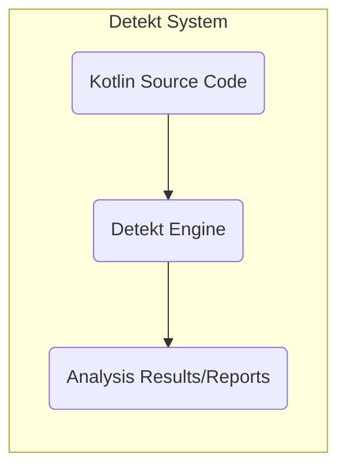
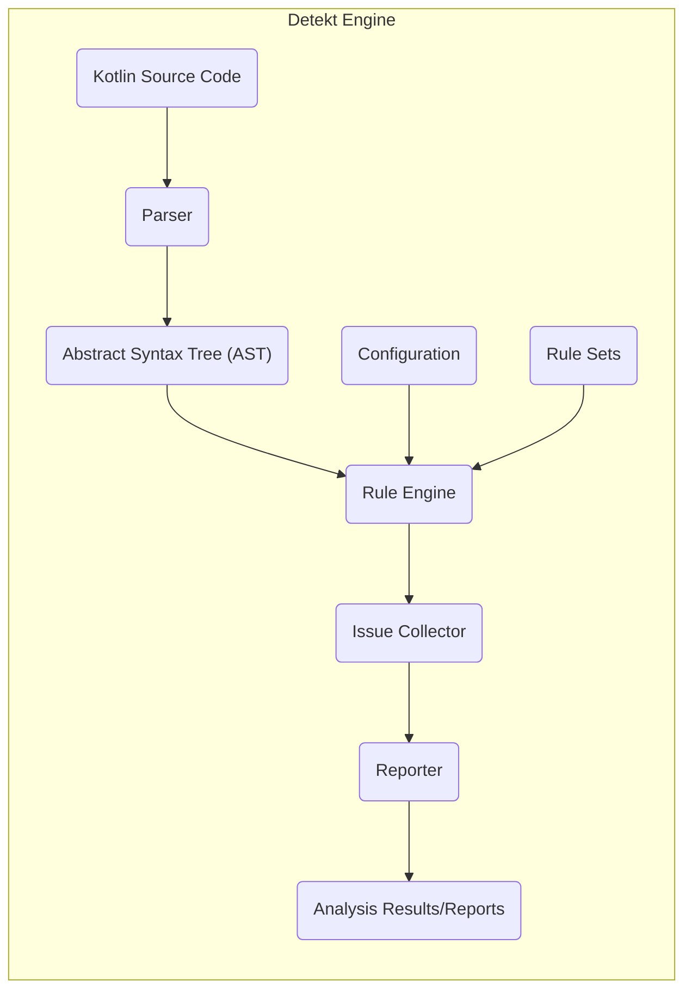

# Project Design Document: Detekt Static Analysis Tool

**Version:** 1.1
**Date:** October 26, 2023
**Author:** AI Software Architect

## 1. Introduction

This document provides an enhanced and detailed design overview of the Detekt static analysis tool for Kotlin code. It elaborates on the system's architecture, key components, data flow, and security considerations, making it more suitable for threat modeling activities.

## 2. Project Overview

Detekt is a sophisticated static code analysis tool specifically designed for the Kotlin programming language. It functions by meticulously parsing Kotlin source code and applying a rich set of predefined and highly configurable rules. This process aims to identify a wide range of potential issues, including code quality degradation, stylistic inconsistencies that hinder readability, and subtle bugs that could lead to runtime errors. Detekt's core objectives are to significantly improve code maintainability, proactively reduce the occurrence of errors, and consistently enforce established coding standards throughout a project's lifecycle.

## 3. Goals and Objectives

*   To offer a robust and highly configurable static analysis solution tailored for Kotlin development.
*   To empower developers to proactively identify and rectify code quality concerns early in the software development lifecycle, minimizing potential downstream issues.
*   To ensure consistent application of coding styles across all parts of a project, fostering better collaboration and code understanding.
*   To provide a flexible and extensible platform through the support of custom rules and seamless integrations with various development tools.
*   To generate clear, concise, and actionable reports that pinpoint detected issues and facilitate their resolution.
*   To integrate smoothly and efficiently with common development workflows, including command-line interfaces, build tools like Gradle and Maven, and Integrated Development Environments (IDEs).

## 4. System Architecture

### 4.1. High-Level Architecture

*   **Kotlin Source Code:** The fundamental input to the Detekt system, representing the complete codebase or specific files targeted for analysis.
*   **Detekt Engine:** The central processing unit of Detekt, responsible for the entire analysis workflow, from parsing the source code to generating the final reports.
*   **Analysis Results/Reports:** The structured output generated by Detekt, providing detailed information about identified code quality issues, their locations, and severity levels.

### 4.2. Detailed Architecture

*   **Parser:** This component utilizes the Kotlin compiler infrastructure to meticulously convert the raw Kotlin source code (text files) into a structured representation known as the Abstract Syntax Tree (AST). This process involves lexical analysis and syntactic analysis to understand the code's structure and meaning.
*   **Abstract Syntax Tree (AST):** A hierarchical tree-like data structure that represents the syntactic structure of the Kotlin source code. Each node in the tree corresponds to a construct in the code (e.g., classes, functions, expressions). This structured representation is the primary data source for the rule engine.
*   **Rule Engine:** The intelligent core of Detekt. It iterates through the nodes of the AST, systematically applying a predefined or custom set of rules. This component orchestrates the analysis process and determines which rules are relevant for each part of the code.
*   **Configuration:**  A set of parameters and settings that govern the behavior of Detekt. This includes specifying which rule sets are active, setting severity levels for different types of issues, defining file exclusion patterns, and configuring thresholds for certain rules (e.g., maximum complexity). Configuration is typically loaded from YAML files (`detekt.yml`) or provided through command-line arguments.
*   **Rule Sets:** Organized collections of individual analysis rules, grouped by their purpose or the type of issue they detect. Examples include rules for code formatting, identifying overly complex code, detecting potential bugs, and enforcing specific coding styles. Users can select and configure which rule sets to apply to their project.
*   **Issue Collector:** A central repository that gathers all the `Issue` objects identified by the `Rule Engine` during the analysis. Each `Issue` object encapsulates details about a specific code quality problem, including its location (file, line number), severity, and a descriptive message.
*   **Reporter:** Responsible for transforming the collected `Issue` objects into human-readable and machine-parsable reports. This component supports various output formats, such as plain text, XML, HTML, and SARIF, allowing for integration with different tools and workflows.
*   **Analysis Results/Reports:** The final output of the Detekt analysis process. These reports provide developers with detailed information about the identified code quality issues, enabling them to understand and address the problems effectively.

## 5. Components

*   **`detekt-core`:** The foundational module containing the core logic of the Detekt engine. This includes the `Parser` (leveraging the Kotlin compiler), the internal representation of the `Abstract Syntax Tree (AST)`, the `Rule Engine` responsible for executing analysis rules, and the `Issue Collector` for managing detected issues.
*   **`detekt-cli`:** Provides the command-line interface (CLI) for interacting with Detekt. It handles parsing command-line arguments, loading configuration files, initiating the analysis process, and managing report generation. This is the primary way many developers interact with Detekt for local analysis or within scripts.
*   **`detekt-gradle-plugin`:** Enables seamless integration of Detekt into Gradle-based build systems. This plugin allows Detekt to be executed as a task within the Gradle build lifecycle, automatically analyzing code during the build process. It simplifies configuration and execution within Android and Kotlin multiplatform projects.
*   **`detekt-maven-plugin`:** Offers similar integration capabilities for Maven-based projects. The Maven plugin allows Detekt to be incorporated into the Maven build lifecycle, ensuring code quality checks are performed as part of the standard build process.
*   **`detekt-rules`:**  A collection of predefined rule sets that implement the actual code analysis logic. These rules are categorized for better organization and configurability:
    *   `formatting`: Enforces code style and formatting rules, ensuring consistency across the codebase.
    *   `complexity`: Detects overly complex code structures (e.g., deeply nested conditionals, long methods) that can be harder to understand and maintain.
    *   `potential-bugs`: Identifies potential runtime errors, logical flaws, and common coding mistakes that could lead to unexpected behavior.
    *   `performance`: Focuses on identifying potential performance bottlenecks and inefficient coding patterns.
    *   `style`: Enforces general code style guidelines and best practices beyond basic formatting.
*   **`detekt-api`:** Defines the public interfaces and abstract classes that allow developers to create custom rules and integrations for Detekt. This provides a mechanism for extending Detekt's functionality to address project-specific needs or enforce unique coding standards.
*   **`detekt-test-utils`:** Provides utility classes and functions specifically designed to facilitate the testing of custom rules and Detekt integrations. This helps ensure the quality and correctness of extensions to the core Detekt functionality.
*   **`detekt-tooling`:** Offers programmatic APIs that allow other applications or tools to interact with Detekt programmatically. This can be used for building custom integrations or embedding Detekt analysis within other systems.
*   **`detekt-sarif-reporter`:** A specialized reporter module that outputs analysis results in the Static Analysis Results Interchange Format (SARIF). SARIF is a standardized format that enables interoperability with various static analysis tools and platforms.

## 6. Data Flow

The flow of data through the Detekt system is a crucial aspect for understanding its operation and identifying potential security considerations:

*   **Input: Kotlin Source Code Files:** The process begins with Kotlin source code files being provided as input to the `detekt-core` engine, typically through the `detekt-cli` or build tool plugins.
*   **Parsing and AST Generation:** The `Parser` component within `detekt-core`, leveraging the Kotlin compiler's parsing capabilities, reads the raw source code and transforms it into a detailed `Abstract Syntax Tree (AST)`. This AST represents the code's structure in a way that Detekt can understand and analyze.
*   **Configuration Loading and Rule Set Selection:** The `Configuration` component loads settings from configuration files (e.g., `detekt.yml`) and any command-line arguments. Based on this configuration, the appropriate `Rule Sets` are selected for analysis.
*   **Rule Application and Issue Detection:** The `Rule Engine` iterates through the nodes of the generated AST. For each node, it applies the enabled rules from the selected `Rule Sets`. Each rule contains specific logic to check for certain patterns or conditions in the code. When a rule identifies a violation of a coding standard or a potential issue, an `Issue` object is created.
*   **Issue Object Creation:** An `Issue` object encapsulates detailed information about the detected problem, including:
    *   The specific rule that was violated.
    *   The location of the issue in the source code (file path, line number, column number).
    *   A descriptive message explaining the problem.
    *   The severity level of the issue (e.g., error, warning, info).
*   **Issue Collection:** The `Issue Collector` component acts as a central aggregator, gathering all the `Issue` objects generated by the `Rule Engine` during the analysis process.
*   **Report Generation:** The `Reporter` component takes the collected `Issue` objects and formats them into the desired output format. Different reporters exist for generating reports in plain text, XML, HTML, SARIF, or other formats. The chosen reporter determines how the analysis results are presented to the user or integrated with other tools.
*   **Output: Analysis Results/Reports:** The final output of the Detekt analysis is a report (or multiple reports in different formats) detailing the identified code quality issues. This report provides developers with the information needed to understand and address the detected problems in their codebase.

## 7. Security Considerations

While Detekt is primarily a static analysis tool and does not directly interact with running applications, several security considerations are important to address:

*   **Configuration Vulnerabilities (Injection/Manipulation):** If the Detekt configuration files (`detekt.yml`) are sourced from untrusted locations or can be manipulated by malicious actors, it could lead to:
    *   **Disabling Critical Rules:** Attackers could disable rules that detect security vulnerabilities, allowing vulnerable code to pass unnoticed.
    *   **Enabling Resource-Intensive Rules:**  Maliciously crafted configurations could enable rules that consume excessive resources, leading to denial-of-service during the analysis process.
    *   **Introducing Malicious Custom Rule Paths:**  Pointing to untrusted locations for custom rules could lead to the execution of arbitrary code during analysis.
*   **Custom Rule Security:** Custom rules, while extending Detekt's functionality, can introduce security risks if not developed carefully:
    *   **Code Injection Vulnerabilities:** Poorly written custom rules might be susceptible to code injection if they process external data without proper sanitization.
    *   **Denial of Service:**  Inefficient or poorly designed custom rules could consume excessive resources (CPU, memory), leading to denial-of-service during analysis.
    *   **Information Disclosure:** Custom rules might inadvertently expose sensitive information during their execution or in their logging.
*   **Dependency Vulnerabilities:** Detekt relies on various third-party libraries (e.g., Kotlin compiler libraries, YAML parsing libraries). Known vulnerabilities in these dependencies could potentially be exploited if Detekt is running in a compromised environment. Regular updates and dependency scanning are crucial.
*   **Report Security (Information Disclosure):** The generated reports can contain sensitive information, such as:
    *   File paths and directory structures, which could reveal information about the application's internal organization.
    *   Potentially sensitive code snippets that highlight detected issues.
    *   Internal error messages or stack traces generated during the analysis.
    Access to these reports should be controlled to prevent unauthorized disclosure.
*   **Denial of Service through Malicious Code:** While less likely in static analysis compared to dynamic analysis, carefully crafted Kotlin code could potentially trigger resource-intensive analysis within certain Detekt rules, leading to a denial-of-service scenario, especially in CI/CD environments where analysis is performed automatically.
*   **Plugin Security (If Applicable):** If Detekt's architecture were to allow for plugins that execute arbitrary code during analysis (which is generally avoided in static analysis tools for security reasons), this would introduce significant security risks. The current design limits plugin capabilities to rule definition and reporting.
*   **Supply Chain Security:** Ensuring the integrity of the Detekt distribution (e.g., the `detekt-cli.jar`) and its dependencies is crucial to prevent the introduction of malicious code. Verifying checksums and using trusted sources for downloads are important measures.

## 8. Deployment

Detekt's versatility allows for deployment in various development workflows:

*   **Command-Line Interface (CLI):** Developers can execute Detekt directly from their terminal using the `detekt-cli` JAR. This is ideal for local code analysis, quick checks before committing code, and for running Detekt in environments where build tool integration is not desired. Security considerations here involve ensuring the `detekt-cli.jar` is obtained from a trusted source and that the configuration files used are not compromised.
*   **Gradle Plugin Integration:** Integrating Detekt as a Gradle plugin is common in Android and Kotlin multiplatform projects. Detekt runs as part of the standard Gradle build lifecycle, automatically analyzing code during development and in CI/CD pipelines. Security considerations include securing the Gradle build scripts and ensuring that the Detekt plugin dependency is resolved from a trusted repository.
*   **Maven Plugin Integration:** Similar to the Gradle plugin, the Maven plugin enables Detekt integration in Maven-based projects. Detekt is executed as part of the Maven build process. Security considerations mirror those of the Gradle plugin, focusing on the integrity of the Maven POM file and the plugin dependency resolution.
*   **CI/CD Pipeline Integration:** Detekt is frequently integrated into Continuous Integration/Continuous Deployment (CI/CD) pipelines to automatically analyze code changes and enforce quality standards before deployment. This is a crucial step for ensuring code quality and security. Security considerations in this context involve securing the CI/CD pipeline itself, ensuring that the Detekt execution environment is secure, and protecting the generated reports.
*   **IDE Integration (Community Plugins):** While not officially provided by the Detekt team, community-developed IDE plugins can integrate Detekt analysis directly into the development environment, providing real-time feedback to developers. Security considerations for these plugins involve trusting the plugin source and ensuring it doesn't introduce vulnerabilities into the IDE.

## 9. Future Considerations

*   **Enhanced Performance and Scalability:** Continuously optimizing the analysis engine for faster execution times and improved handling of very large codebases. This includes exploring parallel processing and more efficient AST traversal techniques.
*   **Expanded Rule Coverage and Analysis Capabilities:**  Adding new built-in rules to detect a wider range of potential issues, including more sophisticated security vulnerabilities and architectural flaws.
*   **Improved Reporting and Visualization:**  Developing more interactive and user-friendly reports, potentially with visualizations and trend analysis to track code quality over time.
*   **Deeper Integration with Development Tools and Platforms:** Exploring tighter integrations with more IDEs, code review tools, and other development platforms to streamline the workflow.
*   **Advanced Static Analysis Techniques:** Investigating the use of more advanced static analysis techniques, such as symbolic execution or data flow analysis, to detect more complex and subtle issues.
*   **More Granular and Flexible Configuration Options:** Providing more fine-grained control over rule configuration, allowing users to customize rule behavior more precisely.
*   **Community Rule Contribution Enhancements:**  Improving the process for community members to contribute custom rules and ensuring the quality and security of contributed rules.
*   **Support for Incremental Analysis:** Implementing incremental analysis capabilities to analyze only the changed parts of the codebase, significantly improving analysis speed for large projects.