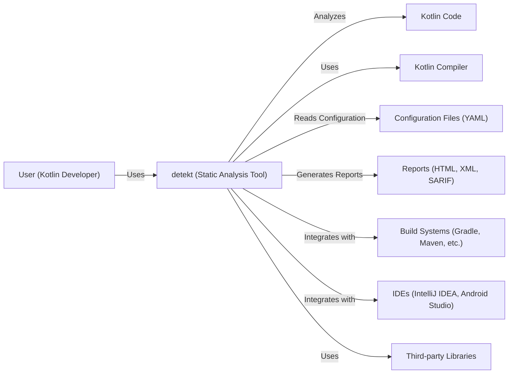
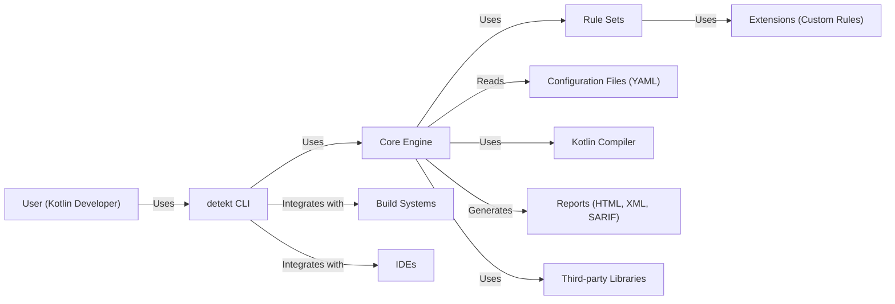
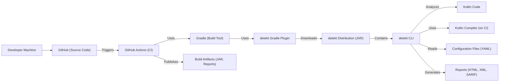
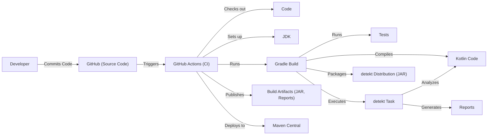

# BUSINESS POSTURE

detekt is a static code analysis tool for Kotlin. It operates on the abstract syntax tree provided by the Kotlin compiler. The primary business goal is to help Kotlin developers maintain code quality and consistency by identifying potential code smells, bugs, and style violations. The project aims to be highly configurable and extensible, allowing users to customize rules and even write their own.

Business priorities:

- Maintainability: The project must be easy to maintain and extend, given its open-source nature and reliance on community contributions.
- Accuracy: The analysis should be accurate, minimizing false positives and false negatives to ensure developer trust.
- Performance: The analysis should be performant enough to be integrated into build pipelines and IDEs without significant overhead.
- Configurability: Users should be able to easily configure the tool to match their specific coding standards and project needs.
- Extensibility: The tool should be designed to allow users to easily add custom rules and integrations.

Business risks:

- Inaccurate analysis leading to wasted developer time investigating false positives or missed bugs due to false negatives.
- Poor performance impacting build times and developer workflow.
- Lack of adoption due to difficult configuration or limited extensibility.
- Security vulnerabilities introduced through custom rules or integrations.
- Project abandonment due to lack of maintainability.

# SECURITY POSTURE

Existing security controls:

- security control: The project uses GitHub's built-in security features, such as code scanning and dependency analysis. (Described in GitHub repository settings and workflows).
- security control: The project has a security policy that describes how to report vulnerabilities. (Described in SECURITY.md file).
- security control: The project uses static analysis tools (including detekt itself) to identify potential issues. (Described in build configuration and CI workflows).
- security control: The project uses dependency management tools to keep dependencies up to date. (Described in build configuration).

Accepted risks:

- accepted risk: The project relies on the Kotlin compiler and its abstract syntax tree. Any vulnerabilities or inaccuracies in the compiler could impact detekt's analysis.
- accepted risk: Custom rules and integrations developed by third parties may introduce security vulnerabilities or performance issues.
- accepted risk: The project is open source and relies on community contributions. While efforts are made to review contributions, malicious or poorly written code could be introduced.

Recommended security controls:

- security control: Implement a Software Bill of Materials (SBOM) generation process to track all dependencies and their versions.
- security control: Introduce a regular security audit process, including penetration testing and code review focused on security aspects.
- security control: Provide clear guidelines and security best practices for developers creating custom rules and integrations.
- security control: Consider implementing a sandboxing mechanism for executing custom rules to limit their potential impact.

Security requirements:

- Authentication: Not directly applicable, as detekt is a command-line tool and doesn't handle user authentication.
- Authorization: Not directly applicable, as detekt operates on source code and doesn't manage access control.
- Input Validation: detekt processes Kotlin source code as input. Input validation is crucial to prevent injection vulnerabilities, especially in custom rules. The Kotlin compiler itself performs the initial parsing and validation, but custom rules must handle any additional input (e.g., configuration files) securely.
- Cryptography: Not directly applicable, as detekt is not involved in cryptographic operations. However, if custom rules handle sensitive data (which should be avoided), they must use appropriate cryptographic libraries and practices.

# DESIGN

## C4 CONTEXT

Elements description:

- User (Kotlin Developer):
  - Name: User (Kotlin Developer)
  - Type: Person
  - Description: A software developer writing Kotlin code.
  - Responsibilities: Writes code, configures detekt, runs detekt, reviews reports.
  - Security controls: Follows secure coding practices.

- detekt (Static Analysis Tool):
  - Name: detekt (Static Analysis Tool)
  - Type: Software System
  - Description: The static analysis tool for Kotlin.
  - Responsibilities: Analyzes Kotlin code, identifies code smells and potential bugs, generates reports.
  - Security controls: Uses GitHub security features, has a security policy, uses static analysis, uses dependency management.

- Kotlin Code:
  - Name: Kotlin Code
  - Type: Data
  - Description: The Kotlin source code to be analyzed.
  - Responsibilities: N/A
  - Security controls: N/A

- Kotlin Compiler:
  - Name: Kotlin Compiler
  - Type: Software System
  - Description: The official Kotlin compiler.
  - Responsibilities: Compiles Kotlin code, provides the abstract syntax tree (AST).
  - Security controls: Relies on the security of the Kotlin compiler itself.

- Configuration Files (YAML):
  - Name: Configuration Files (YAML)
  - Type: Data
  - Description: YAML files used to configure detekt's rules and behavior.
  - Responsibilities: N/A
  - Security controls: Input validation within detekt to prevent malicious configurations.

- Reports (HTML, XML, SARIF):
  - Name: Reports (HTML, XML, SARIF)
  - Type: Data
  - Description: Reports generated by detekt, containing analysis results.
  - Responsibilities: N/A
  - Security controls: N/A

- Build Systems (Gradle, Maven, etc.):
  - Name: Build Systems (Gradle, Maven, etc.)
  - Type: Software System
  - Description: Build automation tools used to build Kotlin projects.
  - Responsibilities: Manages the build process, integrates with detekt.
  - Security controls: Secure configuration of the build system.

- IDEs (IntelliJ IDEA, Android Studio):
  - Name: IDEs (IntelliJ IDEA, Android Studio)
  - Type: Software System
  - Description: Integrated development environments used to write Kotlin code.
  - Responsibilities: Provides a development environment, integrates with detekt.
  - Security controls: Secure configuration of the IDE.

- Third-Party Libraries
  - Name: Third-party Libraries
  - Type: Software System
  - Description: Libraries used by Detekt
  - Responsibilities: Provide additional functionality to Detekt
  - Security controls: Keep dependencies up to date.

## C4 CONTAINER

Elements description:

- detekt CLI:
  - Name: detekt CLI
  - Type: Container (Command-line application)
  - Description: The command-line interface for detekt.
  - Responsibilities: Parses command-line arguments, loads configuration, invokes the core engine, outputs reports.
  - Security controls: Input validation of command-line arguments.

- Core Engine:
  - Name: Core Engine
  - Type: Container (Java/Kotlin Library)
  - Description: The core logic of detekt.
  - Responsibilities: Manages the analysis process, coordinates rule sets, interacts with the Kotlin compiler.
  - Security controls: Secure handling of configuration data, robust error handling.

- Rule Sets:
  - Name: Rule Sets
  - Type: Container (Collection of Rules)
  - Description: Collections of rules that define specific code smells or style violations.
  - Responsibilities: Analyzes the abstract syntax tree (AST) to identify violations.
  - Security controls: Each rule should be carefully designed to avoid vulnerabilities and performance issues.

- Extensions (Custom Rules):
  - Name: Extensions (Custom Rules)
  - Type: Container (User-provided code)
  - Description: Custom rules developed by users to extend detekt's functionality.
  - Responsibilities: Analyzes the AST based on user-defined logic.
  - Security controls: Requires careful review and potentially sandboxing to mitigate risks.

- Configuration Files (YAML):
  - Name: Configuration Files (YAML)
  - Type: Data
  - Description: YAML files used to configure detekt's rules and behavior.
  - Responsibilities: N/A
  - Security controls: Input validation within detekt to prevent malicious configurations.

- Kotlin Compiler:
  - Name: Kotlin Compiler
  - Type: Software System
  - Description: The official Kotlin compiler.
  - Responsibilities: Compiles Kotlin code, provides the abstract syntax tree (AST).
  - Security controls: Relies on the security of the Kotlin compiler itself.

- Reports (HTML, XML, SARIF):
  - Name: Reports (HTML, XML, SARIF)
  - Type: Data
  - Description: Reports generated by detekt, containing analysis results.
  - Responsibilities: N/A
  - Security controls: N/A

- Build Systems:
    - Name: Build Systems
    - Type: Software System
    - Description: Build automation tools.
    - Responsibilities: Integrates with detekt CLI during the build process.
    - Security controls: Secure configuration of build system and its plugins.

- IDEs:
    - Name: IDEs
    - Type: Software System
    - Description: Integrated Development Environments.
    - Responsibilities: Integrates with detekt CLI for real-time analysis.
    - Security controls: Secure configuration of IDE and its plugins.

- Third-Party Libraries
  - Name: Third-party Libraries
  - Type: Software System
  - Description: Libraries used by Detekt
  - Responsibilities: Provide additional functionality to Detekt
  - Security controls: Keep dependencies up to date.

## DEPLOYMENT

detekt can be deployed and used in several ways:

1.  **Standalone CLI:** Downloaded and executed directly from the command line.
2.  **Gradle Plugin:** Integrated into a Gradle build.
3.  **Maven Plugin:** Integrated into a Maven build.
4.  **IntelliJ IDEA Plugin:** Used within the IntelliJ IDEA IDE.
5.  **GitHub Action:** Integrated into a GitHub Actions workflow.

We will describe the **Gradle Plugin** deployment, as it's a common and representative use case.

Elements description:

- Developer Machine:
  - Name: Developer Machine
  - Type: Infrastructure Node
  - Description: The developer's local machine.
  - Responsibilities: Writing code, committing changes.
  - Security controls: Secure development environment, code signing.

- GitHub (Source Code):
  - Name: GitHub (Source Code)
  - Type: Infrastructure Node
  - Description: The Git repository hosting the source code.
  - Responsibilities: Version control, code review.
  - Security controls: Branch protection rules, access controls.

- GitHub Actions (CI):
  - Name: GitHub Actions (CI)
  - Type: Infrastructure Node
  - Description: The continuous integration service.
  - Responsibilities: Automates the build, test, and analysis process.
  - Security controls: Secure configuration of workflows, secrets management.

- Gradle (Build Tool):
  - Name: Gradle (Build Tool)
  - Type: Software System
  - Description: The build automation tool used for the project.
  - Responsibilities: Manages dependencies, compiles code, runs tests, executes detekt.
  - Security controls: Secure configuration of Gradle, dependency verification.

- detekt Gradle Plugin:
  - Name: detekt Gradle Plugin
  - Type: Software Component
  - Description: The Gradle plugin that integrates detekt into the build process.
  - Responsibilities: Downloads the detekt distribution, configures detekt tasks, executes detekt.
  - Security controls: Relies on the security of the Gradle plugin mechanism and the detekt distribution.

- detekt Distribution (JAR):
  - Name: detekt Distribution (JAR)
  - Type: Artifact
  - Description: The packaged detekt distribution, containing the CLI and dependencies.
  - Responsibilities: N/A
  - Security controls: Integrity checks on the downloaded JAR.

- detekt CLI:
  - Name: detekt CLI
  - Type: Container (Command-line application)
  - Description: The command-line interface for detekt.
  - Responsibilities: Parses command-line arguments, loads configuration, invokes the core engine, outputs reports.
  - Security controls: Input validation of command-line arguments.

- Kotlin Code:
  - Name: Kotlin Code
  - Type: Data
  - Description: The Kotlin source code to be analyzed.
  - Responsibilities: N/A
  - Security controls: N/A

- Kotlin Compiler (on CI):
  - Name: Kotlin Compiler (on CI)
  - Type: Software System
  - Description: The Kotlin compiler, running within the CI environment.
  - Responsibilities: Compiles Kotlin code, provides the AST.
  - Security controls: Relies on the security of the CI environment and the Kotlin compiler.

- Configuration Files (YAML):
  - Name: Configuration Files (YAML)
  - Type: Data
  - Description: YAML files used to configure detekt's rules and behavior.
  - Responsibilities: N/A
  - Security controls: Input validation within detekt to prevent malicious configurations.

- Reports (HTML, XML, SARIF):
  - Name: Reports (HTML, XML, SARIF)
  - Type: Data
  - Description: Reports generated by detekt, containing analysis results.
  - Responsibilities: N/A
  - Security controls: N/A

- Build Artifacts (JAR, Reports):
  - Name: Build Artifacts (JAR, Reports)
  - Type: Artifact
  - Description: The output of the build process, including the compiled code and detekt reports.
  - Responsibilities: N/A
  - Security controls: Secure storage and access control for build artifacts.

## BUILD

The detekt build process is automated using Gradle and GitHub Actions.

Security controls in the build process:

- security control: Code is built and tested on every commit using GitHub Actions, ensuring continuous integration and early detection of issues.
- security control: The build process uses Gradle's dependency management to ensure consistent and reproducible builds.
- security control: detekt itself is used as part of the build process to analyze its own code (dogfooding).
- security control: The build process includes unit and integration tests to verify the functionality of detekt.
- security control: GitHub Actions workflows are configured to use specific versions of dependencies and actions, reducing the risk of supply chain attacks.
- security control: The build artifacts (JAR files) are published to Maven Central, a trusted repository.
- security control: The release process is automated and requires maintainer approval, reducing the risk of unauthorized releases.
- security control: SAST (Static Application Security Testing) tools, including detekt, are used to scan the codebase for vulnerabilities.
- security control: Dependency scanning tools are used to identify known vulnerabilities in third-party libraries.

# RISK ASSESSMENT

Critical business processes we are trying to protect:

- The integrity and reliability of the static analysis process.
- The reputation of the detekt project and its trustworthiness.
- The development workflow of Kotlin developers using detekt.

Data we are trying to protect and their sensitivity:

- Kotlin source code (analyzed by detekt): Sensitivity varies depending on the code being analyzed. It could range from non-sensitive open-source code to highly confidential proprietary code.
- detekt configuration files: May contain information about enabled rules and custom configurations. Sensitivity is generally low, but malicious configurations could impact analysis results.
- detekt reports: Contain the results of the analysis, highlighting potential issues in the code. Sensitivity depends on the sensitivity of the analyzed code.

# QUESTIONS & ASSUMPTIONS

Questions:

- Are there any specific compliance requirements (e.g., GDPR, HIPAA) that detekt needs to consider, especially regarding the handling of source code and reports?
- What is the expected level of security expertise for users developing custom rules? Should we provide more detailed security guidelines or a sandbox environment?
- What is the process for handling security vulnerabilities discovered in detekt or its dependencies?
- What are the plans for future development and how might they impact the security posture?

Assumptions:

- BUSINESS POSTURE: The primary users of detekt are Kotlin developers who are concerned with code quality and maintainability.
- BUSINESS POSTURE: The project aims to be a community-driven effort, with contributions from various developers.
- SECURITY POSTURE: Users are responsible for the security of their own Kotlin code and the environment in which they run detekt.
- SECURITY POSTURE: The Kotlin compiler is assumed to be secure and reliable.
- DESIGN: The Gradle plugin deployment model is representative of other deployment methods.
- DESIGN: The build process is secure and follows best practices for software development.