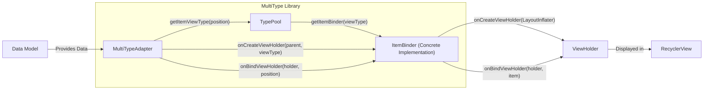
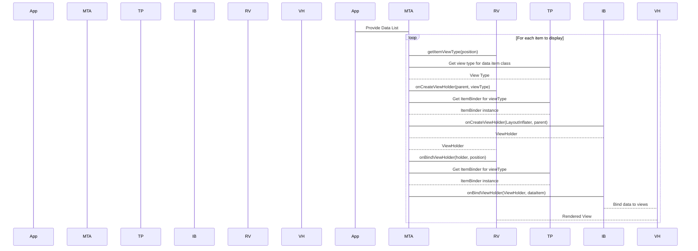

## Project Design Document: MultiType Library for Android RecyclerView (Improved)

**Version:** 1.1
**Date:** October 26, 2023
**Author:** Gemini (AI Language Model)

### 1. Introduction

This document provides a detailed design overview of the MultiType library, a widely used Android library designed to simplify the management of diverse view types within a `RecyclerView`. This document aims to clearly articulate the library's architecture, components, and the flow of data, establishing a solid foundation for subsequent threat modeling activities. The improvements in this version focus on enhanced clarity and more specific security considerations.

### 2. Goals

The primary goals of this design document are:

*   To provide a clear and comprehensive understanding of the MultiType library's internal structure and operational mechanisms.
*   To precisely identify the key components of the library and elucidate their interactions.
*   To thoroughly describe the data flow within the library, from the initial data input to the final rendering of views.
*   To serve as a robust and detailed basis for identifying potential security vulnerabilities and possible attack vectors during the threat modeling process.
*   To document the design in a clear, structured, and easily understandable manner, strictly adhering to the specified formatting requirements.

### 3. Scope

This document specifically focuses on the design and architecture of the core MultiType library. It encompasses the following aspects:

*   The fundamental classes and interfaces responsible for managing multiple view types within a `RecyclerView`.
*   The detailed process of registering and utilizing concrete implementations of the `ItemBinder` interface.
*   The intricate interactions between the `MultiTypeAdapter`, the `TypePool`, and individual `ItemBinder` instances.
*   The complete flow of data, starting from the data source and culminating in the display of rendered views within the `RecyclerView`.

This document explicitly **does not** cover:

*   Specific implementations of the `ItemBinder` interface created by developers who integrate the library into their applications.
*   The internal operational details of the Android `RecyclerView` itself, except in scenarios where it directly interacts with the MultiType library.
*   Performance benchmarks, optimization techniques, or strategies related to the library's efficiency.
*   The processes involved in testing, building, or releasing the library.

### 4. Architectural Overview

The MultiType library is built upon a flexible and extensible architecture centered around the concepts of distinct data types and their corresponding visual representations. The core principle is to effectively decouple the underlying data model from the specific view used to render that data.

The primary components of the MultiType library include:

*   **`MultiTypeAdapter`**: This is the central adapter class, extending `RecyclerView.Adapter`. It is responsible for managing the collection of data items and delegating the creation and binding of `ViewHolder` instances to the appropriate `ItemBinder` implementations.
*   **`ItemBinder<T, VH>`**: This abstract class serves as the blueprint for developers to define how a specific data type (`T`) should be visually represented within a `ViewHolder` (`VH`). It handles the instantiation of the `ViewHolder` and the process of binding data to the views it contains.
*   **`TypePool`**: This acts as a registry, maintaining the mapping between specific data types (identified by their `Class` objects) and their corresponding `ItemBinder` instances. The `MultiTypeAdapter` utilizes this registry to locate the correct binder for a given data item.
*   **Data Model**: This refers to the actual data objects that are intended to be displayed within the `RecyclerView`. These can be instances of any Java or Kotlin class.

The interaction between these core components can be visualized as follows:

### 5. Component Details

#### 5.1. `MultiTypeAdapter`

*   **Responsibilities:**
    *   Extends `RecyclerView.Adapter` and serves as the primary manager for the underlying data list.
    *   Implements the `getItemViewType(position)` method to determine the appropriate view type for the data item at a given position. This typically involves querying the `TypePool` based on the class of the data item.
    *   Implements the `onCreateViewHolder(parent, viewType)` method to instantiate a new `ViewHolder`. It delegates this creation process to the specific `ItemBinder` associated with the determined `viewType`.
    *   Implements the `onBindViewHolder(holder, position)` method to bind the data to the views within a `ViewHolder`. This binding process is delegated to the corresponding `ItemBinder`.
    *   Provides methods for registering `ItemBinder` instances with the `TypePool`, establishing the mappings between data types and their view representations.
    *   Manages the lifecycle of the underlying data list, including operations for adding, removing, and updating items.

#### 5.2. `ItemBinder<T, VH>`

*   **Responsibilities:**
    *   Defines the specific manner in which a particular data type (`T`) should be visually presented to the user.
    *   `onCreateViewHolder(LayoutInflater inflater, ViewGroup parent)`: Responsible for creating and returning a new instance of the `ViewHolder` class, which will hold the views for the associated view type.
    *   `onBindViewHolder(VH holder, T item)`: Handles the process of binding the actual data (`item`) to the individual views contained within the provided `ViewHolder` (`holder`).
    *   May optionally implement methods to handle view recycling or other relevant lifecycle events related to the `ViewHolder`.

#### 5.3. `TypePool`

*   **Responsibilities:**
    *   Serves as the central repository for storing the mappings between data types (represented by their corresponding `Class` objects) and the specific `ItemBinder` instances responsible for rendering them.
    *   Provides methods for registering `ItemBinder` instances, associating them with particular data types.
    *   `getItemViewType(Class<?> clazz)`: Returns the integer representing the view type associated with a given data type. This integer is used by the `RecyclerView` to efficiently manage different view layouts.
    *   `getItemBinder(int viewType)`: Retrieves and returns the `ItemBinder` instance that is registered for a specific view type.

#### 5.4. Data Model

*   **Responsibilities:**
    *   Represents the actual data that will be displayed within the `RecyclerView`.
    *   Can be an instance of any valid Java or Kotlin class, providing flexibility in the types of data that can be displayed.
    *   The structure and content of the data model are entirely determined by the developer implementing the application.

### 6. Data Flow

The process of displaying data within a `RecyclerView` using the MultiType library involves the following sequence of steps:

1. **Data Provision:** The application provides a list of data objects to the `MultiTypeAdapter`. This list represents the data that will be displayed in the `RecyclerView`.
2. **View Type Determination:** When the `RecyclerView` needs to display an item at a specific position, it calls the `getItemViewType(position)` method on the `MultiTypeAdapter`.
3. **Binder Lookup:** The `MultiTypeAdapter` uses the class of the data item at the given position to query the `TypePool` for the corresponding view type. The `TypePool` returns the integer representing the view type.
4. **ViewHolder Creation:** The `RecyclerView` then calls the `onCreateViewHolder(parent, viewType)` method on the `MultiTypeAdapter`, providing the determined view type.
5. **Binder Invocation (Create):** The `MultiTypeAdapter` retrieves the specific `ItemBinder` instance associated with the provided `viewType` from the `TypePool`. It then calls the `onCreateViewHolder()` method of this `ItemBinder` to create a new `ViewHolder` instance.
6. **ViewHolder Binding:** When it's time to display data in a particular `ViewHolder`, the `RecyclerView` calls the `onBindViewHolder(holder, position)` method on the `MultiTypeAdapter`.
7. **Binder Invocation (Bind):** The `MultiTypeAdapter` again retrieves the appropriate `ItemBinder` for the given view type and calls its `onBindViewHolder()` method. This method receives the `ViewHolder` instance and the actual data item at the specified position, allowing the `ItemBinder` to populate the views within the `ViewHolder` with the data.
8. **View Rendering:** Finally, the `ItemBinder` binds the data to the views within the `ViewHolder`, and the `RecyclerView` displays the fully rendered view to the user.

This entire flow is repeated for each item that needs to be displayed or when the data in the `RecyclerView` is updated.

### 7. Security Considerations (More Specific)

Building upon the preliminary considerations, here are more specific security aspects to consider during threat modeling:

*   **Input Sanitization and Validation within `ItemBinder`:** Since `ItemBinder` implementations handle the display of data, they are critical points for potential vulnerabilities. If the data being bound originates from untrusted sources (e.g., user input, network requests), failure to properly sanitize or validate this data within the `onBindViewHolder()` method can lead to:
    *   **Cross-Site Scripting (XSS) vulnerabilities:** If displaying web content or allowing HTML tags, unsanitized input can lead to malicious scripts being injected and executed within the application's context.
    *   **Data Injection vulnerabilities:** If displaying data that influences further actions or queries, malicious input could manipulate these actions.
*   **Type Safety and Casting Issues:** While the `TypePool` helps manage the mapping, incorrect implementation or usage could lead to scenarios where an `ItemBinder` receives data of an unexpected type. This could lead to:
    *   **ClassCastException vulnerabilities:** While not strictly a security vulnerability, unexpected crashes can impact availability and user experience.
    *   **Logic errors:** Incorrectly cast data might lead to unexpected behavior or the display of incorrect information, potentially misleading users.
*   **Resource Handling in `ItemBinder`:** `ItemBinder` implementations might load resources (images, etc.). Improper handling of these resources could lead to:
    *   **Denial of Service (DoS) vulnerabilities:**  Loading excessively large or numerous resources could exhaust device resources.
    *   **Path Traversal vulnerabilities (less likely in this context but worth considering):** If resource paths are derived from user input, improper sanitization could lead to accessing unintended resources.
*   **Potential for Misuse of `ViewHolder`:** While `ViewHolder` is primarily a performance optimization, incorrect usage or manipulation within the `ItemBinder` could lead to:
    *   **State corruption:** If the `ViewHolder`'s state is not properly managed, it could lead to incorrect data being displayed.
*   **Dependency Vulnerabilities (Indirect):** While MultiType itself might have minimal dependencies, the `ItemBinder` implementations created by developers might rely on external libraries with known vulnerabilities. This is an indirect security concern but should be considered in the overall application threat model.

### 8. Assumptions and Constraints

The following assumptions and constraints are relevant to this design document:

*   The underlying platform is assumed to be the Android SDK and its associated development tools and environment.
*   It is assumed that developers utilizing the library will adhere to best practices for implementing the `ItemBinder` interface, including proper data handling and security considerations.
*   The data provided to the `MultiTypeAdapter` is expected to be in a consistent and anticipated format, as defined by the application's data model.

### 9. Future Considerations

This design document represents the current architecture of the MultiType library. Potential future enhancements and considerations include:

*   Exploring built-in mechanisms for more robust data validation and sanitization that could be optionally utilized within `ItemBinder` implementations.
*   Providing more comprehensive built-in safeguards and utility methods to help prevent common implementation errors within `ItemBinder` classes.
*   Investigating potential performance optimizations within the core library components.
*   Potentially providing standardized interfaces or base classes for common `ItemBinder` patterns to promote consistency and security.

This document provides a solid foundation for understanding the design of the MultiType library and is a crucial step towards conducting a thorough threat modeling exercise to identify and mitigate potential security vulnerabilities.
