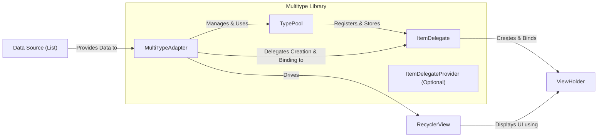
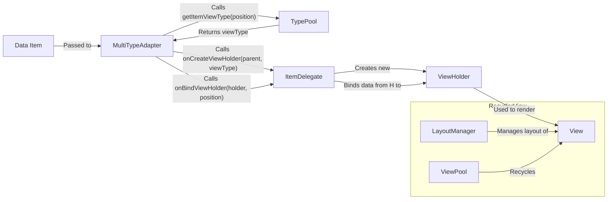

# Project Design Document: Multitype Library

**Version:** 1.1
**Date:** October 26, 2023
**Author:** AI Software Architect

## 1. Introduction

This document provides an enhanced design overview of the Multitype library, a widely used Android library designed to simplify the creation of `RecyclerView`s that display items of various types. This document aims to provide a clear and detailed articulation of the library's architecture, its core components, and the flow of data within it. This detailed design serves as a crucial foundation for subsequent threat modeling activities, enabling a thorough analysis of potential security vulnerabilities.

## 2. Goals and Objectives

The fundamental goals driving the development and usage of the Multitype library are:

* **Simplification of Heterogeneous `RecyclerView` Implementation:** To offer a straightforward and efficient mechanism for managing `RecyclerView`s that need to display diverse data types and corresponding view holders. This avoids complex conditional logic within a single adapter.
* **Enhanced Code Organization and Maintainability:** To promote a decoupled design where the responsibility for handling each item type is isolated within dedicated `ItemDelegate`s. This leads to cleaner, more modular, and easier-to-maintain adapter code.
* **Increased Flexibility and Extensibility:** To empower developers to seamlessly add, modify, or remove support for different item types without requiring significant alterations to the core adapter logic. This adaptability is crucial for evolving application requirements.

## 3. System Architecture

The Multitype library employs a component-based architecture, with the central concept being the `ItemDelegate`. These delegates encapsulate the logic for handling specific data types. The interaction between the core components orchestrates the mapping of data items to their appropriate view holders.

**Components:**

* **`MultiTypeAdapter`:** This is the primary adapter class, extending `RecyclerView.Adapter`. It holds the collection of data items and internally manages the `TypePool`. Its core responsibility is to delegate the creation of `ViewHolder` instances and the binding of data to these holders, based on the item type, to the appropriate `ItemDelegate`.
* **`TypePool`:** This component acts as a registry, maintaining the association between data item classes (or specific view types) and their corresponding `ItemDelegate` implementations. It provides the mechanisms to register these delegates and to retrieve the correct delegate for a given data item.
* **`ItemDelegate<T, VH>`:** This is an abstract class or interface that defines the contract for handling a specific type of data item (`T`). It is responsible for three key actions:
    * Determining if it can handle a given data item (`isForViewType`).
    * Creating the appropriate `ViewHolder` (`onCreateViewHolder`).
    * Binding the data of the item to the `ViewHolder` (`onBindViewHolder`).
* **`ItemDelegateProvider` (Optional):** This interface offers a more dynamic approach to selecting the `ItemDelegate` for a given item. Instead of relying solely on the item's class, the `ItemDelegateProvider` can implement custom logic to determine the appropriate delegate, potentially based on the item's properties or other contextual information.
* **`ViewHolder`:** These are standard `RecyclerView.ViewHolder` classes, typically extending `RecyclerView.ViewHolder`. They are responsible for holding references to the views within an item's layout, preventing costly `findViewById` calls during the binding process.

**Actors:**

* **Developer:** The individual or team integrating the Multitype library into their Android application. They provide the data to be displayed and implement the specific `ItemDelegate`s required for their application's data types.
* **`RecyclerView`:** The Android UI component responsible for efficiently displaying large sets of data. It interacts with the `MultiTypeAdapter` to obtain the views for each item.
* **Data Source:** The source of the data to be displayed in the `RecyclerView`. This is typically a `List` containing objects of various types.

## 4. Component Design Details

### 4.1. `MultiTypeAdapter`

* **Responsibilities:**
    * Holds and manages the list of data items to be displayed in the `RecyclerView`.
    * Internally manages the `TypePool`, registering and utilizing `ItemDelegate`s.
    * Implements the required methods from `RecyclerView.Adapter`, such as `onCreateViewHolder` and `onBindViewHolder`, delegating the actual implementation to the appropriate `ItemDelegate`.
    * Provides methods for updating the data set, such as `setItems(List<?> items)` and `notifyDataSetChanged()`, triggering UI updates.
    * Determines the appropriate view type for a given data item by querying the `TypePool`.
* **Key Methods:**
    * `setItems(List<?> items)`: Sets the data source for the adapter, replacing the existing data.
    * `register(Class<?> itemClass, ItemDelegate<?, ?> delegate)`: Registers an `ItemDelegate` to handle items of a specific class.
    * `register(ItemDelegate<?, ?> delegate)`: Registers an `ItemDelegate`. The order of registration might be important if delegates can handle multiple types.
    * `onCreateViewHolder(@NonNull ViewGroup parent, int viewType)`:  Delegates the creation of a `ViewHolder` to the `ItemDelegate` registered for the given `viewType`.
    * `onBindViewHolder(@NonNull RecyclerView.ViewHolder holder, int position)`: Delegates the process of binding data to the `ViewHolder` to the `ItemDelegate` responsible for the item at the specified `position`.
    * `getItemViewType(int position)`: Retrieves the view type for the item at the given `position` by consulting the `TypePool`.
    * `getItemCount()`: Returns the total number of items in the data source.

### 4.2. `TypePool`

* **Responsibilities:**
    * Serves as the central registry for the mapping between item classes (or view types) and their corresponding `ItemDelegate` instances.
    * Provides methods to register new `ItemDelegate`s and to retrieve the correct delegate based on the item type or view type.
    * Implements the logic for resolving the appropriate `ItemDelegate` for a given data item.
* **Key Methods:**
    * `register(Class<?> itemClass, ItemDelegate<?, ?> delegate)`: Registers an `ItemDelegate` to handle items of a specific class.
    * `register(ItemDelegate<?, ?> delegate)`: Registers an `ItemDelegate`.
    * `getItemType(@NonNull Object item)`: Returns the view type identifier for a given data item. This identifier is used to retrieve the corresponding `ItemDelegate`.
    * `getItemDelegate(int viewType)`: Retrieves the `ItemDelegate` instance associated with a specific view type.

### 4.3. `ItemDelegate<T, VH>`

* **Responsibilities:**
    * Encapsulates the logic for handling a specific type of data item (`T`).
    * Defines how to create the `ViewHolder` (`VH`) for items of its supported type.
    * Implements the logic for binding the data of an item to its `ViewHolder`.
    * Provides a mechanism to determine if the delegate can handle a given data item.
* **Key Methods:**
    * `isForViewType(@NonNull T item, int position)`: Returns `true` if this delegate is responsible for handling the provided data item at the given position.
    * `onCreateViewHolder(@NonNull LayoutInflater inflater, @NonNull ViewGroup parent)`: Creates and returns a new `ViewHolder` instance for the item type handled by this delegate.
    * `onBindViewHolder(@NonNull VH holder, @NonNull T item)`: Binds the data from the provided `item` to the views held by the `holder`.

### 4.4. `ItemDelegateProvider`

* **Responsibilities:**
    * Offers a more flexible and dynamic way to select the appropriate `ItemDelegate` for an item.
    * Allows for implementing custom logic to determine the delegate based on various factors beyond the item's class.
* **Key Methods:**
    * `getItemDelegate(@NonNull Object item)`: Returns the `ItemDelegate` that should be used to handle the given item. This method allows for complex decision-making logic.

## 5. Data Flow

The following diagram illustrates the typical flow of data within the Multitype library during the process of rendering items in a `RecyclerView`:

**Detailed Steps:**

1. The `RecyclerView` requests a view to be displayed for a specific position in the data set.
2. The `MultiTypeAdapter`'s `getItemViewType(position)` method is invoked to determine the type of view needed for the item at that position.
3. The `MultiTypeAdapter` queries the `TypePool` to retrieve the view type identifier associated with the data item at the given position.
4. The `MultiTypeAdapter`'s `onCreateViewHolder(parent, viewType)` method is called, providing the view type identifier.
5. Based on the `viewType`, the `MultiTypeAdapter` retrieves the corresponding `ItemDelegate` from the `TypePool`.
6. The `onCreateViewHolder` method of the retrieved `ItemDelegate` is invoked to create a new `ViewHolder` instance, typically by inflating a layout.
7. The `MultiTypeAdapter`'s `onBindViewHolder(holder, position)` method is called to bind the data to the created `ViewHolder`.
8. The `MultiTypeAdapter` again retrieves the appropriate `ItemDelegate` from the `TypePool` based on the item's type.
9. The `onBindViewHolder` method of the retrieved `ItemDelegate` is invoked, passing the `ViewHolder` and the data item. This method populates the views within the `ViewHolder` with the data from the item.
10. The `ViewHolder` is used to render the `View` for the item.
11. The `LayoutManager` positions the rendered `View` within the `RecyclerView`. The `ViewPool` manages the recycling of `View` instances for efficiency.

## 6. Security Considerations (For Threat Modeling)

This section highlights potential security considerations relevant to the Multitype library, serving as a starting point for a more in-depth threat modeling exercise.

* **Data Integrity and Malicious Data Injection:** While the library itself doesn't handle data persistence, vulnerabilities in the data source or the process of providing data to the adapter could lead to the display of manipulated or malicious data. This could involve displaying incorrect information or potentially triggering unintended actions if the displayed data influences other parts of the application.
* **Denial of Service (DoS) through Resource Exhaustion:**  A large number of distinct item types or overly complex logic within `ItemDelegate`s (especially in `onCreateViewHolder` or `onBindViewHolder`) could lead to performance bottlenecks, potentially causing the UI to become unresponsive or even crash due to excessive resource consumption (e.g., memory allocation, CPU usage).
* **Information Disclosure through Logging or Side Channels:**  Careless implementation of `ItemDelegate`s might inadvertently expose sensitive information through logging statements or other side channels during the view creation or binding process.
* **Dependency Vulnerabilities:** The Multitype library depends on the Android `RecyclerView` component. Vulnerabilities in this or any other transitive dependencies could indirectly affect the security of applications using Multitype. Regular dependency updates and security audits are crucial.
* **Improper Input Handling within `ItemDelegate`s:** If `ItemDelegate`s process user-provided data (e.g., data fetched from a server) without proper sanitization or validation, it could lead to vulnerabilities such as cross-site scripting (XSS) if the view displays web content (e.g., using a `WebView` within a `ViewHolder`). Even without `WebView`, improper handling of data could lead to UI inconsistencies or crashes.
* **Type Confusion and Unexpected Behavior:** Errors in the registration of `ItemDelegate`s within the `TypePool` or incorrect logic in `isForViewType` methods could lead to type confusion, where the wrong `ViewHolder` is used for a given data item. This could result in unexpected UI behavior, crashes, or potentially expose underlying data structures.
* **Security of Custom ViewHolders and Views:** The security of the custom `ViewHolder` implementations and the views they manage is also a concern. Vulnerabilities within these custom components could be exploited, even if the Multitype library itself is secure.
* **Potential for UI Redressing or Clickjacking (Less likely, but worth considering):** While less directly related to the library's code, if the displayed UI elements are not handled carefully, there's a theoretical risk of UI redressing or clickjacking attacks, especially if the content is dynamic or interactive.

## 7. Dependencies

The Multitype library has a primary dependency on the AndroidX `RecyclerView` library. The specific version can be found in the project's `build.gradle` file.

* `androidx.recyclerview:recyclerview`

## 8. Deployment

The Multitype library is deployed as a library dependency within an Android application project. Developers typically add the library's dependency declaration to their application module's `build.gradle` file.

## 9. Future Considerations

* **Enhanced Integration with `DiffUtil`:** Further improvements to seamlessly integrate with Android's `DiffUtil` for more efficient and performant updates to the `RecyclerView`'s data set.
* **More Sophisticated Delegate Selection Mechanisms:** Exploration of more advanced strategies for determining the appropriate `ItemDelegate`, potentially incorporating factors beyond just the item's class.
* **Kotlin DSL for `ItemDelegate` Registration:** Providing a more concise and expressive way to register `ItemDelegate`s using Kotlin's Domain Specific Language (DSL) features.
* **Improved Error Handling and Debugging Tools:** Enhancements to provide better error messages and debugging capabilities when issues arise with `ItemDelegate` registration or data binding.

This revised document provides a more detailed and nuanced design overview of the Multitype library, specifically focusing on aspects relevant to security considerations and threat modeling. The enhanced descriptions of components, data flow, and potential security concerns aim to facilitate a more thorough and effective security analysis of applications utilizing this library.