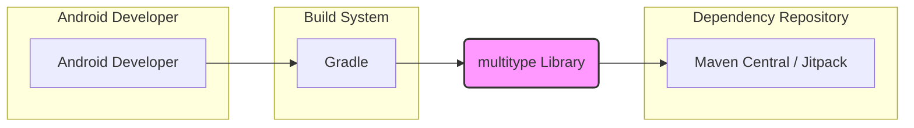
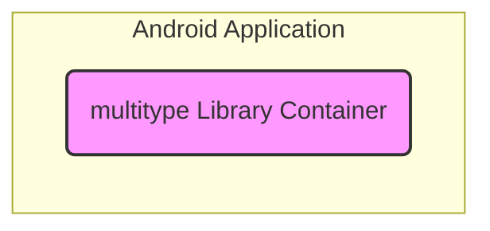

# BUSINESS POSTURE

- Business Priorities and Goals:
  - The primary goal of the `multitype` library is to simplify the development of Android RecyclerViews that display diverse data types.
  - The project prioritizes developer productivity by providing a reusable and easy-to-use library.
  - Another priority is to enhance code maintainability in Android projects by promoting a structured approach to handling multiple view types in RecyclerViews.
  - The project aims to improve the user experience of Android applications by enabling developers to create more dynamic and engaging list-based interfaces efficiently.
- Business Risks:
  - Low adoption rate by Android developers, leading to wasted development effort.
  - Bugs or performance issues in the library could negatively impact applications that depend on it, damaging developer trust.
  - Security vulnerabilities in the library could be exploited in applications using it, leading to potential security breaches in those applications.
  - Lack of community support and maintenance could lead to the library becoming outdated and unusable over time.

# SECURITY POSTURE

- Existing Security Controls:
  - security control: Source code hosted on GitHub, leveraging GitHub's infrastructure security. (Implemented by: GitHub)
  - security control: Publicly accessible repository, allowing for community review and contributions. (Implemented by: GitHub)
  - security control: Issue tracking system on GitHub for reporting and managing bugs and potential vulnerabilities. (Implemented by: GitHub)
- Accepted Risks:
  - accepted risk: Reliance on community contributions for identifying and addressing security vulnerabilities.
  - accepted risk: Potential for undiscovered vulnerabilities in the library code.
  - accepted risk: Risk of supply chain attacks through dependencies, although this project appears to have minimal dependencies.
- Recommended Security Controls:
  - security control: Implement automated static analysis security testing (SAST) in the CI/CD pipeline to identify potential code-level vulnerabilities.
  - security control: Integrate dependency scanning to monitor for known vulnerabilities in any external libraries used (though currently dependencies seem minimal).
  - security control: Establish a clear vulnerability reporting and response process, including a security policy file in the repository.
- Security Requirements:
  - Authentication: Not applicable. This is a library and does not handle user authentication.
  - Authorization: Not applicable. This is a library and does not handle user authorization.
  - Input Validation: While the library itself primarily processes configuration data (class types, item binders), input validation should be considered for any public APIs to prevent unexpected behavior or crashes due to malformed input from developers using the library.
  - Cryptography: Not applicable. This library is not expected to handle sensitive data or require cryptographic operations. However, if future features involve handling any data, appropriate encryption measures should be considered at the application level where this library is used.

# DESIGN

## C4 CONTEXT



- Elements of Context Diagram:
  - - Name: Android Developer
    - Type: Person
    - Description: Developers who use the `multitype` library to build Android applications.
    - Responsibilities: Integrate the `multitype` library into their Android projects to simplify RecyclerView implementation. Configure and use the library's APIs correctly.
    - Security controls: Responsible for securely using the library within their applications and following secure coding practices in their own application code.
  - - Name: Gradle
    - Type: Software System
    - Description: Android build system used to compile, build, and package Android applications. Gradle is used to manage dependencies, including the `multitype` library.
    - Responsibilities: Build Android applications, manage dependencies, and integrate the `multitype` library into the application build process.
    - Security controls: Gradle itself has security considerations related to build script execution and dependency resolution. Developers should ensure secure Gradle configurations and use trusted dependency sources.
  - - Name: Maven Central / Jitpack
    - Type: Software System
    - Description: Public repositories for hosting and distributing Java and Android libraries. `multitype` library is likely published to one of these repositories for developers to download and use.
    - Responsibilities: Host and distribute the `multitype` library, making it available for download by developers via Gradle or other dependency management tools.
    - Security controls: Repository security is managed by Maven Central/Jitpack. Developers should use secure channels (HTTPS) when downloading dependencies.
  - - Name: multitype Library
    - Type: Software System
    - Description: Android library that simplifies the implementation of RecyclerViews with multiple view types.
    - Responsibilities: Provide APIs and functionalities for developers to easily create and manage RecyclerViews with different item types. Process configuration data provided by developers to render RecyclerViews.
    - Security controls:  Focus on code quality, input validation of configuration data (class types, binders), and avoiding vulnerabilities that could be exploited in applications using the library.

## C4 CONTAINER



- Elements of Container Diagram:
  - - Name: multitype Library Container
    - Type: Container (Code Library)
    - Description: This container represents the `multitype` library itself, which is a collection of Kotlin/Java classes and resources designed to be included in Android applications. It encapsulates the logic for handling multiple view types in RecyclerViews.
    - Responsibilities:
      - Provide APIs for registering item types and binders.
      - Manage the mapping between data types and view types.
      - Handle the creation and binding of ViewHolders for different item types within a RecyclerView.
    - Security controls:
      - Code review to ensure secure coding practices.
      - Input validation within the library's APIs to handle potentially unexpected or malicious input from the application using it.
      - Static analysis security testing (SAST) to identify potential vulnerabilities in the library's code.

## DEPLOYMENT

- Deployment Options:
  - Option 1: Maven Central - Publish the library to Maven Central for wide accessibility and standard dependency management.
  - Option 2: Jitpack - Publish the library to Jitpack for easier integration with GitHub repositories and potentially faster releases.
  - Option 3: GitHub Packages - Publish the library as a GitHub Package, which is integrated with GitHub's ecosystem.

- Selected Deployment Architecture: Maven Central

```mermaid
flowchart LR
    subgraph "Maven Central Repository"
        A("Maven Central Server")
    end
    subgraph "Developer's Local Machine"
        subgraph "Local Maven Repository"
            B("Local Maven Cache")
        end
        C("Android Studio / IDE")
    end

    C --> B: Downloads Library
    B --> A: Fetches Library (if not cached)
    style A fill:#ccf,stroke:#333,stroke-width:2px
    style B fill:#eee,stroke:#333,stroke-width:1px
```

- Elements of Deployment Diagram:
  - - Name: Maven Central Server
    - Type: Infrastructure
    - Description: The infrastructure hosting the Maven Central repository, which stores and serves Java and Android libraries.
    - Responsibilities: Store and serve the `multitype` library artifacts (JAR/AAR files). Ensure the availability and integrity of the hosted libraries.
    - Security controls: Managed by the Maven Central infrastructure providers. Security measures include physical security, network security, and access controls to the repository.
  - - Name: Local Maven Cache
    - Type: Software (Local Cache)
    - Description: A local directory on the developer's machine where downloaded Maven dependencies are cached. This speeds up build times by avoiding repeated downloads from Maven Central.
    - Responsibilities: Store downloaded library artifacts locally. Provide cached artifacts to the build system (Gradle) when available.
    - Security controls:  Security relies on the security of the developer's local machine. Ensure the local machine is protected from malware and unauthorized access.
  - - Name: Android Studio / IDE
    - Type: Software (Development Tool)
    - Description: Integrated Development Environment used by Android developers to write, build, and debug Android applications. Includes Gradle integration for dependency management.
    - Responsibilities: Allow developers to specify dependencies (including `multitype`) in their project configuration (build.gradle files). Download dependencies from Maven Central (via Gradle). Integrate the library into the Android application build process.
    - Security controls:  Security depends on the security of the developer's IDE and the plugins used. Developers should use trusted IDE versions and plugins. Securely manage project configurations and dependencies.

## BUILD

```mermaid
flowchart LR
    subgraph "Developer Environment"
        A[Developer]
        B[Local Code Repository]
    end
    subgraph "CI/CD System (GitHub Actions)"
        C[GitHub Actions Workflow]
        D[Build Environment]
        E[Artifact Storage]
        F[Package Registry (Maven Central / Jitpack)]
    end

    A --> B: Code Changes
    B --> C: Push Code
    C --> D: Build & Test
    D --> E: Store Artifacts
    E --> F: Publish Package
    style A fill:#fff,stroke:#333,stroke-width:1px
    style B fill:#eee,stroke:#333,stroke-width:1px
    style C fill:#ccf,stroke:#333,stroke-width:2px
    style D fill:#eee,stroke:#333,stroke-width:1px
    style E fill:#eee,stroke:#333,stroke-width:1px
    style F fill:#ccf,stroke:#333,stroke-width:2px
```

- Elements of Build Diagram:
  - - Name: Developer
    - Type: Person
    - Description: Software developer working on the `multitype` library.
    - Responsibilities: Write code, commit changes to the code repository, and initiate the build process through code pushes.
    - Security controls: Responsible for secure coding practices, code reviews, and protecting their development environment.
  - - Name: Local Code Repository
    - Type: Software (Version Control)
    - Description: Local Git repository on the developer's machine where the source code of the `multitype` library is stored.
    - Responsibilities: Store the source code, track changes, and allow developers to manage versions of the code.
    - Security controls: Security relies on the developer's machine security and access controls to the local repository.
  - - Name: GitHub Actions Workflow
    - Type: Software (CI/CD Orchestration)
    - Description: Automated workflow defined in GitHub Actions to build, test, and publish the `multitype` library.
    - Responsibilities: Automate the build process, run tests, perform security checks (if configured), and publish the library artifacts.
    - Security controls: Securely configured GitHub Actions workflows, using secrets management for credentials, and ensuring the integrity of the workflow definition.
  - - Name: Build Environment
    - Type: Infrastructure (Compute)
    - Description: The environment where the build process is executed, typically a container or virtual machine provided by GitHub Actions.
    - Responsibilities: Provide a clean and consistent environment for building the library. Execute build scripts and commands defined in the workflow.
    - Security controls:  Managed by GitHub Actions infrastructure. Security measures include isolation of build environments and secure execution of build processes.
  - - Name: Artifact Storage
    - Type: Software (Storage)
    - Description: Temporary storage within the CI/CD pipeline to hold build artifacts (JAR/AAR files, POM files) before publishing.
    - Responsibilities: Store the generated build artifacts securely and temporarily.
    - Security controls: Managed by GitHub Actions infrastructure. Access control to stored artifacts within the CI/CD pipeline.
  - - Name: Package Registry (Maven Central / Jitpack)
    - Type: Software (Package Repository)
    - Description:  Maven Central or Jitpack repository where the final `multitype` library package is published for distribution.
    - Responsibilities: Host and distribute the released versions of the `multitype` library.
    - Security controls: Repository security is managed by Maven Central/Jitpack. Secure publishing process from the CI/CD pipeline to the repository.

# RISK ASSESSMENT

- Critical Business Processes:
  - Providing a functional and reliable Android library to developers.
  - Maintaining the integrity and availability of the library in distribution repositories.
  - Ensuring the library is free from vulnerabilities that could impact applications using it.
- Data Sensitivity:
  - The `multitype` library itself does not directly handle sensitive user data.
  - However, vulnerabilities in the library could potentially be exploited in applications that use it, leading to unauthorized access or disclosure of sensitive data managed by those applications.
  - The sensitivity of data indirectly related to this library depends on the applications that integrate and use it.

# QUESTIONS & ASSUMPTIONS

- BUSINESS POSTURE:
  - Assumption: The primary goal is developer convenience and code maintainability, rather than direct revenue generation for this specific library project.
  - Question: Are there any specific target audiences or use cases for this library that should be prioritized?
  - Question: What are the key metrics for success for this library (e.g., adoption rate, GitHub stars, community contributions)?

- SECURITY POSTURE:
  - Assumption: Security is important to maintain developer trust and prevent potential harm to applications using the library.
  - Question: Is there a formal vulnerability disclosure policy in place for this project?
  - Question: Are there any plans to implement automated security scanning tools in the CI/CD pipeline?

- DESIGN:
  - Assumption: The library is designed to be lightweight and have minimal dependencies.
  - Question: Are there any plans to add features that might introduce new dependencies or increase the complexity of the library?
  - Question: What is the intended distribution method for the library (Maven Central, Jitpack, etc.) and are there any security considerations specific to that method?