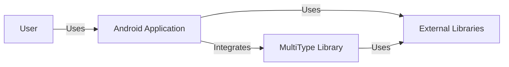
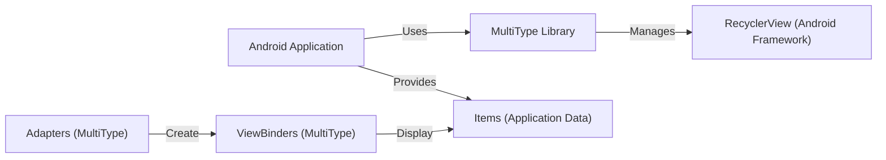
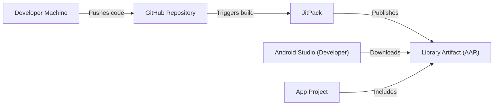
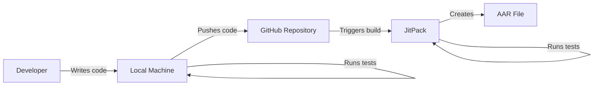

Okay, let's create a design document for the MultiType project.

# BUSINESS POSTURE

Business Priorities and Goals:

*   Provide a flexible and easy-to-use library for displaying multiple item types in Android RecyclerViews.
*   Reduce boilerplate code associated with RecyclerView adapters.
*   Improve code maintainability and readability.
*   Offer a robust and well-tested solution.
*   Attract and maintain a community of users and contributors.

Most Important Business Risks:

*   Library Adoption: The library may not gain sufficient traction, leading to wasted development effort.
*   Maintainability: The library could become difficult to maintain as it grows, or if key contributors leave.
*   Compatibility: Changes in the Android framework or related libraries could break compatibility.
*   Security Vulnerabilities: While not a primary concern for this type of library, vulnerabilities could still exist, potentially leading to app instability or, in extreme cases, data leaks if misused in a sensitive context.
*   Competition: Other libraries with similar functionality could overshadow MultiType.

# SECURITY POSTURE

Existing Security Controls:

*   security control: Code Reviews: The GitHub repository shows evidence of pull requests and code reviews, which helps to identify potential security issues before they are merged.
*   security control: Static Analysis: While not explicitly mentioned, it's common practice to use static analysis tools (like Lint) in Android development, which can catch some security-related coding errors.
*   security control: Open Source: The project is open source, allowing for community scrutiny and contributions, which can improve security.

Accepted Risks:

*   accepted risk: Limited Security Focus: The library itself is not directly involved in handling sensitive data or performing security-critical operations. The primary risk is indirect, stemming from how developers integrate the library into their applications.
*   accepted risk: Dependency Vulnerabilities: The library may depend on other libraries that could have security vulnerabilities.

Recommended Security Controls:

*   security control: Dependency Scanning: Implement automated dependency scanning (e.g., using tools like Snyk, Dependabot, or OWASP Dependency-Check) to identify and address vulnerabilities in third-party libraries.
*   security control: SAST Integration: Integrate Static Application Security Testing (SAST) tools into the build process to automatically scan for potential vulnerabilities in the MultiType code itself.
*   security control: Security Documentation: Add a SECURITY.md file to the repository outlining security considerations for users of the library, including best practices for handling data and avoiding common pitfalls.

Security Requirements:

*   Authentication: Not directly applicable to this library.
*   Authorization: Not directly applicable to this library.
*   Input Validation: The library should handle potentially malicious or unexpected input gracefully, without crashing or causing unexpected behavior. This is particularly relevant if the library is used to display user-generated content. The library itself doesn't directly handle user input, but it's crucial that developers using MultiType validate any data they pass to it.
*   Cryptography: Not directly applicable to this library.

# DESIGN

## C4 CONTEXT

Element Descriptions:

*   Element:
    *   Name: User
    *   Type: Person
    *   Description: The end-user of an Android application that utilizes the MultiType library.
    *   Responsibilities: Interacts with the Android application.
    *   Security Controls: None (handled by the Android application).

*   Element:
    *   Name: MultiType Library
    *   Type: Software System
    *   Description: A library for displaying multiple item types in Android RecyclerViews.
    *   Responsibilities: Provides a flexible and easy-to-use API for managing RecyclerView adapters.
    *   Security Controls: Input validation (indirectly, through developer usage), dependency scanning (recommended), SAST integration (recommended).

*   Element:
    *   Name: Android Application
    *   Type: Software System
    *   Description: An Android application that integrates the MultiType library.
    *   Responsibilities: Handles user interaction, business logic, and data display.
    *   Security Controls: All standard Android application security controls (e.g., data validation, secure storage, network security).

*   Element:
    *   Name: External Libraries
    *   Type: Software System
    *   Description: Third-party libraries used by the MultiType library and the Android application.
    *   Responsibilities: Provide various functionalities (e.g., networking, data storage, UI components).
    *   Security Controls: Dependency scanning (recommended).

## C4 CONTAINER

Element Descriptions:

*   Element:
    *   Name: Android Application
    *   Type: Container
    *   Description: The application that uses MultiType.
    *   Responsibilities: Provides data and overall application logic.
    *   Security Controls: Standard Android security practices.

*   Element:
    *   Name: MultiType Library
    *   Type: Container
    *   Description: The core library.
    *   Responsibilities: Provides the API for managing RecyclerViews.
    *   Security Controls: Input validation (indirect), dependency scanning (recommended).

*   Element:
    *   Name: RecyclerView (Android Framework)
    *   Type: Container
    *   Description: The standard Android UI component for displaying lists.
    *   Responsibilities: Handles efficient display and scrolling of list items.
    *   Security Controls: Handled by the Android framework.

*   Element:
    *   Name: Adapters (MultiType)
    *   Type: Component
    *   Description: MultiType's custom adapter implementations.
    *   Responsibilities: Manage the mapping of data to view binders.
    *   Security Controls: Input validation (indirect).

*   Element:
    *   Name: ViewBinders (MultiType)
    *   Type: Component
    *   Description: Components that bind data to specific view types.
    *   Responsibilities: Inflate layouts and populate views with data.
    *   Security Controls: Input validation (indirect).

*   Element:
    *   Name: Items (Application Data)
    *   Type: Data
    *   Description: The data to be displayed in the RecyclerView.
    *   Responsibilities: Represents the application's data model.
    *   Security Controls: Data validation and sanitization within the Android Application.

## DEPLOYMENT

Possible Deployment Solutions:

1.  JitPack: A popular and easy-to-use platform for publishing Android libraries.
2.  Maven Central: The standard repository for Java and Android libraries. Requires more setup than JitPack.
3.  Local Repository: Developers can build the library locally and include it as a module in their project.

Chosen Solution: JitPack (as indicated in the project's README)

Element Descriptions:

*   Element:
    *   Name: GitHub Repository
    *   Type: Code Repository
    *   Description: The source code repository for MultiType.
    *   Responsibilities: Stores the project's code, tracks changes, and manages releases.
    *   Security Controls: Access controls, code review processes.

*   Element:
    *   Name: JitPack
    *   Type: Build and Publication Service
    *   Description: A service that builds and publishes Android libraries directly from GitHub repositories.
    *   Responsibilities: Builds the library from source, creates the AAR artifact, and makes it available for download.
    *   Security Controls: JitPack's internal security measures, dependency scanning (recommended).

*   Element:
    *   Name: Developer Machine
    *   Type: Workstation
    *   Description: The machine used by developers to write and test code.
    *   Responsibilities: Code development, testing, and pushing changes to GitHub.
    *   Security Controls: Standard developer workstation security practices.

*   Element:
    *   Name: Android Studio (Developer)
    *   Type: IDE
    *   Description: The integrated development environment used by developers to build Android applications.
    *   Responsibilities: Provides tools for coding, building, and debugging.
    *   Security Controls: Standard IDE security practices.

*   Element:
    *   Name: App Project
    *   Type: Project
    *   Description: An Android application project that uses the MultiType library.
    *   Responsibilities: Integrates the MultiType library and uses it to display data.
    *   Security Controls: Standard Android application security practices.

*  Element:
    *   Name: Library Artifact (AAR)
    *   Type: Artifact
    *   Description: The compiled library package.
    *   Responsibilities: Contains the compiled code and resources of the MultiType library.
    *   Security Controls: Integrity checks (e.g., checksums) during download.

## BUILD

Build Process Description:

1.  Developer: The developer writes code and pushes it to the GitHub repository.
2.  Local Machine: Before pushing, the developer typically runs tests locally to ensure code quality.
3.  GitHub: The GitHub repository acts as the central source of truth for the code.
4.  JitPack: JitPack is configured to automatically build the library whenever changes are pushed to the GitHub repository (specifically, to tagged commits or releases).
5.  Compilation: JitPack compiles the code using the Android build tools.
6.  Testing: JitPack likely runs the project's unit tests as part of the build process.
7.  Artifact Creation: If the build and tests are successful, JitPack creates the AAR (Android Archive) file, which is the distributable package for the library.

Security Controls:

*   security control: Code Review: Pull requests and code reviews on GitHub help ensure code quality and security.
*   security control: Automated Testing: Unit tests help catch bugs and regressions, which can indirectly improve security.
*   security control: Dependency Scanning (Recommended): Integrate a dependency scanning tool into the JitPack build process (if possible) or as a separate GitHub Action.
*   security control: SAST (Recommended): Integrate a SAST tool into the build process to scan for vulnerabilities.

# RISK ASSESSMENT

Critical Business Processes:

*   Providing a stable and reliable library for RecyclerView management.
*   Maintaining the library and addressing user issues.
*   Ensuring compatibility with future Android versions.

Data Protection:

*   Data Sensitivity: The MultiType library itself does not handle sensitive data directly. The sensitivity of the data depends entirely on the application that uses the library.
*   Data Types: The library deals with generic data types that are displayed in RecyclerViews. The responsibility for protecting sensitive data lies with the application developer.

# QUESTIONS & ASSUMPTIONS

Questions:

*   Are there any specific compliance requirements (e.g., GDPR, HIPAA) that applications using this library are expected to meet?  This would influence recommendations for developers using the library.
*   What is the expected level of support and maintenance for this library? This impacts the risk assessment related to maintainability.
*   Are there any plans to monetize this library in the future? This could affect the business priorities and risks.

Assumptions:

*   BUSINESS POSTURE: The primary goal is to provide a useful and widely adopted open-source library. There is no immediate plan for monetization.
*   SECURITY POSTURE: The library is not intended for security-critical applications, but basic security best practices should still be followed.
*   DESIGN: The library will continue to be used primarily with Android's RecyclerView. The use of JitPack for distribution will continue. The build process is relatively simple and relies on standard Android build tools.