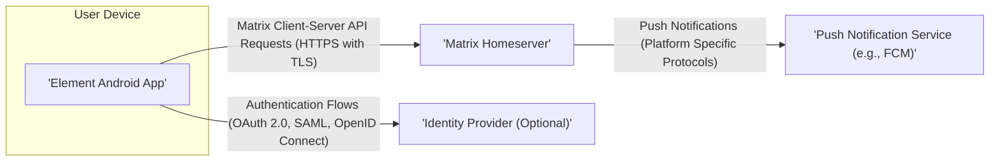
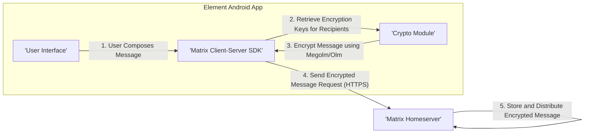
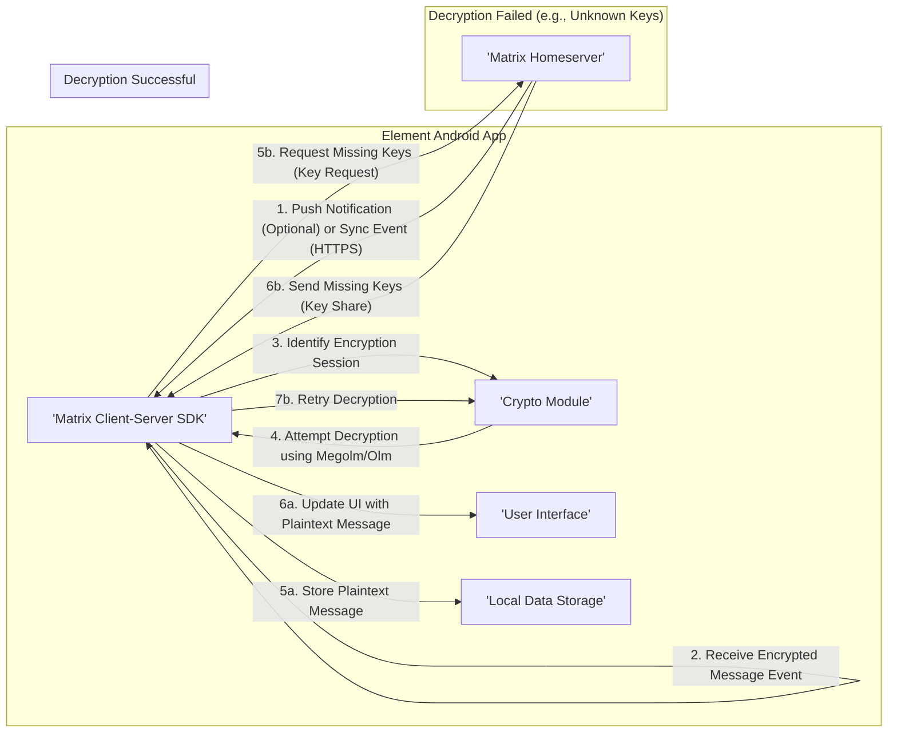
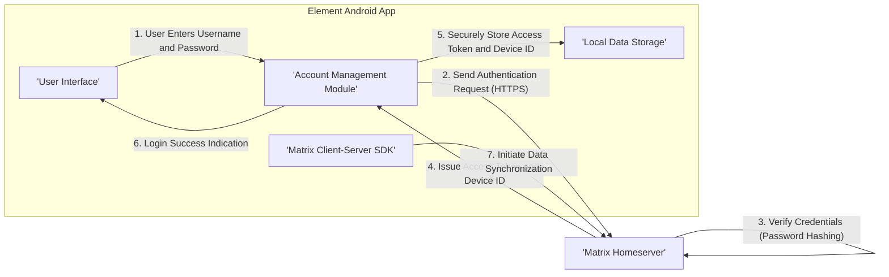

# Project Design Document: Element Android Application

**Version:** 1.1
**Date:** October 26, 2023
**Author:** AI Cloud & Security Architect

## 1. Introduction

This document provides a detailed design overview of the Element Android application, an open-source secure messenger built on the Matrix protocol. This document is specifically tailored to serve as a foundation for subsequent threat modeling activities. It outlines the application's architecture, key components with a security focus, detailed data flow for critical operations, and specific security considerations.

## 2. Goals and Objectives

The primary goals of the Element Android application are:

*   Provide secure and private communication through robust end-to-end encryption leveraging the Matrix protocol.
*   Offer a user-friendly and feature-rich interface for various communication modalities including text messaging, voice/video calls, and file sharing.
*   Enable decentralized and federated communication by adhering to the Matrix open protocol specifications.
*   Support seamless integration and interaction with diverse Matrix homeservers.
*   Maintain a high level of application performance, stability, and responsiveness.
*   Ensure user privacy and data protection are paramount in the application's design and implementation.

## 3. Architectural Overview

The Element Android application functions as a client application within the broader Matrix ecosystem. It directly interacts with a designated Matrix homeserver for core functionalities such as user account management, message exchange, and participation in communication rooms. The application also relies on external services like push notification providers for real-time event delivery and may optionally integrate with identity providers for streamlined authentication.

## 4. Detailed Component Design

This section provides a detailed breakdown of the key components within the Element Android application, with a particular emphasis on their security implications and responsibilities.

*   **User Interface (UI) Layer:**
    *   Primary responsibility is the rendering of application screens and the handling of all user interactions.
    *   Built using modern Android UI frameworks, primarily Jetpack Compose, potentially with legacy components using the traditional Android Views system.
    *   Includes components for displaying chronologically ordered message lists, a rich text editor for composing messages, intuitive room management features, and comprehensive user settings panels.
    *   Security considerations include protection against UI redressing attacks and ensuring proper input sanitization to prevent injection vulnerabilities.
*   **Matrix Client-Server SDK:**
    *   The central component responsible for all communication and interaction with the designated Matrix homeserver.
    *   Handles user authentication, comprehensive room management operations, sending and receiving various types of messages and events, efficient event synchronization, and the orchestration of end-to-end encryption.
    *   Implements the specifications defined by the Matrix Client-Server API.
    *   Security is paramount here, ensuring secure session management, proper handling of access tokens, and adherence to the Matrix protocol's security guidelines.
*   **Crypto Module (Olm/Megolm Implementation):**
    *   Manages the critical end-to-end encryption and decryption processes for messages exchanged within private rooms.
    *   Handles the complex aspects of cryptographic key generation, secure key exchange, secure session establishment, and rigorous device verification procedures.
    *   Implements the well-vetted Olm and Megolm cryptographic protocols.
    *   This module is a critical security boundary, requiring careful implementation to prevent cryptographic vulnerabilities and key compromise.
*   **Local Data Storage Layer:**
    *   Responsible for the persistent storage of application data directly on the user's device.
    *   Securely stores sensitive user credentials, detailed room metadata, comprehensive message history, and personalized application settings.
    *   Typically utilizes a local, embedded database such as SQLite, accessed through the Room Persistence Library for abstraction and type safety.
    *   Security measures must include encryption of the local database to protect data at rest, especially given the sensitive nature of the stored information.
*   **Media Handling Module:**
    *   Manages the secure uploading, efficient downloading, and appropriate display of various media file types, including images, videos, and audio recordings.
    *   Handles the encryption of media before upload and decryption upon download in end-to-end encrypted rooms.
    *   Interacts with the device's storage subsystems and potentially the camera and microphone hardware.
    *   Security considerations include preventing unauthorized access to stored media, ensuring secure transfer protocols, and mitigating risks associated with malicious media files.
*   **Push Notification Handler:**
    *   Handles the registration of the application instance with a platform-specific push notification service (e.g., Firebase Cloud Messaging on Android).
    *   Receives and processes incoming push notifications, triggering alerts for new messages and other relevant events.
    *   May wake up the application in the background to perform data synchronization.
    *   Security concerns involve potential information leakage through notification content and ensuring the integrity and authenticity of push messages.
*   **Background Synchronization Service:**
    *   Periodically synchronizes the local application state with the Matrix homeserver when the application is running in the background or brought to the foreground.
    *   Ensures that the locally stored data remains consistent and up-to-date with the server-side state.
    *   Security considerations include ensuring secure communication during background sync and preventing unauthorized data access.
*   **Call Module (Voice/Video Calling Functionality):**
    *   Facilitates real-time voice and video calls within Matrix rooms.
    *   Manages call signaling, secure media streaming, and the application of encryption to call media.
    *   Likely leverages the WebRTC framework or a similar technology for media transport.
    *   Security is critical for call media, ensuring end-to-end encryption and protection against eavesdropping.
*   **Account Management Module:**
    *   Handles user-centric operations such as account registration, secure login and logout procedures, and the management of user account settings.
    *   May interact with external Identity Providers for federated authentication scenarios.
    *   Security measures must include protection against brute-force attacks, secure storage of authentication tokens, and proper handling of password resets.
*   **Widget Support (If Implemented):**
    *   Enables the embedding and interaction with interactive widgets within Matrix rooms.
    *   Introduces potential security complexities related to the handling of third-party content and ensuring proper sandboxing to prevent malicious widget behavior.

## 5. Data Flow Diagrams

This section visually illustrates the flow of data through the application for several key functionalities, highlighting security-relevant steps.

### 5.1. Sending an End-to-End Encrypted Message

### 5.2. Receiving an End-to-End Encrypted Message

### 5.3. User Login with Password

## 6. Security Considerations (Detailed)

This section provides a more structured and detailed overview of potential security considerations that will be the focus of subsequent threat modeling activities.

*   **End-to-End Encryption (E2EE) Vulnerabilities:**
    *   Compromise of Olm/Megolm implementation leading to message decryption.
    *   Key exchange vulnerabilities allowing man-in-the-middle attacks.
    *   Weaknesses in device verification processes.
    *   Potential for replay attacks on encrypted messages.
*   **Cryptographic Key Management Security:**
    *   Insecure storage of encryption keys on the device (e.g., unencrypted storage, weak encryption).
    *   Risk of key extraction through device compromise (rooting, malware).
    *   Vulnerabilities in key backup and recovery mechanisms.
*   **Authentication and Authorization Weaknesses:**
    *   Vulnerabilities to brute-force attacks on login credentials.
    *   Insecure storage or transmission of access tokens.
    *   Session hijacking vulnerabilities.
    *   Lack of multi-factor authentication support.
*   **Local Data Storage Security:**
    *   Unencrypted local database exposing sensitive data at rest.
    *   Insufficient protection against unauthorized access to local files.
    *   Data leakage through insecure temporary files or logging.
*   **Network Communication Security:**
    *   Vulnerability to man-in-the-middle attacks if HTTPS is not enforced or implemented correctly.
    *   Risks associated with insecure network connections (e.g., public Wi-Fi).
    *   Potential for DNS spoofing or hijacking.
*   **Push Notification Security Risks:**
    *   Information leakage through the content of push notifications.
    *   Potential for push notification spoofing or manipulation.
    *   Privacy implications of push notification metadata.
*   **Third-Party Integration Security (Widgets, etc.):**
    *   Risks associated with embedding untrusted or malicious third-party content.
    *   Potential for cross-site scripting (XSS) vulnerabilities within widgets.
    *   Insufficient sandboxing of widget code.
*   **Application Code Security:**
    *   Common software vulnerabilities such as buffer overflows, injection flaws, and insecure deserialization.
    *   Improper handling of user input leading to security issues.
    *   Vulnerabilities in custom code related to security-sensitive operations.
*   **Dependency Management Security:**
    *   Use of vulnerable third-party libraries with known security flaws.
    *   Lack of proper dependency scanning and management.
    *   Risk of supply chain attacks through compromised dependencies.
*   **Privacy Considerations:**
    *   Collection and handling of user data in compliance with privacy regulations (e.g., GDPR).
    *   Transparency regarding data collection and usage practices.
    *   Mechanisms for users to control their data.

## 7. Deployment

The Element Android application is typically deployed and distributed through the following official and community-driven channels:

*   **Google Play Store:** The primary and official distribution channel for Android applications, providing automated updates and security checks.
*   **F-Droid:** A reputable alternative app store focusing on free and open-source software, offering verifiable builds.
*   **Direct APK Download (Advanced Users):**  Distribution of the application package (APK) directly, typically for development, testing, or users who prefer manual installation. Requires users to enable installation from unknown sources.

The deployment process involves building the application package (APK), digitally signing it with a developer key for authenticity, and uploading it to the chosen distribution platform(s).

## 8. Technologies Used (Detailed)

This section lists the key technologies, libraries, and frameworks utilized in the development of the Element Android application, providing context for potential security considerations related to these technologies.

*   **Primary Programming Language:** Kotlin (leveraging its modern features and security benefits).
*   **User Interface Framework:** Jetpack Compose (Google's modern declarative UI toolkit for Android), with potential legacy components using traditional Android Views.
*   **Matrix Client-Server SDK:**  Likely a well-established and actively maintained Matrix SDK for Android, such as `matrix-android-sdk2` or its successor, providing the core Matrix protocol implementation.
*   **Cryptography Libraries:**  The Olm and Megolm cryptographic libraries are fundamental for end-to-end encryption, likely integrated directly within the chosen Matrix SDK.
*   **Local Database:** SQLite, a widely used embedded database, accessed and managed through the Room Persistence Library (part of Android Jetpack) for type-safe database access.
*   **Networking Library:** OkHttp, a popular and efficient HTTP client for Android and Java applications, used for communication with the Matrix homeserver and other services.
*   **JSON Processing:** Likely Gson or Kotlin Serialization for handling JSON data exchanged with the Matrix API.
*   **Image Loading and Caching:**  Libraries like Coil or Glide for efficient image loading and caching.
*   **Push Notifications:** Firebase Cloud Messaging (FCM) for receiving and handling push notifications.
*   **Dependency Management:** Gradle, the standard build tool for Android projects, used for managing project dependencies.
*   **Build System:** Gradle, responsible for automating the build, testing, and packaging process.
*   **Version Control:** Git, the widely adopted distributed version control system, used for managing the project's source code (as hosted on GitHub).

This improved document provides a more detailed and security-focused design overview of the Element Android application, making it a more effective foundation for subsequent threat modeling activities.
