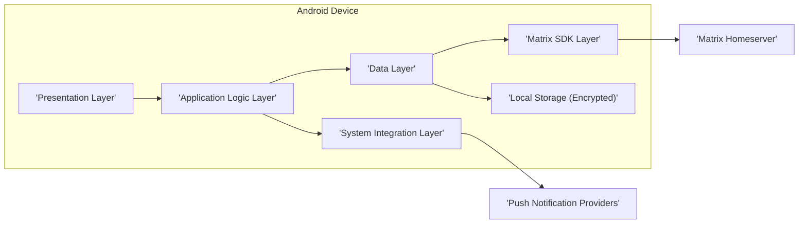
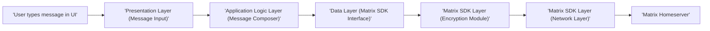
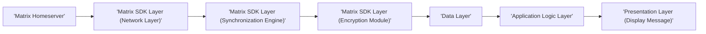

# Project Design Document: Element Android Application

**Version:** 1.1
**Date:** October 26, 2023
**Prepared By:** Gemini (AI Language Model)

## 1. Introduction

This document provides a detailed design overview of the Element Android application, a secure collaboration app built on the Matrix open standard. This document is specifically crafted to facilitate subsequent threat modeling activities by clearly outlining the application's architecture, key components, data flows, and inherent security considerations. It is based on the publicly available source code repository: [https://github.com/element-hq/element-android](https://github.com/element-hq/element-android).

## 2. Goals

*   Provide a granular and well-defined architectural overview of the Element Android application.
*   Identify key components, their specific functionalities, and interdependencies.
*   Detail the primary data flows within the application, highlighting sensitive data paths.
*   Articulate specific security considerations and potential vulnerabilities relevant for threat modeling.
*   Serve as a comprehensive and actionable document for security analysts and developers.

## 3. Scope

This document focuses on the design of the Element Android application running on an Android device and its direct interactions with external services. It encompasses the internal components, data handling, and communication protocols relevant to the application's security posture. The scope does not extend to the intricacies of the Matrix protocol itself, the server-side implementation of the homeserver, or the underlying Android operating system's core functionalities beyond their direct interaction with the application.

## 4. High-Level Architecture

The Element Android application is structured into distinct layers, each with specific responsibilities:

*   **Presentation Layer:** Responsible for rendering the user interface and managing user interactions.
*   **Application Logic Layer:**  Orchestrates application behavior, manages state, and coordinates interactions between the Presentation and Data layers.
*   **Data Layer:** Handles data retrieval, persistence, and interaction with external services, including the Matrix SDK.
*   **Matrix SDK Layer:**  Provides the implementation of the Matrix protocol, managing communication with the Matrix homeserver and handling cryptographic operations.
*   **System Integration Layer:** Facilitates interaction with Android system services and device hardware.

## 5. Key Components

This section provides a more detailed breakdown of the major components:

*   **Presentation Layer:**
    *   **Activities and Fragments:** Manage screen lifecycles and user navigation.
    *   **Layouts (XML/Compose):** Define the structure and appearance of UI elements.
    *   **View Models/Presenters:** Hold UI-related data and handle UI logic, mediating between the View and the Application Logic Layer.
    *   **UI Widgets and Custom Views:** Display information and handle user input.

*   **Application Logic Layer:**
    *   **Use Cases/Interactors:** Implement specific business logic for features like sending messages, joining rooms, and managing user settings.
    *   **State Management:**  Manages the application's state, potentially using libraries like RxJava, Coroutines StateFlow, or MVI patterns.
    *   **Navigation Logic:**  Handles transitions between different screens and flows within the application.
    *   **Authentication and Session Management:** Manages user login, logout, and session persistence.

*   **Data Layer:**
    *   **Local Database (Room):**  Provides a persistent storage mechanism for caching data like messages, room lists, and user profiles.
    *   **Matrix SDK Interface:**  Abstracts the interaction with the Matrix SDK, providing a clean API for the Application Logic Layer.
    *   **Network Client (Retrofit/OkHttp):**  Handles network requests to external services (although most Matrix communication goes through the SDK).
    *   **Data Mappers:**  Convert data between different formats (e.g., network responses to database entities).

*   **Matrix SDK Layer:**
    *   **Matrix Client:** The core component for interacting with a Matrix homeserver.
    *   **Encryption Module (Olm/Megolm):** Handles end-to-end encryption and decryption of messages.
    *   **Synchronization Engine:**  Manages the process of syncing data between the client and the homeserver.
    *   **Network Layer (within SDK):**  Handles the low-level network communication with the Matrix homeserver.
    *   **Store (within SDK):**  Manages the SDK's internal data storage and caching.

*   **System Integration Layer:**
    *   **Push Notification Handler (FCM Integration):**  Registers for and handles push notifications.
    *   **Background Task Manager (WorkManager):**  Schedules and manages background tasks for data synchronization and other operations.
    *   **File Access and Storage:**  Handles access to local files and storage for media and other attachments.
    *   **Device Sensors and Permissions:**  Accesses device sensors (e.g., camera, microphone) and manages required permissions.

*   **Local Storage (Encrypted):**
    *   **Encrypted Database:** The local database where sensitive data, including message history and encryption keys, is stored using Android's encryption facilities.
    *   **Encrypted Shared Preferences:**  Stores application settings and other sensitive configuration data.

## 6. Data Flow

This section provides more detailed data flow diagrams for key operations:

### 6.1. Sending an Encrypted Message

*   The user inputs a message in the UI.
*   The Presentation Layer captures the message content.
*   The Application Logic Layer processes the message and prepares it for sending.
*   The Data Layer invokes the Matrix SDK Interface.
*   The Matrix SDK's Encryption Module encrypts the message using the appropriate session keys.
*   The Matrix SDK's Network Layer sends the encrypted message to the Matrix Homeserver.

### 6.2. Receiving and Decrypting an Encrypted Message

*   The Matrix Homeserver sends a new message to the device.
*   The Matrix SDK's Network Layer receives the message.
*   The Synchronization Engine processes the incoming message.
*   The Encryption Module attempts to decrypt the message using available session keys.
*   The Data Layer stores the decrypted message in the local database.
*   The Application Logic Layer updates the UI with the new message.
*   The Presentation Layer renders the message to the user.

### 6.3. Initial User Login and Key Setup

```mermaid
graph LR
    A["'User enters credentials'"] --> B["'Presentation Layer (Login Screen)'"]
    B --> C["'Application Logic Layer (Authentication)'"]
    C --> D["'Data Layer (Matrix SDK Interface)'"]
    D --> E["'Matrix SDK Layer (Authentication)'"]
    E --> F["'Matrix Homeserver (Authentication)'"]
    F -- "'Authentication Success'" --> G["'Matrix SDK Layer (Key Generation/Retrieval)'"]
    G --> H["'Local Storage (Encrypted Key Store)'"]
    H --> I["'Application Logic Layer (Session Management)'"]
    I --> J["'Presentation Layer (Main App)'"]
```

*   The user provides their login credentials.
*   The Presentation Layer captures the credentials.
*   The Application Logic Layer initiates the authentication process.
*   The Data Layer interacts with the Matrix SDK.
*   The Matrix SDK communicates with the Matrix Homeserver for authentication.
*   Upon successful authentication, the SDK handles key generation or retrieval.
*   Encryption keys are securely stored in the encrypted local storage.
*   The Application Logic Layer manages the user session.
*   The Presentation Layer displays the main application interface.

## 7. Security Considerations (Specific Areas for Threat Modeling)

This section outlines specific security considerations relevant for threat modeling:

*   **End-to-End Encryption (E2EE) Vulnerabilities:**
    *   Compromise of encryption keys stored in local storage.
    *   Man-in-the-middle attacks during initial key exchange or device verification.
    *   Implementation flaws in the Olm/Megolm libraries within the Matrix SDK.
    *   Vulnerabilities in session management and key rotation.

*   **Local Data Security:**
    *   Weak or compromised device encryption allowing access to the local database.
    *   SQL injection vulnerabilities if data is not properly sanitized before database queries.
    *   Exposure of sensitive data through insecure logging or debugging practices.
    *   Insufficient protection against unauthorized access to the device.

*   **Network Communication Security:**
    *   Bypassing TLS certificate validation, leading to man-in-the-middle attacks.
    *   Vulnerabilities in the Matrix protocol itself.
    *   Exposure of sensitive information in network requests or responses (beyond encrypted content).

*   **Authentication and Authorization Flaws:**
    *   Brute-force attacks against login credentials.
    *   Session hijacking or token theft.
    *   Insecure handling of password reset mechanisms.
    *   Privilege escalation vulnerabilities.

*   **Push Notification Security:**
    *   Exposure of sensitive information in push notification content.
    *   Push notification spoofing or manipulation.
    *   Unauthorized access to push notification registration tokens.

*   **Third-Party Library Vulnerabilities:**
    *   Security flaws in the Matrix SDK or other included libraries.
    *   Supply chain attacks targeting dependencies.

*   **Input Validation and Data Sanitization:**
    *   Cross-site scripting (XSS) vulnerabilities if user-generated content is not properly sanitized.
    *   Injection attacks (e.g., SQL injection, command injection) if user input is not validated.

*   **Permissions and System Integrations:**
    *   Overly broad permissions granted to the application.
    *   Vulnerabilities arising from interactions with other applications or system services.
    *   Data leaks through insecure handling of device sensors or external storage.

## 8. Technology Stack

*   **Primary Programming Language:** Kotlin
*   **User Interface Framework:** Jetpack Compose and/or Android Views
*   **Architectural Pattern:** Model-View-ViewModel (MVVM), Model-View-Intent (MVI)
*   **Local Database:** SQLite via Room Persistence Library
*   **Matrix SDK:**  Likely the official Matrix Android SDK (or a derivative)
*   **Networking Library (within SDK & potentially Data Layer):** OkHttp, Retrofit
*   **Dependency Injection:** Hilt or Dagger
*   **Asynchronous Programming:** Kotlin Coroutines, RxJava
*   **Background Task Management:** WorkManager
*   **Push Notifications:** Firebase Cloud Messaging (FCM)
*   **Encryption Libraries (within Matrix SDK):** Olm, Megolm
*   **Image Loading:** Coil, Glide

## 9. Deployment

The Element Android application is typically deployed through:

*   **Google Play Store:** The primary distribution platform.
*   **F-Droid:** A repository for free and open-source software.
*   **Direct APK Distribution:** Used for development, testing, or specific releases.

## 10. Assumptions and Constraints

*   The security of the underlying Android operating system and device hardware is assumed to a reasonable extent.
*   The Matrix Homeserver is assumed to be correctly configured and maintained with appropriate security measures.
*   The Matrix SDK is considered a trusted component, but its security needs to be continuously monitored.
*   Users are expected to have a stable internet connection for core functionalities.
*   This document reflects the current understanding of the application's architecture based on publicly available information and may not capture all internal implementation details.

## 11. Future Considerations

*   Conducting detailed threat modeling sessions based on the identified components, data flows, and security considerations.
*   Performing regular security audits and penetration testing to identify and address vulnerabilities.
*   Implementing robust security monitoring and logging mechanisms.
*   Staying up-to-date with security best practices and patching dependencies promptly.
*   Considering further security enhancements based on threat intelligence and evolving security landscapes.
