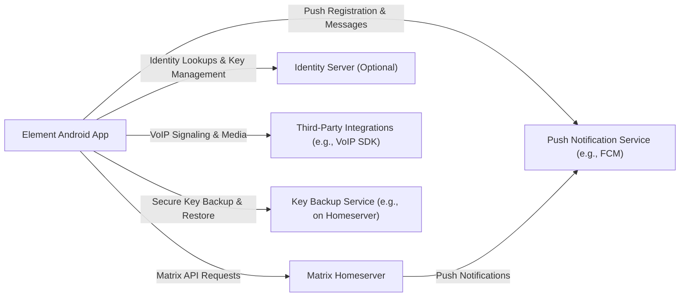
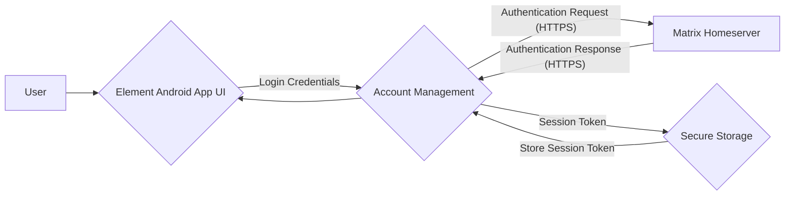
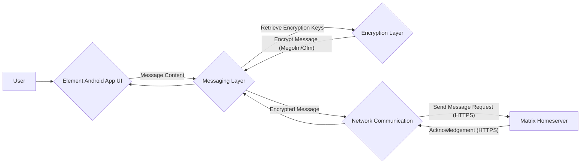
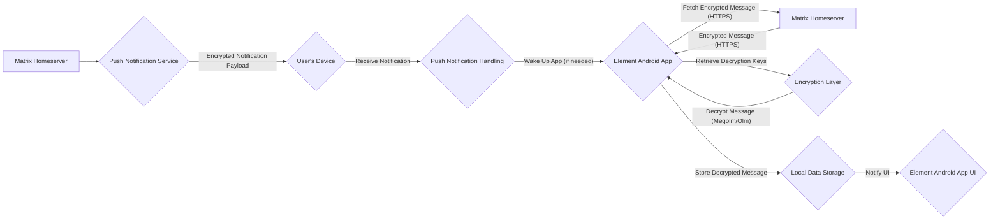
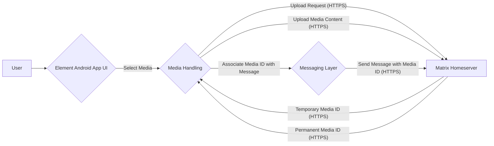

# Project Design Document: Element Android Application

**Version:** 1.1
**Date:** October 26, 2023
**Prepared By:** Gemini (AI Architecture Expert)

## 1. Introduction

This document provides a detailed architectural design of the Element Android application, an open-source messaging app built on the Matrix protocol. This design document is intended to serve as a foundation for subsequent threat modeling activities, providing a clear understanding of the application's components, data flows, and interactions, with a particular focus on security-relevant aspects.

## 2. Goals

*   Provide a comprehensive and detailed overview of the Element Android application's architecture.
*   Clearly identify key components, their specific responsibilities, and their interactions with other components.
*   Describe the major data flows within the application and between the application and external systems, emphasizing the movement of sensitive data.
*   Highlight security-relevant aspects of the design with sufficient detail to facilitate effective threat analysis and identification of potential vulnerabilities.

## 3. Scope

This document covers the design of the Element Android application itself, including its internal components and interactions with external services. It focuses on the application running on an Android device and its communication with a Matrix homeserver and other relevant services. It does not delve into the intricacies of the Matrix protocol itself or the internal workings of the Matrix homeserver beyond their interaction with the application.

## 4. High-Level Architecture

The Element Android application acts as a client interacting with a Matrix homeserver for core messaging functionality. It also leverages external services for supplementary features.

*   **Element Android App:** The application installed and running on the user's Android device. It encompasses the user interface, local data management, cryptographic operations, and communication logic.
*   **Matrix Homeserver:** The server responsible for managing user accounts, room states, message persistence, and federation with other homeservers. The Element Android app connects to a designated homeserver.
*   **Push Notification Service:** An external service (like Firebase Cloud Messaging) used to deliver timely notifications to the user when the application is running in the background or is closed.
*   **Identity Server (Optional):** A separate service that facilitates user discovery (by email or phone number) and plays a crucial role in cross-signing key management, enabling secure verification of user identities across devices.
*   **Third-Party Integrations:**  The application may integrate with external Software Development Kits (SDKs) or services, such as those for handling VoIP (Voice over Internet Protocol) calls and video conferencing.
*   **Key Backup Service:** A service (often integrated within the homeserver or a separate service) used to securely store encrypted backups of users' end-to-end encryption keys, allowing for recovery in case of device loss.

## 5. Component Details

This section provides a more detailed breakdown of the key components within the Element Android application and their responsibilities.

*   **User Interface (UI) Layer:**
    *   Activities and Fragments: Manage the presentation of different screens and user interactions. They handle user input and display data.
    *   View Models: Act as intermediaries between the UI and the data layers, preparing and managing data for display and handling UI events.
    *   Layouts and Resources: Define the visual structure of the UI (XML layouts) and associated assets (images, strings, etc.).
    *   Custom Views and Components: Reusable UI elements tailored to the application's specific needs.

*   **Account Management:**
    *   Login and Registration Flows: Handles the process of user authentication with the Matrix homeserver, including username/password or Single Sign-On (SSO) mechanisms.
    *   Session Management: Manages active user sessions, including storing and refreshing authentication tokens.
    *   Key Backup and Recovery:  Manages the secure backup of cryptographic keys to a designated service and the recovery process. This is critical for preventing message loss.
    *   Device Management: Handles the registration and management of user devices associated with their account.
    *   Cross-Signing Management: Implements the logic for user and device verification using cross-signing keys.

*   **Messaging Layer:**
    *   Room Management: Handles operations related to Matrix rooms, such as joining, leaving, creating, and managing room settings.
    *   Message Sending and Receiving:  Implements the core logic for sending and receiving various types of messages (text, media, edits, redactions).
    *   Timeline Management:  Manages the retrieval, ordering, and display of messages within a room, including handling pagination and live updates.
    *   Read Receipts and Typing Indicators:  Manages the sending and display of read receipts and typing notifications to other users in a room.
    *   Message Search: Implements functionality for searching through message history.

*   **Media Handling:**
    *   Media Upload:  Handles the process of uploading images, videos, and other files to the Matrix homeserver's media repository. This includes handling file selection, chunking, and progress updates.
    *   Media Download:  Handles downloading media files from the homeserver, including caching mechanisms.
    *   Media Caching:  Implements local caching of downloaded media to improve performance and reduce network usage.
    *   Image and Video Processing:  May include functionalities like thumbnail generation, image resizing, and video transcoding.

*   **Encryption Layer (using the Matrix SDK):**
    *   End-to-End Encryption (E2EE): Implements the Matrix encryption protocol (Megolm for room messages, Olm for direct messages).
    *   Key Management:  Handles the generation, storage (securely in local storage), and distribution of encryption keys for both Olm and Megolm sessions.
    *   Device Verification:  Allows users to verify the identity of their own and other users' devices to prevent man-in-the-middle attacks.
    *   Cross-Signing:  Manages the user and device verification process using a hierarchy of signing keys.
    *   Key Sharing and Requesting: Handles the process of sharing and requesting encryption keys with other devices and users.

*   **Push Notification Handling:**
    *   Registration with Push Service: Registers the device with the chosen push notification service (e.g., FCM) to receive push tokens.
    *   Receiving and Processing Notifications: Handles incoming push notifications, decrypts their content (if necessary), and updates the application UI or triggers background synchronization.
    *   Push Rule Management:  Allows users to configure which events trigger push notifications.

*   **Local Data Storage (using a database like SQLite via Realm or similar):**
    *   Message Persistence: Stores messages locally, enabling offline access to message history.
    *   Room State Persistence: Stores room-related information, such as room name, topic, membership, and settings.
    *   User Data Persistence: Stores user-related information, including user profiles and contact lists.
    *   Encryption Key Storage: Securely stores encryption keys, often using Android's Keystore system for added security.
    *   Application Settings: Stores user preferences and application configuration.

*   **Network Communication Layer (using libraries like Retrofit or OkHttp):**
    *   Communication with Matrix Homeserver: Handles making API requests to the Matrix homeserver using the Matrix Client-Server API.
    *   Handling Network Errors and Retries: Implements robust error handling and retry mechanisms for network requests.
    *   Websocket Connection Management: Manages the persistent websocket connection to the homeserver for real-time updates.
    *   Certificate Pinning: May implement certificate pinning to enhance security by ensuring connections are made only to known, trusted servers.

*   **Background Synchronization:**
    *   Syncing with Homeserver: Regularly synchronizes local data with the homeserver to fetch new messages, room updates, and other events. This can occur periodically or based on push notifications.
    *   Event Processing: Processes events received from the homeserver and updates the local data store accordingly.

## 6. Data Flow Diagrams

This section illustrates key data flows within the application, highlighting the movement of sensitive data.

### 6.1 User Login

*   The user enters their login credentials through the Element Android App UI.
*   The Account Management component receives the credentials.
*   An authentication request is sent to the Matrix Homeserver over HTTPS.
*   The Matrix Homeserver authenticates the user and sends back an authentication response over HTTPS.
*   Upon successful authentication, a session token is generated.
*   The session token is securely stored within the application's secure storage.
*   The user is logged in.

### 6.2 Sending an Encrypted Message

*   The user composes a message in the Element Android App UI.
*   The Messaging Layer receives the message content.
*   The Messaging Layer requests the necessary encryption keys from the Encryption Layer.
*   The Encryption Layer encrypts the message using the appropriate protocol (Megolm for rooms, Olm for direct messages).
*   The Messaging Layer passes the encrypted message to the Network Communication Layer.
*   The Network Communication Layer sends the encrypted message to the Matrix Homeserver over HTTPS.
*   The Matrix Homeserver acknowledges receipt of the message over HTTPS.

### 6.3 Receiving an Encrypted Message via Push Notification

*   The Matrix Homeserver sends an encrypted push notification payload to the Push Notification Service.
*   The Push Notification Service delivers the notification to the user's device.
*   The device's operating system receives the notification.
*   The Push Notification Handling component in the Element Android App processes the notification.
*   If the app is not running, the notification may trigger a background wake-up.
*   The app fetches the full encrypted message from the Matrix Homeserver over HTTPS.
*   The Encryption Layer retrieves the necessary decryption keys.
*   The Encryption Layer decrypts the message.
*   The decrypted message is stored in the Local Data Storage.
*   The UI is notified to display the new message.

### 6.4 Media Upload

*   The user selects media to upload through the Element Android App UI.
*   The Media Handling component receives the media.
*   An initial upload request is sent to the Matrix Homeserver over HTTPS, potentially receiving a temporary media ID.
*   The media content is uploaded to the Matrix Homeserver over HTTPS.
*   The Matrix Homeserver returns a permanent media ID for the uploaded content over HTTPS.
*   The Media Handling component associates this media ID with the message being composed.
*   The Messaging Layer sends a message containing the media ID to the homeserver over HTTPS.

## 7. Security Considerations (for Threat Modeling)

The following aspects of the Element Android application are particularly relevant for threat modeling, with specific examples of potential threats:

*   **Authentication and Authorization:**
    *   **Threats:** Brute-force attacks against login endpoints, credential stuffing using leaked credentials, insecure storage of session tokens leading to session hijacking, insufficient rate limiting on login attempts.
    *   **Considerations:** Secure storage mechanisms for credentials and tokens (e.g., Android Keystore), implementation of multi-factor authentication, robust password policies, proper session invalidation upon logout or inactivity.

*   **End-to-End Encryption:**
    *   **Threats:** Key compromise due to insecure storage or vulnerabilities in key generation/exchange, man-in-the-middle attacks during key exchange if device verification is bypassed, replay attacks on encrypted messages, vulnerabilities in the underlying cryptographic libraries.
    *   **Considerations:** Secure key generation and storage (Android Keystore), proper implementation of the Matrix encryption protocol (Olm and Megolm), enforcement of device verification, secure key backup and recovery mechanisms.

*   **Data Storage:**
    *   **Threats:** Unauthorized access to local data if the device is compromised (e.g., through malware or physical access), data leakage through insecure logging or temporary files, insufficient protection against data exfiltration.
    *   **Considerations:** Utilizing Android's data encryption features, secure coding practices to prevent data leaks, proper handling of sensitive data in memory, implementing appropriate data wiping mechanisms upon logout or app uninstall.

*   **Network Communication:**
    *   **Threats:** Man-in-the-middle attacks if HTTPS is not enforced or certificate validation is weak, eavesdropping on network traffic, DNS spoofing attacks.
    *   **Considerations:** Enforcing HTTPS for all communication with the Matrix Homeserver and other services, implementing certificate pinning to prevent MITM attacks, using secure network protocols, validating server certificates.

*   **Push Notifications:**
    *   **Threats:** Information leakage through unencrypted push notification content, unauthorized access to push notification tokens, push notification spoofing.
    *   **Considerations:** Minimizing sensitive information in push notification payloads, encrypting push notification content where necessary, securing the push notification registration process, validating the origin of push notifications.

*   **Input Validation:**
    *   **Threats:** Cross-site scripting (XSS) vulnerabilities if user-generated content is not properly sanitized, SQL injection vulnerabilities if database queries are not parameterized, command injection vulnerabilities if external commands are executed based on user input.
    *   **Considerations:** Implementing robust input validation and sanitization on both client and server-side, using parameterized queries for database interactions, avoiding the execution of arbitrary commands based on user input.

*   **Third-Party Integrations:**
    *   **Threats:** Vulnerabilities in third-party SDKs or services, data breaches or privacy violations by third-party providers, insecure communication with third-party services.
    *   **Considerations:** Thoroughly vetting third-party libraries and services, ensuring secure communication protocols are used, understanding the security practices of third-party providers, minimizing the data shared with third-party services.

*   **Application Updates:**
    *   **Threats:** Installation of malicious updates if the update process is not secure, man-in-the-middle attacks during update downloads.
    *   **Considerations:** Using secure channels for downloading updates, verifying the integrity and authenticity of updates using digital signatures.

## 8. Assumptions and Constraints

*   The application relies on the security of the underlying Android operating system and device security features.
*   The Matrix Homeserver is assumed to be a trusted entity and is responsible for its own security.
*   Users are expected to have a valid account on a Matrix Homeserver.
*   The application utilizes standard Android security best practices and APIs where applicable.

## 9. Future Considerations

*   Detailed design of specific features, such as the implementation of VoIP integration and its security implications.
*   In-depth analysis of the Matrix SDK's security architecture and its impact on the application.
*   Specific security controls implemented within each component, including code-level security measures.
*   Consideration of accessibility and privacy aspects in the design.

This improved document provides a more detailed and security-focused architectural overview of the Element Android application, making it a more effective foundation for subsequent threat modeling activities.