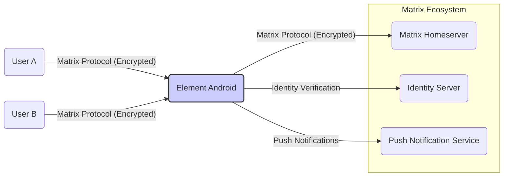

# BUSINESS POSTURE

The Element Android project aims to provide a secure, private, and feature-rich messaging and collaboration application on the Android platform. It is built upon the Matrix open protocol for decentralized communication. The primary business priorities and goals are:

- Provide a reliable and user-friendly Matrix client for Android users.
- Ensure secure and private communication for users, protecting their data and conversations.
- Promote the adoption of the Matrix protocol as an open and decentralized communication standard.
- Maintain an open-source project that is community-driven and transparent.
- Offer a competitive alternative to proprietary messaging applications, emphasizing user control and data ownership.

Key business risks associated with these priorities and goals include:

- Security vulnerabilities in the application or the underlying Matrix protocol that could compromise user privacy and trust.
- Data breaches or leaks that could damage the project's reputation and user confidence.
- Performance issues or usability problems that could hinder user adoption and satisfaction.
- Competition from other messaging applications, both open-source and proprietary.
- Dependence on the Matrix ecosystem and the stability of Matrix homeservers.
- Legal and regulatory compliance related to data privacy and communication security.
- Difficulty in monetizing the open-source project to ensure long-term sustainability.

# SECURITY POSTURE

Existing security controls:

- security control: Code reviews are likely conducted by the development team and community contributors as part of the open-source development process. (Location: GitHub repository - pull request reviews, commit history)
- security control: Static Application Security Testing (SAST) tools are likely used during development to identify potential vulnerabilities in the codebase. (Location: CI/CD pipelines - if implemented, or development practices)
- security control: Secure coding practices are likely followed by developers, considering the project's focus on security and privacy. (Location: Codebase structure, coding style, project documentation - if available)
- security control: Cryptography is heavily used for end-to-end encryption based on the Matrix protocol. (Location: Codebase - crypto libraries, Matrix SDK usage)
- security control: Regular updates and patching are likely provided to address security vulnerabilities and bugs. (Location: GitHub repository - release notes, commit history)
- security control: User authentication is implemented using Matrix account credentials. (Location: Codebase - authentication modules, Matrix SDK usage)
- security control: Authorization mechanisms are in place to control access to resources and functionalities within the application and the Matrix protocol. (Location: Codebase - permission checks, Matrix SDK usage)

Accepted risks:

- accepted risk: Risks associated with open-source dependencies and potential vulnerabilities in third-party libraries.
- accepted risk: Risks related to user device security, as the application's security is partially dependent on the security of the user's Android device.
- accepted risk: Risks inherent in complex cryptographic implementations, requiring careful design and review.
- accepted risk: Potential for social engineering attacks targeting users to compromise their accounts or data.

Recommended security controls:

- security control: Implement Dynamic Application Security Testing (DAST) to identify runtime vulnerabilities.
- security control: Conduct regular penetration testing by external security experts to assess the application's security posture.
- security control: Implement dependency scanning and management to track and mitigate vulnerabilities in third-party libraries.
- security control: Enhance security logging and monitoring to detect and respond to security incidents.
- security control: Implement a bug bounty program to incentivize security researchers to find and report vulnerabilities.
- security control: Provide security awareness training to developers and users to promote secure development and usage practices.

Security requirements:

- Authentication:
    - security requirement: Securely authenticate users to their Matrix accounts using username/password or other supported authentication methods (e.g., SSO, OAuth).
    - security requirement: Implement multi-factor authentication (MFA) as an option to enhance account security.
    - security requirement: Protect user credentials from unauthorized access and storage.
- Authorization:
    - security requirement: Implement fine-grained authorization controls to manage user permissions and access to features and data.
    - security requirement: Enforce access control policies to prevent unauthorized actions and data breaches.
    - security requirement: Ensure proper authorization checks are performed before granting access to sensitive operations.
- Input Validation:
    - security requirement: Validate all user inputs to prevent injection attacks (e.g., XSS, SQL injection - although less relevant for mobile app, command injection).
    - security requirement: Sanitize user inputs before processing or displaying them to prevent security vulnerabilities.
    - security requirement: Implement input validation on both client-side and server-side (homeserver) where applicable.
- Cryptography:
    - security requirement: Utilize strong and well-vetted cryptographic algorithms and libraries for end-to-end encryption and data protection.
    - security requirement: Securely manage cryptographic keys and prevent key leakage or compromise.
    - security requirement: Implement cryptographic protocols correctly to avoid vulnerabilities in encryption and decryption processes.
    - security requirement: Regularly review and update cryptographic implementations to address new threats and vulnerabilities.

# DESIGN

## C4 CONTEXT



Context Diagram Elements:

- Element Android
    - Name: Element Android
    - Type: Mobile Application
    - Description: The Element Android application is a Matrix client for the Android platform, providing secure messaging, voice/video calls, and collaboration features.
    - Responsibilities:
        - Provide a user interface for interacting with the Matrix protocol.
        - Implement end-to-end encryption for secure communication.
        - Manage user accounts and sessions.
        - Handle push notifications.
        - Store user data locally and synchronize with Matrix homeserver.
    - Security controls:
        - Security control: End-to-end encryption using Matrix protocol.
        - security control: Secure local data storage.
        - security control: Input validation on user inputs.
        - security control: Regular security updates.

- User A & User B
    - Name: User A, User B (Matrix Users)
    - Type: Person
    - Description: Individuals who use the Element Android application to communicate and collaborate with others on the Matrix network.
    - Responsibilities:
        - Send and receive messages.
        - Participate in voice and video calls.
        - Manage their Matrix account.
        - Configure application settings.
    - Security controls:
        - security control: User-managed encryption keys (end-to-end encryption).
        - security control: Device security (passcode, biometrics).

- Matrix Homeserver (HS)
    - Name: Matrix Homeserver
    - Type: Software System
    - Description: A server implementing the Matrix protocol, responsible for storing messages, managing user accounts, and routing communication between users.
    - Responsibilities:
        - Store message history and user data.
        - Manage user accounts and authentication.
        - Facilitate communication between Matrix clients.
        - Enforce server-side access control policies.
    - Security controls:
        - security control: Server-side access controls and authentication.
        - security control: Data encryption at rest and in transit.
        - security control: Security hardening and regular updates.

- Push Notification Service (PS)
    - Name: Push Notification Service
    - Type: External Service
    - Description: A service (e.g., Firebase Cloud Messaging - FCM) used to deliver push notifications to the Element Android application when new messages or events occur.
    - Responsibilities:
        - Deliver push notifications to user devices.
        - Manage device registration and notification delivery.
    - Security controls:
        - security control: Secure communication channels (HTTPS).
        - security control: Authentication and authorization for notification delivery.
        - security control: Data minimization in push notifications.

- Identity Server (IS)
    - Name: Identity Server
    - Type: Software System
    - Description: A server used for identity verification and management within the Matrix ecosystem, allowing users to verify their identity and discover other users.
    - Responsibilities:
        - Verify user identities.
        - Manage user profiles and discovery.
        - Facilitate key exchange for end-to-end encryption.
    - Security controls:
        - security control: Secure authentication and authorization.
        - security control: Protection of user identity information.
        - security control: Secure key exchange mechanisms.

## C4 CONTAINER

```mermaid
flowchart LR
    subgraph "Element Android Application"
        style "Element Android Application" fill:#f9f,stroke:#333,stroke-width:2px
        UI("User Interface")
        LocalDB("Local Database")
        MatrixSDK("Matrix SDK")
        PushClient("Push Notification Client")
        CryptoLib("Crypto Library")
    end

    UA("User A") --> UI
    UB("User B") --> UI

    UI --> MatrixSDK
    UI --> LocalDB

    MatrixSDK -- "Matrix Protocol" --> HS("Matrix Homeserver")
    MatrixSDK --> CryptoLib
    MatrixSDK --> LocalDB
    MatrixSDK -- "Push Notifications" --> PushClient

    PushClient -- "Push Notifications (FCM etc.)" --> PS("Push Notification Service")
    CryptoLib --> LocalDB

    style MatrixSDK fill:#ccf,stroke:#333,stroke-width:1px
    style UI fill:#ccf,stroke:#333,stroke-width:1px
    style LocalDB fill:#ccf,stroke:#333,stroke-width:1px
    style PushClient fill:#ccf,stroke:#333,stroke-width:1px
    style CryptoLib fill:#ccf,stroke:#333,stroke-width:1px
```

Container Diagram Elements:

- User Interface (UI)
    - Name: User Interface
    - Type: Application Component
    - Description: The visual and interactive part of the Element Android application that users directly interact with. Built using Android UI frameworks.
    - Responsibilities:
        - Present application features and data to the user.
        - Handle user input and interactions.
        - Display messages, contacts, and settings.
        - Manage user navigation within the application.
    - Security controls:
        - security control: Input validation on user inputs within UI components.
        - security control: Secure handling of sensitive data displayed in the UI.
        - security control: Protection against UI-based attacks (e.g., clickjacking - less relevant for native mobile app).

- Local Database (LocalDB)
    - Name: Local Database
    - Type: Data Store
    - Description: A local database (e.g., SQLite) on the Android device used to store user data, messages, and application state for offline access and performance.
    - Responsibilities:
        - Persist user data locally on the device.
        - Provide efficient data access for the application.
        - Manage data storage and retrieval.
    - Security controls:
        - security control: Encryption of sensitive data at rest in the local database.
        - security control: Secure database access controls within the application.
        - security control: Regular database backups (less relevant for mobile app data).

- Matrix SDK
    - Name: Matrix SDK
    - Type: Library/SDK
    - Description: The Matrix Software Development Kit (SDK) used by Element Android to interact with the Matrix protocol and homeservers. Provides core Matrix functionalities.
    - Responsibilities:
        - Implement the Matrix protocol client-side logic.
        - Handle network communication with Matrix homeservers.
        - Manage user sessions and authentication.
        - Provide APIs for UI and other components to interact with Matrix.
    - Security controls:
        - security control: Secure implementation of Matrix protocol and cryptographic operations.
        - security control: Regular updates and security patches from the Matrix SDK project.
        - security control: Input validation and output sanitization for Matrix protocol interactions.

- Push Notification Client (PushClient)
    - Name: Push Notification Client
    - Type: Application Component
    - Description: Component responsible for handling push notifications, integrating with platform-specific push notification services (e.g., FCM on Android).
    - Responsibilities:
        - Register device for push notifications.
        - Receive and process push notifications from push notification services.
        - Display notifications to the user.
        - Handle user interactions with notifications.
    - Security controls:
        - security control: Secure communication with push notification services (HTTPS).
        - security control: Validation of push notification payloads.
        - security control: Protection of sensitive data in push notifications (minimize data exposure).

- Crypto Library (CryptoLib)
    - Name: Crypto Library
    - Type: Library
    - Description: A cryptographic library used for implementing end-to-end encryption and other cryptographic operations within the Element Android application. (Likely uses libolm and vodozemac).
    - Responsibilities:
        - Provide cryptographic functions for encryption, decryption, signing, and key management.
        - Implement secure cryptographic algorithms and protocols.
    - Security controls:
        - security control: Use of well-vetted and audited cryptographic libraries.
        - security control: Secure key generation, storage, and management practices.
        - security control: Regular updates to address cryptographic vulnerabilities.

## DEPLOYMENT

Deployment Architecture: Android Application Distribution

Element Android is primarily deployed as a mobile application distributed through app stores and potentially direct downloads.

```mermaid
flowchart LR
    subgraph "User Device (Android)"
        style "User Device (Android)" fill:#f9f,stroke:#333,stroke-width:2px
        EA("Element Android Application")
        AndroidOS("Android OS")
    end

    AppStore("Google Play Store / F-Droid") -- "Install" --> AndroidOS
    WebDL("Direct Web Download (APK)") -- "Install" --> AndroidOS

    AndroidOS -- "Runs" --> EA

    Internet("Internet") --> AppStore
    Internet --> WebDL
```

Deployment Diagram Elements:

- Element Android Application (EA)
    - Name: Element Android Application
    - Type: Software Component (APK/AAB)
    - Description: The packaged Android application (APK or Android App Bundle - AAB) containing all necessary components to run on an Android device.
    - Responsibilities:
        - Execute on the Android operating system.
        - Provide application functionalities to the user.
        - Interact with device hardware and software resources.
    - Security controls:
        - security control: Application signing to ensure integrity and authenticity.
        - security control: Android OS security features (sandboxing, permissions).
        - security control: Regular application updates distributed through app stores.

- Android OS
    - Name: Android OS
    - Type: Operating System
    - Description: The Android operating system running on the user's mobile device, providing the runtime environment for the Element Android application.
    - Responsibilities:
        - Provide a secure and isolated environment for applications.
        - Manage device resources and permissions.
        - Enforce security policies and controls.
    - Security controls:
        - security control: Operating system security features (kernel security, process isolation).
        - security control: Permission system to control application access to resources.
        - security control: Regular OS updates and security patches.

- Google Play Store / F-Droid
    - Name: Google Play Store / F-Droid
    - Type: Application Distribution Platform
    - Description: App stores used to distribute and install Android applications, providing a centralized and (partially) verified source for applications.
    - Responsibilities:
        - Host and distribute Android application packages.
        - Provide application discovery and updates.
        - Enforce app store policies and security checks (Google Play Protect).
    - Security controls:
        - security control: Application scanning and malware detection (Google Play Protect).
        - security control: Developer account verification and app signing requirements.
        - security control: User reviews and ratings for community feedback.

- Direct Web Download (APK)
    - Name: Direct Web Download (APK)
    - Type: Distribution Method
    - Description: Option to download the Element Android application APK file directly from a website (e.g., Element website, GitHub releases) for manual installation.
    - Responsibilities:
        - Provide an alternative distribution channel outside of app stores.
    - Security controls:
        - security control: Website security (HTTPS) for secure download.
        - security control: Checksums or signatures for APK verification (user responsibility).
        - security control: Developer signing of APK to ensure authenticity.

## BUILD

Build Process for Element Android

The build process for Element Android likely involves a CI/CD pipeline to automate building, testing, and packaging the application.

```mermaid
flowchart LR
    Developer("Developer") --> VCS("Version Control System (GitHub)")
    VCS --> CI("CI/CD System (GitHub Actions/Jenkins)")
    CI --> BuildEnv("Build Environment")
    BuildEnv --> Compile("Compilation & Packaging")
    Compile --> Test("Automated Tests (Unit, UI)")
    Test --> SAST("SAST Scanners")
    SAST --> DependencyCheck("Dependency Check")
    DependencyCheck --> ArtifactStore("Artifact Store (GitHub Releases/Binary Repository)")
    ArtifactStore --> Distribution("Distribution Channels (App Stores, Web)")

    style CI fill:#ccf,stroke:#333,stroke-width:1px
    style BuildEnv fill:#ccf,stroke:#333,stroke-width:1px
    style Compile fill:#ccf,stroke:#333,stroke-width:1px
    style Test fill:#ccf,stroke:#333,stroke-width:1px
    style SAST fill:#ccf,stroke:#333,stroke-width:1px
    style DependencyCheck fill:#ccf,stroke:#333,stroke-width:1px
    style ArtifactStore fill:#ccf,stroke:#333,stroke-width:1px
```



Build Diagram Elements:

- Developer
    - Name: Developer
    - Type: Person
    - Description: Software developers who write and contribute code to the Element Android project.
    - Responsibilities:
        - Write and maintain application code.
        - Commit code changes to the version control system.
        - Participate in code reviews.
    - Security controls:
        - security control: Secure development practices and coding guidelines.
        - security control: Code review process to identify potential vulnerabilities.
        - security control: Access control to development environments and resources.

- Version Control System (VCS) (GitHub)
    - Name: Version Control System (GitHub)
    - Type: Software Service
    - Description: GitHub repository used to store and manage the source code of the Element Android project.
    - Responsibilities:
        - Store and track code changes.
        - Manage branches and releases.
        - Facilitate collaboration among developers.
    - Security controls:
        - security control: Access control to the repository (authentication and authorization).
        - security control: Audit logging of code changes and access.
        - security control: Branch protection and code review requirements.

- CI/CD System (GitHub Actions/Jenkins)
    - Name: CI/CD System (GitHub Actions/Jenkins)
    - Type: Automation System
    - Description: Continuous Integration and Continuous Delivery system used to automate the build, test, and deployment process.
    - Responsibilities:
        - Automate the build process.
        - Run automated tests.
        - Perform security checks (SAST, dependency scanning).
        - Package and release application artifacts.
    - Security controls:
        - security control: Secure configuration of CI/CD pipelines.
        - security control: Access control to CI/CD system and build secrets.
        - security control: Audit logging of build and deployment activities.

- Build Environment
    - Name: Build Environment
    - Type: Infrastructure
    - Description: The environment where the application is compiled and built, including necessary tools, libraries, and SDKs (Android SDK, Gradle, etc.).
    - Responsibilities:
        - Provide a consistent and reproducible build environment.
        - Execute build scripts and commands.
    - Security controls:
        - security control: Securely configured build environment.
        - security control: Access control to build environment resources.
        - security control: Regular updates and patching of build tools and dependencies.

- Compilation & Packaging
    - Name: Compilation & Packaging
    - Type: Build Process Step
    - Description: Step where the source code is compiled, resources are processed, and the application is packaged into APK or AAB files.
    - Responsibilities:
        - Compile source code into executable code.
        - Package application resources and assets.
        - Sign the application package.
    - Security controls:
        - security control: Secure compilation process (compiler hardening - if applicable).
        - security control: Secure signing of application packages using private keys.
        - security control: Verification of build artifacts integrity.

- Automated Tests (Unit, UI)
    - Name: Automated Tests (Unit, UI)
    - Type: Build Process Step
    - Description: Automated tests (unit tests, UI tests, integration tests) run to verify the functionality and stability of the application.
    - Responsibilities:
        - Detect bugs and regressions in the code.
        - Ensure code quality and reliability.
    - Security controls:
        - security control: Security-focused test cases to cover security requirements.
        - security control: Regular execution of automated tests in CI/CD pipeline.

- SAST Scanners
    - Name: SAST Scanners
    - Type: Security Tool
    - Description: Static Application Security Testing tools used to scan the source code for potential security vulnerabilities.
    - Responsibilities:
        - Identify potential security flaws in the code.
        - Provide reports on identified vulnerabilities.
    - Security controls:
        - security control: Integration of SAST scanners into the CI/CD pipeline.
        - security control: Regular updates of SAST scanner rules and signatures.
        - security control: Review and remediation of identified vulnerabilities.

- Dependency Check
    - Name: Dependency Check
    - Type: Security Tool
    - Description: Tools used to scan project dependencies (libraries, SDKs) for known vulnerabilities.
    - Responsibilities:
        - Identify vulnerable dependencies.
        - Provide reports on vulnerable dependencies.
    - Security controls:
        - security control: Integration of dependency check tools into the CI/CD pipeline.
        - security control: Regular updates of dependency vulnerability databases.
        - security control: Remediation or mitigation of vulnerable dependencies.

- Artifact Store (GitHub Releases/Binary Repository)
    - Name: Artifact Store (GitHub Releases/Binary Repository)
    - Type: Storage System
    - Description: Storage location for build artifacts (APK, AAB files, release notes) after successful build and testing.
    - Responsibilities:
        - Securely store build artifacts.
        - Manage versions and releases.
        - Provide access to artifacts for distribution.
    - Security controls:
        - security control: Access control to the artifact store.
        - security control: Integrity checks for stored artifacts.
        - security control: Secure storage of release signing keys (if stored in artifact store).

- Distribution Channels (App Stores, Web)
    - Name: Distribution Channels (App Stores, Web)
    - Type: Distribution System
    - Description: Channels used to distribute the Element Android application to end-users (Google Play Store, F-Droid, website).
    - Responsibilities:
        - Distribute application packages to users.
        - Manage application updates.
    - Security controls:
        - security control: Secure distribution channels (HTTPS for web download, app store security).
        - security control: Application signing verification during installation.

# RISK ASSESSMENT

Critical business processes we are trying to protect:

- Secure and private messaging: Ensuring confidentiality, integrity, and availability of user communications.
- User account security: Protecting user credentials and preventing unauthorized access to user accounts.
- Data privacy: Safeguarding user data (messages, contacts, profile information) from unauthorized access, disclosure, or modification.
- Application availability and reliability: Ensuring the application is functional and accessible to users when needed.
- Trust and reputation: Maintaining user trust in the application's security and privacy features.

Data we are trying to protect and their sensitivity:

- User messages: Highly sensitive. Confidentiality is paramount due to the nature of personal communications. Integrity is also critical to ensure messages are not tampered with.
- User credentials (passwords, access tokens): Highly sensitive. Confidentiality is crucial to prevent unauthorized account access.
- User profile information (username, display name, contacts): Sensitive. Confidentiality is important to protect user privacy.
- Encryption keys: Highly sensitive. Confidentiality and integrity are critical for end-to-end encryption security. Loss or compromise of keys can lead to data breaches.
- Application logs and diagnostic data: Moderately sensitive. Logs may contain some user-related information and should be protected from unauthorized access.

# QUESTIONS & ASSUMPTIONS

Questions:

- What specific SAST and DAST tools are currently used or planned to be used in the development and build process?
- What dependency scanning tools are used to manage third-party library vulnerabilities?
- Is there a formal security incident response plan in place for Element Android?
- Are penetration tests conducted regularly, and if so, what is the frequency and scope?
- What is the process for managing and rotating cryptographic keys used in the application?
- Are there specific compliance requirements (e.g., GDPR, HIPAA) that Element Android needs to adhere to?
- What is the process for user data retention and deletion in Element Android and related Matrix homeservers?
- Is multi-factor authentication (MFA) currently implemented or planned for Element Android?

Assumptions:

- BUSINESS POSTURE: The project prioritizes user privacy and security above all else, reflecting the nature of a secure messaging application. The target audience values privacy and open-source solutions.
- SECURITY POSTURE: Secure software development lifecycle (SSDLC) principles are generally followed, including code reviews and some level of automated security testing. End-to-end encryption is a core security feature.
- DESIGN: The application relies heavily on the Matrix SDK for core Matrix protocol functionalities. Local data storage is used for offline capabilities. Push notifications are essential for real-time communication. The build process is automated using CI/CD pipelines.
- DEPLOYMENT: The primary distribution channels are app stores (Google Play Store, F-Droid), with APK downloads as an alternative. Users are expected to install the application on their personal Android devices.