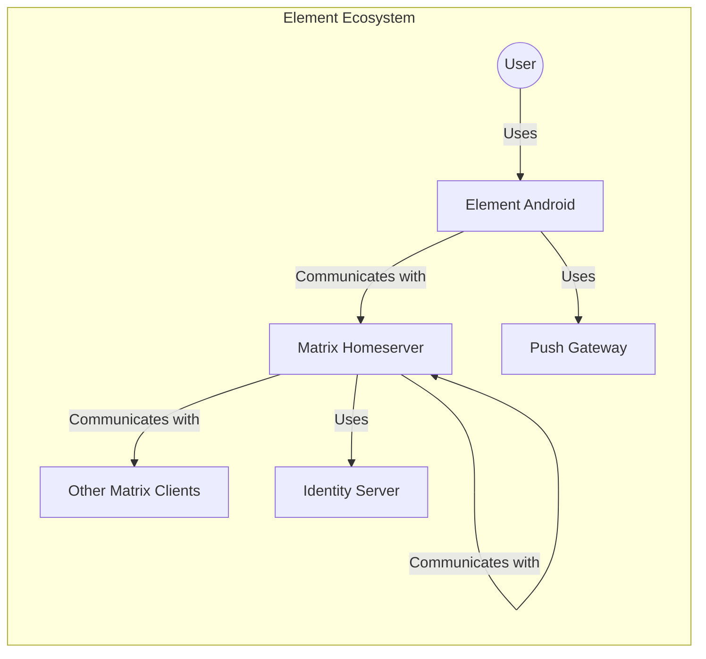
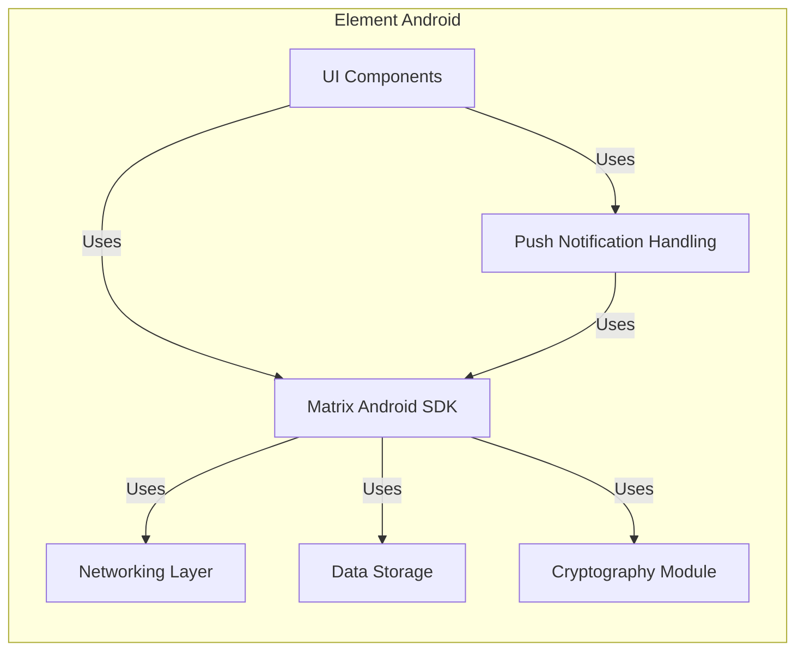
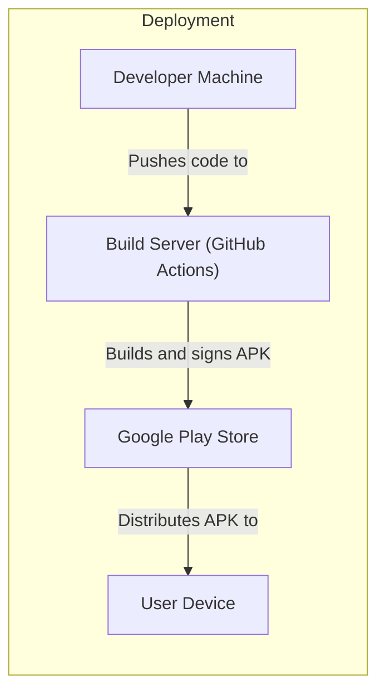
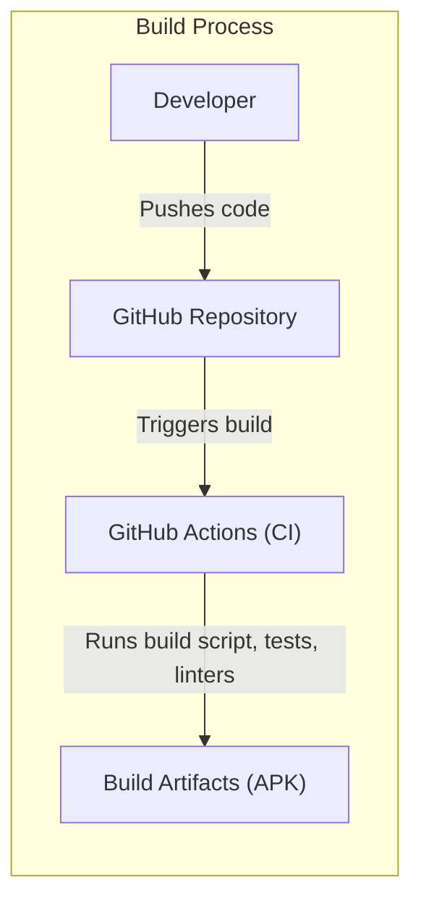

Okay, let's create a design document for the Element Android project, focusing on aspects relevant for threat modeling.

# BUSINESS POSTURE

Element is a messaging and collaboration application focused on secure and decentralized communication.  It's built on the Matrix protocol.  The Android client is a crucial part of the Element ecosystem, providing access to the Matrix network on mobile devices.

Business Priorities and Goals:

*   Provide a secure and private communication platform for users.
*   Maintain user trust and confidence in the application's security.
*   Ensure compatibility with the Matrix protocol and interoperability with other Matrix clients.
*   Offer a user-friendly and feature-rich experience on Android devices.
*   Support a decentralized architecture, avoiding single points of failure and control.
*   Enable end-to-end encryption (E2EE) to protect user communications.

Most Important Business Risks:

*   Compromise of user data (messages, contacts, metadata) due to vulnerabilities in the client or the Matrix protocol.
*   Loss of user trust due to security incidents or privacy breaches.
*   Reputational damage resulting from security flaws or perceived lack of security.
*   Inability to keep up with evolving security threats and vulnerabilities.
*   Disruption of service due to attacks on the client or the Matrix network.
*   Legal and regulatory risks related to data privacy and security.

# SECURITY POSTURE

Existing Security Controls:

*   security control: End-to-end encryption (E2EE) using the Olm and Megolm cryptographic ratchets (Matrix protocol specification, implemented in the Matrix Android SDK and used by the Element Android client).
*   security control: HTTPS for communication with homeservers (standard Android networking libraries).
*   security control: Local data encryption (using Android's built-in storage encryption, if enabled by the user, and potentially additional application-level encryption).
*   security control: Code signing to verify the integrity of the application (standard Android development practice).
*   security control: Regular security audits and penetration testing (implied by the project's maturity and focus on security, but needs confirmation).
*   security control: Use of ProGuard/R8 for code obfuscation (standard Android development practice to hinder reverse engineering).
*   security control: Dependency management to track and update third-party libraries (using Gradle, standard Android build tool).
*   security control: Implementation of Android's permission model to restrict access to sensitive device features and data (defined in the AndroidManifest.xml).
*   security control: Use of secure coding practices to prevent common vulnerabilities (e.g., input validation, output encoding, proper handling of cryptographic keys).

Accepted Risks:

*   accepted risk: Reliance on the security of the underlying Matrix protocol and homeservers. While Element Android can implement client-side security, the overall security also depends on the Matrix network.
*   accepted risk: Potential for vulnerabilities in third-party libraries, despite efforts to keep them updated.
*   accepted risk: User error, such as weak passwords or compromised devices, can still lead to data breaches.
*   accepted risk: The application is open source, meaning vulnerabilities, once discovered, are publicly known. This is mitigated by a rapid response to vulnerability reports.

Recommended Security Controls:

*   Implement Certificate Pinning: To mitigate the risk of man-in-the-middle attacks, even if a Certificate Authority is compromised.
*   Integrate Static Application Security Testing (SAST) tools: Into the build process to automatically identify potential vulnerabilities in the codebase.
*   Integrate Dynamic Application Security Testing (DAST) tools: To test the running application for vulnerabilities.
*   Implement a robust bug bounty program: To incentivize external security researchers to find and report vulnerabilities.
*   Consider using a dedicated secure element or trusted execution environment (TEE) for key management, if supported by the target devices.

Security Requirements:

*   Authentication:
    *   Users must be authenticated to access their accounts and decrypt messages.
    *   Support for strong passwords and multi-factor authentication (if supported by the homeserver).
    *   Secure storage of authentication tokens.
    *   Protection against brute-force attacks.
*   Authorization:
    *   Access control mechanisms to ensure users can only access data they are authorized to see.
    *   Proper handling of room permissions and user roles within the Matrix protocol.
*   Input Validation:
    *   Validate all user inputs to prevent injection attacks (e.g., cross-site scripting, SQL injection, command injection).
    *   Sanitize data received from the Matrix network to prevent malicious content from being rendered.
*   Cryptography:
    *   Use strong, well-vetted cryptographic algorithms and libraries.
    *   Secure key management practices, including secure generation, storage, and destruction of keys.
    *   Regularly review and update cryptographic implementations to address new threats and vulnerabilities.
    *   Ensure proper implementation of the Olm and Megolm protocols for E2EE.

# DESIGN

## C4 CONTEXT

Element Context Diagram Description:

*   Element Ecosystem:
    *   1. Name: User
        *   2. Type: Person
        *   3. Description: A person who uses Element Android to communicate.
        *   4. Responsibilities: Initiates and receives messages, manages contacts, participates in rooms.
        *   5. Security controls: Strong password, device security, awareness of phishing attacks.
    *   2. Name: Element Android
        *   2. Type: Software System
        *   3. Description: The Android client for the Element messaging application.
        *   4. Responsibilities: Provides a user interface for interacting with the Matrix network, handles encryption and decryption, manages local data storage.
        *   5. Security controls: E2EE, HTTPS, local data encryption, code signing, ProGuard/R8, dependency management, Android permission model, secure coding practices.
    *   3. Name: Matrix Homeserver
        *   2. Type: Software System
        *   3. Description: A server that hosts user accounts and facilitates communication within the Matrix network.
        *   4. Responsibilities: Stores user data, routes messages, manages room memberships, handles user authentication.
        *   5. Security controls: HTTPS, access controls, intrusion detection systems, regular security audits.
    *   4. Name: Other Matrix Clients
        *   2. Type: Software System
        *   3. Description: Other clients (e.g., web, desktop) that connect to the Matrix network.
        *   4. Responsibilities: Similar to Element Android, but on different platforms.
        *   5. Security controls: Dependent on the specific client implementation.
    *   5. Name: Identity Server
        *   2. Type: Software System
        *   3. Description: Optional server used for discovering Matrix user IDs based on email addresses or phone numbers.
        *   4. Responsibilities: Maps email addresses and phone numbers to Matrix user IDs.
        *   5. Security controls: HTTPS, access controls, data privacy measures.
    *   6. Name: Push Gateway
        *   2. Type: Software System
        *   3. Description: Server that relays push notifications to the Element Android application.
        *   4. Responsibilities: Receives push notification requests from the homeserver and delivers them to the Android device via Firebase Cloud Messaging (FCM).
        *   5. Security controls: Authentication and authorization mechanisms to prevent unauthorized sending of notifications.

## C4 CONTAINER

Element Container Diagram Description:

*   Element Android:
    *   1. Name: UI Components
        *   2. Type: Container
        *   3. Description: Android Activities, Fragments, and Views that provide the user interface.
        *   4. Responsibilities: Displays data to the user, handles user input, interacts with the Matrix SDK.
        *   5. Security controls: Input validation, output encoding, secure handling of user credentials.
    *   2. Name: Matrix Android SDK
        *   2. Type: Container
        *   3. Description: Library that provides an API for interacting with the Matrix network.
        *   4. Responsibilities: Handles communication with the homeserver, manages rooms and sessions, provides access to Matrix features.
        *   5. Security controls: HTTPS, E2EE (via the Cryptography Module), secure coding practices.
    *   3. Name: Networking Layer
        *   2. Type: Container
        *   3. Description: Handles network communication with the homeserver and other services.
        *   4. Responsibilities: Sends and receives HTTP requests, manages network connections.
        *   5. Security controls: HTTPS, certificate pinning (recommended).
    *   4. Name: Data Storage
        *   2. Type: Container
        *   3. Description: Manages local storage of data, such as messages, contacts, and keys.
        *   4. Responsibilities: Stores and retrieves data securely, handles data encryption (if applicable).
        *   5. Security controls: Android's built-in storage encryption, application-level encryption (recommended).
    *   5. Name: Cryptography Module
        *   2. Type: Container
        *   3. Description: Handles cryptographic operations, including encryption, decryption, and key management.
        *   4. Responsibilities: Implements the Olm and Megolm protocols for E2EE, manages cryptographic keys.
        *   5. Security controls: Use of strong cryptographic algorithms and libraries, secure key management practices.
    *   6. Name: Push Notification Handling
        *   2. Type: Container
        *   3. Description: Handles the reception and display of push notifications.
        *   4. Responsibilities: Registers with FCM, receives push notifications, displays notifications to the user.
        *   5. Security controls: Secure handling of FCM registration tokens.

## DEPLOYMENT

Possible Deployment Solutions:

1.  Standard Android Deployment:  The application is packaged as an APK file and distributed through the Google Play Store or other app stores.  Users install the app directly on their devices.
2.  F-Droid Deployment: The application is built and signed by F-Droid, and distributed through the F-Droid repository. This provides additional assurance of the build process.
3.  Manual Installation: Users can download the APK file directly from the project's GitHub releases page and install it manually. This requires enabling installation from unknown sources on the device.

Chosen Solution (Standard Android Deployment with Google Play Store):

Deployment Diagram Description:

*   Deployment:
    *   1. Name: Developer Machine
        *   2. Type: Infrastructure Node
        *   3. Description: A developer's workstation used for writing and testing code.
        *   4. Responsibilities: Code development, testing, and pushing changes to the repository.
        *   5. Security controls: Secure development environment, access controls, code signing.
    *   2. Name: Build Server (GitHub Actions)
        *   2. Type: Infrastructure Node
        *   3. Description: A continuous integration and continuous delivery (CI/CD) platform that automates the build and deployment process.
        *   4. Responsibilities: Builds the APK file, runs tests, signs the APK, and deploys it to the Google Play Store.
        *   5. Security controls: Access controls, secure build environment, code signing, vulnerability scanning (recommended).
    *   3. Name: Google Play Store
        *   2. Type: Infrastructure Node
        *   3. Description: Google's official app store for Android devices.
        *   4. Responsibilities: Distributes the application to users, handles updates, provides security scanning.
        *   5. Security controls: Google Play Protect, application signing verification.
    *   4. Name: User Device
        *   2. Type: Infrastructure Node
        *   3. Description: An Android device on which the Element application is installed.
        *   4. Responsibilities: Runs the application, stores user data.
        *   5. Security controls: Android operating system security features, device encryption (if enabled), user authentication.

## BUILD

Build Process Description:

1.  Developer commits and pushes code changes to the GitHub repository.
2.  GitHub Actions is triggered by the push event.
3.  The GitHub Actions workflow executes the build script.
4.  The build script compiles the code, runs unit and integration tests, and performs static analysis using linters (e.g., Android Lint, Detekt).
5.  If all tests and checks pass, the build script generates the APK file.
6.  The APK file is signed using a release key.
7.  The signed APK is stored as a build artifact.

Security Controls in Build Process:

*   Code signing: The APK is signed with a release key to ensure its authenticity and integrity.
*   Dependency management: Gradle is used to manage dependencies and ensure that only approved libraries are included.
*   Static analysis: Linters are used to identify potential code quality and security issues.
*   Automated testing: Unit and integration tests are run to verify the functionality and security of the code.
*   GitHub Actions: Provides a secure and controlled environment for building the application. Access to GitHub Actions is restricted.
*   Supply Chain Security: While Gradle helps manage dependencies, further steps could be taken to verify the integrity of downloaded artifacts (e.g., using checksums or signing). This is an area for improvement.

# RISK ASSESSMENT

Critical Business Processes to Protect:

*   User communication: Ensuring the confidentiality, integrity, and availability of user messages and calls.
*   User authentication and authorization: Protecting user accounts from unauthorized access.
*   Data storage: Securely storing user data, both on the device and on the homeserver.
*   Key management: Protecting cryptographic keys used for E2EE.

Data to Protect and Sensitivity:

*   Messages: Highly sensitive. Content of user conversations.
*   Contacts: Sensitive. List of user's contacts.
*   Metadata: Moderately sensitive. Information about who is communicating with whom, when, and how often.
*   User profile information: Potentially sensitive, depending on the information provided by the user.
*   Cryptographic keys: Extremely sensitive. Compromise of keys would allow decryption of user messages.
*   Authentication tokens: Highly sensitive. Compromise would allow unauthorized access to user accounts.

# QUESTIONS & ASSUMPTIONS

Questions:

*   What specific security audits and penetration tests have been conducted on the Element Android client and the Matrix Android SDK? What were the findings and remediation steps?
*   What is the process for handling security vulnerabilities reported by external researchers or users?
*   What are the specific measures in place to protect against supply chain attacks targeting third-party libraries?
*   Are there any plans to implement certificate pinning or use a secure element/TEE for key management?
*   What is the frequency of security training for developers working on the project?
*   What kind of DAST is used?
*   Is there a bug bounty program?

Assumptions:

*   BUSINESS POSTURE: The business prioritizes security and privacy, and is willing to invest in necessary security measures.
*   SECURITY POSTURE: Developers follow secure coding practices and are aware of common Android security vulnerabilities. The Matrix Android SDK is also developed with security in mind.
*   DESIGN: The homeserver is configured securely and implements appropriate security controls. Users are aware of basic security hygiene (e.g., using strong passwords, keeping their devices secure). The deployment via Google Play Store is the primary distribution method. The build process described is accurate and complete.