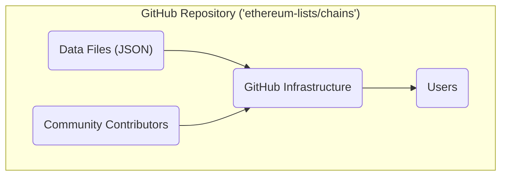

## Project Design Document: Ethereum Chains List (Improved)

**1. Introduction**

This document provides an enhanced design description for the Ethereum Chains List project, hosted on GitHub at [https://github.com/ethereum-lists/chains](https://github.com/ethereum-lists/chains). It details the project's architecture, components, and data flow with greater clarity and specificity, serving as a refined foundation for subsequent threat modeling exercises. The project's primary function is to offer a community-driven, reliable, and accessible collection of metadata for Ethereum Virtual Machine (EVM) compatible networks.

**2. Project Goals**

*   Establish a definitive and easily discoverable central repository for metadata concerning EVM-compatible blockchains.
*   Empower developers and researchers with rapid access to crucial information about diverse network characteristics.
*   Cultivate a collaborative environment for the ongoing contribution and meticulous maintenance of chain metadata.
*   Uphold data integrity and accuracy through rigorous community review processes and the utilization of version control.

**3. Non-Goals**

*   Monitoring and reporting real-time operational status or health metrics for the listed blockchain networks.
*   Developing software tools or libraries designed for direct interaction with the chain metadata.
*   Hosting, operating, or providing infrastructure for any of the listed blockchain networks.
*   Implementing complex, automated data validation procedures beyond basic structural checks.

**4. Target Audience**

*   Software developers creating decentralized applications (dApps) requiring support for multiple EVM-based chains.
*   Researchers conducting analyses of the EVM ecosystem and its constituent networks.
*   Infrastructure providers offering services that support EVM-compatible blockchains.
*   Wallet application developers integrating support for a variety of networks.
*   Any individual or entity seeking dependable and up-to-date metadata about EVM-compatible blockchains.

**5. System Architecture**

The project's architecture is intentionally simple, leveraging the robust features provided by the GitHub platform.

*   **Data Files (JSON):** The core asset of the project, consisting of individual JSON files. Each file meticulously documents the metadata for a specific EVM-compatible blockchain. Examples of metadata include:
    *   `name`: The officially recognized name of the blockchain network.
    *   `chainId`: The unique numerical identifier assigned to the chain.
    *   `networkId`:  Another numerical identifier, often used for distinguishing network environments.
    *   `rpc`: An array containing URLs of Remote Procedure Call (RPC) endpoints for interacting with the chain.
    *   `explorers`: An array of URLs pointing to block explorer websites for the chain.
    *   `nativeCurrency`: Detailed information about the chain's native cryptocurrency (e.g., symbol, decimals).
    *   `infoURL`: A URL providing comprehensive information about the specific blockchain.
    *   `shortName`: A concise, commonly used abbreviation for the chain's name.
    *   `slip44`: The standardized SLIP-0044 coin type identifier.
    *   `ens`:  Details regarding Ethereum Name Service (ENS) support on the chain, if applicable.
    *   `parent`: Information about the parent chain for Layer-2 solutions or sidechains.
    *   `status`: The current operational status of the chain (e.g., 'active', 'deprecated').
    *   `faucets`: An array of URLs for cryptocurrency faucets providing testnet funds.
    *   `features`: An array listing specific features supported by the chain.
    *   `icon`: A URL pointing to the chain's logo or icon.

*   **GitHub Infrastructure:** This encompasses the comprehensive suite of services and features provided by GitHub, which are integral to the project's operation:
    *   **Repository Hosting:** Secure and reliable storage for the project's files and their complete version history.
    *   **Version Control (Git):**  Enables meticulous tracking of changes, efficient management of branches for development, and streamlined collaboration among contributors.
    *   **Issue Tracking:** A dedicated platform for users and contributors to report bugs, suggest enhancements, and propose new chain listings.
    *   **Pull Requests:** The established mechanism for community members to propose modifications and additions to the project's data.
    *   **GitHub Actions (Potential):** While currently not extensively used, GitHub Actions offers the potential for automating data validation, consistency checks, and other maintenance tasks.
    *   **GitHub Pages (Potential):** Could be utilized to host a user-friendly website for browsing and searching the chain data.
    *   **Access Control:**  Mechanisms for managing permissions, defining who can read and write to the repository, and protecting sensitive branches. This includes branch protection rules to enforce code review and prevent direct pushes to `main`.

*   **Community Contributors:** The individuals who actively participate in the project by proposing changes, submitting new chain data, identifying errors, and suggesting improvements through the GitHub pull request and issue reporting systems.

*   **Users:**  The broad audience, including developers, researchers, and other stakeholders, who access and utilize the valuable chain metadata stored within the repository.

**6. Detailed Component Description**

*   **JSON Data Files:**
    *   **Structure and Organization:** Each individual chain's metadata is stored in a dedicated JSON file located within the `_data/chains` directory. The filename typically mirrors the chain's unique `chainId` for easy identification. For example, the file for Ethereum Mainnet might be named `1.json`.
    *   **Content and Schema:** The content within each JSON file adheres to a loosely defined schema, primarily enforced through community convention and the code review process. Key-value pairs represent the various attributes of each chain.
    *   **Storage Mechanism:** The JSON files are directly stored within the Git repository, benefiting from Git's version control capabilities.
    *   **Update Process:** Modifications and additions to the JSON files are exclusively managed through the pull request workflow. Community members submit proposed changes, which are then reviewed and merged by the project maintainers.

*   **GitHub Repository:**
    *   **Directory Structure:** Files are logically organized into directories. For instance, `_data/chains` contains the chain metadata, and potentially other directories could exist for token lists or other related data.
    *   **Branching Strategy:** The project typically employs a straightforward branching strategy, with the `main` branch representing the stable and authoritative version of the data. Feature branches are created for individual contributions.
    *   **Contribution Workflow (Detailed):**  Contributors fork the repository, create a branch for their changes, modify the relevant files, and then submit a pull request to the upstream `main` branch.
    *   **Access Control Implementation:** GitHub's built-in access control features are used to manage permissions. Maintainers are granted write access, allowing them to merge pull requests and manage the repository. The public has read-only access. Branch protection rules on the `main` branch often require pull request reviews and successful checks before merging.

*   **Community Contributions:**
    *   **Pull Request Lifecycle:** The primary method for contributing. A pull request involves proposing changes, engaging in discussions and reviews, and ultimately having the changes merged (or rejected).
    *   **Issue Reporting and Management:**  GitHub Issues are used to track bugs, feature requests, and general discussions related to the project's data.
    *   **Review and Approval Process:** Project maintainers play a crucial role in reviewing pull requests, ensuring data accuracy, consistency, and adherence to any established guidelines before approving and merging contributions.

*   **Users:**
    *   **Data Access Methods:** Users can access the data through several methods:
        *   **Git Cloning:** Cloning the entire repository to their local machine using Git.
        *   **Direct File Download:** Downloading individual JSON files directly from the GitHub web interface.
        *   **Raw Content URLs:** Accessing the raw JSON files programmatically using their unique URLs provided by GitHub.
        *   **GitHub API:** Utilizing the GitHub API to programmatically retrieve the contents of the repository or specific files.

**7. Data Flow**

The data flow within the project centers around the processes of contribution, review, and consumption of the chain metadata.

```mermaid
graph LR
    subgraph "Community Contributor"
        direction TB
        CC_A["Proposes Changes (via Pull Request)"]
    end

    subgraph "GitHub Repository"
        direction TB
        GR_A["Receives Pull Request"]
        GR_B["Automated Checks (Potential)"]
        GR_C["Maintainer Review"]
        GR_D["Merges Changes"]
        GR_E["Data Updated in Repository"]
    end

    subgraph "User"
        direction TB
        U_A["Accesses Repository (Web, Git, API)"]
        U_B["Downloads/Clones Data"]
        U_C["Utilizes Data in Applications/Research"]
    end

    CC_A --> GR_A
    GR_A --> GR_B
    GR_B --> GR_C
    GR_A --> GR_C
    GR_C -- "Approved" --> GR_D
    GR_D --> GR_E
    GR_E --> U_A
    U_A --> U_B
    U_B --> U_C
```

*   **Contribution Phase:**
    1. A community contributor identifies the need to add new chain data or modify existing entries.
    2. They create a new branch in their forked copy of the repository.
    3. They add or modify the relevant JSON file(s) according to the project's conventions.
    4. The contributor submits a pull request to the main repository, proposing their changes.

*   **Review and Merge Phase:**
    1. The GitHub repository receives the submitted pull request.
    2. *(Potential)* Automated checks (e.g., linting, basic schema validation) might be performed via GitHub Actions.
    3. Project maintainers review the pull request, examining the proposed changes for accuracy, completeness, and adherence to project guidelines. Discussions and requests for modifications may occur.
    4. If the maintainers approve the changes, they merge the pull request into the `main` branch, updating the repository's data.

*   **Consumption Phase:**
    1. A user accesses the GitHub repository through various methods (web interface, Git client, or programmatically via the API).
    2. They download or clone the repository to obtain the chain metadata.
    3. The user integrates the obtained data into their applications, research projects, or other relevant use cases.

**8. Security Considerations (For Threat Modeling)**

This section outlines potential security considerations to be thoroughly examined during subsequent threat modeling activities.

*   **Data Integrity Threats:**
    *   **Malicious Pull Requests:**  A malicious actor could attempt to inject incorrect, misleading, or even harmful data by submitting a carefully crafted pull request. This could include incorrect RPC endpoints or misleading chain information.
    *   **Compromised Contributor Accounts:** If a contributor's GitHub account is compromised, it could be exploited to introduce malicious changes without detection.
    *   **Accidental Data Corruption:** While version control mitigates this, unintentional errors during manual editing by authorized contributors could lead to data inconsistencies.

*   **Availability Threats:**
    *   **GitHub Service Disruption:** The project's availability is inherently tied to the uptime and reliability of the GitHub platform. A significant GitHub outage would render the data inaccessible.
    *   **Accidental or Malicious Deletion:** Although Git provides mechanisms for recovery, accidental or malicious deletion of critical files or the entire repository poses a risk. Strong access controls and backup strategies on GitHub's side mitigate this.

*   **Confidentiality Threats:**
    *   Generally, the project's data is intended to be publicly accessible. However, potential concerns could arise if sensitive information (e.g., API keys mistakenly included in contributions) were to be exposed. Maintainer credentials also require protection.

*   **Access Control Threats:**
    *   **Unauthorized Write Access:**  Ensuring that only trusted individuals have write access to the repository is paramount to prevent unauthorized modifications. Weak password security or compromised maintainer accounts are key risks here.
    *   **Privilege Escalation:**  Exploiting vulnerabilities in GitHub's permission system to gain unauthorized access.

*   **Infrastructure Security Threats (GitHub Reliance):**
    *   The project's security posture is heavily reliant on the security measures implemented by GitHub. Vulnerabilities within the GitHub platform itself could potentially impact the project's integrity and availability.

*   **Supply Chain Security Threats:**
    *   Users consuming the data rely on its integrity and accuracy. If the data is compromised, it could lead to security vulnerabilities or operational issues in downstream applications that depend on this information (e.g., connecting to incorrect or malicious RPC endpoints).

**9. Future Considerations**

*   **Formalized Schema Validation:** Implementing automated validation of the JSON data against a formally defined schema (e.g., using JSON Schema) within the pull request workflow using GitHub Actions. This would ensure data consistency and reduce manual review burden.
*   **Enhanced Data Standardization and Guidelines:**  Developing more detailed and explicit guidelines for contributing data, ensuring consistency in formatting and data types across different chain entries.
*   **Dedicated Website for Browsing and Search:** Creating a user-friendly website (potentially hosted using GitHub Pages) to allow users to easily browse, search, and filter the chain data without needing to interact directly with the raw JSON files.
*   **Alternative Data Export Formats:**  Exploring options for providing the data in additional formats (e.g., CSV, YAML) to cater to a wider range of user needs and tools.
*   **Community-Developed Tools and Libraries:**  Encouraging and potentially showcasing community-developed tools and libraries that facilitate the use of the chain list data in various programming languages and frameworks.
*   **Improved Data Governance Model:**  Establishing a clearer governance model for managing contributions, resolving disputes, and ensuring the long-term health of the project.