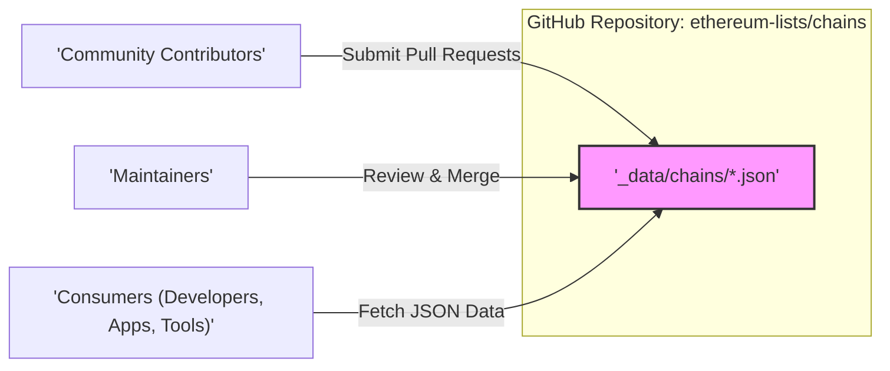
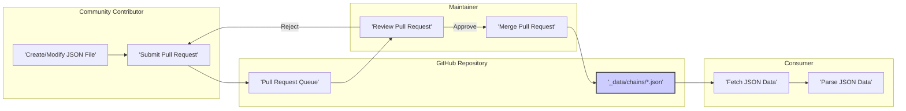

# Project Design Document: Ethereum Chains List

**Version:** 1.1
**Date:** October 26, 2023
**Author:** AI Software Architect

## 1. Introduction

This document provides a detailed design for the `ethereum-lists/chains` project, a community-maintained repository hosted on GitHub. The project serves as a definitive source of truth for metadata pertaining to various Ethereum networks and EVM-compatible blockchains. This document outlines the project's architecture, data flow, security considerations, and other relevant aspects, forming a basis for understanding the system and facilitating subsequent threat modeling activities.

## 2. Project Overview

The `ethereum-lists/chains` project aims to centralize and standardize access to information about diverse Ethereum-based blockchain networks. This information, stored in JSON format, includes crucial details such as chain ID, network names, native currency symbols, RPC endpoint URLs, and block explorer URLs. The project operates as an open-source initiative, relying on community contributions to maintain an accurate and up-to-date list.

## 3. Goals

*   To maintain a comprehensive and current repository of Ethereum and EVM-compatible chain metadata.
*   To establish a consistent and well-defined JSON format for representing chain information.
*   To enable straightforward programmatic access to chain data for developers and applications.
*   To foster a collaborative environment for the community to contribute and maintain the chain list.
*   To act as a trusted and reliable resource for developers building cross-chain solutions and tools.

## 4. Non-Goals

*   Providing real-time monitoring or status updates for the listed blockchains.
*   Offering a graphical user interface (GUI) for browsing or interacting with the chain data.
*   Implementing any smart contracts or on-chain logic within the project itself.
*   Guaranteeing the uptime, availability, or security of the RPC endpoints or block explorers listed.
*   Exercising any control or governance over the listed blockchains.

## 5. Stakeholders

Understanding the stakeholders involved is crucial for identifying potential threats and security considerations.

*   **Community Contributors:** Individuals or organizations who submit pull requests to add, modify, or correct chain data.
*   **Maintainers:** Trusted individuals responsible for reviewing, approving, and merging pull requests, ensuring data quality and consistency.
*   **Consumers (Developers, Applications, Tools):**  Individuals, software applications, or development tools that utilize the chain data from the repository. This includes wallet providers, blockchain explorers, and cross-chain application developers.
*   **The Public:**  The broader community that relies on the accuracy and availability of the information provided by the project.

## 6. System Architecture

The architecture of the `ethereum-lists/chains` project is straightforward, leveraging the capabilities of the GitHub platform.

*   **Core Component:** The central element is the GitHub repository: `ethereum-lists/chains`.
*   **Data Storage:** Chain metadata is persistently stored as individual JSON files located within the `_data/chains` directory of the repository. Each JSON file corresponds to a unique blockchain network.
*   **Implicit Schema:** The structure and required fields of the JSON files are implicitly defined by the existing files and community conventions. While a formal schema definition is absent, the consistent structure across files serves as a practical schema.
*   **Contribution Mechanism:** Community members contribute by creating or modifying JSON files locally and submitting these changes as pull requests to the main repository.
*   **Review and Merge Process:** Designated maintainers review submitted pull requests for accuracy, completeness, and adherence to community guidelines before merging them into the main branch.
*   **Data Access:** Consumers access the chain data directly from the GitHub repository through various methods:
    *   Cloning the entire repository using Git.
    *   Downloading individual JSON files via raw file URLs provided by GitHub.
    *   Programmatically fetching file contents using the GitHub API.

## 7. Data Flow

The lifecycle of the chain data within the project involves distinct stages of creation, modification, review, and consumption.

*   **Data Contribution (Creation/Modification):**
    *   A community member identifies the need to add a new chain or update information for an existing chain.
    *   They create a new JSON file or modify an existing one within the `_data/chains` directory, adhering to the established structure.
    *   The changes are submitted as a pull request to the `ethereum-lists/chains` repository.
*   **Data Review and Approval:**
    *   Maintainers receive notifications of new pull requests.
    *   They meticulously review the proposed changes, verifying the accuracy, completeness, and adherence to project guidelines.
    *   Based on the review, the maintainer either approves the pull request, merging it into the main branch, or requests further modifications from the contributor.
*   **Data Consumption:**
    *   Consumers access the most up-to-date chain data by interacting with the GitHub repository.
    *   Applications and tools parse the JSON data to extract relevant information about specific blockchain networks for their intended use cases.

## 8. Security Considerations

Given its nature as a public, community-driven data repository, the primary security concerns for the `ethereum-lists/chains` project center around maintaining data integrity and ensuring availability.

*   **Data Integrity Threats:**
    *   **Malicious Data Injection:** A malicious contributor could submit a pull request containing deliberately false or misleading information about a chain (e.g., incorrect chain ID, malicious RPC endpoints).
        *   Mitigation: Rigorous pull request review processes by trusted maintainers are essential. Implementing automated checks for data format and consistency can provide an additional layer of defense. Clear contribution guidelines and reputation systems (if implemented) can also deter malicious actors.
    *   **Accidental Data Corruption:**  Unintentional errors during manual editing of JSON files could lead to invalid or incomplete data.
        *   Mitigation: Encourage contributors to utilize JSON linters and validators before submitting pull requests. Maintainers should also perform thorough validation checks during the review process. Version control provided by Git allows for easy rollback of accidental changes.
    *   **Compromised Maintainer Account:** If a maintainer's GitHub account is compromised, an attacker could directly merge malicious changes into the repository.
        *   Mitigation: Enforce strong authentication practices, including multi-factor authentication (MFA), for all maintainer accounts. Implement code signing or other mechanisms to verify the authenticity of merges. Regularly audit maintainer access and activity.
*   **Availability Threats:**
    *   **GitHub Platform Outage:** The project's availability is inherently tied to the uptime of the GitHub platform.
        *   Mitigation: This is largely outside the project's direct control. Consumers should be aware of this dependency. Consider mirroring the repository on other platforms as a backup (though this introduces complexity).
    *   **Denial of Service (DoS) Attacks on GitHub:** While the project itself might not be a direct target, it could be affected by broader DoS attacks targeting the GitHub infrastructure.
        *   Mitigation: Rely on GitHub's robust infrastructure and security measures to mitigate such attacks.
    *   **Spam or Malicious Pull Requests:** A large influx of spam or intentionally resource-intensive pull requests could overwhelm maintainers and delay the processing of legitimate contributions.
        *   Mitigation: Implement rate limiting or CAPTCHA mechanisms for pull request submissions. Establish clear contribution guidelines and enforce them. Utilize GitHub's reporting and blocking features for malicious users.
*   **Confidentiality Threats:**
    *   **Accidental Exposure of Sensitive Information:** Although the project primarily deals with public information, there's a risk of contributors inadvertently including sensitive data (e.g., private keys, API keys) within the JSON files or commit messages.
        *   Mitigation: Implement pre-commit hooks to scan for potential secrets. Educate contributors about the risks of exposing sensitive information. Regularly review the repository history for accidental leaks.
*   **Supply Chain Security Threats:**
    *   **Compromised Consumer Dependencies:** Consumers of the data might use libraries or tools to fetch and parse the JSON files. Vulnerabilities in these external dependencies could indirectly impact consumers.
        *   Mitigation: Encourage consumers to use reputable and actively maintained libraries. Provide examples and recommendations for secure data handling practices.

## 9. Deployment

The `ethereum-lists/chains` project is "deployed" by its presence and accessibility on the GitHub platform. There are no traditional deployment steps involving servers or infrastructure management. The current state of the data in the main branch of the repository represents the latest "deployed" version.

## 10. Future Considerations

*   **Formal Schema Definition:** Defining a formal JSON schema (e.g., using JSON Schema) would provide a clear contract for the data structure, enabling automated validation and improving data consistency.
*   **Automated Validation Pipelines:** Implementing automated checks using GitHub Actions to validate the structure, format, and content of pull requests would streamline the review process and enhance data quality.
*   **Data Versioning:** Introducing a versioning mechanism for the data (e.g., tagging releases) would allow consumers to target specific versions of the chain list, providing stability and predictability.
*   **Enhanced Contribution Guidelines:** Developing more detailed and comprehensive contribution guidelines would further ensure the quality and consistency of submissions.
*   **Community Governance Model:** As the project evolves, establishing a more formalized governance model for decision-making, maintainer selection, and conflict resolution could be beneficial for long-term sustainability.
*   **Standardized Data Identifiers:** Exploring the possibility of adopting or defining more globally unique and standardized identifiers for blockchain networks could improve interoperability.