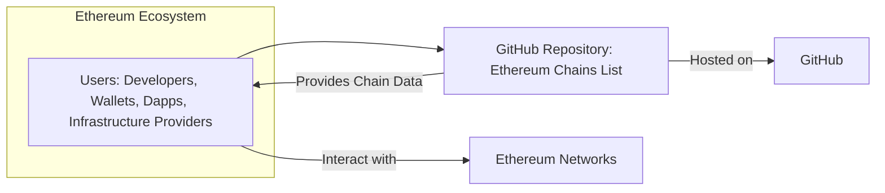

# BUSINESS POSTURE

This project, represented by the github.com/ethereum-lists/chains repository, aims to provide a comprehensive, community-sourced, and readily accessible list of Ethereum chain configurations. This information is crucial for developers, applications, and infrastructure providers interacting with the Ethereum ecosystem.

Business Priorities:
- Maintain data accuracy and up-to-dateness to ensure users can rely on the information provided.
- Maximize data availability and accessibility for a wide range of users and systems.
- Foster community contribution and maintainability to ensure the project's long-term viability.

Business Goals:
- Become the definitive, community-trusted source for Ethereum chain information.
- Support the growth and interoperability of the Ethereum ecosystem by providing essential configuration data.
- Minimize the effort required for developers and systems to integrate with different Ethereum chains.

Business Risks:
- Data integrity risks: Inaccurate or outdated chain information could lead to integration issues, application failures, or financial losses for users.
- Availability risks: Downtime or inaccessibility of the data source would disrupt users and dependent systems.
- Malicious contributions: Malicious actors could attempt to inject incorrect or harmful data into the lists, compromising the integrity of the project.
- Maintainability risks: Lack of community engagement or maintainer burnout could lead to stagnation and data decay.

# SECURITY POSTURE

Existing Security Controls:
- security control: GitHub Access Control - Implemented via GitHub repository settings, controlling who can contribute, review, and merge changes. Described in GitHub repository settings.
- security control: GitHub Version Control - Implemented via Git, providing a history of changes and the ability to revert to previous states. Described in Git documentation.
- security control: GitHub Issue Tracking - Implemented via GitHub Issues, allowing for community reporting of issues and proposed changes. Described in GitHub Issues section.
- security control: Community Review Process - Implemented informally through pull requests and community discussions. Described in project's contribution guidelines (if any) and observed in pull request activity.

Accepted Risks:
- accepted risk: Potential for outdated information - Relies on community contributions, which might not always be timely or complete.
- accepted risk: Risk of incorrect information - Community-sourced data requires validation, and errors might be introduced despite review processes.
- accepted risk: Limited formal security testing - Project likely lacks dedicated security testing beyond standard GitHub and community practices.

Recommended Security Controls:
- security control: Input Validation - Implement automated checks to validate the format and schema of chain data contributions to prevent malformed or malicious data.
- security control: Content Signing - Digitally sign the data files to ensure integrity and authenticity, allowing users to verify the source and prevent tampering.
- security control: Automated Data Integrity Checks - Implement automated checks to verify the consistency and correctness of chain data against known standards or other sources.
- security control: Regular Security Audits - Conduct periodic security reviews of the project's infrastructure, processes, and data to identify and address potential vulnerabilities.

Security Requirements:
- Authentication:
    - Requirement: Contributors should be authenticated via GitHub accounts to track contributions and manage permissions.
    - Implemented: GitHub authentication for repository access.
- Authorization:
    - Requirement: Only authorized maintainers should be able to merge changes to the main data branches.
    - Implemented: GitHub branch protection rules to control merge access.
- Input Validation:
    - Requirement: All contributed chain data must be validated against a defined schema to ensure data integrity and prevent injection attacks.
    - Recommended security control: Input Validation (see above).
- Cryptography:
    - Requirement: Consider digitally signing the data files to ensure data integrity and authenticity.
    - Recommended security control: Content Signing (see above).

# DESIGN

## C4 CONTEXT



Context Diagram Elements:

- Element:
    - Name: Ethereum Chains List
    - Type: Software System
    - Description: A GitHub repository containing lists of Ethereum chain configurations in YAML and JSON formats.
    - Responsibilities:
        - Store and maintain accurate and up-to-date Ethereum chain data.
        - Provide publicly accessible data in standard formats.
    - Security controls:
        - security control: GitHub Access Control
        - security control: GitHub Version Control

- Element:
    - Name: Users: Developers, Wallets, Dapps, Infrastructure Providers
    - Type: Person/System
    - Description: Various actors within the Ethereum ecosystem who consume the chain data.
    - Responsibilities:
        - Utilize chain data to configure software, connect to networks, and build applications.
        - Potentially contribute to the list by reporting issues or suggesting updates.
    - Security controls:
        - N/A - Users are external to the system.

- Element:
    - Name: GitHub
    - Type: Infrastructure
    - Description: The platform hosting the repository, providing version control, access control, and issue tracking.
    - Responsibilities:
        - Host the repository and its data.
        - Provide access control and versioning.
        - Facilitate community contributions through pull requests and issues.
    - Security controls:
        - security control: GitHub Security Features (platform level security provided by GitHub).

- Element:
    - Name: Ethereum Networks
    - Type: External System
    - Description: The various Ethereum networks (Mainnet, testnets, L2s, etc.) that the data describes.
    - Responsibilities:
        - Exist as the real-world systems that the data represents.
    - Security controls:
        - N/A - External systems.

## C4 CONTAINER

```mermaid
flowchart LR
    subgraph "GitHub"
    direction TB
        A[GitHub Repository: Ethereum Chains List]
        B[GitHub Pages (Optional)]
    end

    C[Users: Developers, Wallets, Dapps, Infrastructure Providers]

    C --> A
    A -- "Provides Data Files" --> C
    A -- "Serves Static Website (Optional)" --> B
    B -- "Provides Website" --> C
```

Container Diagram Elements:

- Element:
    - Name: GitHub Repository: Ethereum Chains List
    - Type: Data Store, Code Repository
    - Description: The core container, storing the YAML and JSON data files and managing version control.
    - Responsibilities:
        - Persistently store chain data.
        - Manage data versions and history.
        - Control access to data and contributions.
    - Security controls:
        - security control: GitHub Access Control
        - security control: GitHub Version Control
        - recommended security control: Input Validation (applied to data commits).

- Element:
    - Name: GitHub Pages (Optional)
    - Type: Static Website
    - Description: Optionally, GitHub Pages can be used to host a static website generated from the repository data for easier browsing and access.
    - Responsibilities:
        - Present the chain data in a user-friendly web interface.
        - Improve data discoverability and accessibility.
    - Security controls:
        - security control: GitHub Pages Security (platform level security provided by GitHub Pages).

## DEPLOYMENT

Deployment Architecture: GitHub Infrastructure

```mermaid
flowchart LR
    A[GitHub Infrastructure]
    subgraph "GitHub Infrastructure"
        B[GitHub Repository Storage]
        C[GitHub Web Servers]
        D[GitHub Pages Servers (Optional)]
    end
    E[Users Internet]

    E -- "HTTPS Access" --> C
    C -- "Access Data" --> B
    E -- "HTTPS Access (Optional)" --> D
    D -- "Serve Website" --> E
```

Deployment Diagram Elements:

- Element:
    - Name: GitHub Infrastructure
    - Type: Cloud Infrastructure
    - Description: The underlying infrastructure provided by GitHub to host repositories and services.
    - Responsibilities:
        - Provide reliable and secure hosting for the repository and related services.
        - Ensure platform availability and performance.
    - Security controls:
        - security control: GitHub Infrastructure Security (platform level security provided by GitHub).

- Element:
    - Name: GitHub Repository Storage
    - Type: Data Storage
    - Description: Storage systems within GitHub infrastructure that persistently store the repository data (Git objects, files).
    - Responsibilities:
        - Securely store repository data with redundancy and backups.
        - Provide access to data for GitHub services.
    - Security controls:
        - security control: GitHub Storage Security (platform level security provided by GitHub storage services).

- Element:
    - Name: GitHub Web Servers
    - Type: Web Server
    - Description: Web servers within GitHub infrastructure that handle user requests to access and interact with the repository through the web interface and API.
    - Responsibilities:
        - Serve the GitHub web interface.
        - Handle API requests for repository data.
        - Enforce access control policies.
    - Security controls:
        - security control: GitHub Web Server Security (platform level security provided by GitHub web services).

- Element:
    - Name: GitHub Pages Servers (Optional)
    - Type: Web Server
    - Description: Web servers within GitHub infrastructure that serve static websites hosted on GitHub Pages.
    - Responsibilities:
        - Serve the static website generated from the repository data (if GitHub Pages is used).
    - Security controls:
        - security control: GitHub Pages Server Security (platform level security provided by GitHub Pages services).

- Element:
    - Name: Users Internet
    - Type: Network
    - Description: The public internet through which users access the GitHub services.
    - Responsibilities:
        - Provide network connectivity for users to access GitHub.
    - Security controls:
        - N/A - External network.

## BUILD

Build Process: Content Validation and Publication

```mermaid
flowchart LR
    A[Developer] --> B{Git Commit & Push}
    B --> C[GitHub Actions (Optional)]
    C -- "Validation Checks" --> D{Validation Success?}
    D -- Yes --> E[GitHub Repository]
    D -- No --> F[Notify Developer]
    E --> G[Publish Data (GitHub Pages, CDN etc.)]
    F --> A
    G --> H[Users]
```

Build Process Description:
The build process for this project is primarily focused on data validation and publication, rather than compiling code.

- Developer: Developers contribute to the project by creating or modifying data files (YAML/JSON) locally.
- Git Commit & Push: Developers commit their changes and push them to the GitHub repository.
- GitHub Actions (Optional): GitHub Actions can be used to automate validation checks upon each push or pull request.
- Validation Checks: Automated scripts or tools within GitHub Actions (or run manually) validate the format, schema, and consistency of the contributed data. This can include:
    - Schema validation against predefined JSON schemas or YAML structures.
    - Data integrity checks to ensure consistency across different data points.
    - Checks for potentially malicious or incorrect data patterns.
- Validation Success?: A decision point based on the outcome of the validation checks.
- GitHub Repository: If validation is successful, the changes are merged into the main branch of the GitHub repository, updating the data.
- Notify Developer: If validation fails, the developer is notified (e.g., via GitHub Actions output, pull request comments) to correct the issues.
- Publish Data: Once data is validated and merged, it can be published. This might involve:
    - Automatically deploying updates to GitHub Pages if used.
    - Pushing data to a CDN for wider distribution.
    - Simply making the updated repository data available for direct download.
- Users: Users consume the published data directly from the GitHub repository, GitHub Pages, or CDN.

Build Process Security Controls:
- security control: Automated Validation Checks - Implemented via GitHub Actions or similar CI/CD tools to automatically validate data contributions.
- security control: Schema Validation - Enforce data structure and format using schemas to prevent malformed data.
- security control: Data Integrity Checks - Implement checks to ensure data consistency and correctness.
- security control: Access Control on Merge - Only authorized maintainers can merge changes after successful validation and review.

# RISK ASSESSMENT

Critical Business Processes:
- Providing accurate and up-to-date Ethereum chain configuration data to the community.
- Maintaining the availability and accessibility of this data.
- Ensuring the integrity and trustworthiness of the data source.

Data to Protect:
- Ethereum chain configuration data (YAML and JSON files).
- Sensitivity: Medium to High. While not strictly confidential, the integrity and accuracy of this data are critical. Inaccurate data can lead to significant issues for users, including application failures, financial losses, and security vulnerabilities in dependent systems. Tampering with the data could have widespread negative consequences across the Ethereum ecosystem.

# QUESTIONS & ASSUMPTIONS

Questions:
- Is there a formal process for reviewing and validating community contributions beyond informal pull request reviews?
- Are there specific tools or scripts currently used for data validation?
- What is the intended publication method for the data (GitHub Pages, CDN, direct repository access only)?
- Are there any specific data integrity requirements or standards that the data should adhere to?
- Is there a plan for long-term maintenance and updates of the data?

Assumptions:
- BUSINESS POSTURE: The primary business goal is to provide a reliable and accurate community resource for Ethereum chain data. Data integrity and availability are paramount.
- SECURITY POSTURE: Security is important to maintain trust in the data and prevent misuse or corruption. Current security relies heavily on GitHub's built-in features and community vigilance.
- DESIGN: The project is primarily a data repository hosted on GitHub. Optional static website generation via GitHub Pages is considered. The build process is focused on data validation rather than code compilation.