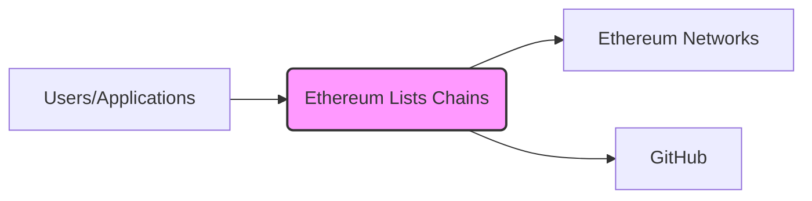
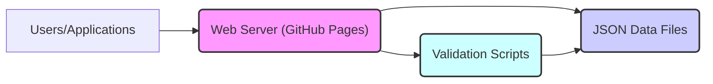
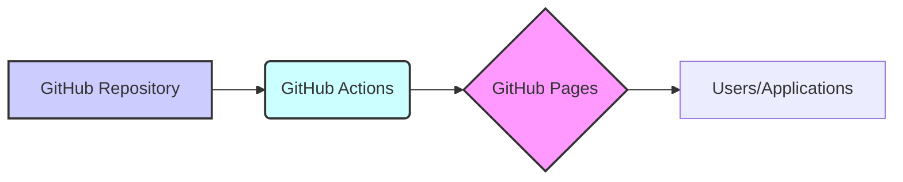

Okay, let's create a design document for the `ethereum-lists/chains` repository.

# BUSINESS POSTURE

Business Priorities and Goals:

*   Provide a canonical, community-maintained registry of EVM (Ethereum Virtual Machine) network and chain metadata.
*   Ensure data accuracy and integrity, preventing malicious or accidental misinformation.
*   Facilitate interoperability between different Ethereum-based tools and applications by offering a standardized data source.
*   Maintain a simple, accessible, and easily-integrated data format (JSON).
*   Enable decentralized updates and maintenance through GitHub's pull request mechanism.

Most Important Business Risks:

*   **Data Poisoning:** Malicious actors submitting pull requests with incorrect or harmful chain data, leading to financial losses or reputational damage for users and applications relying on the registry.
*   **Data Inconsistency:** Inconsistent or outdated information across different chain entries, causing compatibility issues and hindering interoperability.
*   **Centralization of Control:** Although using GitHub, a single entity could theoretically exert undue influence over the repository's content.
*   **Lack of Maintenance:** Insufficient community participation or maintainer activity, leading to stale data and reduced reliability.
*   **Accessibility Issues:** Difficulty for developers to access, parse, or integrate the data into their applications.

# SECURITY POSTURE

Existing Security Controls:

*   security control: GitHub Pull Request Process: All changes are made through pull requests, requiring review and approval before merging. (Implemented in GitHub repository settings and workflow).
*   security control: Community Review: The open-source nature of the project encourages community scrutiny of proposed changes. (Implemented through community participation and GitHub's review features).
*   security control: JSON Schema Validation: The repository uses JSON Schema to define the expected structure and data types of chain information, ensuring basic data integrity. (Described in `README.md` and implemented in `_validator/validate.js`).
*   security control: Automated Tests: Basic validation tests are run to check for data consistency and schema compliance. (Implemented in `_validator/validate.js`).
*   security control: EIP-155 Compliance: Encourages adherence to EIP-155 (chain ID standard) to prevent replay attacks across different chains. (Mentioned in `README.md`).
*   security control: Read Only access to data though API. (Implemented in GitHub Pages).

Accepted Risks:

*   accepted risk: Reliance on GitHub: The project is entirely dependent on GitHub for its infrastructure, including access control, version control, and distribution.
*   accepted risk: Limited Formal Verification: While basic validation is in place, there's no formal verification of the correctness of the chain data itself beyond community review.
*   accepted risk: Potential for Human Error: Reviewers may miss subtle errors or malicious modifications in pull requests.

Recommended Security Controls:

*   Implement more robust automated testing, including checks for known vulnerabilities and attack vectors specific to EVM chains.
*   Introduce a more formal governance model, potentially with multiple designated reviewers or a voting mechanism for significant changes.
*   Consider using a decentralized storage solution (e.g., IPFS) as a backup or mirror to mitigate reliance on GitHub.
*   Implement signing of data or commits to ensure authenticity and non-repudiation.
*   Provide security guidelines and best practices for contributors to follow when submitting chain data.

Security Requirements:

*   Authentication: Not directly applicable, as the project relies on GitHub's authentication for contributions. However, signing of data/commits could be considered a form of authentication.
*   Authorization: GitHub's pull request and review system provides basic authorization, controlling who can merge changes. A more granular authorization model could be beneficial.
*   Input Validation: The JSON Schema provides strong input validation at the structural level. Additional semantic validation is needed to ensure the correctness of the data itself.
*   Cryptography: Consider using cryptographic signatures to verify the integrity and origin of chain data. This could involve signing individual chain entries or the entire dataset.

# DESIGN

## C4 CONTEXT



C4 Context Element List:

*   Element:
    *   Name: Users/Applications
    *   Type: External Entities
    *   Description: Developers, wallets, explorers, and other applications that consume the chain data.
    *   Responsibilities: Utilize the chain data to connect to and interact with Ethereum networks.
    *   Security Controls: None directly implemented by this project. Reliance on application-level security.

*   Element:
    *   Name: Ethereum Lists Chains
    *   Type: Project
    *   Description: The central repository providing the chain metadata.
    *   Responsibilities: Store, validate, and distribute chain information.
    *   Security Controls: JSON Schema validation, pull request reviews, automated tests, EIP-155 compliance.

*   Element:
    *   Name: Ethereum Networks
    *   Type: External Systems
    *   Description: The actual EVM networks (Mainnet, Testnets, etc.) that the data describes.
    *   Responsibilities: Operate the blockchain networks.
    *   Security Controls: Dependent on the specific network's implementation.

*   Element:
    *   Name: GitHub
    *   Type: External System
    *   Description: The platform hosting the repository, providing version control, collaboration tools, and distribution.
    *   Responsibilities: Host the repository, manage access control, facilitate pull requests.
    *   Security Controls: GitHub's built-in security features, including access controls, two-factor authentication, and audit logs.

## C4 CONTAINER



C4 Container Element List:

*   Element:
    *   Name: Users/Applications
    *   Type: External Entities
    *   Description: Developers, wallets, explorers, and other applications that consume the chain data.
    *   Responsibilities: Utilize the chain data to connect to and interact with Ethereum networks.
    *   Security Controls: None directly implemented by this project. Reliance on application-level security.

*   Element:
    *   Name: Web Server (GitHub Pages)
    *   Type: Container
    *   Description: Serves the JSON data files to users/applications.
    *   Responsibilities: Host the static JSON files and make them accessible via HTTP.
    *   Security Controls: GitHub Pages' inherent security (HTTPS, DDoS protection).

*   Element:
    *   Name: JSON Data Files
    *   Type: Container
    *   Description: The collection of JSON files containing the chain metadata.
    *   Responsibilities: Store the structured chain information.
    *   Security Controls: JSON Schema validation.

*   Element:
    *   Name: Validation Scripts
    *   Type: Container
    *   Description: Scripts used to validate the JSON data against the schema.
    *   Responsibilities: Ensure data integrity and consistency.
    *   Security Controls: Code review of the validation scripts themselves.

## DEPLOYMENT

Possible Deployment Solutions:

1.  GitHub Pages (Current Implementation): Simple, static hosting directly from the repository.
2.  Dedicated Web Server (e.g., AWS S3 + CloudFront): More control over hosting and caching, but increased complexity.
3.  Decentralized Storage (e.g., IPFS): Enhanced resilience and censorship resistance.

Chosen Solution: GitHub Pages



Deployment Element List:

*   Element:
    *   Name: GitHub Repository
    *   Type: Infrastructure Node
    *   Description: The source code repository containing the chain data and validation scripts.
    *   Responsibilities: Store the project files and manage version control.
    *   Security Controls: GitHub's access controls and security features.

*   Element:
    *   Name: GitHub Actions
    *   Type: Infrastructure Node
    *   Description: Automated workflows triggered by events (e.g., pull requests, pushes).
    *   Responsibilities: Run validation tests and deploy the data to GitHub Pages.
    *   Security Controls: GitHub Actions security best practices (e.g., least privilege, secrets management).

*   Element:
    *   Name: GitHub Pages
    *   Type: Infrastructure Node
    *   Description: The static hosting service provided by GitHub.
    *   Responsibilities: Serve the JSON data files to users/applications.
    *   Security Controls: GitHub Pages' inherent security (HTTPS, DDoS protection).

*   Element:
    *   Name: Users/Applications
    *   Type: External Entities
    *   Description: Developers, wallets, explorers, and other applications that consume the chain data.
    *   Responsibilities: Utilize the chain data to connect to and interact with Ethereum networks.
    *   Security Controls: None directly implemented by this project. Reliance on application-level security.

## BUILD

```mermaid
graph LR
    A[Developer] --> B{GitHub Repository};
    B --> C("GitHub Actions");
    C --> D("Validation Scripts");
    C --> E("JSON Schema");
    D --> F{Build Artifacts (Validated JSON)};
    E --> D
        style A fill:#ccf,stroke:#333,stroke-width:2px
        style B fill:#ccf,stroke:#333,stroke-width:2px
        style C fill:#cff,stroke:#333,stroke-width:2px
        style D fill:#f9f,stroke:#333,stroke-width:2px
        style E fill:#cfc,stroke:#333,stroke-width:2px
```

Build Process Description:

1.  Developer: A contributor creates or modifies chain data in JSON files.
2.  GitHub Repository: The developer submits a pull request to the repository.
3.  GitHub Actions: A workflow is triggered by the pull request.
4.  Validation Scripts: The workflow executes the validation scripts (`_validator/validate.js`).
5.  JSON Schema: The validation scripts use the JSON Schema (`_schemas/chain.json`) to verify the data structure and types.
6.  Build Artifacts (Validated JSON): If validation passes, the updated JSON files are considered the build artifacts.  If validation fails, the pull request is blocked from merging.

Build Security Controls:

*   Automated Validation: GitHub Actions ensures that validation is run automatically on every pull request.
*   JSON Schema Enforcement: The schema provides a strong definition of the expected data format, preventing many common errors.
*   Community Review: The pull request process allows for human review of changes before they are merged.
*   No artifacts publishing: Project is not publishing any artifacts, it's just publishing validated data.

# RISK ASSESSMENT

Critical Business Processes:

*   Providing accurate and up-to-date chain metadata.
*   Maintaining the integrity and availability of the data.
*   Facilitating interoperability between Ethereum-based applications.

Data Protection:

*   Data: Chain metadata (chain ID, name, RPC URLs, explorer URLs, etc.).
*   Sensitivity: Medium. While not directly financial data, incorrect chain data can lead to financial losses (e.g., connecting to a malicious network). The data is public, but its integrity is crucial.

# QUESTIONS & ASSUMPTIONS

Questions:

*   Are there any specific compliance requirements (e.g., regulatory) that the project needs to adhere to?
*   What is the expected growth rate of the repository (number of chains, frequency of updates)? This impacts scalability considerations.
*   What is the process for handling disputes or disagreements about chain data?
*   Is there a plan for long-term maintenance and sustainability of the project?

Assumptions:

*   BUSINESS POSTURE: The primary goal is to provide a reliable and accurate data source, prioritizing accuracy over speed of updates.
*   SECURITY POSTURE: GitHub's built-in security features are considered sufficient for basic access control and version control. Community review is a key component of the security model.
*   DESIGN: The current simple architecture (static JSON files hosted on GitHub Pages) is adequate for the current needs of the project. The project will continue to use GitHub Actions for CI/CD.