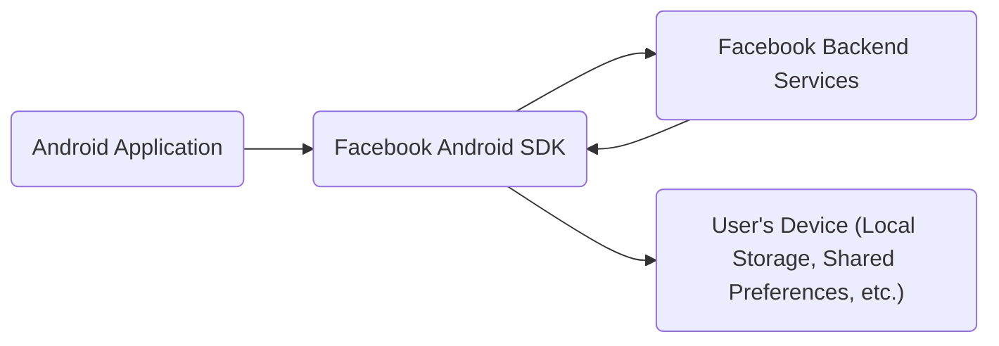
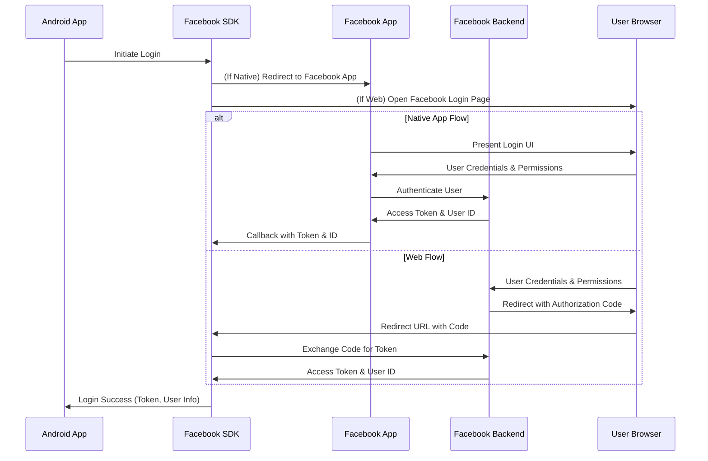
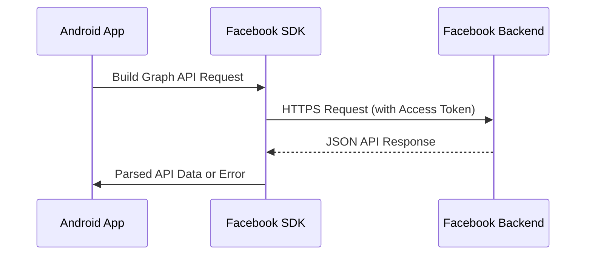
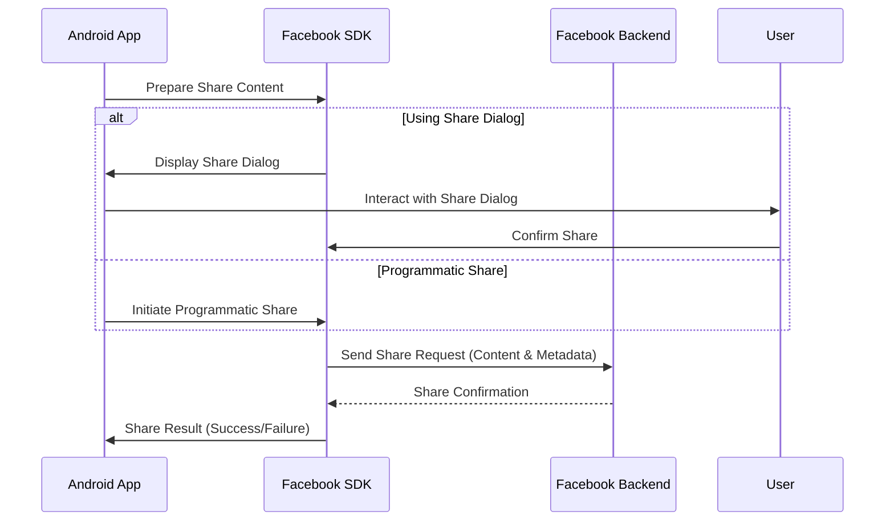
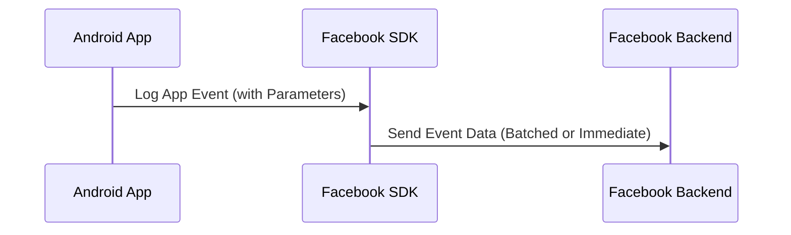

## Project Design Document: Facebook Android SDK (Improved)

**1. Introduction**

This document provides an enhanced architectural overview of the Facebook Android SDK, based on the codebase available at [https://github.com/facebook/facebook-android-sdk](https://github.com/facebook/facebook-android-sdk). This improved version aims to offer a more granular understanding of the SDK's internal structure, functionalities, and data flow, specifically tailored for effective threat modeling. The focus remains on the SDK's client-side architecture and its interactions with the integrating Android application and the Facebook backend services.

**2. Goals and Objectives**

The primary goals of the Facebook Android SDK are to:

*   Simplify the integration of Facebook features into Android applications for developers.
*   Offer a robust and well-defined API for accessing Facebook's social graph, marketing solutions, and other platform services.
*   Abstract away the complexities of authentication, authorization, and network communication with Facebook's backend.
*   Provide pre-built UI components and functionalities for common tasks like sharing, login, and user profile access.
*   Facilitate the implementation of Facebook's advertising and analytics tools within Android applications.
*   Prioritize security and user privacy while enabling seamless integration with the Facebook ecosystem.

**3. High-Level Architecture**

The Facebook Android SDK operates as a client-side library embedded within an Android application. It acts as an intermediary, managing communication and data exchange between the application and Facebook's backend infrastructure.

*   **Android Application:** The third-party application developed by developers that incorporates the Facebook Android SDK to leverage Facebook functionalities.
*   **Facebook Android SDK:** The collection of libraries, classes, and resources that provide the API and implementation for interacting with Facebook services.
*   **Facebook Backend Services:** Facebook's extensive server-side infrastructure responsible for user authentication, data storage, API processing, and service delivery.
*   **User's Device:** The Android-powered device where the integrating application and the Facebook Android SDK reside. The SDK utilizes local storage mechanisms for caching, session management, and potentially storing temporary data.

**4. Component Details**

The Facebook Android SDK is structured into several distinct modules, each responsible for a specific set of functionalities:

*   **Core Module:**
    *   Initialization and Configuration: Handles the SDK's initialization process, including setting up the application ID, client token, and other configuration parameters.
    *   Error Handling and Logging: Provides mechanisms for capturing and reporting errors and exceptions within the SDK.
    *   Network Management: Manages network requests to Facebook's backend, including handling retries and connection management.
    *   Utility Functions: Offers various utility classes and methods for common tasks like string manipulation, date formatting, and cryptographic operations.
    *   Attribution: Handles attribution of app installs and events to Facebook campaigns.
*   **Authentication Module:**
    *   Login Management: Implements the Facebook Login flow using OAuth 2.0, supporting various login types (e.g., native app switch, web-based OAuth).
    *   Access Token Management: Responsible for securely storing, retrieving, and refreshing access tokens.
    *   Permissions Management: Provides APIs for requesting and checking user permissions.
    *   Logout Functionality: Enables users to log out of their Facebook account within the application.
    *   Account Linking: Supports linking the user's Facebook account with the application's account.
*   **Graph API Module:**
    *   Request Building: Offers methods for constructing requests to the Facebook Graph API, specifying endpoints, parameters, and HTTP methods.
    *   Request Execution: Handles the execution of Graph API requests and manages the communication with Facebook's backend.
    *   Response Parsing: Parses the JSON responses received from the Graph API and provides structured data to the application.
    *   Batch Requests: Supports making multiple Graph API requests in a single batch for efficiency.
*   **Share Module:**
    *   Share Dialogs: Provides pre-built UI dialogs for sharing content (links, photos, videos, etc.) to Facebook.
    *   Share API: Offers programmatic APIs for sharing content without using the UI dialogs.
    *   Content Preparation: Handles the preparation and formatting of content for sharing.
    *   Share Results: Provides callbacks and mechanisms for tracking the success or failure of share operations.
*   **App Events Module:**
    *   Event Logging: Provides APIs for logging various application events (e.g., app installs, launches, purchases, custom events).
    *   Parameter Collection: Allows associating parameters with logged events for more detailed tracking.
    *   Flush Behavior: Configures how and when logged events are sent to Facebook's servers (e.g., periodically, on app close).
    *   Automatic Event Logging: May automatically log certain events (e.g., app installs) without explicit developer intervention.
*   **Advertising Module:**
    *   Audience Network Integration: Enables the display of Facebook Audience Network ads within the application.
    *   Advertising Tracking: Provides mechanisms for tracking ad impressions, clicks, and conversions.
    *   Mobile Measurement Partners (MMP) Integration: Facilitates integration with third-party MMPs for attribution.
*   **Deep Linking and App Links Module:**
    *   Deep Link Handling: Parses and processes incoming deep links that direct users to specific content within the application.
    *   App Link Support: Implements support for Facebook App Links, allowing seamless navigation between applications.
*   **Gaming Services Module (If Included):**
    *   Achievements: Provides APIs for managing and displaying game achievements.
    *   Leaderboards: Enables the creation and display of game leaderboards.
    *   Game Requests: Allows users to send and receive game requests to their Facebook friends.
*   **Account Kit Module (Potentially Separate):**
    *   Phone Number Login: Implements login using phone number verification.
    *   Email Login: Supports login using email address verification.
    *   Account Management: Provides APIs for managing user accounts created through Account Kit.

**5. Data Flow**

The following details the data flow for key operations within the Facebook Android SDK:

*   **User Login Flow:**
    *   The Android Application initiates the login process by calling a method in the Authentication Module of the SDK.
    *   The Facebook SDK determines the appropriate login flow (e.g., native app switch if the Facebook app is installed, or a web-based OAuth flow).
    *   If using native app switch, the SDK redirects the user to the Facebook app. If using web-based OAuth, a browser window is opened.
    *   The user provides their Facebook credentials and grants the requested permissions on the Facebook platform.
    *   Facebook Backend Services authenticates the user and generates an access token and potentially a user ID.
    *   The access token and user ID are returned to the Facebook Android SDK (either via a callback from the Facebook app or through the redirect URL in the web-based flow).
    *   The SDK securely stores the access token (e.g., using `SharedPreferences` with encryption or Android Keystore).
    *   The SDK notifies the Android Application about the successful login, providing the access token and user profile information (if requested).

*   **Making a Graph API Call:**
    *   The Android Application uses the Graph API Module of the SDK to construct a request, specifying the Graph API endpoint, parameters, and HTTP method.
    *   The Facebook SDK automatically includes the current access token in the request headers for authentication and authorization.
    *   The SDK sends an HTTPS request to the appropriate Facebook Backend Services endpoint.
    *   Facebook Backend Services processes the request, authenticates the user based on the access token, and retrieves or modifies the requested data.
    *   Facebook Backend Services returns a JSON response containing the requested data or an error message.
    *   The Facebook SDK parses the JSON response and provides the data or error information to the Android Application through a callback or a returned object.

*   **Sharing Content Flow:**
    *   The Android Application uses the Share Module of the SDK to prepare the content to be shared (e.g., a link, photo, or video).
    *   The SDK can either present a pre-built Share Dialog to the user or allow for programmatic sharing.
    *   If using the Share Dialog, the user interacts with the dialog to confirm the share action and potentially add a message.
    *   The Facebook SDK packages the content and associated metadata.
    *   The SDK sends an HTTPS request to the Facebook Backend Services with the share data.
    *   Facebook Backend Services processes the share request and publishes the content on the user's Facebook timeline or other specified locations.
    *   The SDK provides a callback to the Android Application indicating the success or failure of the share operation.

*   **App Events Logging Flow:**
    *   The Android Application uses the App Events Module of the SDK to log specific events occurring within the application (e.g., user registration, item purchase).
    *   The SDK collects event data, including event name, parameters, and potentially device information.
    *   The SDK may batch events together before sending them to Facebook's servers for efficiency.
    *   The SDK sends an HTTPS request to the Facebook Backend Services with the logged event data.
    *   Facebook Backend Services processes the event data for analytics, attribution, and other purposes.

**6. Security Considerations**

The Facebook Android SDK incorporates various security measures and requires developers to adhere to best practices to ensure secure integration:

*   **Secure Communication (HTTPS):** All network communication between the SDK and Facebook Backend Services is conducted over HTTPS to encrypt data in transit and prevent eavesdropping.
*   **Access Token Security:**
    *   Secure Storage: The SDK utilizes Android's secure storage mechanisms (e.g., `SharedPreferences` with encryption, Android Keystore) to store access tokens, protecting them from unauthorized access.
    *   Token Management: The SDK handles token refreshing and expiration to maintain valid access while minimizing the risk of compromised tokens.
    *   Limited Scope Permissions: Developers should request only the necessary permissions to minimize the potential impact of a compromised access token.
*   **OAuth 2.0 Authorization:** The SDK implements the industry-standard OAuth 2.0 protocol for secure authorization, ensuring that users explicitly grant permissions to the application.
*   **Input Validation:** While the primary responsibility lies with the Facebook Backend Services, the SDK may perform some client-side input validation to prevent malformed requests.
*   **Data Privacy:**
    *   Consent Management: Developers are responsible for obtaining necessary user consents for data collection and usage, as required by privacy regulations.
    *   Data Minimization: Developers should only collect and transmit the data that is strictly necessary for their application's functionality.
    *   Transparency: Developers should be transparent with users about how their data is being used.
*   **Dependency Management:** Developers should ensure that they are using the latest version of the SDK and any other dependencies to benefit from the latest security patches.
*   **Code Obfuscation:** While not a security feature of the SDK's API, Facebook may employ code obfuscation techniques to make reverse engineering of the SDK more difficult.
*   **Regular Updates and Security Patches:** Facebook regularly updates the SDK to address security vulnerabilities and improve overall security. Developers should promptly integrate these updates.
*   **Protection Against Replay Attacks:** The OAuth 2.0 flow and token management mechanisms help mitigate replay attacks.
*   **Secure Random Number Generation:** The SDK likely uses secure random number generators for cryptographic operations and session management.

**7. Assumptions and Constraints**

*   The integrating Android application is assumed to be running on a reasonably secure Android environment.
*   Developers using the SDK are expected to adhere to Facebook's developer policies and best practices for secure development.
*   The security of the Facebook Backend Services is assumed to be robust and maintained by Facebook.
*   The functionality and APIs of the SDK are subject to change by Facebook.
*   This document primarily focuses on the client-side aspects of the SDK. Security considerations for the Facebook Backend Services are outside the scope of this document.
*   The availability and functionality of certain SDK features may depend on the user's Facebook app installation and settings.

**8. Future Considerations**

*   Adoption of more advanced security measures, such as certificate pinning.
*   Integration with Android's privacy-preserving technologies.
*   Support for emerging authentication standards.
*   Adaptation to evolving privacy regulations and user expectations.
*   Potential modularization of the SDK to reduce the application's footprint.

This improved design document provides a more detailed and nuanced understanding of the Facebook Android SDK's architecture, data flow, and security considerations. This enhanced information will be invaluable for conducting thorough and effective threat modeling activities.