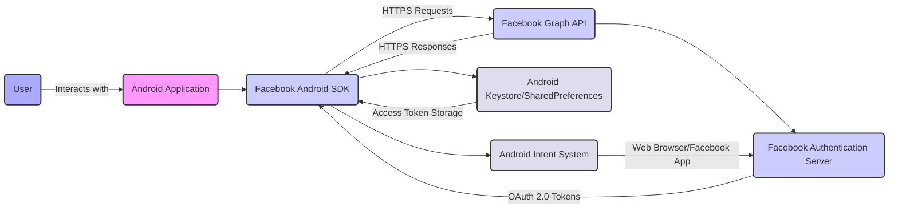

# Project Design Document: Facebook Android SDK

**Version:** 1.1
**Date:** October 26, 2023
**Prepared By:** Gemini (AI Model)

## 1. Introduction

This document provides an enhanced design overview of the Facebook Android SDK, as represented by the project hosted at [https://github.com/facebook/facebook-android-sdk](https://github.com/facebook/facebook-android-sdk). This iteration aims to provide a more granular understanding of the SDK's architecture, data flows, and functionalities, specifically tailored for effective threat modeling. The information presented is based on publicly available information, common understanding of SDK functionalities, and aims to highlight potential areas of security concern.

## 2. Goals and Objectives

The primary goals of the Facebook Android SDK are to:

*   Enable secure and efficient integration of Facebook platform features into Android applications.
*   Provide developers with well-defined and secure APIs for user authentication (Login with Facebook), managing user sessions, and handling access tokens.
*   Facilitate secure and controlled sharing of content from Android apps to Facebook, respecting user privacy settings.
*   Offer robust and authenticated access to the Facebook Graph API for retrieving and posting data, adhering to permission scopes.
*   Provide privacy-conscious functionalities for app analytics and advertising, respecting user opt-out mechanisms.
*   Simplify the development process for integrating with the Facebook platform while maintaining a strong security posture.

## 3. Target Audience

This design document is intended for:

*   Security engineers and architects performing detailed threat modeling on applications integrating the Facebook Android SDK and the SDK itself.
*   Software developers requiring an in-depth understanding of the SDK's internal workings and security implications.
*   Security auditors and researchers evaluating the security of the Facebook Android SDK and applications utilizing it.
*   Product managers and technical leads involved in the development and maintenance of applications using the SDK.

## 4. System Architecture

The Facebook Android SDK acts as a client-side library mediating interactions between an Android application and the Facebook platform. It abstracts away the complexities of network communication, authentication protocols, and API interactions.

**Components:**

*   **Android Application:** The third-party application integrating the Facebook Android SDK to leverage Facebook features. This is the primary subject for threat modeling when considering SDK integration.
*   **Facebook Android SDK:** The library embedded within the Android application. It contains the core logic for interacting with Facebook services. Key areas of concern for threat modeling include its internal logic, data handling, and communication security.
*   **Facebook Graph API:** Facebook's central API endpoint. The SDK constructs and sends requests to this API. Understanding the API's endpoints and expected parameters is crucial for threat modeling.
*   **Facebook Authentication Server:** Handles user authentication and the issuance of OAuth 2.0 access tokens. The security of the authentication flow is a key area for threat analysis.
*   **Android Keystore/SharedPreferences:** Mechanisms on the Android device used by the SDK (or the integrating application with SDK guidance) to store sensitive information like access tokens. Secure storage practices are vital.
*   **Android Intent System:** Used by the SDK to launch activities for authentication (potentially redirecting to the Facebook app or a web browser). Potential for intent interception or manipulation needs consideration.
*   **Web Browser/Facebook App:** External applications involved in the authentication process. The security of these external components is a dependency for the SDK's authentication flow.
*   **User:** The end-user whose actions trigger interactions with the SDK and Facebook. User behavior and potential for social engineering are relevant threat vectors.

## 5. Data Flow (Detailed)

The SDK manages various types of data, and understanding their flow is crucial for identifying potential vulnerabilities.

*   **Authentication Data Flow:**
    *   **Initiation:** The Android application calls the SDK's login methods.
    *   **Authentication Request:** The SDK constructs an authentication request, potentially using custom Chrome Tabs, a WebView, or by invoking the native Facebook application via an intent.
    *   **User Interaction:** The user interacts with the Facebook login screen (either in-app or external) and provides credentials.
    *   **Credential Transmission:** User credentials are transmitted over HTTPS to the Facebook Authentication Server.
    *   **Token Issuance:** Upon successful authentication, the Facebook Authentication Server issues an OAuth 2.0 access token, along with a refresh token and potentially other metadata.
    *   **Token Redirection:** The access token is redirected back to the Android application, typically through a redirect URI handled by the SDK.
    *   **Token Storage:** The SDK (or the integrating application) stores the access token securely, ideally in the Android Keystore or encrypted SharedPreferences. The security of this storage is paramount.
*   **Graph API Request Data Flow:**
    *   **Request Construction:** The Android application utilizes the SDK to build requests to specific Graph API endpoints. This includes specifying parameters, HTTP methods, and required permissions.
    *   **Authentication Header:** The SDK attaches the user's access token to the request's authorization header (typically a Bearer token).
    *   **HTTPS Transmission:** The request is transmitted over an HTTPS connection to the Facebook Graph API.
    *   **API Processing:** Facebook servers validate the access token, check permissions, and process the request.
    *   **Response Handling:** The Graph API returns a response, typically in JSON format, over HTTPS.
    *   **SDK Processing:** The SDK parses the JSON response and provides the data to the Android application.
*   **Sharing Data Flow:**
    *   **Content Preparation:** The Android application prepares the content to be shared (text, links, images, videos).
    *   **Share Intent/Dialog:** The SDK provides mechanisms like Share Dialogs or allows direct API calls for sharing. Using Share Dialogs often involves Android Intents.
    *   **Content Transmission:** Shared content is transmitted to Facebook servers over HTTPS. For media, this may involve uploading files.
    *   **Privacy Settings:** The user's privacy settings on Facebook govern who can see the shared content. The SDK should respect these settings.
*   **App Events Data Flow:**
    *   **Event Logging:** The Android application uses the SDK to log specific app events.
    *   **Batching and Transmission:** The SDK may batch events and transmit them periodically to Facebook servers over HTTPS.
    *   **Data Aggregation:** Facebook servers aggregate and process the event data for analytics and advertising purposes.
*   **Advertising Data Flow:**
    *   **Ad Request:** The SDK requests ad configurations and content from Facebook's ad servers.
    *   **Ad Delivery:** Ad content (images, videos, text) is delivered to the SDK over HTTPS.
    *   **Impression Tracking:** The SDK tracks ad impressions and interactions.
    *   **Data Reporting:** Interaction data is reported back to Facebook's ad servers.

## 6. Key Components of the SDK (Detailed)

A deeper look into the SDK's components reveals potential areas for security focus.

*   **Core Module:**
    *   **AccessToken Management:** Responsible for securely storing, retrieving, and refreshing access tokens. Vulnerabilities here could lead to unauthorized access.
    *   **API Request Builder:** Constructs and signs API requests. Improper signing or handling of sensitive data in requests is a risk.
    *   **Error Handling:** Manages errors returned from Facebook APIs. Detailed error messages might inadvertently reveal sensitive information.
    *   **Network Layer:** Handles HTTPS communication. Ensuring proper certificate validation and secure connection establishment is critical.
*   **Login Module:**
    *   **Login Button:** UI component that initiates the login flow. Potential for UI redressing or spoofing.
    *   **Authentication Flow Logic:** Implements the OAuth 2.0 flow. Vulnerabilities in the flow implementation could lead to token compromise.
    *   **Authorization Code Handling:** If using the authorization code flow, secure handling of the code before token exchange is important.
*   **Share Module:**
    *   **Share Dialog Implementation:** Handles the presentation of the share dialog. Potential for injection or manipulation of shared content.
    *   **Content Upload Logic:** Manages the secure upload of media and other content.
*   **Graph API Module:**
    *   **Specific API Wrappers:** Provides convenient methods for common Graph API calls. Incorrect parameter handling could lead to unintended actions.
    *   **Permission Management:** Handles requesting and checking API permissions. Ensuring least privilege is important.
*   **App Events Module:**
    *   **Event Data Collection:** Collects and potentially stores event data locally before transmission. Secure storage of this data needs consideration.
    *   **Data Transmission Logic:** Handles the transmission of event data to Facebook.
*   **Advertising Module:**
    *   **Ad Request Logic:** Fetches ad configurations. Potential for serving malicious ads if the retrieval process is compromised.
    *   **Ad Rendering:** Displays ad content. Vulnerabilities in rendering could lead to cross-site scripting (XSS) within the app context.
    *   **Tracking Logic:** Tracks ad interactions. Privacy implications of tracking need to be considered.
*   **Utility Classes:**
    *   **Security Utilities:** May include functions for encryption or data hashing. The robustness of these utilities is important.

## 7. Security Considerations (Granular)

Expanding on the high-level considerations, here are more specific security aspects:

*   **Access Token Security:**
    *   Secure storage on the device (Android Keystore preferred).
    *   Proper handling to prevent leakage or unauthorized access.
    *   Secure transmission during API calls (HTTPS).
    *   Understanding token expiration and refresh mechanisms.
*   **OAuth 2.0 Flow Vulnerabilities:**
    *   Authorization code interception.
    *   Redirect URI manipulation.
    *   Cross-Site Request Forgery (CSRF) during login.
*   **Data Transmission Security:**
    *   Enforcement of HTTPS for all communication with Facebook servers.
    *   Proper certificate validation to prevent Man-in-the-Middle (MITM) attacks.
*   **Data Storage Security:**
    *   Encryption of sensitive data at rest.
    *   Protection against unauthorized access to local storage.
*   **Privacy Compliance:**
    *   Adherence to Facebook's Data Use Policy.
    *   Respecting user privacy settings and opt-outs.
    *   Transparency about data collection and usage.
*   **Input Validation:**
    *   Sanitizing data received from Facebook APIs to prevent injection attacks within the application.
    *   Validating data sent to the SDK to prevent unexpected behavior or vulnerabilities.
*   **Dependency Management:**
    *   Regularly updating the SDK to patch vulnerabilities.
    *   Awareness of vulnerabilities in the SDK's dependencies.
*   **Permissions:**
    *   Requesting only necessary Android permissions.
    *   Clearly explaining the purpose of requested permissions to the user.
*   **Deeplinking Security:**
    *   Validating deep links received from Facebook to prevent malicious redirection or exploitation.
*   **UI Security:**
    *   Protecting against UI redressing or clickjacking attacks related to SDK UI components (e.g., Login Button).
*   **Code Obfuscation:**
    *   While not a direct security feature of the SDK, obfuscating the integrating application's code can make it harder to reverse engineer and extract sensitive information related to the SDK integration.

## 8. Dependencies

The Facebook Android SDK relies on several underlying components and libraries:

*   **Android SDK:** Specific API levels and features of the Android operating system.
*   **AndroidX Libraries:** Provides backward-compatible versions of Android framework APIs.
*   **OkHttp/ অন্যান্য HTTP Client Libraries:**  Likely used for handling network requests. Vulnerabilities in these libraries could impact the SDK.
*   **JSON Parsing Libraries (e.g., Gson, Jackson):** Used for parsing data received from Facebook APIs. Vulnerabilities in these libraries could be exploited.
*   **Potentially other Facebook internal libraries:**  Details may not be publicly available, but their security is relevant.

## 9. Deployment

Integrating the Facebook Android SDK involves the following steps, which introduce points of consideration for security.

*   **Gradle Dependency Management:** Adding the SDK dependency through `build.gradle`. Ensuring the integrity of the dependency source (Maven Central, Facebook's Maven repo) is important.
*   **AndroidManifest.xml Configuration:**  Configuring the SDK with the Facebook App ID and other metadata. Securely managing the App ID is crucial.
*   **SDK Initialization:** Initializing the SDK within the application's code. Ensuring this is done securely and early in the application lifecycle is recommended.
*   **ProGuard/R8 Configuration:** Configuring code shrinking and obfuscation tools to protect the application's code and potentially the SDK integration logic.

## 10. Future Considerations

The Facebook Android SDK is continuously evolving. Future developments might include:

*   **Enhanced Security Features:**  Implementation of new security measures to address emerging threats.
*   **Improved Privacy Controls:**  More granular controls for users regarding data sharing.
*   **Support for New Android Features:** Adapting to new Android versions and security enhancements.
*   **Changes to Facebook Platform APIs:**  The SDK will need to adapt to changes in the underlying Facebook APIs.

This enhanced design document provides a more detailed and security-focused overview of the Facebook Android SDK. It aims to equip security professionals and developers with the necessary information for conducting thorough threat modeling exercises and building secure applications that integrate with the Facebook platform.
