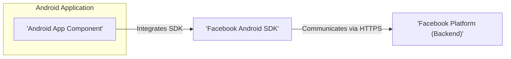
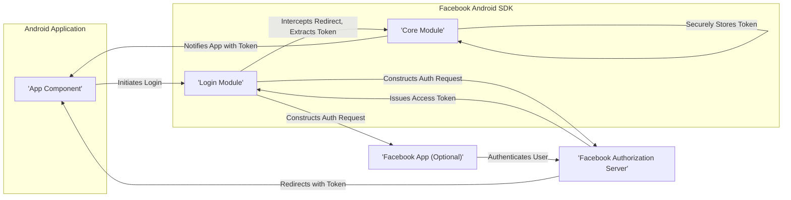

# Project Design Document: Facebook Android SDK - Improved

**Version:** 1.1
**Date:** October 26, 2023
**Author:** AI Software Architect

## 1. Introduction

This document provides an enhanced design overview of the Facebook Android SDK, based on the codebase available at [https://github.com/facebook/facebook-android-sdk](https://github.com/facebook/facebook-android-sdk). This iteration aims to provide a more granular and insightful understanding of the SDK's architecture, component interactions, and data flow, specifically tailored for effective threat modeling.

## 2. Goals and Objectives

The core objectives of the Facebook Android SDK remain:

*   To facilitate straightforward integration of Facebook platform functionalities within Android applications.
*   To offer Android developers a robust and well-documented API for interacting with Facebook services.
*   To abstract the complexities of authentication, authorization protocols (like OAuth 2.0), and API request management.
*   To provide specific features for social sharing, enhancing user engagement, and collecting application analytics.
*   To prioritize security and privacy for end-users and the integrity of the Facebook platform.

## 3. High-Level Architecture

The Facebook Android SDK serves as an intermediary layer, enabling communication between an Android application and the Facebook platform's backend infrastructure.

**Key Entities:**

*   **Android Application:** The application being developed by a third-party, which incorporates the Facebook Android SDK to leverage Facebook features.
*   **Facebook Android SDK:** A library integrated directly into the Android application, providing specific APIs and functionalities for Facebook interaction.
*   **Facebook Platform (Backend):** Facebook's extensive server infrastructure, encompassing APIs, databases, and services that provide the core Facebook functionalities.

## 4. Component Breakdown - Detailed

The Facebook Android SDK is structured into distinct modules, each responsible for a specific set of functionalities. Understanding these components is crucial for identifying potential threat vectors.

*   **Core Module:**
    *   Responsible for the SDK's lifecycle management, including initialization and configuration using the application's Facebook App ID.
    *   Manages the acquisition, storage, and refreshing of access tokens, employing secure storage mechanisms provided by the Android OS.
    *   Handles low-level network communication with the Facebook Platform, enforcing HTTPS for all requests.
    *   Provides mechanisms for error handling and reporting within the SDK.
*   **Login Module:**
    *   Implements the complete Facebook Login flow, adhering to the OAuth 2.0 protocol for user authentication and authorization.
    *   Offers customizable UI components (e.g., login buttons, dialogs) for a seamless user experience.
    *   Supports various login methods, including native app switch (Facebook app present), web-based OAuth flows, and potentially limited login.
    *   Manages permission requests, allowing developers to request specific data access from users.
*   **Graph API Module:**
    *   Provides a structured interface for making requests to the Facebook Graph API, abstracting away the complexities of HTTP request construction.
    *   Offers methods for executing various types of Graph API calls (e.g., read, write, delete).
    *   Handles serialization and deserialization of data exchanged with the Graph API.
    *   May include specific helper functions for common Graph API endpoints (e.g., fetching user profiles, posting to timelines).
*   **Share Module:**
    *   Enables users to share content from the Android application to Facebook, supporting various content types (links, images, videos).
    *   Provides pre-built UI components (e.g., share dialogs) for a consistent sharing experience.
    *   Handles the creation and management of share parameters and metadata.
    *   Supports different sharing mechanisms, including direct sharing and the Share API.
*   **App Events Module:**
    *   Facilitates the tracking of user actions and application events within the Android app.
    *   Transmits anonymized event data to Facebook for analytics, advertising measurement, and other purposes.
    *   Allows developers to define custom events and associated parameters for granular tracking.
    *   May employ batching techniques to optimize network usage when sending event data.
*   **Gaming Services Module:**
    *   Provides APIs specifically tailored for game developers, enabling features like app invites, game requests, and integration with Facebook's gaming platform.
    *   Handles authentication and authorization within the context of gaming features.
    *   May offer functionalities for accessing leaderboards and achievements.
*   **Advertising Support Module:**
    *   Offers functionalities related to Facebook advertising, such as tracking ad conversions and attributing app installs to specific ad campaigns.
    *   May integrate with Facebook's advertising SDKs or APIs.
    *   Handles the collection and transmission of advertising-related data.
*   **Account Kit Module (Potentially Deprecated/Separate):**
    *   Historically provided alternative login methods using phone numbers or email addresses (implementation details and current status require verification against the latest SDK version). *Note: This module's integration and status should be confirmed for accurate threat modeling.*
*   **Utility Modules:**
    *   Contains helper classes and functions for common tasks, such as:
        *   Handling deep linking and app invites.
        *   Managing network connectivity checks.
        *   Providing logging and debugging utilities.
        *   Potentially including image loading and caching functionalities.

## 5. Data Flow - Detailed Use Case: User Login

To illustrate the data flow, let's examine the user login process:

1. **Initiation:** The Android application presents a Facebook Login button or initiates the login flow programmatically using the SDK's Login module.
2. **Login Request:** The Login module constructs an authorization request, specifying the required permissions.
3. **Authentication:**
    *   **Native App Switch (if Facebook app is installed):** The request is handed off to the Facebook app for authentication.
    *   **Web-based OAuth (if Facebook app is not installed):** A web view is launched, directing the user to Facebook's login page.
4. **User Credentials:** The user enters their Facebook credentials (username/email and password) on the Facebook platform (either within the Facebook app or a web view).
5. **Authorization Grant:** Upon successful authentication, the Facebook platform prompts the user to grant the requested permissions to the Android application.
6. **Access Token Issuance:** If the user grants the permissions, the Facebook platform issues an access token.
7. **Token Redirection:** The access token is redirected back to the Android application via a deep link or a callback URL.
8. **SDK Interception:** The Facebook Android SDK intercepts the redirection and extracts the access token.
9. **Token Storage:** The SDK securely stores the access token (typically using Android's `SharedPreferences` with appropriate security measures or Android Keystore).
10. **Callback to Application:** The SDK notifies the Android application about the successful login, providing the access token and user profile information (if requested).
11. **Subsequent API Calls:** The Android application can now use the access token to make authenticated requests to the Facebook Graph API through the SDK's Graph API module.

## 6. Security Considerations - Expanded

A thorough threat model requires a detailed understanding of potential security vulnerabilities.

*   **Authentication and Authorization:**
    *   **Threat:** Access token theft (e.g., through insecure storage, man-in-the-middle attacks).
    *   **Threat:** Improper handling of refresh tokens, leading to unauthorized access.
    *   **Threat:** Insufficient validation of redirect URIs, potentially leading to authorization code interception.
    *   **Threat:** Over-requesting permissions, increasing the potential impact of a compromised token.
*   **Data Transmission:**
    *   **Threat:** Downgrade attacks forcing communication to insecure protocols (though HTTPS enforcement mitigates this).
    *   **Threat:** Exposure of sensitive data (access tokens, user information) if HTTPS is not strictly enforced or implemented correctly.
    *   **Threat:** Data injection or tampering during transmission.
*   **Data Storage:**
    *   **Threat:** Insecure storage of access tokens in shared preferences without encryption, making them vulnerable to local attacks (root access, malware).
    *   **Threat:** Accidental logging or exposure of sensitive data.
    *   **Threat:** Vulnerabilities in the underlying Android Keystore implementation (though the SDK likely leverages it securely).
*   **Input Validation:**
    *   **Threat:** Injection attacks (e.g., Cross-Site Scripting (XSS) if web views are involved in login flows and input is not sanitized).
    *   **Threat:** Malicious data passed through API calls, potentially exploiting vulnerabilities in the Facebook Platform.
*   **Privacy:**
    *   **Threat:** Unauthorized collection or transmission of user data beyond the declared permissions.
    *   **Threat:** Non-compliance with data privacy regulations (e.g., GDPR, CCPA).
    *   **Threat:** Lack of transparency regarding data usage.
*   **Dependency Management:**
    *   **Threat:** Inclusion of vulnerable third-party libraries within the SDK.
    *   **Mitigation:** Regular updates and security audits of dependencies are crucial.
*   **Code Security:**
    *   **Threat:** Vulnerabilities within the SDK codebase itself (e.g., buffer overflows, logic flaws).
    *   **Mitigation:** Secure coding practices, code reviews, and penetration testing are necessary.
*   **Deep Linking Security:**
    *   **Threat:** Exploitation of deep links to perform unauthorized actions or redirect users to malicious sites.
    *   **Mitigation:** Proper validation of deep link parameters is essential.
*   **App Secret Protection:**
    *   **Consideration:** While the SDK doesn't directly embed the App Secret, developers must understand its sensitivity and avoid exposing it in client-side code or insecure backend implementations.

## 7. Deployment

The Facebook Android SDK is integrated into Android application projects as a dependency, typically managed through build systems like Gradle.

*   **Gradle Dependency:** Developers add the SDK as a dependency in their `build.gradle` file.
*   **Manifest Configuration:** The application's `AndroidManifest.xml` file requires specific configurations, including:
    *   Permissions necessary for SDK functionalities (e.g., internet access).
    *   Metadata tags containing the Facebook App ID.
    *   Potentially, activity declarations for Facebook-related UI components.
*   **SDK Initialization:** The SDK must be initialized within the application's code, usually in the `Application` class or an `Activity`'s `onCreate` method.

## 8. Future Considerations

Ongoing development and potential future directions for the Facebook Android SDK may include:

*   **Performance Optimization:** Continuously improving the SDK's efficiency to minimize its impact on the host application's performance and battery life.
*   **Enhanced Security Measures:** Implementing new security features to address evolving threats and vulnerabilities proactively.
*   **Support for Emerging Facebook Platform Features:** Adapting the SDK to seamlessly integrate with new APIs and functionalities introduced by the Facebook platform.
*   **Improved Developer Experience (DX):** Providing clearer and more comprehensive documentation, enhanced debugging tools, and more intuitive APIs to simplify integration.
*   **Increased Modularity:** Further breaking down the SDK into smaller, more independent modules, allowing developers to include only the specific functionalities they require, reducing the application's size and potential attack surface.

This enhanced design document provides a more detailed and nuanced understanding of the Facebook Android SDK's architecture and functionalities. This information is critical for conducting a comprehensive threat model and identifying potential security risks associated with its integration.