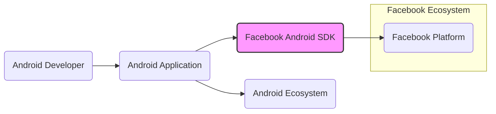
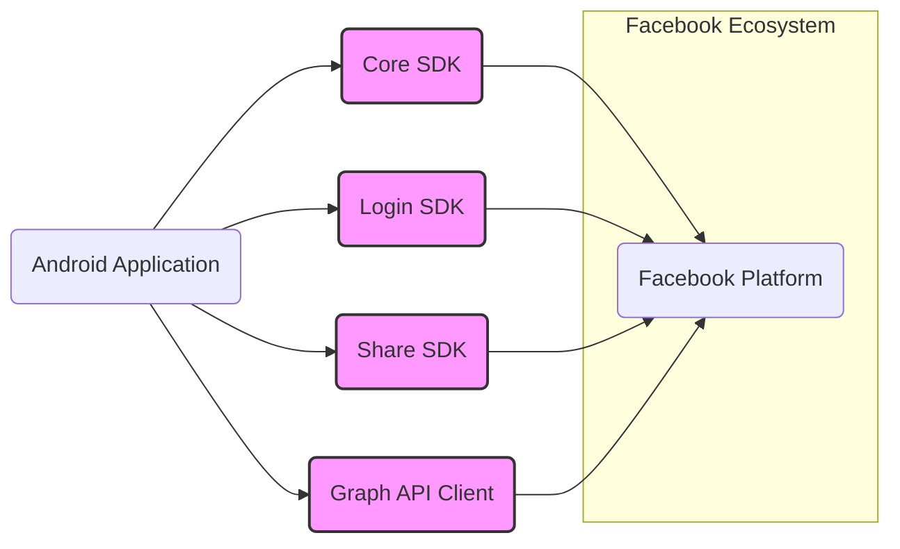
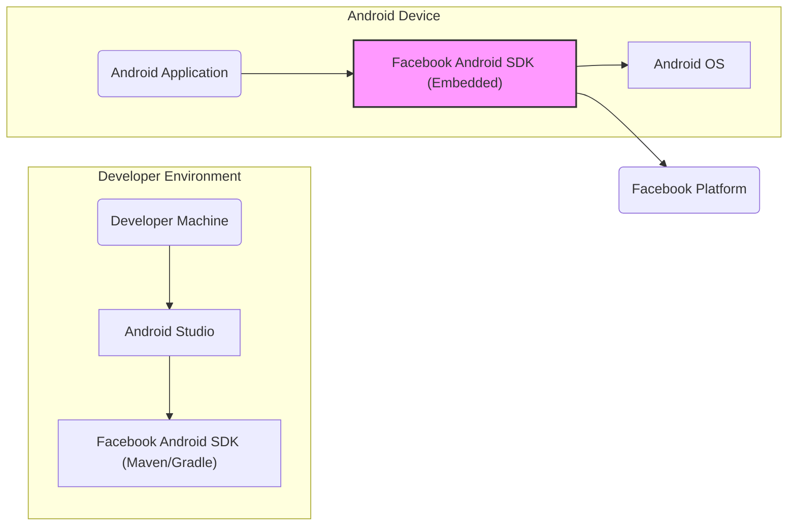
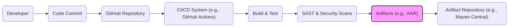

# BUSINESS POSTURE

The Facebook Android SDK project aims to empower Android developers to seamlessly integrate Facebook functionalities into their mobile applications. This integration facilitates user authentication via Facebook, content sharing on the platform, access to Facebook's social graph data, and the utilization of Facebook's advertising and analytics tools.

The primary business priorities and goals for the Facebook Android SDK are:
- Increase adoption of the Facebook platform by Android developers.
- Provide developers with robust and easy-to-use tools to enhance user engagement and app growth.
- Expand Facebook's reach and data collection capabilities through mobile applications.
- Support Facebook's advertising ecosystem by enabling mobile app integrations.

The most important business risks associated with the Facebook Android SDK project that need to be addressed are:
- Developer dissatisfaction due to complexity, bugs, or lack of features in the SDK, leading to decreased adoption and potential migration to competitor platforms.
- Security vulnerabilities within the SDK that could be exploited by malicious actors to compromise applications using the SDK, leading to data breaches, reputational damage for Facebook and developers, and legal liabilities.
- Privacy violations arising from improper data handling or collection by the SDK, resulting in regulatory fines, user distrust, and damage to Facebook's brand image.
- Supply chain risks associated with dependencies and build processes, potentially introducing vulnerabilities or malicious code into the SDK.

# SECURITY POSTURE

Existing security controls for the Facebook Android SDK project include:
- security control: Code reviews are conducted for all code changes to identify potential security vulnerabilities and ensure code quality. (Location: Facebook's internal development process)
- security control: Static Application Security Testing (SAST) tools are likely used to automatically scan the codebase for common security flaws. (Location: Facebook's internal development process)
- security control: Dependency management practices are in place to track and manage third-party libraries used by the SDK, including vulnerability scanning of dependencies. (Location: Facebook's internal development process, dependency management tools like Maven or Gradle)
- security control: HTTPS is enforced for all communication between the SDK and Facebook servers to protect data in transit. (Location: Network communication layer within the SDK)
- security control: API key and access token management is implemented to control access to Facebook APIs and protect user data. (Location: Authentication and authorization modules within the SDK)
- security control: Regular security updates and patches are released to address identified vulnerabilities in the SDK. (Location: Facebook's SDK release and maintenance process)

Accepted risks for the Facebook Android SDK project include:
- accepted risk: Risks associated with third-party dependencies, where vulnerabilities in external libraries could affect the SDK despite Facebook's dependency management efforts.
- accepted risk: Risks stemming from improper usage of the SDK by developers, leading to security vulnerabilities in their applications that are not directly caused by the SDK itself.
- accepted risk: The inherent complexity of a large codebase like the SDK may contain undiscovered vulnerabilities despite security measures.

Recommended security controls to implement for the Facebook Android SDK project:
- recommended security control: Implement dynamic application security testing (DAST) to identify runtime vulnerabilities and security issues that may not be detectable by SAST.
- recommended security control: Conduct regular penetration testing by external security experts to simulate real-world attacks and identify weaknesses in the SDK's security posture.
- recommended security control: Establish a vulnerability disclosure program to encourage security researchers to report vulnerabilities responsibly.
- recommended security control: Implement fuzzing techniques to automatically test the SDK's robustness against malformed or unexpected inputs.
- recommended security control: Appoint security champions within the development team to promote security awareness and best practices throughout the development lifecycle.
- recommended security control: Enhance supply chain security measures by implementing binary component analysis and provenance checks for dependencies.

Security requirements for the Facebook Android SDK project:
- Authentication:
    - security requirement: Securely authenticate users with Facebook accounts using industry-standard protocols like OAuth 2.0.
    - security requirement: Protect user credentials and access tokens from unauthorized access and disclosure.
    - security requirement: Implement multi-factor authentication options where applicable to enhance account security.
- Authorization:
    - security requirement: Implement fine-grained authorization mechanisms to control access to Facebook APIs and user data based on permissions granted by users and applications.
    - security requirement: Ensure that applications using the SDK can only access data and functionalities they are explicitly authorized to use.
    - security requirement: Regularly review and update API permissions to align with evolving privacy policies and user expectations.
- Input Validation:
    - security requirement: Implement robust input validation on all data received from Android applications and Facebook APIs to prevent injection attacks (e.g., SQL injection, cross-site scripting).
    - security requirement: Sanitize and encode user-provided data before displaying it or using it in further processing to mitigate cross-site scripting vulnerabilities.
    - security requirement: Validate data types, formats, and ranges to prevent unexpected behavior and potential security issues.
- Cryptography:
    - security requirement: Use strong encryption algorithms and protocols to protect sensitive data at rest and in transit.
    - security requirement: Securely manage cryptographic keys and certificates, following industry best practices.
    - security requirement: Implement data encryption for sensitive data stored locally within the SDK or application using the SDK.

# DESIGN

## C4 CONTEXT

Context Diagram Description:

- Element:
    - Name: Android Developer
    - Type: Person
    - Description: Software developers who use the Facebook Android SDK to integrate Facebook features into their Android applications.
    - Responsibilities: Develop Android applications, integrate Facebook features using the SDK, manage user data within their applications.
    - Security controls: Secure development practices, secure storage of developer credentials, responsible use of SDK features and APIs.

- Element:
    - Name: Android Application
    - Type: Software System
    - Description: Mobile applications developed for the Android platform that integrate with Facebook using the Facebook Android SDK.
    - Responsibilities: Provide Facebook-integrated features to end-users, interact with the Facebook Android SDK, manage user data and permissions.
    - Security controls: Application-level security controls (authentication, authorization, input validation), secure data storage, adherence to privacy policies.

- Element:
    - Name: Facebook Android SDK
    - Type: Software System
    - Description: A software development kit provided by Facebook to enable Android developers to integrate Facebook features into their applications. This is the project in question.
    - Responsibilities: Provide APIs and tools for Facebook integration, handle communication with the Facebook Platform, manage user authentication and authorization, provide data access and sharing functionalities.
    - Security controls: Security controls listed in the SECURITY POSTURE section, secure coding practices, regular security updates, vulnerability management.

- Element:
    - Name: Facebook Platform
    - Type: Software System
    - Description: Facebook's backend infrastructure and services that provide social networking functionalities, APIs, data storage, and processing.
    - Responsibilities: Provide Facebook services and APIs, manage user accounts and data, handle authentication and authorization requests from the SDK, process data requests from applications.
    - Security controls: Facebook's platform-level security controls, including authentication, authorization, data encryption, intrusion detection, and incident response.

- Element:
    - Name: Android Ecosystem
    - Type: External System
    - Description: The broader Android mobile ecosystem, including the Android operating system, Google Play Store, and Android devices.
    - Responsibilities: Provide the runtime environment for Android applications, distribute applications to users, manage device security.
    - Security controls: Android OS security features, Google Play Store security checks, device-level security controls.

## C4 CONTAINER

Container Diagram Description:

- Element:
    - Name: Core SDK
    - Type: Container
    - Description: The foundational module of the Facebook Android SDK, providing core functionalities and utilities used by other SDK components.
    - Responsibilities: Initialization, configuration, error handling, network communication management, base classes and utilities for other modules.
    - Security controls: Input validation, secure network communication (HTTPS), secure data handling within the core module, logging and monitoring.

- Element:
    - Name: Login SDK
    - Type: Container
    - Description: Handles user authentication with Facebook, providing APIs for login, logout, and session management.
    - Responsibilities: User authentication, session management, token handling, permission management related to login.
    - Security controls: Secure authentication protocols (OAuth 2.0), secure storage of access tokens, protection against session hijacking, input validation for login credentials.

- Element:
    - Name: Share SDK
    - Type: Container
    - Description: Enables users to share content from Android applications to Facebook.
    - Responsibilities: Content sharing functionalities, handling share dialogs, managing share permissions, interacting with Facebook's sharing APIs.
    - Security controls: Input validation for shared content, protection against content injection attacks, secure handling of user-generated content, authorization checks for sharing actions.

- Element:
    - Name: Graph API Client
    - Type: Container
    - Description: Provides a client library for interacting with the Facebook Graph API, allowing applications to access Facebook data and functionalities.
    - Responsibilities: Making requests to the Facebook Graph API, handling API responses, managing API rate limits, providing data models for Graph API entities.
    - Security controls: Secure API request construction, input validation for API parameters, secure handling of API responses, authorization checks for API access, rate limiting to prevent abuse.

## DEPLOYMENT

Deployment Architecture: Android Application Integration

Deployment Diagram Description:

- Element:
    - Name: Android Studio
    - Type: Development Tool
    - Description: The Integrated Development Environment (IDE) used by Android developers to build Android applications.
    - Responsibilities: Code editing, building, debugging, and packaging Android applications.
    - Security controls: Secure coding practices by developers, IDE security features, plugin security checks.

- Element:
    - Name: Facebook Android SDK (Maven/Gradle)
    - Type: Package Manager Dependency
    - Description: The Facebook Android SDK distributed as a dependency through package managers like Maven or Gradle, used during development.
    - Responsibilities: Providing SDK libraries and resources to the Android Studio build environment.
    - Security controls: Dependency management security (vulnerability scanning, dependency provenance), secure distribution channels (Maven Central, Facebook's Maven repository).

- Element:
    - Name: Android Application
    - Type: Software System
    - Description: The Android application built by the developer, incorporating the Facebook Android SDK.
    - Responsibilities: Running on Android devices, providing Facebook-integrated features to end-users, interacting with the embedded SDK.
    - Security controls: Application-level security controls, secure configuration, runtime environment security.

- Element:
    - Name: Facebook Android SDK (Embedded)
    - Type: Library
    - Description: The Facebook Android SDK embedded within the Android application package, running on the user's Android device.
    - Responsibilities: Providing Facebook integration functionalities within the application runtime, communicating with the Facebook Platform.
    - Security controls: Security controls of the SDK itself (as described in SECURITY POSTURE), runtime security within the Android application context.

- Element:
    - Name: Android OS
    - Type: Operating System
    - Description: The Android operating system running on the user's mobile device.
    - Responsibilities: Providing the runtime environment for Android applications and the SDK, managing device resources and security.
    - Security controls: Android OS security features (sandboxing, permissions, security updates), device-level security settings.

- Element:
    - Name: Facebook Platform
    - Type: Backend System
    - Description: Facebook's backend infrastructure that the SDK communicates with over the network.
    - Responsibilities: Providing Facebook services, APIs, and data to the SDK, handling authentication and authorization requests.
    - Security controls: Facebook's platform-level security controls.

## BUILD

Build Process: Automated CI/CD Pipeline (Assumed)

Build Diagram Description:

- Element:
    - Name: Developer
    - Type: Person
    - Description: Software engineers who write and maintain the code for the Facebook Android SDK.
    - Responsibilities: Writing code, fixing bugs, implementing new features, committing code changes.
    - Security controls: Secure coding practices, code reviews, access control to development environment.

- Element:
    - Name: Code Commit
    - Type: Action
    - Description: The action of developers committing code changes to the source code repository.
    - Responsibilities: Version control of code changes, triggering the build process.
    - Security controls: Access control to the repository, commit signing, branch protection.

- Element:
    - Name: GitHub Repository
    - Type: Code Repository
    - Description: The source code repository (GitHub in this case) hosting the Facebook Android SDK code.
    - Responsibilities: Storing and managing the source code, version history, and collaboration workflows.
    - Security controls: Access control, branch protection, audit logging, vulnerability scanning of the repository infrastructure.

- Element:
    - Name: CI/CD System (e.g., GitHub Actions)
    - Type: Automation System
    - Description: An automated Continuous Integration and Continuous Delivery system used to build, test, and deploy the SDK. (Assuming GitHub Actions or similar)
    - Responsibilities: Automating the build process, running tests, performing security scans, publishing build artifacts.
    - Security controls: Secure configuration of CI/CD pipelines, access control to CI/CD system, secrets management, build environment security.

- Element:
    - Name: Build & Test
    - Type: Build Stage
    - Description: The stage where the SDK code is compiled, linked, and unit tests are executed.
    - Responsibilities: Compiling code, running unit tests, generating build artifacts.
    - Security controls: Secure build environment, dependency integrity checks, build process isolation.

- Element:
    - Name: SAST & Security Scans
    - Type: Security Check Stage
    - Description: Static Application Security Testing (SAST) and other security scans are performed on the codebase during the build process.
    - Responsibilities: Identifying potential security vulnerabilities in the code, enforcing security policies.
    - Security controls: SAST tool configuration and maintenance, vulnerability reporting and tracking, integration with security dashboards.

- Element:
    - Name: Artifacts (e.g., AAR)
    - Type: Build Output
    - Description: The packaged build artifacts of the SDK, such as Android Archive (AAR) files.
    - Responsibilities: Distributable components of the SDK, ready for consumption by developers.
    - Security controls: Artifact signing, integrity checks, secure storage of artifacts.

- Element:
    - Name: Artifact Repository (e.g., Maven Central)
    - Type: Distribution System
    - Description: A repository (like Maven Central or Facebook's internal repository) where the SDK artifacts are published for developers to download and use.
    - Responsibilities: Hosting and distributing SDK artifacts, managing versions, providing access to developers.
    - Security controls: Access control, secure artifact storage, integrity checks, secure distribution channels (HTTPS).

# RISK ASSESSMENT

Critical business processes we are trying to protect:
- Secure distribution of the Facebook Android SDK to developers.
- Maintaining the integrity and availability of the SDK codebase and build artifacts.
- Protecting the confidentiality and integrity of user data accessed and processed by applications using the SDK.
- Ensuring the continuous functionality and reliability of Facebook integration features provided by the SDK.

Data we are trying to protect and their sensitivity:
- User access tokens and credentials: Highly sensitive, as they grant access to user accounts and data. Confidentiality and integrity are critical.
- User profile information (name, email, etc.): Sensitive personal data. Confidentiality and integrity are important to protect user privacy.
- Social graph data (friends, connections, etc.): Sensitive social relationship data. Confidentiality and integrity are important.
- Application usage data and analytics: Potentially sensitive data about user behavior within applications. Confidentiality and integrity are relevant depending on the nature of the data.
- SDK configuration and internal data: Sensitive configuration data and internal SDK workings. Confidentiality and integrity are important to prevent tampering and reverse engineering.

# QUESTIONS & ASSUMPTIONS

Questions:
- What specific SAST/DAST tools are currently used in the SDK's development and build process?
- Is there a formal vulnerability disclosure program in place for the Facebook Android SDK?
- What is the process for managing and patching vulnerabilities identified in third-party dependencies?
- Are there regular penetration testing activities conducted for the SDK?
- What are the specific security training programs provided to developers working on the SDK?
- What is the incident response plan in case of a security breach or vulnerability exploitation related to the SDK?

Assumptions:
- It is assumed that Facebook follows secure software development lifecycle (SSDLC) principles for the development of the Android SDK.
- It is assumed that Facebook has internal security policies and standards that are applied to the SDK project.
- It is assumed that the build and release process for the SDK is automated and includes security checks.
- It is assumed that the SDK is distributed through secure channels (e.g., HTTPS, signed artifacts).
- It is assumed that developers using the SDK are responsible for implementing application-level security controls in their own applications.