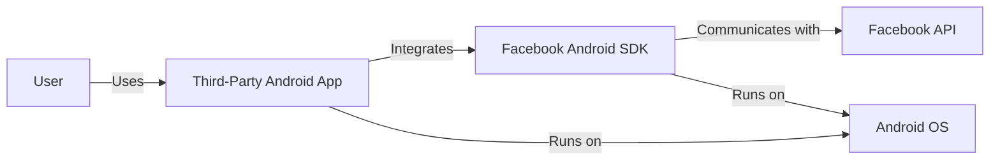
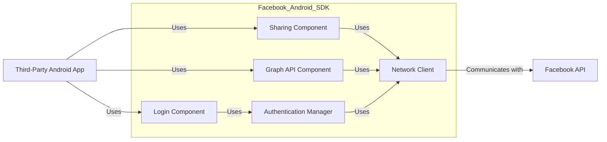
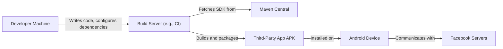
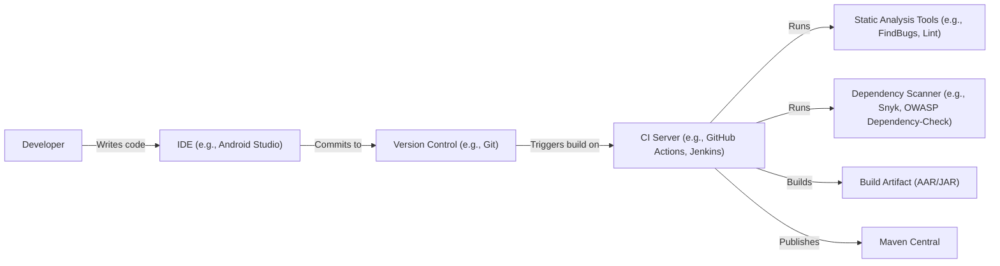

Okay, let's create a design document for the Facebook Android SDK.

# BUSINESS POSTURE

Business Priorities and Goals:

*   Enable developers to easily integrate Facebook functionalities into their Android applications.
*   Provide a consistent and reliable way for users to interact with Facebook through third-party apps.
*   Gather data on app usage and user engagement to improve Facebook services and advertising.
*   Expand Facebook's reach and user base through increased app integrations.
*   Maintain user privacy and data security while facilitating data sharing between apps and Facebook.
*   Provide tools for developers to monetize their apps through Facebook's advertising platform.

Most Important Business Risks:

*   Data breaches or privacy violations affecting user data shared through the SDK.
*   SDK vulnerabilities exploited to compromise user accounts or devices.
*   Negative publicity or regulatory scrutiny due to privacy concerns or security incidents.
*   SDK malfunctions or bugs disrupting the user experience or app functionality.
*   Incompatibility with new Android versions or devices, limiting the SDK's reach.
*   Competition from other social login providers or SDKs.

# SECURITY POSTURE

Existing Security Controls:

*   security control: OAuth 2.0 for authentication and authorization (described in Facebook Login documentation).
*   security control: Access token management with limited lifetimes and scopes (described in Facebook Login documentation).
*   security control: Code obfuscation and anti-tampering measures (part of the SDK build process).
*   security control: HTTPS for all communication with Facebook servers (enforced by the SDK).
*   security control: Regular security audits and penetration testing (mentioned in Facebook's security policies).
*   security control: Data validation and sanitization to prevent injection attacks (part of the SDK's internal implementation).
*   security control: Compliance with relevant data privacy regulations (e.g., GDPR, CCPA) (mentioned in Facebook's privacy policies).

Accepted Risks:

*   accepted risk: Reliance on the security of the underlying Android operating system and device.
*   accepted risk: Potential for developers to misuse the SDK or mishandle user data.
*   accepted risk: Limited control over the security practices of third-party apps using the SDK.
*   accepted risk: Vulnerabilities in third-party libraries used by the SDK.

Recommended Security Controls:

*   Implement Certificate Pinning: To mitigate risks of Man-in-the-Middle attacks.
*   Enhanced Input Validation: More rigorous input validation to prevent injection and other vulnerabilities.
*   Security-focused SDK Configuration Options: Provide developers with more granular control over security settings.
*   Dependency Security Scanning: Integrate automated scanning for vulnerabilities in third-party libraries.

Security Requirements:

*   Authentication:
    *   The SDK must use OAuth 2.0 for user authentication.
    *   Access tokens must have limited lifetimes and scopes.
    *   Refresh tokens must be securely stored and managed.
    *   Support for multi-factor authentication should be considered.
*   Authorization:
    *   The SDK must enforce granular permissions based on user consent.
    *   Access to user data must be restricted based on the principle of least privilege.
    *   Developers must be able to define custom permissions for their apps.
*   Input Validation:
    *   All input received from the host application or Facebook servers must be validated.
    *   Data received from Facebook servers should be treated as untrusted until validated.
    *   Input validation must prevent common web vulnerabilities (e.g., XSS, CSRF, SQL injection).
*   Cryptography:
    *   All communication with Facebook servers must use HTTPS.
    *   Sensitive data stored locally must be encrypted using strong encryption algorithms.
    *   Cryptographic keys must be securely managed.
    *   Certificate Pinning should be implemented.

# DESIGN

## C4 CONTEXT

Element Descriptions:

*   Element:
    *   Name: User
    *   Type: Person
    *   Description: A person who uses a third-party Android application that integrates with Facebook.
    *   Responsibilities: Interacts with the third-party app, grants permissions to access Facebook data.
    *   Security controls: Relies on the security of the third-party app and Facebook's authentication mechanisms.

*   Element:
    *   Name: Facebook Android SDK
    *   Type: Software System
    *   Description: A library that allows developers to integrate Facebook functionalities into their Android applications.
    *   Responsibilities: Provides APIs for login, sharing, Graph API access, and other Facebook features. Manages authentication tokens, handles communication with Facebook servers.
    *   Security controls: OAuth 2.0, access token management, HTTPS communication, code obfuscation, data validation.

*   Element:
    *   Name: Facebook API
    *   Type: Software System
    *   Description: The set of APIs provided by Facebook for developers to interact with the Facebook platform.
    *   Responsibilities: Provides access to Facebook data and functionality, enforces access control and rate limits.
    *   Security controls: OAuth 2.0, API keys, rate limiting, data validation, security audits.

*   Element:
    *   Name: Third-Party Android App
    *   Type: Software System
    *   Description: An Android application developed by a third-party that utilizes the Facebook Android SDK.
    *   Responsibilities: Provides specific functionality to the user, integrates with Facebook features using the SDK.
    *   Security controls: Relies on the security of the Facebook SDK and its own security implementation.

*   Element:
    *   Name: Android OS
    *   Type: Software System
    *   Description: The Android operating system on which the third-party app and the Facebook SDK run.
    *   Responsibilities: Provides the underlying platform and security features for running applications.
    *   Security controls: Sandboxing, permission system, security updates.

## C4 CONTAINER

Element Descriptions:

*   Element:
    *   Name: Third-Party Android App
    *   Type: Software System
    *   Description: An Android application developed by a third-party that utilizes the Facebook Android SDK.
    *   Responsibilities: Provides specific functionality to the user, integrates with Facebook features using the SDK components.
    *   Security controls: Relies on the security of the Facebook SDK and its own security implementation.

*   Element:
    *   Name: Login Component
    *   Type: Container
    *   Description: Handles Facebook Login functionality within the SDK.
    *   Responsibilities: Manages the login flow, obtains authorization codes, exchanges them for access tokens.
    *   Security controls: OAuth 2.0, secure storage of tokens.

*   Element:
    *   Name: Sharing Component
    *   Type: Container
    *   Description: Provides functionality for sharing content to Facebook.
    *   Responsibilities: Creates share dialogs, handles user input, posts content to Facebook.
    *   Security controls: Data validation, HTTPS communication.

*   Element:
    *   Name: Graph API Component
    *   Type: Container
    *   Description: Provides access to the Facebook Graph API.
    *   Responsibilities: Constructs API requests, parses API responses, handles errors.
    *   Security controls: Access token management, HTTPS communication, data validation.

*   Element:
    *   Name: Authentication Manager
    *   Type: Container
    *   Description: Manages authentication tokens and user sessions.
    *   Responsibilities: Stores and retrieves access tokens, refresh tokens, handles token expiration and renewal.
    *   Security controls: Secure storage of tokens, encryption.

*   Element:
    *   Name: Network Client
    *   Type: Container
    *   Description: Handles network communication with Facebook servers.
    *   Responsibilities: Sends HTTP requests, receives responses, handles network errors.
    *   Security controls: HTTPS communication, certificate pinning (recommended).

*   Element:
    *   Name: Facebook API
    *   Type: Software System
    *   Description: The set of APIs provided by Facebook.
    *   Responsibilities: Provides access to Facebook data and functionality.
    *   Security controls: OAuth 2.0, API keys, rate limiting, data validation, security audits.

## DEPLOYMENT

Possible Deployment Solutions:

1.  Direct download of the SDK from Facebook's developer website.
2.  Integration via Maven Central or JCenter (using Gradle or similar build tools).
3.  Inclusion as a pre-built library within a larger SDK or framework.

Chosen Solution (most common): Integration via Maven Central (Gradle).

Element Descriptions:

*   Element:
    *   Name: Developer Machine
    *   Type: Device
    *   Description: The developer's workstation where the Android application code is written and the Facebook SDK is integrated.
    *   Responsibilities: Code development, dependency management, build configuration.
    *   Security controls: Standard development environment security practices.

*   Element:
    *   Name: Build Server (e.g., CI)
    *   Type: Server
    *   Description: A server that automates the build process, including fetching dependencies, compiling code, and packaging the application.
    *   Responsibilities: Building the Android application, fetching the Facebook SDK from Maven Central.
    *   Security controls: Secure access to the build server, dependency scanning (recommended).

*   Element:
    *   Name: Maven Central
    *   Type: Repository
    *   Description: A public repository for Java libraries, including the Facebook Android SDK.
    *   Responsibilities: Hosting the Facebook SDK artifacts.
    *   Security controls: Repository security measures, checksum verification.

*   Element:
    *   Name: Third-Party App APK
    *   Type: Artifact
    *   Description: The packaged Android application containing the integrated Facebook SDK.
    *   Responsibilities: Running on the Android device, interacting with Facebook services.
    *   Security controls: Code signing, Android's application sandboxing.

*   Element:
    *   Name: Android Device
    *   Type: Device
    *   Description: The user's Android device where the third-party app is installed.
    *   Responsibilities: Running the application, interacting with the user.
    *   Security controls: Android OS security features, user permissions.

*   Element:
    *   Name: Facebook Servers
    *   Type: Server
    *   Description: Facebook's servers that handle API requests and provide data.
    *   Responsibilities: Processing API requests, managing user data, enforcing security policies.
    *   Security controls: Facebook's internal security infrastructure.

## BUILD

Build Process Description:

1.  Developers write code for the Facebook Android SDK using an IDE like Android Studio.
2.  Code is committed to a version control system like Git.
3.  Changes in the version control system trigger a build on a CI server (e.g., GitHub Actions, Jenkins).
4.  The CI server runs static analysis tools (e.g., FindBugs, Lint) to identify potential code quality and security issues.
5.  The CI server runs a dependency scanner (e.g., Snyk, OWASP Dependency-Check) to identify vulnerabilities in third-party libraries used by the SDK.
6.  The CI server builds the SDK, creating a build artifact (AAR or JAR file).
7.  The CI server publishes the build artifact to a repository like Maven Central.
8.  Security controls:
    *   Code reviews are performed before merging code changes.
    *   Static analysis tools are used to identify potential vulnerabilities.
    *   Dependency scanners are used to identify vulnerabilities in third-party libraries.
    *   The build process is automated to ensure consistency and repeatability.
    *   Access to the CI server and the repository is restricted.
    *   Build artifacts are signed to ensure their integrity.

# RISK ASSESSMENT

Critical Business Processes:

*   User authentication and authorization.
*   Data sharing between third-party apps and Facebook.
*   User privacy and data protection.
*   SDK functionality and reliability.
*   Developer experience and ease of integration.

Data Sensitivity:

*   Personally Identifiable Information (PII): Name, email address, profile picture, friend list, etc. (High sensitivity)
*   User-generated content: Posts, photos, videos, etc. (Variable sensitivity, depending on content and privacy settings)
*   App usage data: Analytics data, event logs, etc. (Medium sensitivity)
*   Device information: Device model, OS version, etc. (Low to medium sensitivity)
*   Access tokens and other credentials: (High sensitivity)

# QUESTIONS & ASSUMPTIONS

Questions:

*   What specific data points are collected by the SDK, and for what purposes?
*   What are the specific security measures in place to protect user data during transmission and storage?
*   What is the process for handling security vulnerabilities reported in the SDK?
*   What level of support is provided to developers for security-related issues?
*   Are there any specific compliance requirements (e.g., GDPR, CCPA) that the SDK must adhere to?
*   What mechanisms are in place to prevent abuse of the SDK by malicious developers?
*   What is Facebook's incident response plan for security breaches related to the SDK?

Assumptions:

*   BUSINESS POSTURE: Facebook prioritizes user privacy and data security, but also needs to collect data for advertising and service improvement.
*   SECURITY POSTURE: Facebook has a robust security program in place, but there are inherent risks associated with third-party integrations.
*   DESIGN: The SDK is designed to be modular and extensible, with clear separation of concerns between different components. The build process is automated and includes security checks. The deployment relies on standard Android development practices.