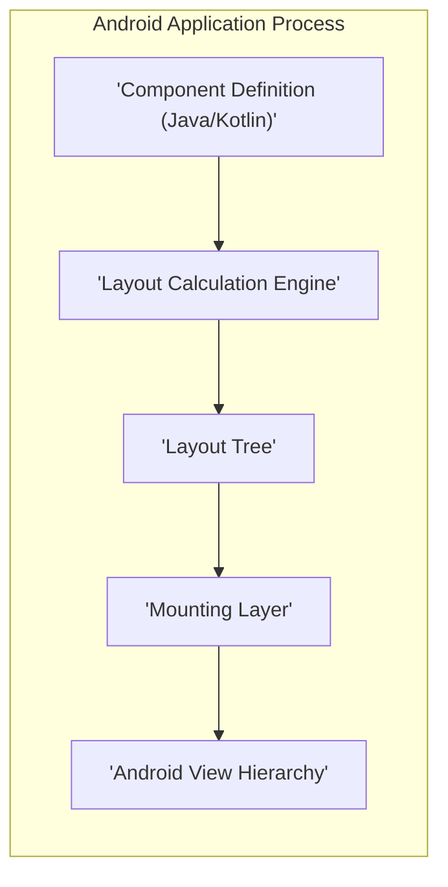
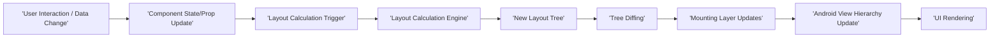

# Project Design Document: Litho - A Declarative UI Framework for Android

**Version:** 1.1
**Date:** October 26, 2023
**Author:** Gemini (AI Language Model)

## 1. Introduction

This document provides an enhanced design overview of Litho, a declarative UI framework for Android developed by Meta. This document aims to provide a more detailed and refined understanding of Litho's architecture, components, and data flow, specifically tailored for subsequent threat modeling activities. It builds upon the previous version by providing more granular explanations and highlighting areas of potential security concern.

## 2. Goals and Objectives

The primary goals of this design document are to:

*   Clearly and comprehensively articulate the architecture and key components of the Litho framework, with a focus on aspects relevant to security.
*   Describe the data flow and interactions within the framework in detail, highlighting potential points of vulnerability.
*   Identify potential areas of interest for security analysis and threat modeling, providing concrete examples where applicable.
*   Serve as a robust reference document for security engineers, developers, and anyone involved in assessing the security posture of applications utilizing Litho.

## 3. Target Audience

This document is intended for:

*   Security engineers responsible for performing threat modeling and security assessments of applications built using Litho.
*   Software architects and developers actively working with or considering the adoption of the Litho framework.
*   Quality assurance engineers involved in testing applications built with Litho.
*   Anyone seeking an in-depth understanding of Litho's internal workings, particularly from a security perspective.

## 4. Scope

This document covers the core architectural components, data flow mechanisms, and key interactions of the Litho framework as described in its public documentation and source code available at [https://github.com/facebook/litho](https://github.com/facebook/litho). The focus remains on the framework itself and its interactions with the underlying Android platform. Specific application implementations built using Litho are outside the scope of this document, although potential security implications for such applications are considered.

## 5. High-Level Architecture

Litho employs a component-based architecture to construct user interfaces. Its core principles center around declarative UI definitions, asynchronous layout calculations performed on background threads, and efficient, fine-grained view recycling and updates.

*   **Component Definition (Java/Kotlin):** Developers define UI elements as reusable, composable components using Java or Kotlin. These components declaratively describe the desired UI structure, properties (props), and dynamic state.
*   **Layout Calculation Engine:** This engine is responsible for taking the component definitions and asynchronously calculating the layout of the UI. This involves determining the size, position, and visibility of each UI element based on constraints and component properties. This process is heavily optimized for performance.
*   **Layout Tree:** The output of the layout calculation is an immutable, tree-like data structure representing the calculated layout of the UI. This tree contains precise information about the dimensions, positions, and types of the components to be rendered.
*   **Mounting Layer:** This layer acts as a bridge between the abstract Layout Tree and the concrete Android View hierarchy. It is responsible for efficiently creating, updating, and recycling Android Views based on the information in the Layout Tree.
*   **Android View Hierarchy:** The final output is the standard Android View hierarchy that is rendered by the Android operating system on the device screen. Litho aims to minimize direct manipulation of this hierarchy, relying on its mounting layer for efficient updates.

## 6. Detailed Design

### 6.1. Components

Components are the fundamental and reusable building blocks for constructing UIs in Litho. They encapsulate UI logic and presentation.

*   **Layout Components:** These components define the structural arrangement and layout of other components. Examples include `Column`, `Row`, `Stack`, `FlexboxLayoutSpec`, and custom layout components. They dictate how child components are positioned and sized.
*   **Drawables:** These components are responsible for rendering visual content on the screen. Examples include `Text`, `Image`, `Border`, and custom drawable components. They handle the actual drawing operations.
*   **State and Props:** Components manage their data through:
    *   **Props:** Immutable data passed down from parent components. Props are typically used to configure the appearance and behavior of a component.
    *   **State:** Internal, mutable data managed by the component itself. State changes trigger re-renders of the component.
*   **Event Handlers:** Components can define event handlers to respond to user interactions or system events. These handlers define the logic to be executed when specific events occur (e.g., `onClick`, `onLongClick`).
*   **Lifecycle Methods:** Components have a defined lifecycle with methods that are invoked at various stages of their existence. Key lifecycle methods include `onCreateLayout` (defines the component's layout), `onMount` (called when the component's view is attached), and `onUnmount` (called when the view is detached).
*   **Inter-Component Communication:** Components communicate primarily through props passed down the hierarchy and through event handlers that can trigger actions in parent components or external systems.

### 6.2. Layout Calculation

The layout calculation process is crucial for Litho's performance and is performed asynchronously.

*   **Declarative Definition Processing:** The engine takes the declarative component definitions as input.
*   **Measure Phase:** The engine recursively traverses the component tree, determining the size requirements (minimum and maximum width and height) of each component based on its props, state, and the constraints imposed by its parent.
*   **Layout Phase:** Based on the measured sizes and layout rules, the engine determines the precise position and dimensions of each component within its parent's bounds.
*   **Memoization and Caching:** Litho heavily utilizes memoization and caching to avoid redundant calculations. If the inputs to a layout calculation (props and state) haven't changed, the cached result is reused.
*   **Incremental Layout:**  Litho can perform incremental layout calculations, only recalculating the parts of the UI that have changed, further optimizing performance.

### 6.3. Mounting

The mounting process bridges the gap between the abstract Layout Tree and the concrete Android View system.

*   **View Management:** The mounting layer manages a pool of Android Views, efficiently reusing them to minimize object creation and garbage collection.
*   **Content Population:**  The mounting layer populates the properties of the Android Views based on the data in the Layout Tree (e.g., setting text on a `TextView`, setting the image source on an `ImageView`).
*   **Event Listener Attachment:** Event listeners defined in the components are attached to the corresponding Android Views during the mounting process.
*   **View Recycling and Updates:** When the UI needs to be updated, Litho compares the new Layout Tree with the previous one and only updates the necessary parts of the Android View hierarchy. Views that are no longer needed are recycled for later use.
*   **Mount State Management:** The mounting layer maintains the state of mounted views and their associated component data.

### 6.4. Data Flow

The data flow in Litho is primarily unidirectional, flowing from parent components to child components through props.

1. **Initiation of Change:** Data changes can originate from various sources, such as user interactions, network responses, or changes in application state managed by other parts of the application.
2. **State Updates:** When a component's state needs to change, it calls a state update method.
3. **Prop Changes:** Parent components can pass new props to their children, triggering a re-render.
4. **Layout Calculation Trigger:** Changes in state or props trigger the Layout Calculation Engine to recalculate the layout for the affected parts of the component tree.
5. **Layout Tree Generation:** The Layout Calculation Engine generates a new Layout Tree reflecting the updated UI structure and properties.
6. **Tree Diffing:** Litho compares the new Layout Tree with the previous one to identify the differences.
7. **Mounting Layer Updates:** The Mounting Layer receives the diff and efficiently updates the Android View hierarchy by creating, updating, or recycling views as needed.
8. **UI Rendering:** The Android system renders the updated View hierarchy on the screen.

## 7. Security Considerations (Preliminary)

This section outlines preliminary security considerations relevant to Litho's architecture. A comprehensive threat model will further analyze these and other potential risks.

*   **Data Injection Vulnerabilities via Props/State:**
    *   **Risk:** Malicious or untrusted data passed as props or state to components could lead to vulnerabilities if not properly sanitized or validated within the component's logic. This could result in UI manipulation, unexpected behavior, or even application crashes.
    *   **Example:** A component displaying user-provided text might be vulnerable to cross-site scripting (XSS) if the text is not properly escaped before being rendered in a `TextView`.
*   **Denial of Service (DoS) through Complex Layouts:**
    *   **Risk:**  Crafting extremely complex or deeply nested component hierarchies, especially with computationally expensive layout calculations, could lead to excessive resource consumption (CPU, memory) during layout calculation, potentially causing performance degradation or application crashes.
    *   **Example:** A dynamically generated UI with a very large number of nested components and intricate layout rules could overwhelm the layout calculation engine.
*   **Information Disclosure through Logging and Debugging:**
    *   **Risk:**  Accidental or intentional logging of sensitive information within component lifecycle methods, event handlers, or custom logic could expose this data. This is particularly concerning in production builds.
    *   **Example:** Logging user authentication tokens or API keys within a component's `onCreateLayout` method.
*   **Dependency Management Risks:**
    *   **Risk:** Litho, like any software project, relies on external libraries (dependencies). Vulnerabilities in these dependencies could potentially be exploited in applications using Litho.
    *   **Mitigation:** Regular dependency updates, security scanning of dependencies, and careful selection of third-party libraries are crucial.
*   **Event Handling Security:**
    *   **Risk:** Improper handling of user input within event handlers could lead to vulnerabilities.
    *   **Example:** If a component handles a URL from user input without proper validation, it could be used to launch arbitrary intents or navigate to malicious websites.
*   **Code Generation and Annotation Processing Security:**
    *   **Risk:**  Litho uses annotation processing to generate boilerplate code. Compromise of the annotation processors or build tools could potentially lead to the injection of malicious code during the build process.
    *   **Mitigation:** Secure build environments and verification of build artifacts are important.
*   **Accessibility Service Interactions:**
    *   **Risk:**  Components might interact with Android accessibility services. Malicious applications with accessibility permissions could potentially intercept or manipulate data intended for accessibility services, leading to information disclosure or unauthorized actions.
*   **Custom View Interactions:**
    *   **Risk:** If Litho components integrate with custom Android Views, vulnerabilities within those custom views could be exposed. Proper security review of custom view implementations is necessary.

## 8. Technologies Used

*   **Java/Kotlin:** The primary programming languages used for defining Litho components and application logic.
*   **Android SDK:** Provides the foundational platform and APIs for building Android applications, upon which Litho is built.
*   **Annotation Processing:**  A key mechanism used by Litho for generating boilerplate code, optimizing component creation, and enabling compile-time checks.
*   **Background Threading (e.g., using `AsyncTask` or `ExecutorService`):** Utilized for performing asynchronous layout calculations to avoid blocking the main UI thread.

## 9. Deployment Considerations

Litho is a library that is integrated directly into Android applications during the development and build process. There are no separate deployment steps specific to the framework itself. Security considerations during deployment primarily focus on the application level:

*   **Code Obfuscation:**  Techniques like ProGuard or R8 should be used to obfuscate the application code, making it more difficult for attackers to reverse engineer.
*   **Secure Key Management:** If the application uses any cryptographic keys, they should be stored securely using the Android Keystore system.
*   **Secure Communication:**  Ensure that any network communication performed by the application is done over secure protocols (HTTPS).
*   **Regular Security Updates:** Keep the Litho library and other dependencies updated to patch any known vulnerabilities.
*   **Application Signing:** Properly sign the application package (APK) before distribution to ensure its integrity and authenticity.

## 10. Future Considerations

This design document reflects the current understanding of Litho's architecture. Future updates may be necessary to incorporate changes in the framework, the introduction of new features, or deeper insights gained from ongoing security analysis and threat modeling activities. Areas for future consideration include:

*   Detailed analysis of specific component implementations and their potential vulnerabilities.
*   Evaluation of the security implications of new features introduced in future Litho releases.
*   Integration with other Android Jetpack libraries and their potential security interactions.

## 11. Glossary

*   **Component:** A reusable, self-contained building block of a Litho UI, encapsulating its structure, behavior, and presentation.
*   **Props:** Immutable data passed to a component from its parent, used to configure its behavior and appearance.
*   **State:** Internal, mutable data managed by a component that can change over time and trigger re-renders.
*   **Layout Tree:** An immutable, tree-like data structure representing the calculated layout of the UI.
*   **Mounting:** The process of translating the abstract Layout Tree into concrete Android Views.
*   **Layout Calculation Engine:** The core part of Litho responsible for asynchronously calculating the layout of the UI.
*   **Declarative UI:** A programming paradigm where the UI is described in terms of its desired state rather than the sequence of steps to create it.
