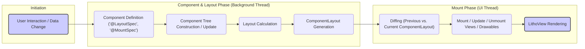

# Project Design Document: Litho UI Framework - Improved

**Version:** 1.1
**Date:** October 26, 2023
**Author:** AI Software Architect

## 1. Introduction

This document provides an enhanced architectural design overview of the Litho UI framework, developed by Facebook and available on GitHub at [https://github.com/facebook/litho](https://github.com/facebook/litho). This improved version aims to offer a more granular understanding of Litho's internal workings, data flow intricacies, and potential security considerations, making it a more effective foundation for subsequent threat modeling activities.

## 2. Goals and Objectives

The primary goals of the Litho framework are to:

* **Maximize UI Rendering Performance:** Achieve highly performant and fluid user interfaces, especially when dealing with complex and frequently updated UI structures.
* **Enhance Developer Productivity:** Provide a declarative and intuitive API that simplifies UI development, reduces boilerplate, and improves code maintainability.
* **Promote Component Reusability and Composition:** Facilitate the creation of modular and reusable UI building blocks that can be easily composed to form complex UIs.
* **Enable Fine-Grained Control over UI Updates:** Allow for precise and efficient updates to only the necessary parts of the UI, minimizing unnecessary redraws and improving performance.

## 3. Architectural Overview

Litho employs a declarative approach to UI development on Android, shifting computationally intensive tasks like layout calculations to background threads. This architecture revolves around a component-based model and a sophisticated rendering pipeline.

### 3.1. Key Architectural Principles

* **Declarative UI Definition:** UI structures are described as a function of the component's state, promoting predictability and simplifying reasoning about the UI.
* **Immutable Data Flow:** Components and their properties are immutable, ensuring data consistency and simplifying state management, thus reducing the potential for side effects.
* **Asynchronous Layout and Rendering:**  The heavy lifting of layout calculation is performed asynchronously, freeing the main UI thread for rendering and user interactions.
* **Fine-Grained UI Updates through Diffing:**  Litho employs a diffing algorithm to identify minimal changes required to update the UI, leading to efficient updates and improved performance.
* **Component Composition:** Complex UIs are built by composing smaller, independent components, fostering code reusability and maintainability.

### 3.2. Core Components

* **Components:**
    * The fundamental building blocks of a Litho UI.
    * Represent distinct, self-contained units of UI logic and presentation.
    * Defined using classes annotated with `@LayoutSpec` or `@MountSpec`.
    * Properties are defined using `@Prop`, which are immutable inputs to the component.
    * Internal state is managed using `@State`, changes to which trigger re-renders.
    * User interactions are handled via methods annotated with `@OnEvent`.
    * Lifecycle methods for managing resources are defined within the component spec.
* **Layout Specs (`@LayoutSpec`):**
    * Define the structure and arrangement of child components in a declarative manner.
    * Use a builder pattern to specify the hierarchy and layout constraints of child components.
    * Generate an immutable `ComponentLayout` object representing the calculated layout.
    * Layout calculations are performed on background threads.
* **Mount Specs (`@MountSpec`):**
    * Responsible for creating and managing the underlying Android `View` or `Drawable` instances that represent the component on the screen.
    * Handle the lifecycle of these "mountable" objects (creation, binding data, recycling).
    * Interact directly with the Android UI toolkit to render the component.
    * Methods annotated with `@OnCreateMountContent`, `@OnMount`, `@OnBind`, `@OnUnmount`, and `@OnPrepare` manage the mountable object's lifecycle.
* **Component Tree:**
    * A hierarchical representation of the UI, composed of interconnected `Component` instances.
    * Built based on the structure defined in the root `LayoutSpec`.
    * Serves as the blueprint for the UI that Litho manages.
* **ComponentLayout:**
    * An immutable data structure that represents the calculated layout of a component and its children.
    * Contains information about the dimensions, position, and other layout properties of each element in the subtree.
    * Generated by the layout calculation process performed by `LayoutSpec`s.
* **Layout State:**
    * Holds the calculated `ComponentLayout` for the entire component tree.
    * Used during the mount phase to determine which views need to be created, updated, or removed.
* **Working Range:**
    * An optimization technique that pre-calculates and pre-mounts components that are likely to become visible soon (e.g., in a scrolling list).
    * Improves perceived scrolling performance by reducing the work needed when items scroll into view.
* **Event Handlers (`@OnEvent`):**
    * Methods within a component that define how it responds to specific events (e.g., clicks, touches).
    * Triggered by user interactions or other system events.
    * Can update the component's state or trigger other actions.
* **State Management (`@State`, `@OnUpdateState`):**
    * Provides a mechanism for managing the internal, mutable state of a component.
    * Changes to state variables annotated with `@State` automatically trigger a re-render of the component.
    * `@OnUpdateState` methods allow for controlled updates to the component's state.
* **Sections (for Collections):**
    * A higher-level abstraction for efficiently managing and displaying large, dynamic lists or grids of data.
    * Handles data fetching, efficient updates, and recycling of items in the collection.
    * Uses concepts like `DataDiff` to calculate minimal updates to the displayed data.
    * Leverages `GroupTree` to manage the hierarchical structure of data in the collection.
* **Diffing Algorithm:**
    * A core part of Litho's rendering pipeline.
    * Compares the previous and current `ComponentLayout` to identify the precise set of changes needed to update the UI.
    * Minimizes the amount of work required during the mount phase, leading to performance gains.
* **LithoView:**
    * The Android `View` that acts as the host for the Litho-managed UI.
    * Responsible for initiating the layout and mount processes.
    * Receives the final rendered output from the Litho framework.

## 4. Data Flow

The data flow within a Litho application can be broken down into distinct phases, ensuring efficient and asynchronous UI updates:

**Detailed Breakdown:**

* **User Interaction / Data Change:** An event occurs, such as a user clicking a button, new data arriving from a network request, or a timer expiring, triggering the need for a UI update.
* **Component Definition:** Developers define the structure and behavior of UI elements using `@LayoutSpec` and `@MountSpec` annotations. These definitions act as blueprints for the UI.
* **Component Tree Construction / Update:** Based on the current application state and component definitions, Litho constructs or updates the component tree. This involves creating new component instances or reusing existing ones.
* **Layout Calculation (Background Thread):** The core of Litho's performance strategy. The layout engine traverses the component tree and calculates the size and position of each component. This computationally intensive task is performed on a background thread, keeping the UI thread responsive.
* **ComponentLayout Generation:** The layout calculation process produces an immutable `ComponentLayout` object. This object represents the final layout of the UI and serves as input for the mount phase.
* **Diffing (Previous vs. Current ComponentLayout):** Litho compares the newly generated `ComponentLayout` with the previous one (if it exists). This diffing process identifies the minimal set of changes required to update the UI.
* **Mount / Update / Unmount Views / Drawables (UI Thread):** On the UI thread, Litho efficiently performs the necessary operations to synchronize the Android `View` hierarchy with the desired UI state. This involves:
    * **Mounting:** Creating new `View` or `Drawable` instances for newly added components.
    * **Updating:** Modifying the properties of existing `View` or `Drawable` instances based on changes identified by the diffing process.
    * **Unmounting:** Removing `View` or `Drawable` instances that are no longer needed.
* **LithoView Rendering:** The `LithoView` receives the updated `View` hierarchy and renders it on the screen, reflecting the changes.

## 5. Deployment Model

Litho is deployed as a library integrated directly into Android applications. Developers add the necessary Litho dependencies to their application's `build.gradle` file. The framework operates entirely within the application's process on the user's device. There are no separate server-side components or services required for the core Litho framework to function.

## 6. Dependencies

Litho relies on several key dependencies:

* **Android SDK:**  Litho is built upon and interacts directly with the standard Android framework APIs, including `View`, `Context`, `Drawable`, and others.
* **Fresco:** An image loading library developed by Facebook (optional, but commonly used in conjunction with Litho for efficient image handling).
* **SoLoader:** A library for efficiently loading native libraries on Android (used internally by Litho).
* **Infer Annotations:** Used for static analysis and nullability checks within the Litho codebase.
* **Java or Kotlin:** The primary programming languages used for developing Litho components and integrating the framework into Android applications.

## 7. Security Considerations (More Specific)

While Litho primarily addresses UI concerns, security must be considered when developing applications using it:

* **Input Sanitization in `@Prop`:** Data passed into components via `@Prop` should be carefully sanitized to prevent potential injection vulnerabilities, especially if the data is used to render dynamic content (e.g., within a `TextView` or `WebView`). Failure to do so could lead to cross-site scripting (XSS) if displaying web content.
* **State Management Security:** Ensure that state updates are handled securely and do not introduce race conditions or allow for unauthorized modification of sensitive data. Avoid exposing sensitive information directly in the component's state if it's not necessary for rendering.
* **Event Handling Security:**  Validate data received in `@OnEvent` handlers to prevent malicious input from triggering unintended actions or exposing vulnerabilities. Be cautious about actions performed in event handlers, especially those that interact with external systems or sensitive data.
* **Custom Mount Specs and Resource Management:** If developers create custom `MountSpec`s that manage resources (e.g., bitmaps, network connections), ensure proper resource allocation and deallocation to prevent leaks or denial-of-service scenarios. Securely handle any sensitive data accessed or manipulated within custom mount specs.
* **Deep Link and Intent Handling within Components:** If Litho components handle deep links or intents, rigorous validation and sanitization of the incoming URI or intent data are crucial to prevent malicious redirection or exploitation of application functionality.
* **Third-Party Library Vulnerabilities:** Regularly review and update Litho's dependencies (like Fresco) to patch any known security vulnerabilities. Be aware of the potential impact of vulnerabilities in these libraries on the Litho-based application.
* **Data Binding and Exposure:** Be mindful of the data being bound to UI components. Avoid inadvertently exposing sensitive information in the UI that should not be visible to the user.
* **Asynchronous Operations and Timing Issues:**  While Litho's asynchronous nature improves performance, it can also introduce potential timing issues or race conditions if not handled carefully, particularly around state updates and UI rendering. Ensure proper synchronization mechanisms are in place when dealing with shared state.

## 8. Threat Modeling Focus Areas (More Granular)

For effective threat modeling of Litho-based applications, consider these specific areas:

* **`@Prop` Injection Vulnerabilities:** Analyze how data passed through `@Prop` is used and whether it's properly sanitized to prevent injection attacks (e.g., HTML injection leading to XSS).
* **State Mutation and Race Conditions:** Examine how component state is updated and whether there are potential race conditions or unintended state mutations that could lead to security flaws.
* **`@OnEvent` Handler Exploitation:** Investigate the actions performed within `@OnEvent` handlers and whether they are vulnerable to malicious input or can be abused to perform unauthorized actions.
* **Custom `MountSpec` Security:** If custom `MountSpec`s are used, assess their resource management practices and whether they handle sensitive data securely.
* **Deep Link/Intent Handling Vulnerabilities in Components:** Analyze how Litho components handle deep links and intents, focusing on potential vulnerabilities related to URI parsing and intent redirection.
* **Dependency Chain Vulnerabilities:** Evaluate the security posture of Litho's dependencies (e.g., Fresco) and how potential vulnerabilities in these libraries could impact the application.
* **Data Exposure through UI Binding:** Review the data being bound to UI components and identify any instances where sensitive information might be unintentionally exposed.
* **Asynchronous State Management Issues:** Analyze the potential for timing issues or race conditions related to asynchronous state updates and their impact on UI security and integrity.

## 9. Future Considerations

Potential future developments in Litho that could introduce new security considerations include:

* **Deeper Integration with Jetpack Compose:**  As Litho and Compose potentially converge, understanding the security implications of their interoperability will be crucial.
* **New Component APIs and Features:** New APIs might introduce new attack surfaces or require different security considerations.
* **Enhanced Support for Web Content:** If Litho expands its capabilities for rendering web content, addressing web-specific security threats (like advanced XSS) will be essential.

This enhanced design document provides a more detailed and nuanced understanding of the Litho UI framework, specifically tailored for effective threat modeling. By focusing on the granular aspects of its architecture and data flow, security professionals can more accurately identify and mitigate potential vulnerabilities in applications built with Litho.