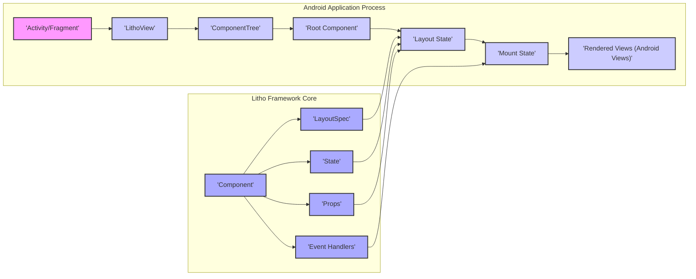

# Project Design Document: Litho - A Declarative UI Framework for Android

**Version:** 1.1
**Date:** October 26, 2023
**Author:** AI Software Architect

## 1. Introduction

This document provides a detailed architectural design of the Litho framework, a declarative UI framework for Android developed by Facebook. This document is specifically crafted to facilitate effective threat modeling by providing a comprehensive understanding of Litho's components, their interactions, and data flow.

### 1.1. Purpose

The primary purpose of this document is to clearly outline the design and architecture of the Litho framework, enabling security analysts to perform thorough threat modeling. It serves as a definitive reference for understanding the system's boundaries, components, data flows, and potential attack surfaces.

### 1.2. Scope

This document focuses on the core architectural elements and fundamental concepts of the Litho framework itself. It details the framework's internal mechanisms and its interactions with the underlying Android platform. The scope is limited to the framework and does not cover the specifics of individual applications built using Litho, although it provides the necessary context for analyzing such applications.

### 1.3. Goals

*   Clearly define the major components within the Litho framework.
*   Illustrate the interactions and data flow pathways between these components.
*   Identify key boundaries and delineate trust zones within the framework's architecture.
*   Provide a robust foundation for identifying potential security vulnerabilities, attack vectors, and areas requiring further security scrutiny.

## 2. Overview of Litho

Litho is a declarative Android UI framework designed for building high-performance and efficient user interfaces. It allows developers to describe UI components in a declarative manner, focusing on the desired UI structure and appearance rather than the imperative steps for rendering. Litho handles the complexities of view creation, recycling, and layout optimization behind the scenes. This separation of concerns can contribute to more maintainable and potentially more secure code.

Key concepts within Litho include:

*   **Components:** The fundamental, reusable building blocks of a Litho UI. They encapsulate UI logic and rendering instructions for individual elements or compositions.
*   **LayoutSpecs:** Declarative specifications defining the layout structure of components and their children.
*   **State:** Manages mutable data internal to a specific component instance, triggering re-renders upon changes.
*   **Props:** Immutable input data passed to a component from its parent, influencing its rendering.
*   **Event Handlers:** Define methods within components to respond to user interactions and other events.
*   **Mount State:** Manages the lifecycle of the underlying Android `View` instances associated with components, optimizing view creation and recycling.
*   **Working Range:** An optimization technique that focuses rendering efforts on components that are currently visible or about to become visible, improving performance.
*   **LithoView:** A custom Android `View` that serves as the root container for the Litho component hierarchy within the standard Android view hierarchy.

## 3. Architectural Design

The following diagram illustrates the high-level architecture of the Litho framework and its interaction with the Android application:

### 3.1. Key Components

*   **Activity/Fragment:** Standard Android UI components that serve as the entry points and host the `LithoView`. These are part of the application's code and represent a boundary where application-specific logic interacts with the Litho framework.
*   **LithoView:** The central entry point into the Litho framework within the Android view hierarchy. It manages the `ComponentTree` and orchestrates the rendering process. It acts as a bridge between the Android view system and the Litho component model.
*   **ComponentTree:**  A representation of the hierarchical structure of Litho components. It manages the lifecycle of components and coordinates layout calculations and updates. This is a core internal component of the Litho framework.
*   **Root Component:** The top-level component in the `ComponentTree`, defining the overall structure of the UI displayed by the `LithoView`. It serves as the starting point for the rendering process.
*   **Component:** The fundamental building block of a Litho UI. Components encapsulate UI logic, rendering instructions, and can manage their own state. They receive input through `Props` and can emit events through `Event Handlers`.
*   **LayoutSpec:**  A declarative specification written by developers to define the layout of a component and its children. It dictates how components are arranged and sized. Incorrectly defined `LayoutSpecs` could potentially lead to unexpected UI behavior.
*   **State:** Internal, mutable data managed by a component. Changes to `State` trigger re-renders of the component. Improper state management or exposure could lead to vulnerabilities.
*   **Props:** Immutable data passed to a component from its parent. `Props` influence the component's rendering. Untrusted or unsanitized data passed as `Props` could be a potential attack vector.
*   **Event Handlers:** Methods defined within a component to handle user interactions or other events. These handlers can update the component's `State` or trigger other actions. Vulnerabilities in event handlers could allow malicious actions.
*   **Layout State:** An intermediate, optimized representation of the calculated layout of the component tree. This state is generated by Litho and used for efficient view mounting.
*   **Mount State:** Manages the lifecycle of the underlying Android `View` instances that are created and updated based on the `Layout State`. It handles view recycling and binding, crucial for performance.
*   **Rendered Views (Android Views):** The actual Android `View` objects that are displayed on the screen. These are managed by the `Mount State` and are the final output of the Litho rendering process.

### 3.2. Interactions and Data Flow

The typical data flow within a Litho-powered UI follows these steps:

1. **Initialization:** An `Activity` or `Fragment` creates a `LithoView` and sets a root component, initiating the Litho rendering process.
2. **Layout Calculation:** When the root component or its `State`/`Props` change, Litho calculates the layout of the component tree based on the `LayoutSpec` of each component. This process is optimized for performance and can occur on a background thread.
3. **Mounting:** Based on the calculated `Layout State`, Litho's `Mount State` determines which Android `View` instances need to be created, updated, or recycled. This step involves mapping Litho components to actual Android views.
4. **Rendering:** The necessary updates are applied to the underlying Android `View` instances, and they are displayed on the screen. This is the final step where the UI becomes visible to the user.
5. **Event Handling:** User interactions on the rendered views trigger event listeners, which in turn invoke the corresponding `Event Handlers` defined in the associated Litho components. These handlers can modify the component's `State`, triggering a new layout calculation and rendering cycle.

Data flows primarily through:

*   **Props:** Data is passed unidirectionally down the component tree from parent to child components. This enforces a clear data flow and helps in managing component dependencies.
*   **State:** Internal data within a component that can be modified by the component itself, often in response to user interactions or other events. State changes trigger re-renders.
*   **Event Handlers:** User interactions or system events trigger callbacks to `Event Handlers`, which can then update the component's `State` or invoke other application logic.

### 3.3. Boundaries and Trust Zones

*   **Application Code Boundary:** This encompasses the code written by the application developer, including the definitions of components, `LayoutSpecs`, and `Event Handlers`. This is the primary area where vulnerabilities related to business logic, data handling, and improper use of the Litho framework can occur. Input validation and secure data handling within application-defined components are crucial.
*   **Litho Framework Boundary:** This includes the core Litho framework code responsible for layout calculation, view management, and rendering. While generally considered a trusted zone, vulnerabilities within the framework itself are possible and could have widespread impact on applications using it. Security audits and updates of the Litho framework are important.
*   **Android Platform Boundary:** The underlying Android operating system and UI toolkit. Litho relies on the Android platform for rendering and event handling. Security vulnerabilities in the Android platform could potentially impact Litho applications. Applications should be aware of and mitigate potential risks arising from the underlying platform.
*   **External Libraries Boundary:** Litho might depend on other libraries (e.g., for image loading, networking). These dependencies introduce additional trust boundaries and potential vulnerabilities. Applications should carefully manage and vet their dependencies.

## 4. Security Considerations for Threat Modeling

This section outlines potential security considerations and areas of focus for threat modeling the Litho framework and applications built upon it:

*   **Input Validation and Sanitization (Props):**  Untrusted or malicious data passed as `Props` to components could lead to various vulnerabilities, such as cross-site scripting (XSS) if the data is used to render web content within a WebView, or unexpected UI behavior. Thorough input validation and sanitization within component logic are essential.
*   **State Management Vulnerabilities:** Improper management of component `State` could lead to inconsistent UI states, information disclosure, or even application crashes. Ensure that state updates are handled securely and predictably.
*   **Event Handler Exploits:**  Vulnerabilities in `Event Handlers` could allow attackers to trigger unintended actions or bypass security checks. Ensure that event handlers are properly secured and do not expose sensitive functionality without proper authorization.
*   **Denial of Service (DoS) through Resource Exhaustion:**  Crafted input or state changes could potentially lead to excessive layout calculations or rendering operations, causing performance degradation or application crashes. Implement mechanisms to prevent resource exhaustion.
*   **Information Disclosure through UI:**  Sensitive information might be unintentionally exposed through component rendering logic or error messages displayed in the UI. Carefully review UI elements to prevent accidental disclosure of sensitive data.
*   **Dependency Vulnerabilities:**  Vulnerabilities in external libraries used by Litho or by components within the application (e.g., image loading libraries like Fresco) could be exploited. Regularly update dependencies and be aware of known vulnerabilities.
*   **Injection Attacks (Limited by Declarative Nature):** While Litho's declarative nature reduces the risk of traditional code injection vulnerabilities, developers should still be cautious about using user-provided data directly in layout specifications or rendering logic.
*   **Permissions and Data Access:** Components might interact with Android APIs that require permissions. Ensure that these interactions are handled securely and that the application follows the principle of least privilege.
*   **Side-Channel Attacks:** Consider potential side-channel attacks where information can be inferred through UI rendering timings or resource consumption patterns.

## 5. Dependencies

Litho relies on the following key dependencies:

*   **Android SDK:** Provides access to the core Android APIs and tools. Security vulnerabilities in the Android SDK can impact Litho.
*   **Support/AndroidX Libraries:** Offer compatibility and access to newer Android features. Ensure these libraries are up-to-date to mitigate known vulnerabilities.
*   **Annotation Processors:** Used for generating boilerplate code, improving developer productivity. While generally not a direct security risk, vulnerabilities in annotation processors could potentially lead to build-time issues.
*   **Fresco (Optional):** A powerful image loading library often used with Litho. Fresco itself has its own set of potential vulnerabilities that need to be considered.
*   **Other potential libraries:** Depending on the specific features used in the application's components (e.g., networking libraries, data persistence libraries). Each dependency introduces its own security considerations.

## 6. Deployment

Litho is deployed as a library that is integrated into Android applications. The framework code resides within the application's process and executes within the application's sandbox.

## 7. Future Considerations

This design document reflects the current architecture of Litho. Future enhancements or changes to the framework could introduce new components, interactions, and potentially new security considerations. Future threat modeling efforts should consider:

*   New APIs or features introduced in future Litho versions.
*   Changes in the underlying Android platform that might impact Litho's security.
*   The adoption of new dependency libraries.

This improved document provides a more detailed and security-focused overview of the Litho framework's architecture, making it a more effective resource for threat modeling activities. The explicit mention of potential vulnerabilities and attack vectors should guide security analysts in their assessment of Litho-based applications.