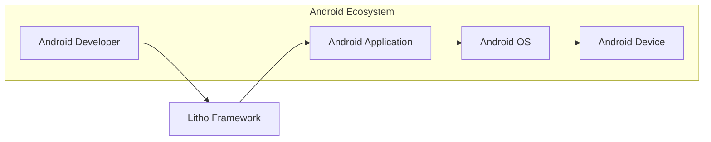
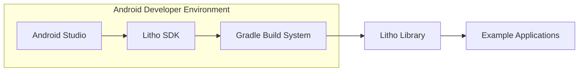

# BUSINESS POSTURE

The Litho project aims to provide a declarative UI framework for building efficient Android applications. It focuses on performance, developer productivity, and scalability for complex user interfaces.

Business Priorities and Goals:
- Enhance Android application performance, leading to improved user experience and engagement.
- Increase developer productivity by providing a more efficient and declarative way to build UIs.
- Enable the creation of complex and scalable user interfaces for Android applications.
- Foster a community around Litho to drive innovation and adoption.
- Potentially reduce development costs and time-to-market for Android applications.

Business Risks:
- Adoption risk: Developers may not adopt Litho if it's perceived as too complex or not mature enough.
- Maintenance risk:  Maintaining an open-source framework requires ongoing effort and resources.
- Security risk: Vulnerabilities in the framework could be exploited in applications using Litho.
- Dependency risk: Applications using Litho become dependent on the framework and its updates.
- Community risk: Reliance on community contributions can introduce instability or security issues if not properly managed.

# SECURITY POSTURE

Existing Security Controls:
- security control: Code reviews are likely conducted for contributions to the open-source project. (Location: GitHub Pull Request process)
- security control: Static analysis tools might be used as part of the development process. (Location: Internal Facebook development pipelines, potentially GitHub Actions)
- security control: Open-source nature allows for community scrutiny and vulnerability reporting. (Location: GitHub repository, issue tracker)

Accepted Risks:
- accepted risk:  Vulnerabilities might be discovered in the framework after release due to the complexity of software development.
- accepted risk:  Community contributions may introduce unforeseen security issues if not thoroughly vetted.
- accepted risk:  Dependency on third-party libraries could introduce vulnerabilities.

Recommended Security Controls:
- recommended security control: Implement automated security scanning (SAST/DAST) in the CI/CD pipeline for Litho framework code.
- recommended security control: Establish a clear vulnerability disclosure and response process for Litho.
- recommended security control:  Perform regular security audits of the Litho framework code and dependencies.
- recommended security control:  Provide security guidelines and best practices for developers using Litho in their applications.
- recommended security control: Implement dependency scanning and management to track and mitigate vulnerabilities in third-party libraries.

Security Requirements:
- Authentication: Not directly applicable to Litho framework itself, as it's a UI library. Authentication is handled by the applications using Litho.
- Authorization: Not directly applicable to Litho framework itself. Authorization logic resides within the applications using Litho.
- Input Validation: Litho framework should perform input validation for any external data it processes, although it primarily deals with UI component definitions. Input validation is more relevant in the applications consuming Litho, especially when handling user inputs and data binding.
- Cryptography: Cryptography is not a core requirement for a UI framework like Litho. If cryptography is used within Litho for specific features (e.g., data encryption at rest or in transit for internal purposes), it should adhere to security best practices. Applications using Litho might require cryptography, but that's outside the scope of the framework itself.

# DESIGN

## C4 CONTEXT



Context Diagram Elements:

- Element:
  - Name: Android Developer
  - Type: Person
  - Description: Software developers who build Android applications.
  - Responsibilities: Develop Android applications using Litho framework. Integrate Litho into their projects.
  - Security controls: Secure development practices, code reviews, access control to development environments.

- Element:
  - Name: Litho Framework
  - Type: Software System
  - Description: Declarative UI framework for building efficient Android user interfaces.
  - Responsibilities: Provide APIs and components for building Android UIs. Manage UI rendering and updates.
  - Security controls: Input validation within the framework (if applicable), secure coding practices, vulnerability scanning, dependency management.

- Element:
  - Name: Android Application
  - Type: Software System
  - Description: Mobile applications built using the Android SDK and potentially Litho framework.
  - Responsibilities: Provide user-facing functionality. Utilize Litho framework for UI rendering. Handle user data and application logic.
  - Security controls: Application-level security controls (authentication, authorization, input validation, data protection), secure integration with Litho framework.

- Element:
  - Name: Android OS
  - Type: Software System
  - Description: Android operating system running on mobile devices.
  - Responsibilities: Provide runtime environment for Android applications. Manage system resources and security.
  - Security controls: Operating system security features (permissions, sandboxing, security updates).

- Element:
  - Name: Android Device
  - Type: Physical Device
  - Description: Physical mobile devices running the Android OS and Android applications.
  - Responsibilities: Execute Android applications. Provide user interface and hardware resources.
  - Security controls: Device security features (device encryption, screen lock, biometric authentication).

## C4 CONTAINER



Container Diagram Elements:

- Element:
  - Name: Android Studio
  - Type: Development Tool
  - Description: Integrated Development Environment (IDE) used by Android developers.
  - Responsibilities: Code editing, debugging, building Android applications. Integration with Litho SDK.
  - Security controls: Access control to development environment, secure coding practices by developers.

- Element:
  - Name: Litho SDK
  - Type: Library/SDK
  - Description: Software Development Kit providing tools and libraries for developing with Litho.
  - Responsibilities: Provide APIs, components, and build tools for Litho development.
  - Security controls: Secure packaging and distribution of SDK, vulnerability scanning of SDK components.

- Element:
  - Name: Gradle Build System
  - Type: Build Tool
  - Description: Build automation tool used for building Android applications and Litho library.
  - Responsibilities: Compile code, manage dependencies, package Litho library and applications.
  - Security controls: Dependency management, build process security, secure configuration of build scripts.

- Element:
  - Name: Litho Library
  - Type: Library
  - Description: Compiled and packaged Litho framework library (e.g., AAR file for Android).
  - Responsibilities: Provide runtime components for Litho framework to Android applications.
  - Security controls: Code signing, vulnerability scanning of compiled library, secure distribution channels (e.g., Maven Central).

- Element:
  - Name: Example Applications
  - Type: Application
  - Description: Sample Android applications demonstrating the usage of Litho framework.
  - Responsibilities: Showcase Litho features and provide examples for developers.
  - Security controls: Secure coding practices in example applications, vulnerability scanning of example code.

## DEPLOYMENT

Deployment Architecture: Library Integration

```mermaid
flowchart LR
    subgraph "Android Device"
        A[Android OS]
        B[Android Application Process]
        C[Litho Library (within App)]
    end

    B --> C
    A --> B
```

Deployment Diagram Elements:

- Element:
  - Name: Android OS
  - Type: Operating System
  - Description: Android operating system running on the target device.
  - Responsibilities: Provide runtime environment for Android applications. Manage system resources and security.
  - Security controls: Operating system security features (permissions, sandboxing, security updates).

- Element:
  - Name: Android Application Process
  - Type: Process
  - Description: Process in which the Android application is executed on the device.
  - Responsibilities: Run the application code, including Litho framework components. Manage application resources.
  - Security controls: Application sandboxing, process isolation, application-level security controls.

- Element:
  - Name: Litho Library (within App)
  - Type: Library Instance
  - Description: Instance of the Litho library loaded within the Android application process.
  - Responsibilities: Provide UI rendering and component management within the application.
  - Security controls: Inherits security controls of the Android application process and Android OS. Secure coding practices within the Litho library itself.

## BUILD

Build Process: GitHub Actions and Gradle

```mermaid
flowchart LR
    A[Developer] --> B{Git Repository}
    B --> C[GitHub Actions]
    C --> D[Gradle Build]
    D --> E[Artifacts (AAR, JAR)]
```

Build Process Description:

1. Developer: Developers write code for Litho framework and commit changes to the Git repository.
2. Git Repository (GitHub): Source code repository for Litho project, hosted on GitHub.
3. GitHub Actions: CI/CD platform used for automating the build, test, and release process.
4. Gradle Build: Gradle build system is used to compile the Litho source code, manage dependencies, and package the library.
5. Artifacts (AAR, JAR): Build artifacts produced by the Gradle build process, including Android Archive (AAR) files and Java Archive (JAR) files for Litho library.

Build Process Security Controls:

- security control: Secure access control to the Git repository (GitHub). (Location: GitHub repository settings)
- security control: Code review process for all code changes submitted to the repository. (Location: GitHub Pull Request process)
- security control: Automated build process using GitHub Actions to ensure consistency and repeatability. (Location: GitHub Actions workflows)
- security control: Dependency scanning during the build process to identify and manage vulnerable dependencies. (Location: GitHub Actions workflows, Gradle dependency management)
- security control: Static analysis security testing (SAST) integrated into the build pipeline to detect potential vulnerabilities in the code. (Location: GitHub Actions workflows, SAST tools integration)
- security control: Build artifacts are signed to ensure integrity and authenticity. (Location: Gradle build scripts, code signing mechanisms)
- security control: Access control to build artifacts and release channels. (Location: Artifact repository access controls, release management processes)

# RISK ASSESSMENT

Critical Business Processes:
- Development and maintenance of the Litho framework itself.
- Adoption and usage of Litho by Android developers to build applications.
- Performance and stability of Android applications built with Litho.
- Community engagement and contributions to the Litho project.

Data to Protect:
- Source code of the Litho framework (High Sensitivity - Confidentiality, Integrity, Availability).
- Build artifacts (Medium Sensitivity - Integrity, Availability).
- Developer credentials and access keys (High Sensitivity - Confidentiality, Integrity, Availability).
- Vulnerability information (Medium Sensitivity - Confidentiality, Integrity).

Data Sensitivity:
- Source code: Highly sensitive as it represents the intellectual property and core functionality of the Litho framework. Unauthorized access or modification could lead to security vulnerabilities or competitive disadvantage.
- Build artifacts: Moderately sensitive as they are the compiled output of the source code. Integrity is crucial to ensure that deployed libraries are not tampered with. Availability is important for developers to access and use the library.
- Developer credentials: Highly sensitive as they provide access to critical systems and resources, including source code repositories and build infrastructure.
- Vulnerability information: Moderately sensitive, especially pre-disclosure. Confidentiality is important to prevent exploitation before patches are available. Integrity and availability are important for effective vulnerability management.

# QUESTIONS & ASSUMPTIONS

Questions:
- What are the specific security requirements and compliance standards that Litho framework needs to adhere to within Facebook and for external users?
- Is there a dedicated security team involved in the development and maintenance of Litho?
- What is the process for handling and responding to security vulnerabilities reported in Litho?
- Are there specific threat models or security assessments conducted for Litho framework?
- What are the intended deployment environments and use cases for Litho beyond general Android application development?

Assumptions:
- Litho is developed following secure software development lifecycle (SSDLC) principles.
- Standard security practices are applied for open-source projects, including code reviews and vulnerability scanning.
- The build and release process for Litho is automated and includes security checks.
- Developers using Litho are responsible for the security of their own applications, including proper usage of the framework and handling of user data.
- Litho framework itself does not handle sensitive user data directly but focuses on UI rendering and component management.