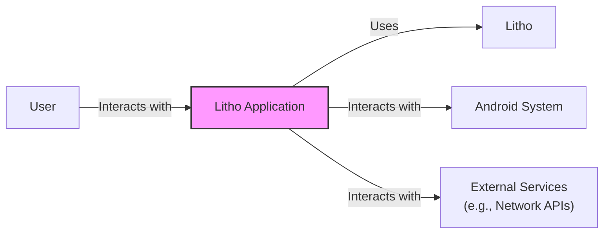
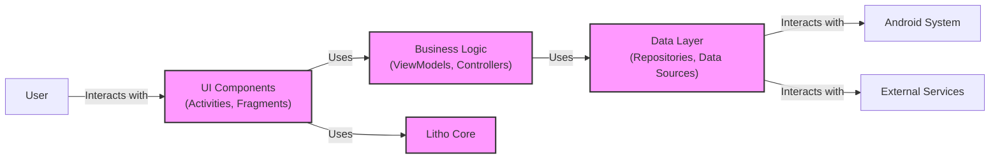
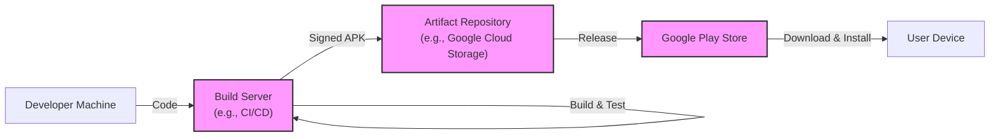
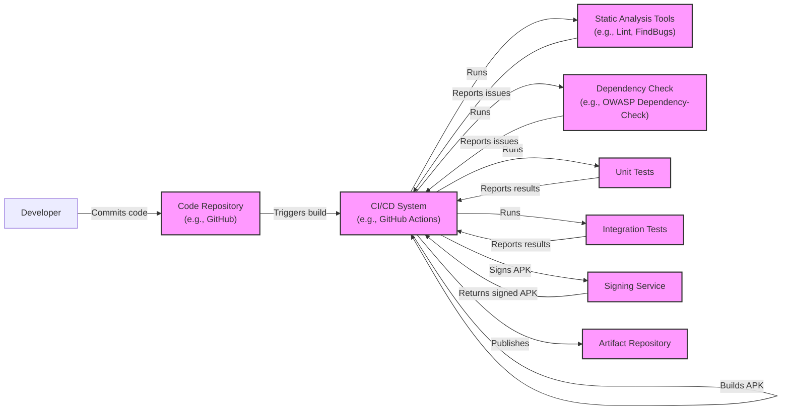

# BUSINESS POSTURE

Litho is a declarative UI framework for building efficient user interfaces on Android. It's developed by Facebook (now Meta) and used extensively in their apps. This suggests a context where performance, scalability, and maintainability are paramount. The business priorities likely revolve around:

*   User Experience: Providing a smooth and responsive user experience, even on lower-end devices or with complex UIs. This is crucial for user engagement and retention.
*   Developer Productivity: Enabling developers to build and iterate on UI features quickly and efficiently. This impacts development velocity and time-to-market.
*   App Performance: Minimizing resource consumption (CPU, memory, battery) to ensure the app remains performant and doesn't negatively impact the device.
*   Code Maintainability: Ensuring the codebase is well-structured, testable, and easy to understand, reducing the risk of bugs and facilitating long-term maintenance.

Based on these priorities, the most important business risks are:

*   Performance Degradation: Any architectural or implementation choices that lead to UI jank, slow rendering, or excessive resource consumption would directly impact the user experience and potentially lead to user churn.
*   Development Bottlenecks: A complex or poorly designed framework could hinder developer productivity, slowing down feature development and increasing the risk of introducing bugs.
  *   Security Vulnerabilities in UI: Vulnerabilities in UI rendering could be exploited.
*   Inability to Scale: The framework must be able to handle increasingly complex UI requirements as the application evolves, without compromising performance or maintainability.
*   Compatibility Issues: The framework must maintain compatibility with a wide range of Android devices and API levels, given the fragmented nature of the Android ecosystem.

# SECURITY POSTURE

Given that Litho is a UI framework, the primary security concerns revolve around preventing vulnerabilities that could be exploited through malicious input or crafted content, leading to issues like cross-site scripting (XSS) in a WebView, denial of service, or potentially even arbitrary code execution.  It's also crucial to consider the security of the development and deployment process.

Existing security controls (based on the public repository and common practices):

*   security control: Code Reviews: Facebook/Meta likely has a rigorous code review process in place for all contributions to Litho. This helps identify potential security vulnerabilities before they are merged into the codebase. (Described in contributing guidelines and pull request process).
*   security control: Static Analysis: Static analysis tools are likely used to scan the codebase for common security vulnerabilities and coding errors. (Inferred from Facebook/Meta's engineering practices).
*   security control: Testing: Extensive unit and integration tests are crucial for ensuring the stability and security of the framework.  This includes testing for edge cases and potential vulnerabilities. (Visible in the repository's test suite).
*   security control: Fuzz Testing: Fuzz testing may be employed to discover unexpected behavior and potential vulnerabilities by providing invalid or random input to the framework. (Inferred from Facebook/Meta's engineering practices).
*   security control: Open Source Scrutiny: Being an open-source project allows for community scrutiny, which can help identify and address security vulnerabilities. (Implicit in the open-source nature of the project).

Accepted risks:

*   accepted risk: Dependency Vulnerabilities: Litho, like any software project, may depend on third-party libraries that could contain vulnerabilities. While efforts are likely made to keep dependencies up-to-date, there's always a residual risk.
*   accepted risk: Zero-Day Exploits: There's always a risk of zero-day exploits in the Android platform itself or in underlying libraries that Litho relies on.
*   accepted risk: Complexity-Induced Vulnerabilities: The inherent complexity of a UI framework like Litho means there's a possibility of subtle vulnerabilities that are difficult to detect.

Recommended security controls (high priority):

*   security control: Regular Security Audits: Conduct regular, independent security audits of the Litho codebase to identify potential vulnerabilities.
*   security control: Dependency Scanning: Implement automated dependency scanning to identify and track known vulnerabilities in third-party libraries.
*   security control: Content Security Policy (CSP) (If applicable): If Litho is used in contexts where it interacts with web content (e.g., within a WebView), implementing CSP can help mitigate XSS vulnerabilities.
*   security control: Input Sanitization: Ensure rigorous input sanitization is performed on all data that is rendered by Litho, to prevent injection attacks.

Security Requirements:

*   Authentication: Not directly applicable to Litho itself, as it's a UI framework. Authentication is handled at the application level.
*   Authorization: Not directly applicable to Litho itself. Authorization is handled at the application level.
*   Input Validation:
    *   All input data rendered by Litho components must be validated and sanitized to prevent injection attacks.
    *   Specific validation rules should be applied based on the expected data type and format.
    *   Invalid input should be rejected or appropriately escaped to prevent rendering issues or vulnerabilities.
*   Cryptography:
    *   Litho should not handle sensitive cryptographic operations directly. These should be delegated to secure platform APIs or well-vetted libraries.
    *   If Litho handles any data that needs to be encrypted (e.g., for caching), it should use the appropriate Android platform APIs for encryption.

# DESIGN

## C4 CONTEXT

*   Elements:
    *   Name: User
        *   Type: Person
        *   Description: The end-user interacting with the Android application.
        *   Responsibilities: Interacting with the UI, providing input, and viewing output.
        *   Security controls: N/A (External to the system)
    *   Name: Litho Application
        *   Type: Software System
        *   Description: The Android application built using the Litho framework.
        *   Responsibilities: Handling user input, managing application state, rendering the UI using Litho, and interacting with the Android system and external services.
        *   Security controls: Input validation, data sanitization, secure communication with external services, adherence to Android security best practices.
    *   Name: Android System
        *   Type: Software System
        *   Description: The underlying Android operating system.
        *   Responsibilities: Providing core system services, managing resources, and providing the platform on which the application runs.
        *   Security controls: Android security model (permissions, sandboxing, etc.), secure inter-process communication (IPC).
    *   Name: External Services
        *   Type: Software System
        *   Description: External services that the application interacts with, such as network APIs, databases, or third-party services.
        *   Responsibilities: Providing specific functionalities or data to the application.
        *   Security controls: Secure communication (HTTPS), authentication, authorization, data validation.
    *   Name: Litho
        *   Type: Software System
        *   Description: Declarative UI framework.
        *   Responsibilities: Rendering UI.
        *   Security controls: Input validation, data sanitization.

## C4 CONTAINER

*   Elements:
    *   Name: User
        *   Type: Person
        *   Description: The end-user interacting with the Android application.
        *   Responsibilities: Interacting with the UI, providing input, and viewing output.
        *   Security controls: N/A (External to the system)
    *   Name: UI Components (Activities, Fragments)
        *   Type: Container
        *   Description: Standard Android UI components that host Litho components.
        *   Responsibilities: Managing the UI lifecycle, handling user interactions, and delegating rendering to Litho.
        *   Security controls: Adherence to Android security best practices, proper handling of user input.
    *   Name: Business Logic (ViewModels, Controllers)
        *   Type: Container
        *   Description: Components responsible for managing application state and business rules.
        *   Responsibilities: Handling user actions, processing data, and updating the UI state.
        *   Security controls: Input validation, data sanitization, secure handling of sensitive data.
    *   Name: Litho Core
        *   Type: Container
        *   Description: The core Litho framework components.
        *   Responsibilities: Managing the component tree, layout calculation, and rendering.
        *   Security controls: Input sanitization, prevention of injection vulnerabilities, secure handling of UI data.
    *   Name: Data Layer (Repositories, Data Sources)
        *   Type: Container
        *   Description: Components responsible for accessing and managing data.
        *   Responsibilities: Fetching data from local storage or external services, caching data, and providing data to the business logic.
        *   Security controls: Secure data storage, secure communication with external services, data validation.
    *   Name: Android System
        *   Type: Software System
        *   Description: The underlying Android operating system.
        *   Responsibilities: Providing core system services, managing resources.
        *   Security controls: Android security model.
    *   Name: External Services
        *   Type: Software System
        *   Description: External services that the application interacts with.
        *   Responsibilities: Providing specific functionalities or data to the application.
        *   Security controls: Secure communication (HTTPS), authentication, authorization, data validation.

## DEPLOYMENT

Possible deployment solutions:

1.  Standard Android Application Package (APK) deployment through Google Play Store.
2.  Internal/Enterprise distribution via a Mobile Device Management (MDM) solution.
3.  Manual installation via APK sideloading (less common for production).

Chosen solution (most common and relevant for Litho): Standard Android Application Package (APK) deployment through Google Play Store.

*   Elements:
    *   Name: Developer Machine
        *   Type: Infrastructure Node
        *   Description: The developer's workstation where code is written and tested.
        *   Responsibilities: Code development, unit testing, local builds.
        *   Security controls: Secure coding practices, local security tools (e.g., antivirus).
    *   Name: Build Server (e.g., CI/CD)
        *   Type: Infrastructure Node
        *   Description: A server that automates the build, test, and packaging process.
        *   Responsibilities: Building the APK, running automated tests, signing the APK.
        *   Security controls: Secure build environment, access control, code signing key management.
    *   Name: Artifact Repository (e.g., Google Cloud Storage)
        *   Type: Infrastructure Node
        *   Description: A repository for storing build artifacts, including the signed APK.
        *   Responsibilities: Storing and managing build artifacts.
        *   Security controls: Access control, encryption at rest, audit logging.
    *   Name: Google Play Store
        *   Type: Infrastructure Node
        *   Description: Google's official app distribution platform.
        *   Responsibilities: Distributing the application to users, managing updates.
        *   Security controls: Google Play Protect (malware scanning), app signing verification.
    *   Name: User Device
        *   Type: Infrastructure Node
        *   Description: The end-user's Android device.
        *   Responsibilities: Running the application.
        *   Security controls: Android security model, user-granted permissions.

## BUILD

*   Developer pushes code to the Code Repository (e.g., GitHub).
*   The Code Repository triggers a build in the CI/CD System (e.g., GitHub Actions, Jenkins).
*   The CI/CD system performs the following steps:
    *   Static Analysis: Runs static analysis tools (e.g., Lint, FindBugs) to identify potential code quality and security issues.
    *   Dependency Check: Scans dependencies for known vulnerabilities (e.g., using OWASP Dependency-Check).
    *   Unit Tests: Executes unit tests to verify the functionality of individual components.
    *   Integration Tests: Executes integration tests to verify the interaction between different parts of the application.
    *   Builds APK: Compiles the code and creates the Android Application Package (APK).
    *   Signs APK: Signs the APK using a secure signing key.
    *   Publishes Artifact: Publishes the signed APK to an Artifact Repository.

Security Controls in Build Process:

*   security control: Code Repository Access Control: Restricting access to the code repository to authorized developers only.
*   security control: CI/CD System Security: Securing the CI/CD system itself, including access control and protection against unauthorized modifications.
*   security control: Static Analysis: Using static analysis tools to identify potential code quality and security issues.
*   security control: Dependency Scanning: Scanning dependencies for known vulnerabilities.
*   security control: Code Signing: Digitally signing the APK to ensure its authenticity and integrity.
*   security control: Secure Key Management: Protecting the signing key used to sign the APK.
*   security control: Build Artifact Integrity: Ensuring the integrity of build artifacts throughout the build and deployment process.

# RISK ASSESSMENT

*   Critical Business Processes:
    *   Rendering the user interface efficiently and responsively.
    *   Providing a smooth and engaging user experience.
    *   Enabling rapid development and iteration of UI features.
    *   Maintaining application stability and performance.

*   Data to Protect and Sensitivity:
    *   Litho itself primarily deals with UI data, which is generally not highly sensitive. However, the *content* displayed by Litho within an application *can* be highly sensitive, depending on the application's purpose. Examples include:
        *   User-Generated Content: Text, images, videos, etc., entered by the user. (Sensitivity: Varies greatly, from public posts to private messages)
        *   Personal Information: User profiles, contact details, etc. (Sensitivity: High)
        *   Financial Data: Payment information, transaction history. (Sensitivity: Very High)
        *   Authentication Tokens: Credentials used to access user accounts. (Sensitivity: Very High)
        *   Application State: Data representing the current state of the application. (Sensitivity: Varies)

    *   While Litho doesn't directly handle the *storage* or *transmission* of this sensitive data, it's crucial that it renders it correctly and securely, without introducing vulnerabilities that could expose this data.

# QUESTIONS & ASSUMPTIONS

*   Questions:
    *   What specific types of input are accepted by Litho components? Are there any custom input types beyond standard Android UI elements?
    *   Are there any plans to integrate Litho with web content or WebViews? If so, what security measures will be taken to mitigate XSS vulnerabilities?
    *   How are errors and exceptions handled within Litho? Are there any potential security implications of error handling mechanisms?
    *   What is the process for reporting and addressing security vulnerabilities discovered in Litho?
    *   What specific static analysis and fuzzing tools are used in the development process?
    *   How are dependencies managed and updated? What is the process for addressing vulnerabilities in dependencies?
    *   What is the long-term support plan for Litho, including security updates and compatibility with future Android versions?

*   Assumptions:
    *   BUSINESS POSTURE: Assumes that Facebook/Meta prioritizes user experience, developer productivity, and application performance. Assumes a high level of engineering rigor and a commitment to security.
    *   SECURITY POSTURE: Assumes that Facebook/Meta has internal security teams and processes in place to review and audit code. Assumes that standard security best practices are followed in the development and deployment of Litho. Assumes that dependencies are regularly reviewed and updated.
    *   DESIGN: Assumes that the provided C4 diagrams are a reasonable representation of the high-level architecture of a typical Litho application. Assumes that the deployment process follows standard Android practices. Assumes that the build process includes automated testing and security checks.