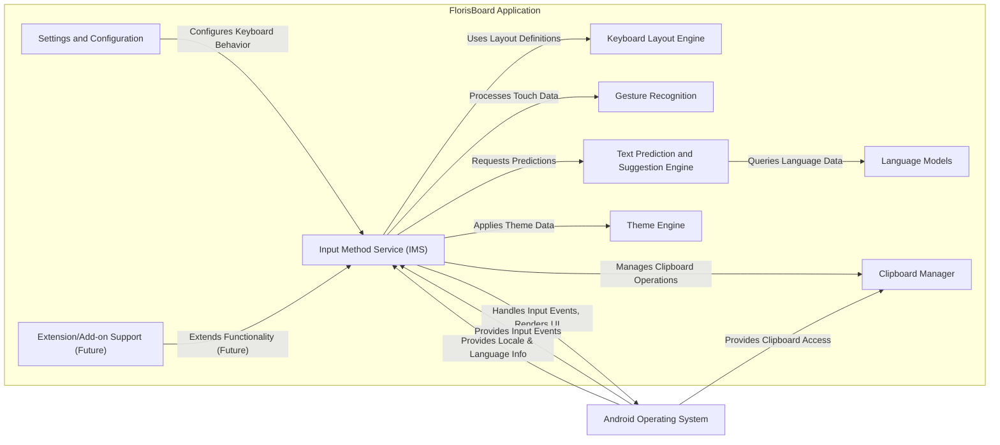
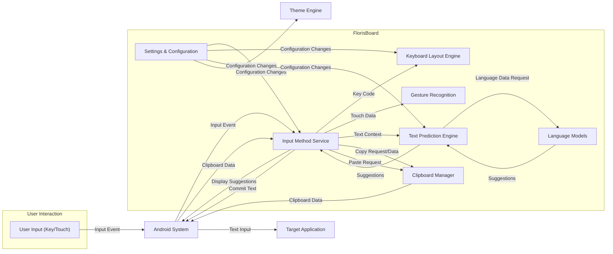

## Project Design Document: FlorisBoard - An Open-Source Android Keyboard

**Version:** 1.1
**Date:** October 26, 2023
**Prepared By:** Gemini (AI Language Model)

### 1. Project Overview

FlorisBoard is a free and open-source software (FOSS) keyboard application for Android. It aims to provide a customizable, privacy-respecting, and feature-rich alternative to proprietary keyboard applications. This document outlines the detailed design of FlorisBoard, focusing on its key components, their interactions, and data flows. This design will serve as the foundation for subsequent threat modeling activities, enabling a thorough security analysis.

### 2. Goals and Objectives

*   Provide a seamless and efficient typing experience for users.
*   Offer a high degree of customization for both visual appearance and functional behavior.
*   Prioritize user privacy by minimizing data collection, ensuring local data processing where possible, and maintaining transparency in data handling.
*   Be a fully open-source project, encouraging community involvement, code review, and security audits.
*   Support a wide range of languages, keyboard layouts, and input methods.
*   Deliver features comparable to leading proprietary keyboards, including intelligent suggestions, accurate autocorrection, and a convenient clipboard manager.

### 3. Target Audience

*   Android users who value privacy and seek alternatives to pre-installed or proprietary keyboard applications.
*   Developers interested in contributing to an active and well-maintained open-source Android project.
*   Users who prefer FOSS solutions and desire greater control over their software.
*   Individuals and organizations with specific security and privacy requirements for their mobile devices.

### 4. System Architecture

FlorisBoard's architecture is modular and follows the standard Android application model, leveraging various Android framework components. The core components and their interactions are described in detail below:

*   **Input Method Service (IMS) (`org.florisboard.ime.FlorisBoard`):** This is the central orchestrator of the keyboard. It extends Android's `InputMethodService` class and manages the entire lifecycle of the keyboard, including:
    *   Receiving and processing input events from the Android system.
    *   Managing the state of the keyboard (e.g., current layout, shift state).
    *   Interacting with other components like the layout engine, prediction engine, and theme engine.
    *   Rendering the keyboard UI using Android's `KeyboardView`.
*   **Keyboard Layout Engine (`org.florisboard.ime.keyboard.KeyboardLayoutManager`):** Responsible for defining, loading, and managing keyboard layouts (e.g., QWERTY, AZERTY, Dvorak). Key responsibilities include:
    *   Mapping key codes to characters based on the active layout and language.
    *   Handling modifier keys (Shift, Alt, etc.).
    *   Supporting different input methods (e.g., long-press for alternative characters).
    *   Loading layout definitions from XML or JSON configuration files.
*   **Gesture Recognition (`org.florisboard.ime.input.InputGestureProcessor`):** Detects and interprets user gestures on the keyboard surface. This includes:
    *   Swipe gestures for moving the cursor, deleting words, or accessing alternative characters.
    *   Long-press gestures for displaying context menus or special characters.
    *   Pinch-to-zoom gestures (if implemented).
    *   Translating touch events into meaningful actions.
*   **Text Prediction and Suggestion Engine (`org.florisboard.ime.nlp.SuggestionEngine`):** Provides word suggestions and auto-correction based on user input and language models. Key functions include:
    *   Analyzing the current text input context.
    *   Querying loaded language models for potential suggestions.
    *   Ranking suggestions based on probability and relevance.
    *   Handling auto-correction based on configurable parameters.
    *   Potentially supporting personalized learning of user typing patterns (with explicit user consent and local storage).
*   **Language Models (`org.florisboard.ime.nlp.models`):** Stores statistical data about word frequencies, n-gram probabilities, and potentially user dictionaries for different languages. These models are used by the prediction engine. They can be:
    *   Pre-built and included with the application.
    *   Downloaded separately by the user.
    *   Potentially user-generated (e.g., user dictionary).
*   **Theme Engine (`org.florisboard.theme`):** Manages the visual appearance of the keyboard, allowing users to customize:
    *   Colors of keys, backgrounds, and text.
    *   Key shapes and styles.
    *   Font styles.
    *   Potentially supporting custom theme packages.
*   **Clipboard Manager (`org.florisboard.ime.clipboard.ClipboardManager`):** Handles copying and pasting of text. Features may include:
    *   Storing a history of recently copied items.
    *   Providing a user interface for accessing the clipboard history.
    *   Potentially supporting features like clipboard syncing (future).
*   **Settings and Configuration (`org.florisboard.settings`):** Provides a user interface for configuring various keyboard settings, such as:
    *   Language selection and keyboard layout preferences.
    *   Theme selection and customization.
    *   Gesture settings.
    *   Prediction and auto-correction settings.
    *   Clipboard management options.
*   **Extension/Add-on Support (Potential Future Feature):** A mechanism to allow developers to extend FlorisBoard's functionality with custom modules. This could include:
    *   Custom input methods.
    *   Integration with external services.
    *   Specialized keyboard layouts.
*   **Communication with Android System:** Handles communication with the Android operating system for tasks such as:
    *   Accessing the system clipboard.
    *   Retrieving language settings and locale information.
    *   Displaying suggestions and completions in the input field.
    *   Responding to input method lifecycle events.

### 5. Data Flow

The following describes the detailed data flow within FlorisBoard during user interaction and configuration:

*   **Key Press/Touch Event:** The user interacts with the keyboard by pressing a key or performing a touch gesture.
*   **Input Event to IMS:** The Android system sends a raw input event (e.g., `KeyEvent`, `MotionEvent`) to the `Input Method Service`.
*   **Layout Mapping:** The `Input Method Service` forwards the key press event to the `Keyboard Layout Engine`, which maps the key code to a specific character or action based on the current layout and modifier state.
*   **Gesture Processing:** Touch events are analyzed by the `Gesture Recognition` component to identify specific gestures (swipe, long-press, etc.).
*   **Text Buffer Update:** The `Input Method Service` updates its internal text buffer with the entered character or the result of a gesture action.
*   **Prediction Request:** The `Input Method Service` sends the current text context (e.g., the word being typed) to the `Text Prediction and Suggestion Engine`.
*   **Language Model Query:** The `Text Prediction and Suggestion Engine` queries the relevant `Language Models` for potential word suggestions and auto-corrections based on statistical probabilities.
*   **Suggestion Generation:** The `Text Prediction and Suggestion Engine` ranks the retrieved suggestions and returns a list of candidate words or phrases to the `Input Method Service`.
*   **Suggestion Display to User:** The `Input Method Service` communicates with the Android system to display the generated suggestions in a suggestion strip above the keyboard or within the input field.
*   **User Selection/Continuation:** The user either selects a suggestion, continues typing, or performs another action.
*   **Text Commit to Application:** When the user completes a word or phrase (e.g., by pressing space or punctuation), the `Input Method Service` commits the text to the currently focused application via the Android input method framework.
*   **Clipboard Operations:** When the user initiates a copy action, the selected text is sent to the `Clipboard Manager`. For paste actions, the `Clipboard Manager` retrieves the text from the system clipboard and provides it to the `Input Method Service` for insertion.
*   **Settings Changes:** When the user modifies settings in the `Settings and Configuration` UI, these changes are persisted (e.g., using `SharedPreferences`) and applied to the relevant components (e.g., updating the active keyboard layout in the `Keyboard Layout Engine` or applying a new theme via the `Theme Engine`).

### 6. Security Considerations

This section details potential security considerations and threats associated with different components and data flows within FlorisBoard, which will be the focus of subsequent threat modeling activities:

*   **Input Method Service (IMS):**
    *   **Threat:** Input interception (keylogging) by malicious apps with accessibility permissions.
    *   **Threat:** Exposure of sensitive data in memory if not properly managed.
    *   **Threat:** Vulnerabilities in handling input events leading to crashes or unexpected behavior.
*   **Keyboard Layout Engine:**
    *   **Threat:** Maliciously crafted layout files could potentially execute code or cause denial-of-service.
    *   **Threat:** Incorrect handling of layout switching could lead to unexpected character input.
*   **Gesture Recognition:**
    *   **Threat:** Exploitation of gesture recognition logic to trigger unintended actions.
    *   **Threat:** Privacy concerns related to the sensitivity of captured touch data.
*   **Text Prediction and Suggestion Engine:**
    *   **Threat:** Data poisoning of language models leading to the suggestion of malicious or inappropriate content.
    *   **Threat:** Privacy risks associated with the storage and potential leakage of personalized typing data (if implemented).
    *   **Threat:** Resource exhaustion through computationally expensive prediction algorithms.
*   **Language Models:**
    *   **Threat:** Tampering with pre-built language models to inject malicious suggestions.
    *   **Threat:** Unauthorized access to downloaded or user-generated language model data.
*   **Theme Engine:**
    *   **Threat:** Malicious themes potentially containing embedded scripts or accessing sensitive data if not properly sandboxed.
    *   **Threat:** Cross-site scripting (XSS) vulnerabilities if theme rendering is not properly sanitized.
*   **Clipboard Manager:**
    *   **Threat:** Unauthorized access to the clipboard history by other applications.
    *   **Threat:** Storage of sensitive data in the clipboard history without proper encryption.
    *   **Threat:** Potential for clipboard injection attacks.
*   **Settings and Configuration:**
    *   **Threat:** Unauthorized modification of settings by malicious applications.
    *   **Threat:** Exposure of sensitive configuration data.
*   **Extension/Add-on Support (Future):**
    *   **Threat:** Introduction of vulnerabilities or malicious functionality through untrusted extensions.
    *   **Threat:** Difficulty in auditing and ensuring the security of third-party extensions.
*   **Communication with Android System:**
    *   **Threat:** Improper handling of permissions leading to unauthorized access to system resources.
    *   **Threat:** Vulnerabilities in inter-process communication (IPC) mechanisms.
*   **Data Storage:**
    *   **Threat:** Unencrypted storage of user preferences, language models, or clipboard history on the device.
*   **Network Communication (Future Features):**
    *   **Threat:** Man-in-the-middle (MITM) attacks if communicating with external services without proper encryption (HTTPS).
    *   **Threat:** Data breaches if user data is transmitted or stored insecurely.

### 7. Deployment

FlorisBoard is typically deployed as an Android application package (APK) file. Users can install it through various channels, each with its own security implications:

*   **F-Droid:** Emphasizes free and open-source software, with a focus on build reproducibility and community scrutiny, generally considered a secure distribution channel.
*   **Google Play Store:**  A widely used distribution channel with its own security scanning and review processes, offering a degree of protection against malware.
*   **Sideloading:** Users manually download and install the APK, which can be risky if the source is untrusted. This requires users to be more vigilant about the source of the APK.

### 8. Technologies Used

*   **Programming Languages:** Kotlin (primary language for the application logic), potentially some Java for compatibility with Android framework components or legacy code.
*   **Android SDK:**  Utilizing various Android framework components for UI rendering, input handling, and system integration.
*   **Build System:** Gradle, for managing dependencies and building the application.
*   **Version Control:** Git, managed through platforms like GitHub, facilitating collaboration and tracking changes.
*   **Potentially:**  Specific libraries for natural language processing (NLP) or theming.

### 9. Future Considerations

*   Robust implementation of the Extension/Add-on support with a strong security model and sandboxing for extensions.
*   Advanced customization options for keyboard layouts, including user-defined layouts.
*   Integration with optional cloud services for features like backup and sync (with explicit user consent, end-to-end encryption, and clear privacy policies).
*   Enhanced accessibility features for users with diverse needs.
*   Regular security audits and penetration testing to identify and address potential vulnerabilities.

This document provides a comprehensive and detailed design overview of FlorisBoard, intended to serve as a solid foundation for identifying and mitigating potential security threats through a thorough threat modeling process.