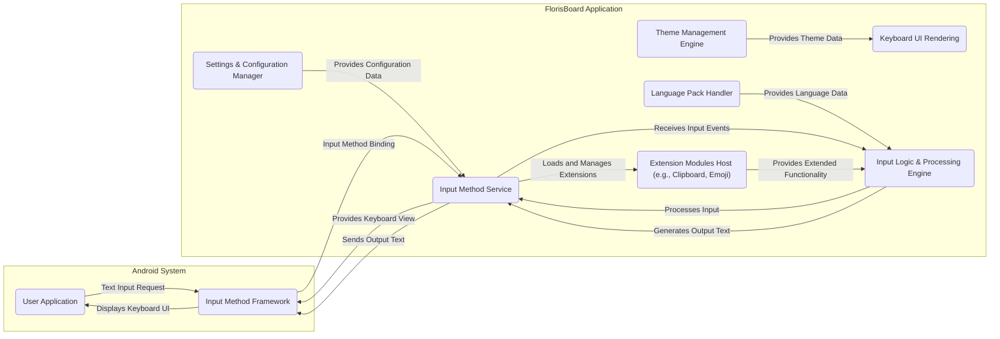
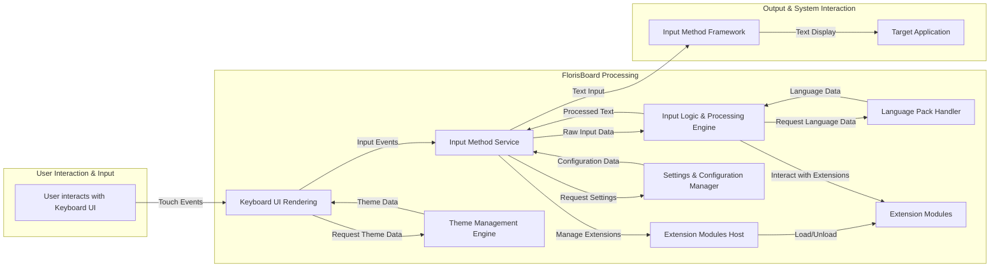

# Project Design Document: FlorisBoard

**Version:** 1.1
**Date:** October 26, 2023
**Author:** AI Software Architecture Expert

## 1. Introduction

This document provides an enhanced and more detailed design overview of FlorisBoard, an open-source Android keyboard application. Building upon the previous version, this iteration further elaborates on the system's architecture, data flow, and security considerations, specifically to facilitate comprehensive threat modeling. It meticulously outlines the key components, their interactions, and the technologies involved, providing a robust foundation for identifying and mitigating potential security vulnerabilities.

## 2. Project Goals and Scope

FlorisBoard is designed to be a highly customizable, privacy-respecting, and feature-rich keyboard application for the Android operating system. The primary goals are:

*   **Efficient and Intuitive Text Input:** To provide a seamless and efficient experience for users to input text.
*   **Extensive Customization:** Offering a wide array of options for users to personalize the keyboard's appearance (themes), layout, and behavior (gestures, predictions).
*   **Prioritizing User Privacy:** Minimizing data collection, ensuring transparency in data handling, and providing users with control over their information.
*   **Multi-Lingual Support:**  Supporting a broad range of languages and input methods to cater to a global user base.
*   **Open-Source and Community Driven:** Fostering a collaborative environment for development, transparency, and community contributions.

The scope of this document focuses on the core functionalities of FlorisBoard as represented in the linked GitHub repository, encompassing the primary features and components that contribute to its operation.

## 3. High-Level Architecture

The following diagram illustrates the high-level architecture of FlorisBoard, emphasizing the interactions between different parts of the system:

## 4. Detailed Component Description

This section provides a more in-depth look at the major components of FlorisBoard and their respective functionalities, data handling, and potential security implications:

*   **Input Method Service (C):** The central component, extending Android's `InputMethodService` class. It acts as the primary interface between the Android system and the FlorisBoard application.
    *   **Functionality:** Manages the keyboard lifecycle (creation, showing, hiding), handles communication with the Android Input Method Framework, receives raw input events from the UI, orchestrates the input processing pipeline, sends processed text back to the requesting application, loads and manages extension modules, and accesses user settings.
    *   **Data Handling:** Receives raw key presses and touch coordinates, sends processed text strings.
    *   **Security Implications:** A compromised service could intercept all user input (keylogging), inject arbitrary text, or leak sensitive data. Improper handling of lifecycle events could lead to denial-of-service.

*   **Keyboard UI Rendering (D):** Responsible for the visual presentation of the keyboard on the screen.
    *   **Functionality:** Renders keys, symbols, and interactive elements based on the current layout and theme, handles touch input and gesture detection, dynamically updates the UI based on state (e.g., shift key), and applies themes and layouts defined by the user.
    *   **Data Handling:** Receives theme data (colors, fonts, images) from the Theme Management Engine.
    *   **Security Implications:** Vulnerabilities in the rendering logic could potentially be exploited to display misleading information or trigger unexpected behavior. Improper handling of theme data could lead to cross-site scripting (XSS)-like issues within the keyboard context if arbitrary code within themes is executed.

*   **Input Logic & Processing Engine (E):** The core intelligence of FlorisBoard, responsible for interpreting user input and generating the intended text.
    *   **Functionality:** Processes key presses and touch events, implements text prediction and suggestion algorithms, handles auto-correction and auto-capitalization, manages input methods for different languages (including handling different keyboard layouts and language-specific rules), and integrates with extension modules for features like clipboard history and emoji input.
    *   **Data Handling:** Processes raw input events, accesses language packs (dictionaries, grammar rules), and interacts with extension modules.
    *   **Security Implications:** Flaws in prediction algorithms could be exploited. Improper handling of language packs could lead to vulnerabilities if malicious packs are loaded. Security of communication with extension modules is crucial to prevent malicious extensions from influencing input processing.

*   **Settings & Configuration Manager (F):**  Manages all user-configurable settings for FlorisBoard.
    *   **Functionality:** Provides a user interface for modifying settings, stores and retrieves user preferences (themes, languages, input methods, privacy settings), manages permissions requested by the application, and handles data backup and restore for settings.
    *   **Data Handling:** Stores sensitive user preferences.
    *   **Security Implications:**  Insecure storage of settings could expose sensitive user data. Lack of proper input validation in settings could lead to unexpected behavior or crashes. Insufficient permission management could grant the application unnecessary access.

*   **Theme Management Engine (G):** Handles the application of visual themes to the keyboard UI.
    *   **Functionality:** Loads and parses theme definition files, applies styles to keyboard elements (colors, fonts, backgrounds, key shapes), allows users to create and customize themes, and potentially supports downloading themes from external sources.
    *   **Data Handling:** Handles theme definition files, which could contain various data formats (JSON, XML, images).
    *   **Security Implications:**  Maliciously crafted theme files could potentially exploit vulnerabilities in the parsing logic to execute arbitrary code or leak information. If downloading themes from external sources is supported, this introduces a supply chain risk.

*   **Language Pack Handler (H):** Manages the language-specific data required for input processing.
    *   **Functionality:** Loads and manages keyboard layouts for different languages, provides dictionaries for text prediction and auto-correction, and potentially handles grammar rules for specific languages.
    *   **Data Handling:** Stores and accesses language-specific data.
    *   **Security Implications:**  Compromised language packs could lead to incorrect predictions, auto-corrections that leak sensitive information, or even potentially introduce vulnerabilities if the data is not properly validated.

*   **Extension Modules Host (I):**  Provides a framework for optional modules that extend the functionality of FlorisBoard.
    *   **Functionality:** Loads and manages various extension modules (e.g., Clipboard Manager, Emoji Picker, Number Row), provides a communication interface between extensions and the core application, and controls the lifecycle of extensions.
    *   **Data Handling:**  Depends on the specific extension. For example, the Clipboard Manager handles copied text.
    *   **Security Implications:**  Malicious extensions could potentially access sensitive data handled by the core application, interfere with input processing, or perform other unauthorized actions. The communication interface between the host and extensions needs to be secure.

## 5. Data Flow

The following outlines the typical data flow within FlorisBoard during text input and other key operations:

Detailed breakdown of the data flow:

1. **User Interaction:** The user interacts with the rendered Keyboard UI by touching keys or performing gestures.
2. **Event Handling (Keyboard UI Rendering):** The Keyboard UI Rendering component captures these touch events, determining the location and nature of the interaction.
3. **Input to Service (Input Method Service):** The Keyboard UI Rendering component sends the interpreted input events (e.g., key press events) to the Input Method Service.
4. **Processing (Input Logic & Processing Engine):** The Input Method Service forwards the raw input data to the Input Logic & Processing Engine.
5. **Logic Application:** The Input Logic & Processing Engine applies various algorithms (prediction, correction, etc.) based on user settings, language packs, and potentially input from extension modules.
6. **Text Generation:** The Input Logic & Processing Engine generates the intended text output.
7. **Output to Service (Input Method Service):** The generated text is sent back to the Input Method Service.
8. **Output to Framework (Input Method Framework):** The Input Method Service sends the processed text to the Android Input Method Framework.
9. **Output to Application (Target Application):** The Input Method Framework delivers the text to the currently focused application.
10. **Settings Access:** The Input Method Service and Input Logic & Processing Engine access the Settings & Configuration Manager to retrieve user preferences and configuration data.
11. **Theme Application:** The Keyboard UI Rendering component requests and receives theme data from the Theme Management Engine to render the keyboard's appearance.
12. **Language Data Retrieval:** The Input Logic & Processing Engine requests and receives language-specific data (dictionaries, layouts) from the Language Pack Handler.
13. **Extension Management:** The Input Method Service manages the loading and unloading of Extension Modules through the Extension Modules Host.
14. **Extension Interaction:** The Input Logic & Processing Engine interacts with loaded Extension Modules to provide extended functionalities.

## 6. Key Technologies and Dependencies

FlorisBoard leverages a range of technologies and depends on various libraries:

*   **Primary Programming Language:** Kotlin (with some legacy Java code likely present).
*   **Android SDK:**  Essential for accessing Android APIs and development tools.
*   **Build System:** Gradle for managing dependencies and building the application.
*   **Android Jetpack Libraries:**  Utilized for modern Android development practices, including:
    *   `androidx.compose`: For declarative UI development (likely for newer parts of the UI).
    *   `androidx.recyclerview`: For efficient display of lists and grids (potentially for suggestion strips).
    *   `androidx.datastore`: For storing key-value pairs or typed objects (likely for settings).
    *   Other relevant Jetpack libraries for lifecycle management, background tasks, etc.
*   **Specific Libraries (Examples):**
    *   Libraries for handling different keyboard layouts and input methods.
    *   Libraries for implementing text prediction and suggestion algorithms (potentially custom implementations or wrappers around existing libraries).
    *   Libraries for image loading and manipulation (for themes).
    *   Libraries for handling different data formats (JSON, XML) for themes and configurations.

A comprehensive list of dependencies can be found in the project's `build.gradle` files. Analyzing these dependencies is crucial for identifying potential third-party vulnerabilities.

## 7. Security Considerations (Initial Thoughts)

Expanding on the initial security considerations, here are more specific potential threats and vulnerabilities:

*   **Input Handling Vulnerabilities:**
    *   **Keylogging:** Malicious actors could exploit vulnerabilities in the Input Method Service or Input Logic & Processing Engine to record all keystrokes entered by the user.
    *   **Input Injection:**  Bugs could allow attackers to inject arbitrary text into applications, potentially leading to command injection or other exploits in the target application.
    *   **Denial of Service:**  Malformed input events could crash the keyboard service, preventing the user from entering text.

*   **Data Storage Security:**
    *   **Insecure Storage of Settings:** Sensitive user preferences (e.g., learned words, privacy settings) stored without proper encryption could be accessed by other applications or during device compromise.
    *   **Backup/Restore Vulnerabilities:**  The backup and restore mechanism for settings could be a target for attackers to inject malicious configurations.

*   **Theme Parsing Exploits:**
    *   **Code Execution:**  Maliciously crafted theme files could exploit vulnerabilities in the Theme Management Engine's parsing logic to execute arbitrary code within the keyboard's context.
    *   **Information Disclosure:**  Theme files could be designed to leak sensitive information if the parsing process is flawed.

*   **Extension Security Risks:**
    *   **Malicious Extensions:**  If users can install third-party extensions, these could be malicious and perform actions like stealing data, injecting input, or compromising the device.
    *   **Insecure Communication:**  Vulnerabilities in the communication interface between the core application and extensions could be exploited to compromise either component.

*   **Inter-Process Communication (IPC) Vulnerabilities:**
    *   Although primarily internal, any potential communication with other apps or services (e.g., for sharing data or features) needs to be secured against eavesdropping or manipulation.

*   **Permission Mismanagement:**
    *   **Overly Broad Permissions:**  Requesting unnecessary permissions could be exploited by attackers if the application is compromised.
    *   **Permission Bypasses:**  Vulnerabilities could allow attackers to bypass permission checks and access restricted resources.

*   **Dependency Vulnerabilities:**
    *   Third-party libraries used by FlorisBoard might contain known security vulnerabilities. Regular dependency updates and security audits are crucial.

*   **Data Leaks and Privacy Violations:**
    *   **Unintentional Logging:**  Sensitive user input or settings could be unintentionally logged or stored in insecure locations.
    *   **Telemetry and Data Collection:**  While aiming for privacy, any data collected (even anonymized) needs careful consideration and transparency.

*   **Supply Chain Attacks:**
    *   If external resources (like theme repositories or language pack sources) are used, they could be compromised, leading to the distribution of malicious content.

## 8. Deployment Considerations

Security considerations related to the deployment of FlorisBoard as an Android application:

*   **App Signing Security:**  Ensuring the application is signed with a strong, securely managed key is crucial to prevent tampering and ensure users are installing the genuine application.
*   **Distribution Channel Security:**
    *   **Official App Stores (Google Play Store, F-Droid):** Relying on the security measures implemented by these platforms to prevent the distribution of malware.
    *   **Sideloading:**  Acknowledging the inherent risks of sideloading APKs from untrusted sources and potentially providing warnings to users.
*   **Update Mechanism Security:**
    *   **Secure Update Delivery:**  Ensuring that updates are delivered securely (e.g., using HTTPS) to prevent man-in-the-middle attacks that could inject malicious code.
    *   **Update Verification:**  Verifying the integrity and authenticity of updates before installation.
*   **Runtime Environment Security:**  Considerations for how the application behaves on different Android versions and device configurations, as vulnerabilities might be specific to certain environments.
*   **Code Obfuscation and Tamper Detection:** Implementing techniques to make reverse engineering and tampering with the application more difficult.

## 9. Conclusion

This enhanced design document provides a more granular and detailed understanding of FlorisBoard's architecture, data flow, and potential security considerations. It serves as a valuable resource for conducting a thorough threat modeling exercise, enabling security professionals and developers to proactively identify and mitigate potential vulnerabilities. By carefully considering the components, their interactions, and the potential threats outlined, the security posture of FlorisBoard can be significantly strengthened, ensuring a safer and more private experience for its users.
