# Project Design Document: FlorisBoard

**Version:** 1.1
**Date:** October 26, 2023
**Author:** AI Software Architect

## 1. Introduction

This document provides an enhanced and more detailed design overview of the FlorisBoard project, an open-source keyboard application for Android. This document aims to clearly articulate the system's architecture, components, and data flows with greater precision to facilitate subsequent threat modeling activities. It elaborates on the key functionalities and interactions within the application, providing a robust foundation for identifying potential security vulnerabilities and attack surfaces.

## 2. Goals and Scope

The primary goal of this document is to provide a comprehensive and granular architectural description of FlorisBoard, suitable for security analysis. The scope encompasses the core functionalities of the keyboard application, including input processing at various levels, text prediction mechanisms, user interface rendering pipelines, settings management, and interaction with the Android operating system. This document focuses on the software components, their specific responsibilities, and their interactions within the Android operating system context.

## 3. System Overview

FlorisBoard is an Android application designed to replace the default system keyboard, offering users enhanced text input capabilities and customization options. It allows users to input text through traditional key presses, swipe gestures, and potentially other input methods. The application meticulously processes this input, leverages language models for suggestions and corrections, and dynamically renders the keyboard interface based on user preferences and context. It also persistently manages user preferences and settings related to the keyboard's behavior, appearance, and language configurations.

## 4. Architectural Design

FlorisBoard's architecture is modular, comprising several distinct components that collaborate to deliver the application's functionality.

### 4.1. Key Components

*   **Input Method Service (IMS) (`"Input Method Service"`):** This is the central Android service responsible for handling all keyboard-related input events. FlorisBoard registers itself as an IMS to intercept key presses, touch events, motion events (for gestures), and other input signals dispatched by the Android system. It acts as the primary interface between the operating system and the keyboard application.
*   **Event Handling Subsystem (`"Event Handling"`):** This subsystem within the IMS is responsible for the initial processing of raw input events. It distinguishes between key presses, touch gestures, and other input types, and routes these events to the appropriate processing modules.
*   **Keyboard Layout Engine (`"Keyboard Layout Engine"`):** This component is responsible for defining, managing, and dynamically switching between various keyboard layouts. It stores the mapping of key codes to characters and symbols for different languages and keyboard types (e.g., QWERTY, AZERTY, Dvorak). It handles layout variations based on user settings and the current input context (e.g., shift key pressed).
*   **Gesture Recognition Module (`"Gesture Recognition"`):** This module interprets touch gestures performed on the keyboard area. It analyzes touch sequences, velocities, and directions to identify specific gestures like swiping for space, deleting words, or accessing alternative character layers. It translates these recognized gestures into corresponding input actions that are then passed to the Text Processing Engine.
*   **Text Processing Engine (`"Text Processing Engine"`):** This is the core logic component responsible for processing user input and generating the final text. It encompasses several sub-modules:
    *   **Input Conversion (`"Input Conversion"`):** Converts raw key events and gesture commands into character input.
    *   **Word Prediction/Suggestion Engine (`"Suggestion Engine"`):** Utilizes dictionaries, n-gram models, and potentially machine learning models to predict and suggest words as the user types. It considers the current input, context, and user history (if enabled).
    *   **Autocorrection Engine (`"Autocorrection Engine"`):** Automatically corrects misspelled words based on predefined rules, statistical models, and language context. It operates based on configurable sensitivity levels.
    *   **Clipboard Manager Interface (`"Clipboard Interface"`):** Provides an interface for handling copy, cut, and paste operations, interacting with the Android system's clipboard.
    *   **Text Formatting (`"Text Formatting"`):** Handles basic text formatting like capitalization and punctuation based on context and user settings.
*   **User Interface (UI) Rendering Engine (`"UI Rendering Engine"`):** This component is responsible for dynamically drawing the keyboard on the screen. It handles:
    *   **Layout Rendering (`"Layout Rendering"`):** Rendering the keys, symbols, and other elements based on the active keyboard layout.
    *   **Theme Management (`"Theme Management"`):** Applying user-selected themes and visual customizations to the keyboard appearance.
    *   **Animation Handling (`"Animation Handling"`):** Implementing animations for key presses, gesture feedback, and other visual cues.
    *   **Suggestion Display (`"Suggestion Display"`):** Displaying word suggestions provided by the Text Processing Engine.
*   **Settings Manager (`"Settings Manager"`):** This component manages user preferences and settings related to the keyboard's behavior and appearance. It handles:
    *   **Settings Storage (`"Settings Storage"`):** Persistently storing user preferences, typically using Android's SharedPreferences or similar mechanisms.
    *   **Settings Retrieval (`"Settings Retrieval"`):** Retrieving user preferences to configure other components.
    *   **Settings Synchronization (Potential):**  If implemented, handles synchronization of settings across devices.
*   **Dictionary and Language Model Manager (`"Dictionary/Model Manager"`):** This component manages the dictionaries and language models used for word prediction and autocorrection. It handles:
    *   **Resource Loading (`"Resource Loading"`):** Loading dictionary files and language models from local storage or potentially downloading them.
    *   **Resource Updating (`"Resource Updating"`):** Handling updates to dictionaries and language models.
    *   **Custom Dictionary Management (`"Custom Dictionary"`):** Managing user-added words and phrases.
*   **Extension/Add-on Framework (Potential) (`"Extension Framework"`):**  If present, this component provides a mechanism for extending FlorisBoard's functionality through plugins or add-ons. It would manage the lifecycle and interactions of these extensions.

### 4.2. Component Interactions

The following list describes the detailed flow of interaction between the key components:

*   The **Input Method Service (`"Input Method Service"`)** receives raw input events from the Android system.
*   The **Event Handling Subsystem (`"Event Handling"`)** within the IMS categorizes the input event (key press, gesture, etc.).
*   For key presses, the event is passed to the **Keyboard Layout Engine (`"Keyboard Layout Engine"`)** to determine the corresponding character or action based on the current layout and modifier keys.
*   For touch events recognized as gestures, the **Gesture Recognition Module (`"Gesture Recognition"`)** interprets the gesture and translates it into a command for the **Text Processing Engine (`"Text Processing Engine"`)**.
*   The **Text Processing Engine (`"Text Processing Engine"`)**, specifically the **Input Conversion (`"Input Conversion"`)** sub-module, receives the interpreted input (characters or gesture commands).
*   The **Text Processing Engine (`"Text Processing Engine"`)** utilizes the **Word Prediction/Suggestion Engine (`"Suggestion Engine"`)** and **Autocorrection Engine (`"Autocorrection Engine"`)**, potentially querying the **Dictionary and Language Model Manager (`"Dictionary/Model Manager"`)** for relevant data.
*   The **UI Rendering Engine (`"UI Rendering Engine"`)** receives information about the current input, suggestions, the keyboard layout from the **Keyboard Layout Engine (`"Keyboard Layout Engine"`)**, and theme settings from the **Settings Manager (`"Settings Manager"`)** to render the keyboard on the screen.
*   User settings managed by the **Settings Manager (`"Settings Manager"`)** influence the behavior of the **Keyboard Layout Engine (`"Keyboard Layout Engine"`)**, **Text Processing Engine (`"Text Processing Engine"`)**, and **UI Rendering Engine (`"UI Rendering Engine"`)**.
*   The **Dictionary and Language Model Manager (`"Dictionary/Model Manager"`)** provides the necessary dictionary and language model data to the **Word Prediction/Suggestion Engine (`"Suggestion Engine"`)** and **Autocorrection Engine (`"Autocorrection Engine"`)**.
*   When copy/paste operations are performed, the **Text Processing Engine (`"Text Processing Engine"`)** interacts with the **Clipboard Manager Interface (`"Clipboard Interface"`)** to access or modify the system clipboard.
*   If present, the **Extension/Add-on Framework (`"Extension Framework"`)** might interact with various components to provide additional functionalities, potentially intercepting input events or modifying the behavior of the **Text Processing Engine (`"Text Processing Engine"`)** or **UI Rendering Engine (`"UI Rendering Engine"`)**.

## 5. Data Flow

The following outlines the detailed data flow within FlorisBoard, specifying the types of data exchanged:

*   **User Input Events:** Raw key presses, touch events, and motion events are captured by the Android system and delivered to the **Input Method Service (`"Input Method Service"`)**.
*   **Categorized Input Data:** The **Event Handling Subsystem (`"Event Handling"`)** processes raw events and outputs categorized data (e.g., key press event with key code, gesture data with touch points and velocity).
*   **Layout Information:** The **Keyboard Layout Engine (`"Keyboard Layout Engine"`)** provides layout information (key positions, character mappings) to the **UI Rendering Engine (`"UI Rendering Engine"`)** and character mappings to the **Text Processing Engine (`"Text Processing Engine"`)**.
*   **Interpreted Input:** The **Keyboard Layout Engine (`"Keyboard Layout Engine"`)** outputs interpreted input (characters, action commands) to the **Text Processing Engine (`"Text Processing Engine"`)**. The **Gesture Recognition Module (`"Gesture Recognition"`)** outputs gesture commands to the **Text Processing Engine (`"Text Processing Engine"`)**.
*   **Text Input & Context:** The **Text Processing Engine (`"Text Processing Engine"`)** maintains the current text input and context.
*   **Dictionary/Model Requests:** The **Text Processing Engine (`"Text Processing Engine"`)** sends requests for dictionary entries and language model data to the **Dictionary and Language Model Manager (`"Dictionary/Model Manager"`)**.
*   **Dictionary/Model Data:** The **Dictionary and Language Model Manager (`"Dictionary/Model Manager"`)** provides dictionary entries, n-gram probabilities, and other language model data to the **Text Processing Engine (`"Text Processing Engine"`)**.
*   **Suggestion Data:** The **Text Processing Engine (`"Text Processing Engine"`)** sends word suggestions and correction candidates to the **UI Rendering Engine (`"UI Rendering Engine"`)**.
*   **UI Rendering Instructions:** The **UI Rendering Engine (`"UI Rendering Engine"`)** receives instructions on how to render the keyboard, including key states, suggestions, and animations.
*   **Rendered UI Output:** The **UI Rendering Engine (`"UI Rendering Engine"`)** outputs the rendered keyboard UI to the Android system for display.
*   **Settings Data (Read/Write):** The **Settings Manager (`"Settings Manager"`)** reads and writes user preference data to persistent storage. This data is used to configure various components.
*   **Clipboard Data (Read/Write):** The **Text Processing Engine (`"Text Processing Engine"`)** reads and writes text data to the system clipboard via the **Clipboard Manager Interface (`"Clipboard Interface"`)**.

```mermaid
graph LR
    subgraph "Android System"
        A("User Input (Key Press, Touch, Motion)") --> B("Input Method Service");
        B --> C("FlorisBoard");
    end

    subgraph "FlorisBoard"
        C -- "Raw Input Events" --> D("Event Handling");
        D -- "Key Press Events" --> E("Keyboard Layout Engine");
        D -- "Touch Events" --> F("Gesture Recognition");
        E -- "Interpreted Input (Characters)" --> G("Text Processing Engine");
        F -- "Gesture Commands" --> G;
        G -- "Text Input, Context, Suggestions" --> H("UI Rendering Engine");
        G -- "Dictionary/Model Request" --> I("Dictionary/Model Manager");
        I -- "Dictionary/Model Data" --> G;
        J("Settings Manager") -- "Settings Data" --> E;
        J -- "Settings Data" --> G;
        J -- "Settings Data" --> H;
        G -- "Clipboard Operations" --> K("Clipboard Interface");
        H -- "Rendered Keyboard UI" --> L("Android System UI");
        style D fill:#ddf,stroke:#333,stroke-width:2px
        style E fill:#ddf,stroke:#333,stroke-width:2px
        style F fill:#ddf,stroke:#333,stroke-width:2px
        style G fill:#ddf,stroke:#333,stroke-width:2px
        style H fill:#ddf,stroke:#333,stroke-width:2px
        style I fill:#ddf,stroke:#333,stroke-width:2px
        style J fill:#ddf,stroke:#333,stroke-width:2px
        style K fill:#ddf,stroke:#333,stroke-width:2px
    end

    style A fill:#f9f,stroke:#333,stroke-width:2px
    style B fill:#ccf,stroke:#333,stroke-width:2px
    style C fill:#aaf,stroke:#333,stroke-width:2px
```

## 6. Security Considerations (Detailed for Threat Modeling)

This section provides a more detailed breakdown of security considerations for threat modeling:

*   **Input Handling Vulnerabilities in IMS and Event Handling:**
    *   **Denial of Service:** Maliciously crafted input events could potentially crash the IMS or the application.
    *   **Input Spoofing:**  Exploiting vulnerabilities to inject fake input events.
    *   **Buffer Overflows:**  Improper handling of large or unexpected input data could lead to buffer overflows.
*   **Keyboard Layout Engine Vulnerabilities:**
    *   **Layout Injection:**  Compromising the layout data to display incorrect characters or execute unintended actions.
    *   **Resource Exhaustion:**  Loading excessively large or complex layouts could lead to resource exhaustion.
*   **Gesture Recognition Module Vulnerabilities:**
    *   **Gesture Spoofing:**  Crafting touch sequences that are incorrectly interpreted as valid gestures.
    *   **Denial of Service:**  Complex or malformed touch sequences could overwhelm the gesture recognition logic.
*   **Text Processing Engine Vulnerabilities:**
    *   **Code Injection through Suggestions:**  Maliciously crafted dictionary data or language models could inject executable code.
    *   **Data Exfiltration through Suggestions:**  Subtly influencing suggestions to leak sensitive information.
    *   **Autocorrection Bypass:**  Finding ways to bypass autocorrection mechanisms for malicious purposes.
    *   **Clipboard Manipulation:**  Unauthorized access or modification of clipboard data.
    *   **Format String Bugs:**  Vulnerabilities in text formatting logic.
*   **UI Rendering Engine Vulnerabilities:**
    *   **UI Redressing/Clickjacking:**  Overlaying malicious UI elements on top of the keyboard.
    *   **Resource Exhaustion:**  Rendering excessively complex themes or animations could lead to performance issues or crashes.
*   **Settings Manager Vulnerabilities:**
    *   **Unauthorized Settings Modification:**  Exploiting vulnerabilities to change user settings without consent.
    *   **Data Leakage from Settings Storage:**  Insecure storage of sensitive settings data.
*   **Dictionary and Language Model Manager Vulnerabilities:**
    *   **Malicious Dictionary/Model Injection:**  Replacing legitimate dictionaries or models with compromised versions.
    *   **Data Poisoning:**  Injecting malicious data into dictionaries or models to influence suggestions or autocorrection.
*   **Extension/Add-on Framework Vulnerabilities (If Applicable):**
    *   **Malicious Extensions:**  Installation of extensions that perform malicious actions.
    *   **API Abuse:**  Exploiting vulnerabilities in the extension API to gain unauthorized access or control.
*   **Inter-Process Communication (IPC) Vulnerabilities:**
    *   **Data Tampering:**  Modifying data exchanged between FlorisBoard and other processes.
    *   **Information Disclosure:**  Leaking sensitive information through IPC channels.
*   **Keylogging Potential (Internal):**
    *   **Accidental Logging:**  Unintended logging of user input data.
    *   **Malicious Logging:**  Intentional logging and potential exfiltration of user input.
*   **Permissions:**
    *   **Overly Broad Permissions:**  Requesting unnecessary permissions that could be abused.
    *   **Permission Downgrade Attacks:**  Exploiting vulnerabilities to bypass permission checks.
*   **Third-Party Libraries:**
    *   **Known Vulnerabilities:**  Using third-party libraries with known security flaws.
    *   **Supply Chain Attacks:**  Compromised dependencies.

## 7. Deployment

FlorisBoard is deployed as a standard Android application package (APK). Users can install it through official channels like the Google Play Store, or by sideloading the APK. Upon installation, users are required to manually enable FlorisBoard as their active input method within the Android system settings. The application runs within the standard Android application sandbox, with permissions granted by the user. Updates are typically distributed through the same channels.

## 8. Future Considerations

*   **Cloud-Based Features:**  Integration of cloud-based features such as synchronized dictionaries, personalized suggestions, or backup of user settings would introduce new security considerations related to data transmission (encryption, secure protocols), data storage (server-side security, data privacy), and authentication/authorization.
*   **Advanced Gesture Recognition:**  More sophisticated gesture recognition using sensor data could introduce new attack vectors related to sensor data manipulation or privacy concerns.
*   **Accessibility Features:**  While enhancing usability, accessibility features need careful design to prevent potential abuse, such as bypassing security measures or exfiltrating information through accessibility services.
*   **Integration with Wearable Devices:**  If FlorisBoard integrates with wearable devices, security considerations related to Bluetooth communication and data synchronization would need to be addressed.
*   **Voice Input Integration:**  Incorporating voice input would introduce security concerns related to audio data processing and potential eavesdropping.

This enhanced document provides a more granular and detailed understanding of FlorisBoard's architecture, specifically tailored for thorough threat modeling. It highlights potential vulnerabilities and attack surfaces within each component and data flow, enabling a more comprehensive security analysis.