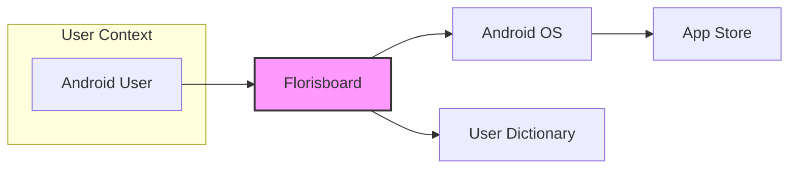
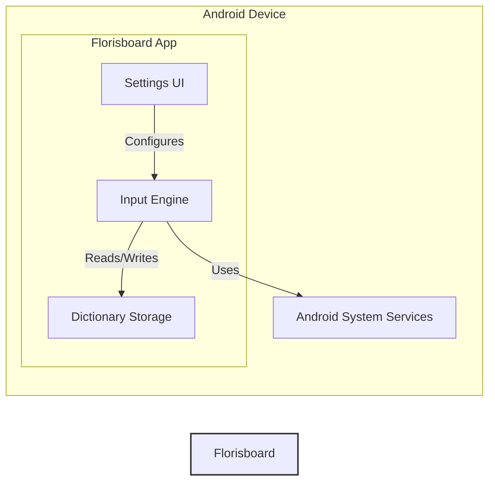
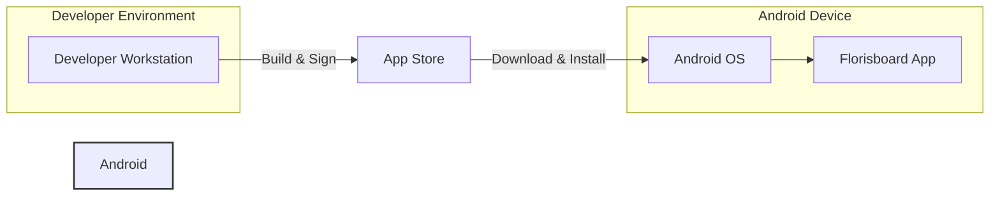

# BUSINESS POSTURE

This project, Florisboard, aims to provide a free and open-source keyboard application for Android. The primary business priority is to offer users a customizable, privacy-focused, and efficient alternative to proprietary keyboard applications. The goals are to empower users with control over their typing experience and data, foster a community-driven development model, and establish Florisboard as a trusted and respected open-source keyboard.

The most important business risks that need to be addressed are:
- Reputational damage due to security vulnerabilities or privacy breaches.
- Loss of user trust if the application is perceived as insecure or unreliable.
- Difficulty in maintaining and updating the project due to its open-source and community-driven nature.
- Competition from established keyboard applications with larger resources and marketing reach.

# SECURITY POSTURE

Existing security controls:
- security control: Open-source codebase, allowing for community review and scrutiny. Implemented in: GitHub repository.
- security control: Standard Android application permissions model. Implemented in: Android operating system.
- security control: Code review process within the open-source community (assumed). Implemented in: Project development workflow.

Accepted risks:
- accepted risk: Potential for undiscovered vulnerabilities in the codebase due to the complexity of software and community-driven development.
- accepted risk: Reliance on community contributions for security patches and updates, which may have variable response times.
- accepted risk: Risks associated with third-party dependencies used in the project.

Recommended security controls:
- recommended security control: Implement automated Static Application Security Testing (SAST) in the build pipeline to identify potential code vulnerabilities.
- recommended security control: Conduct regular dependency scanning to identify and address vulnerabilities in third-party libraries.
- recommended security control: Establish a clear vulnerability reporting and response process to handle security issues effectively.
- recommended security control: Implement robust input validation and sanitization to prevent injection attacks.
- recommended security control: Consider implementing dynamic application security testing (DAST) or penetration testing to assess runtime security.

Security requirements:
- Authentication: Not directly applicable for a keyboard application in the traditional sense. However, secure access to application settings and configurations should be considered to prevent unauthorized modifications.
- Authorization: Android's permission system is the primary authorization mechanism. Florisboard should adhere to the principle of least privilege and only request necessary permissions. User data access within the application (like dictionaries) should be properly authorized.
- Input validation: Rigorous input validation is crucial to prevent various injection attacks. All input from the user (keystrokes, settings input) and external sources should be validated.
- Cryptography: If Florisboard stores any sensitive data locally (e.g., user dictionaries, learned words) or transmits data (though unlikely for a keyboard), appropriate encryption mechanisms should be used to protect data confidentiality and integrity. Secure storage of cryptographic keys is also essential.

# DESIGN

## C4 CONTEXT



Context Diagram Elements:

- Element:
    - Name: Android User
    - Type: Person
    - Description: The end-user who uses the Florisboard application on their Android device to input text.
    - Responsibilities: Provides input to the Florisboard application, configures keyboard settings.
    - Security controls: Device-level security controls (passcode, biometrics), user awareness of application permissions.

- Element:
    - Name: Florisboard
    - Type: System
    - Description: The Florisboard keyboard application itself, running on the Android operating system. It provides text input functionality, customization options, and potentially user dictionary features.
    - Responsibilities: Captures user input, provides keyboard layouts and functionalities, stores user preferences and dictionary data, interacts with the Android OS for input methods and system features.
    - Security controls: Input validation, secure data storage (if applicable), adherence to Android security best practices, software updates.

- Element:
    - Name: Android OS
    - Type: System
    - Description: The Android operating system on which Florisboard is installed and runs. It provides the runtime environment, APIs, and security features for applications.
    - Responsibilities: Manages application permissions, provides system-level security features, handles input method framework, provides access to device resources.
    - Security controls: Android security model, permission system, sandboxing, OS updates.

- Element:
    - Name: App Store
    - Type: System
    - Description: Platforms like Google Play Store or F-Droid used to distribute and install the Florisboard application.
    - Responsibilities: Application distribution, hosting application packages, providing update mechanisms.
    - Security controls: App store security scanning, developer account verification, code signing.

- Element:
    - Name: User Dictionary
    - Type: System
    - Description: Local storage on the Android device where Florisboard might store user-specific words, learned words, or custom dictionary entries.
    - Responsibilities: Persistent storage of user dictionary data, providing data to Florisboard for text prediction and correction.
    - Security controls: Android file system permissions, application-level encryption if sensitive data is stored, secure data handling within Florisboard.

## C4 CONTAINER



Container Diagram Elements:

- Element:
    - Name: Input Engine
    - Type: Mobile App Component
    - Description: The core component responsible for handling user input, processing keystrokes, managing keyboard layouts, and providing text prediction and correction functionalities.
    - Responsibilities: Capturing user input events, rendering keyboard UI, implementing input logic, interacting with dictionary storage, communicating with Android System Services for input method integration.
    - Security controls: Input validation, secure handling of user input data, protection against buffer overflows or other memory safety issues, secure communication with other components.

- Element:
    - Name: Settings UI
    - Type: Mobile App Component
    - Description: The user interface component that allows users to configure Florisboard settings, such as themes, layouts, languages, and other preferences.
    - Responsibilities: Providing a user-friendly interface for configuring application settings, validating user input in settings, storing and retrieving user preferences.
    - Security controls: Input validation for settings input, secure storage of user preferences, authorization to modify settings, protection against UI-based attacks (e.g., clickjacking, UI redressing).

- Element:
    - Name: Dictionary Storage
    - Type: Local File/Database
    - Description: The local storage mechanism used by Florisboard to store user dictionaries, learned words, and potentially other user-specific data. This could be a file, a local database (like SQLite), or Android's SharedPreferences.
    - Responsibilities: Persistent storage of dictionary data, providing data access to the Input Engine, managing data integrity and consistency.
    - Security controls: File system permissions, data encryption at rest if sensitive data is stored, secure data access controls within the application, protection against data corruption.

- Element:
    - Name: Android System Services
    - Type: System Service
    - Description: Android operating system services that Florisboard interacts with, such as the Input Method Framework, Accessibility Services (if used for specific features), and other system APIs.
    - Responsibilities: Providing system-level functionalities to applications, managing input methods, enforcing system security policies.
    - Security controls: Android OS security controls, API access controls, permission enforcement.

## DEPLOYMENT

Deployment Architecture Option: Standard Android Application Deployment



Deployment Diagram Elements:

- Element:
    - Name: Developer Workstation
    - Type: Development Environment
    - Description: The environment used by developers to write, build, and test the Florisboard application.
    - Responsibilities: Source code management, software development, building and packaging the application, signing the application package.
    - Security controls: Secure coding practices, code review, access control to development environment, secure key management for code signing.

- Element:
    - Name: App Store (e.g., Google Play Store, F-Droid)
    - Type: Distribution Platform
    - Description: The platform used to distribute the Florisboard application to end-users.
    - Responsibilities: Hosting application packages, verifying application integrity, providing update mechanisms, managing application listings.
    - Security controls: App store security scanning, developer account verification, code signing verification, malware detection.

- Element:
    - Name: Android OS
    - Type: Operating System
    - Description: The Android operating system on the user's device.
    - Responsibilities: Providing the runtime environment for the application, managing application installation and updates, enforcing security policies.
    - Security controls: Android security model, permission system, sandboxing, OS updates, runtime application security.

- Element:
    - Name: Florisboard App
    - Type: Mobile Application
    - Description: The installed instance of the Florisboard application running on the Android device.
    - Responsibilities: Providing keyboard functionality to the user, accessing device resources as permitted, storing user data locally.
    - Security controls: Application-level security controls, adherence to Android security best practices, secure data handling, software updates.

## BUILD

```mermaid
flowchart LR
    A[Developer] --> B{Source Code (GitHub)};
    B --> C[Build System (GitHub Actions / Local Build)];
    C --> D{Security Checks (SAST, Linting)};
    D --> E[Build Artifact (APK)];
    E --> F[App Store / Distribution];
    style B fill:#ccf,stroke:#333,stroke-width:2px
    style C fill:#ccf,stroke:#333,stroke-width:2px
    style D fill:#ccf,stroke:#333,stroke-width:2px
```

Build Process Description:

The build process starts with developers committing code changes to the GitHub repository.

- Developer: Writes code, performs local testing, and commits changes to the source code repository (GitHub). Security responsibility: Secure coding practices, local testing, vulnerability awareness.
- Source Code (GitHub): Hosts the project's source code, including application code, build scripts, and configuration files. Security responsibility: Access control to the repository, branch protection, vulnerability scanning of dependencies (GitHub Dependabot).
- Build System (GitHub Actions / Local Build): Automates the build process. This could be GitHub Actions for CI/CD or local development environments. Security responsibility: Secure build environment, access control to build system, integrity of build scripts, dependency management.
- Security Checks (SAST, Linting): Automated security checks integrated into the build pipeline. Includes Static Application Security Testing (SAST) tools to identify potential code vulnerabilities and linters for code quality and style checks. Security responsibility: Configuration and maintenance of security scanning tools, remediation of identified vulnerabilities.
- Build Artifact (APK): The final Android application package (APK) produced by the build process. This is the distributable file for the application. Security responsibility: Code signing of the APK to ensure integrity and authenticity, secure storage of signing keys.
- App Store / Distribution: The APK is distributed through app stores like Google Play Store or F-Droid, or directly to users. Security responsibility: App store security scanning, secure distribution channels, update mechanisms.

# RISK ASSESSMENT

Critical business process we are trying to protect:
- Providing a secure, private, and reliable keyboard input method for Android users.
- Maintaining user trust and a positive reputation for Florisboard as a privacy-focused open-source project.

Data we are trying to protect and their sensitivity:
- User input data (keystrokes): Potentially highly sensitive as it can include passwords, personal information, and confidential communications.
- User dictionary data: Potentially sensitive as it may contain frequently used words and phrases, personal names, etc.
- Application settings and preferences: Low sensitivity, but important for user experience and customization.

# QUESTIONS & ASSUMPTIONS

Questions:
- Does Florisboard currently implement any form of data encryption for locally stored user data (like dictionaries)?
- Are there any plans to collect telemetry or usage data from users? If so, what data is collected and how is it secured and anonymized?
- What is the current process for handling vulnerability reports and releasing security updates?
- Are there any third-party dependencies used in the project, and is there a process for monitoring and updating them?
- Is there a formal code review process in place for contributions to the project?

Assumptions:
- Florisboard's primary goal is to be a privacy-respecting keyboard application.
- The project is developed and maintained by a community of open-source contributors.
- Distribution is primarily through app stores like Google Play Store and F-Droid.
- There are no server-side components or network communication beyond standard application updates and potential optional features (if any).
- The project aims to adhere to Android security best practices.