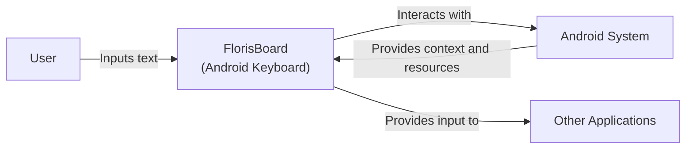
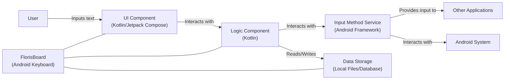
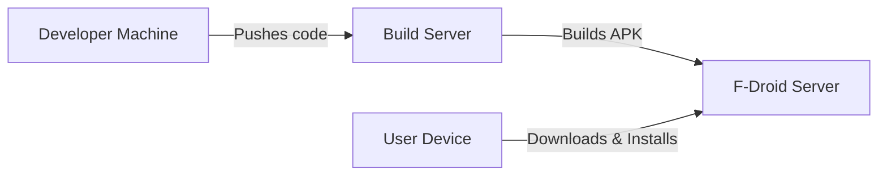
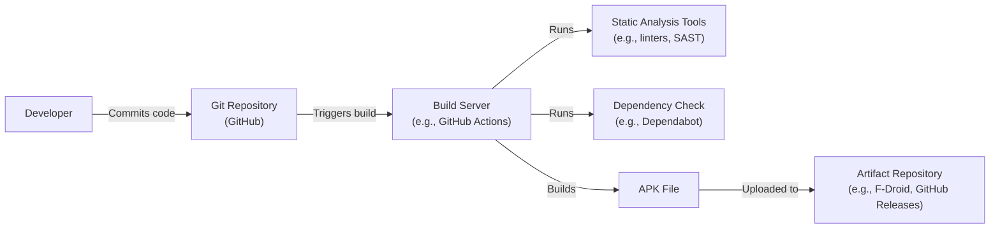

# BUSINESS POSTURE

FlorisBoard is an open-source keyboard for Android, aiming to provide a privacy-respecting, customizable, and feature-rich input method. Given its nature as a keyboard, a core component of any mobile device, the business priorities and goals revolve around user trust, data privacy, and a positive user experience.

Business Priorities:

*   User Privacy: Ensuring user input data is handled securely and privately, without unnecessary collection or sharing.
*   Customization: Offering a highly customizable keyboard experience to cater to diverse user preferences.
*   Accessibility: Providing features that make the keyboard usable for people with disabilities.
*   Open Source and Community Driven: Maintaining transparency and fostering community contributions.
*   Stability and Reliability: Ensuring the keyboard functions smoothly and reliably across different Android devices and versions.
*   Feature Richness: Providing a competitive set of features compared to other keyboards.

Business Risks:

*   Data Breach: Unauthorized access to user input data, potentially including sensitive information like passwords or personal messages. This is the most critical risk.
*   Malicious Code Injection: Introduction of malicious code through third-party libraries, extensions, or compromised build processes.
*   Reputation Damage: Negative publicity due to privacy violations, security vulnerabilities, or poor user experience.
*   Loss of User Trust: Erosion of user trust due to perceived or actual privacy/security issues.
*   Compliance Violations: Failure to comply with relevant data privacy regulations (e.g., GDPR, CCPA).
*   Denial of Service: Keyboard crashing or becoming unresponsive, hindering user's ability to input text.

# SECURITY POSTURE

Existing Security Controls (based on the GitHub repository, some are inferred):

*   security control: Open Source Codebase: The entire codebase is publicly available, allowing for community scrutiny and audits. (Described in the GitHub repository).
*   security control: Limited Permissions: The application requests only necessary permissions. (Described in AndroidManifest.xml).
*   security control: No Network Access (Default): By default, FlorisBoard does not connect to the internet, minimizing the attack surface. (Inferred from the project description and common practice for privacy-focused keyboards).
*   security control: Local Data Storage: User dictionaries and settings are stored locally on the device. (Inferred from the project description and common practice for privacy-focused keyboards).
*   security control: Code Reviews: Contributions are likely subject to code reviews before being merged. (Inferred from standard open-source development practices).

Accepted Risks:

*   accepted risk: Third-Party Library Vulnerabilities: The project depends on external libraries, which may contain vulnerabilities.
*   accepted risk: User-Installed Themes/Extensions: Users can install custom themes or extensions, which may introduce security risks if not properly vetted.
*   accepted risk: Zero-Day Exploits: The underlying Android operating system or device hardware may have undiscovered vulnerabilities.
*   accepted risk: Limited Formal Security Audits: While the code is open source, comprehensive, formal security audits may be infrequent due to resource constraints.

Recommended Security Controls:

*   security control: Implement a robust Content Security Policy (CSP) if any web views are used within the keyboard.
*   security control: Regularly update dependencies to patch known vulnerabilities. Automate this process.
*   security control: Conduct static code analysis (SAST) during the build process to identify potential security issues.
*   security control: Consider dynamic analysis (DAST) to test the running application for vulnerabilities.
*   security control: Establish a clear vulnerability disclosure program to encourage responsible reporting of security issues.
*   security control: Implement a Software Bill of Materials (SBOM) to track all components and dependencies.
*   security control: Perform regular penetration testing, ideally by independent security researchers.

Security Requirements:

*   Authentication:
    *   Not directly applicable, as the keyboard itself doesn't authenticate users. However, it must securely handle authentication data (e.g., passwords) entered by the user.
*   Authorization:
    *   The keyboard should only have access to the resources it absolutely needs (e.g., user dictionary, settings). Principle of Least Privilege.
*   Input Validation:
    *   Sanitize all user input to prevent injection attacks, especially if custom themes or extensions are allowed.
    *   Validate data read from external storage (e.g., custom dictionaries).
*   Cryptography:
    *   If any data is encrypted (e.g., user settings), use strong, well-vetted cryptographic algorithms and libraries.
    *   Securely manage cryptographic keys.
    *   Consider encrypting the user dictionary at rest.

# DESIGN

## C4 CONTEXT

Element Descriptions:

*   Element:
    *   Name: User
    *   Type: Person
    *   Description: A person who uses an Android device with FlorisBoard installed.
    *   Responsibilities: Interacts with the device, inputs text using FlorisBoard.
    *   Security controls: N/A - External entity.

*   Element:
    *   Name: FlorisBoard (Android Keyboard)
    *   Type: Software System
    *   Description: The open-source Android keyboard application.
    *   Responsibilities: Receives user input, provides text suggestions, handles keyboard layout and settings, interacts with the Android system to provide input to other applications.
    *   Security controls: Limited permissions, local data storage, open-source codebase, (planned) input validation, (planned) dependency management.

*   Element:
    *   Name: Android System
    *   Type: Software System
    *   Description: The Android operating system.
    *   Responsibilities: Provides the underlying platform and resources for FlorisBoard, manages application permissions, handles inter-process communication.
    *   Security controls: Android security model (sandboxing, permissions), system updates.

*   Element:
    *   Name: Other Applications
    *   Type: Software System
    *   Description: Any other application installed on the Android device that receives text input from FlorisBoard.
    *   Responsibilities: Receives text input from FlorisBoard (via the Android system).
    *   Security controls: Application-specific security controls.

## C4 CONTAINER

Element Descriptions:

*   Element:
    *   Name: User
    *   Type: Person
    *   Description: A person who uses an Android device with FlorisBoard installed.
    *   Responsibilities: Interacts with the device, inputs text using FlorisBoard.
    *   Security controls: N/A - External entity.

*   Element:
    *   Name: FlorisBoard (Android Keyboard)
    *   Type: Software System
    *   Description: The open-source Android keyboard application.
    *   Responsibilities: Receives user input, provides text suggestions, handles keyboard layout and settings, interacts with the Android system to provide input to other applications.
    *   Security controls: Limited permissions, local data storage, open-source codebase, (planned) input validation, (planned) dependency management.

*   Element:
    *   Name: Input Method Service (Android Framework)
    *   Type: Container: Android Framework Component
    *   Description: The Android framework component that manages input methods.
    *   Responsibilities: Provides the interface between FlorisBoard and other applications, handles input method lifecycle.
    *   Security controls: Android security model.

*   Element:
    *   Name: UI Component (Kotlin/Jetpack Compose)
    *   Type: Container: Code
    *   Description: The user interface of the keyboard.
    *   Responsibilities: Displays the keyboard layout, handles user touch events, renders text suggestions.
    *   Security controls: Input validation (planned), secure handling of user input.

*   Element:
    *   Name: Logic Component (Kotlin)
    *   Type: Container: Code
    *   Description: The core logic of the keyboard.
    *   Responsibilities: Processes user input, manages keyboard state, handles text prediction and correction, interacts with data storage.
    *   Security controls: Input validation, secure handling of user data.

*   Element:
    *   Name: Data Storage (Local Files/Database)
    *   Type: Container: Data Store
    *   Description: Local storage for user data.
    *   Responsibilities: Stores user dictionaries, settings, and potentially other data.
    *   Security controls: Data encryption (planned), access control (via Android permissions).

*   Element:
    *   Name: Other Applications
    *   Type: Software System
    *   Description: Any other application installed on the Android device that receives text input from FlorisBoard.
    *   Responsibilities: Receives text input from FlorisBoard (via the Android system).
    *   Security controls: Application-specific security controls.

*   Element:
    *   Name: Android System
    *   Type: Software System
    *   Description: The Android operating system.
    *   Responsibilities: Provides the underlying platform and resources for FlorisBoard, manages application permissions, handles inter-process communication.
    *   Security controls: Android security model (sandboxing, permissions), system updates.

## DEPLOYMENT

Possible Deployment Solutions:

1.  Google Play Store: Standard distribution method for Android applications.
2.  F-Droid: Alternative app store focused on free and open-source software.
3.  Manual APK Sideloading: Users can download the APK file directly and install it.

Chosen Deployment Solution (F-Droid):

Element Descriptions:

*   Element:
    *   Name: Developer Machine
    *   Type: Infrastructure Node: Device
    *   Description: The developer's computer used for coding and development.
    *   Responsibilities: Writing code, committing changes, managing the project.
    *   Security controls: Secure development environment, access controls.

*   Element:
    *   Name: Build Server
    *   Type: Infrastructure Node: Server
    *   Description: Server that builds the application.
    *   Responsibilities: Building application from source code.
    *   Security controls: Hardened OS, limited access, regular security updates.

*   Element:
    *   Name: F-Droid Server
    *   Type: Infrastructure Node: Server
    *   Description: The server hosting the F-Droid repository.
    *   Responsibilities: Stores and distributes the FlorisBoard APK, manages metadata.
    *   Security controls: Server security best practices, access controls, regular security updates.

*   Element:
    *   Name: User Device
    *   Type: Infrastructure Node: Device
    *   Description: The Android device on which FlorisBoard is installed.
    *   Responsibilities: Runs FlorisBoard, receives user input.
    *   Security controls: Android security model, user-configured security settings.

## BUILD

Build Process Description:

1.  Developer commits code changes to the Git repository (GitHub).
2.  A build server (e.g., GitHub Actions) is triggered by the commit.
3.  The build server checks out the code.
4.  Static analysis tools (linters, SAST) are run to identify potential code quality and security issues.
5.  Dependency checks (e.g., Dependabot) are performed to identify known vulnerabilities in dependencies.
6.  The build server compiles the code and builds the APK file.
7.  The APK file is uploaded to an artifact repository (e.g., F-Droid, GitHub Releases).

Security Controls:

*   security control: Git Repository: Version control with commit history and access controls.
*   security control: Build Server: Automated build process in a controlled environment.
*   security control: Static Analysis: Automated code analysis to identify potential vulnerabilities.
*   security control: Dependency Check: Automated scanning for known vulnerabilities in dependencies.
*   security control: Signed APK: The APK file should be digitally signed to ensure its integrity and authenticity.

# RISK ASSESSMENT

Critical Business Processes to Protect:

*   User Input Handling: Ensuring the confidentiality and integrity of user input.
*   Application Update Mechanism: Preventing malicious updates from being installed.
*   Data Storage: Protecting user data stored locally on the device.

Data to Protect and Sensitivity:

*   User Input Data: Highly sensitive, potentially including passwords, personal messages, and other confidential information.
*   User Dictionary: Moderately sensitive, contains user-specific words and phrases, which could reveal personal information.
*   Keyboard Settings: Low sensitivity, but should still be protected to prevent unauthorized modification.

# QUESTIONS & ASSUMPTIONS

Questions:

*   Are there any plans for cloud synchronization of user data (e.g., dictionaries, settings)? If so, what security measures will be implemented?
*   What is the specific process for handling user-reported security vulnerabilities?
*   Are there any plans for supporting hardware-backed security features (e.g., secure enclaves)?
*   What specific cryptographic libraries are used, and how are they managed?
*   What is the process for reviewing and approving custom themes and extensions?
*   Are there any plans to collect telemetry or analytics data? If so, what data will be collected, and how will it be anonymized and protected?

Assumptions:

*   BUSINESS POSTURE: The primary goal is to provide a privacy-respecting keyboard, prioritizing user trust over aggressive monetization.
*   SECURITY POSTURE: The development team follows secure coding practices, but formal security audits may be limited due to resource constraints.
*   DESIGN: The keyboard operates primarily offline, with no network access by default. User data is stored locally on the device. The Android security model provides a baseline level of protection.