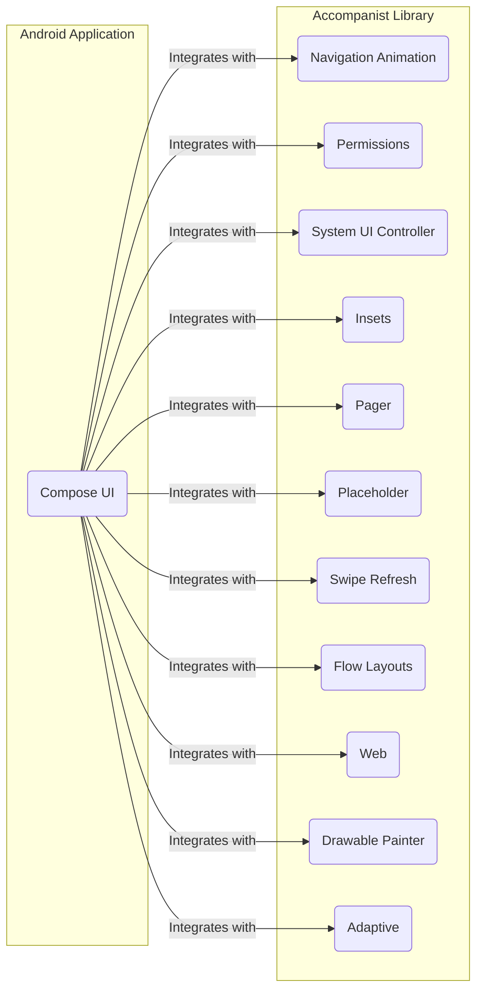
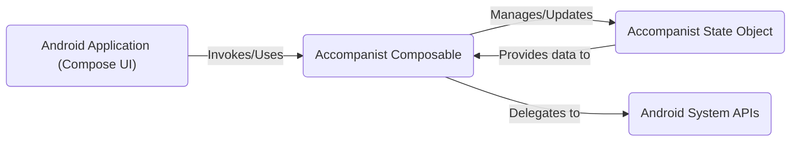

## Project Design Document: Accompanist Library (Improved)

**1. Introduction**

This document provides an enhanced design overview of the Accompanist library, a collection of utility libraries for Jetpack Compose on Android. Its primary purpose is to serve as a robust foundation for subsequent threat modeling activities. It comprehensively details the library's architecture, key components, data flow mechanisms, and dependencies, thereby facilitating a thorough understanding of its functionality and potential attack surfaces.

**1.1. Project Overview**

Accompanist is designed to augment Jetpack Compose by offering supplementary and often experimental UI components and utilities. Organized into distinct modules, it addresses various facets of Android development with Compose, including navigation enhancements, permission management, system UI control, and more. The library's modularity allows developers to selectively integrate only the required components, optimizing application size and reducing unnecessary dependencies.

**1.2. Goals of this Document**

*   Provide a clear and unambiguous description of the Accompanist library's architecture and functionality.
*   Precisely identify key components and elucidate their interactions.
*   Illustrate the flow of data both within the library and between the library and the hosting application.
*   Thoroughly document all external dependencies and integration points.
*   Establish a strong basis for identifying and analyzing potential security threats and vulnerabilities.

**1.3. Scope**

This document focuses specifically on the design of the Accompanist library itself and its integration within an Android application utilizing Jetpack Compose. It does not delve into the internal implementation specifics of the Android framework or the detailed workings of individual applications that incorporate Accompanist.

**2. System Architecture**

The Accompanist library is architected as a suite of independent modules, each dedicated to a specific set of functionalities. This modular approach enables developers to include only the necessary features, minimizing the library's footprint in applications that do not require all available utilities.

**2.1. Component Details**

*   **Navigation Animation:** Facilitates animated transitions between composable destinations when employing the Jetpack Navigation Component.
    *   Core responsibility: Manages the lifecycle and execution of navigation animations.
    *   Key interaction: Interacts directly with the Navigation Component's `NavController` to orchestrate transitions.
*   **Permissions:** Simplifies the process of requesting and evaluating Android runtime permissions within Compose-based UIs.
    *   Core responsibility: Provides declarative composable APIs to initiate permission requests.
    *   Key interaction: Handles responses from the Android permission system and updates the UI state to reflect permission status.
*   **System UI Controller:** Grants developers the ability to programmatically control the appearance of the Android system bars (status bar and navigation bar) from within Compose.
    *   Core responsibility: Offers functions to dynamically set colors, visibility, and behavior modes of the system bars.
    *   Key interaction: Directly interacts with Android's `Window` and `View` APIs to apply system bar modifications.
*   **Insets:** Offers a set of utilities to effectively manage system screen insets (e.g., areas occupied by the status bar, navigation bar, and display cutouts) within Compose layouts.
    *   Core responsibility: Provides Modifiers and state-holding objects to access and react to changes in system insets.
    *   Key interaction: Relies on Android's `ViewCompat.setOnApplyWindowInsetsListener` to receive and process inset information.
*   **Pager:** Implements a horizontally scrolling pager component, analogous to the `ViewPager` found in the traditional Android View system.
    *   Core responsibility: Manages the internal state of the pager, including the current page index and scroll offset.
    *   Key interaction: Responds to user touch input to enable swiping gestures for navigating between pages.
*   **Placeholder:** Provides a composable element for displaying a placeholder UI while awaiting the loading of actual content.
    *   Core responsibility: Enables customization of the visual appearance of the placeholder.
    *   Key interaction: Controls the placeholder's visibility based on the loading state of the associated content.
*   **Swipe Refresh:** Implements the "swipe-to-refresh" interaction paradigm for triggering content refreshes via a swipe gesture.
    *   Core responsibility: Detects vertical swipe gestures initiated by the user.
    *   Key interaction: Triggers a designated refresh action and provides visual feedback to the user during the refresh process.
*   **Flow Layouts:** Offers composable layouts that arrange child items sequentially, wrapping them to the next line or column when the available space is exhausted.
    *   Core responsibility: Provides variations such as `FlowRow` and `FlowColumn` for different arrangement directions.
    *   Key interaction: Manages the positioning and layout of individual child composable elements.
*   **Web:** Provides a `WebView` composable, facilitating the embedding and display of web content directly within a Compose UI.
    *   Core responsibility: Acts as a composable wrapper around the Android `WebView` class.
    *   Key interaction: Allows for configuration of `WebView` settings and handles communication between the Compose UI and the underlying `WebView` instance.
*   **Drawable Painter:** Offers a mechanism to load and render `Drawable` resources as Compose `Painter` objects.
    *   Core responsibility: Handles the loading of `Drawable` resources from various sources (e.g., resources, files).
    *   Key interaction: Provides a `Painter` instance that can be utilized within Compose UI elements for displaying the loaded drawable.
*   **Adaptive:** Provides utilities and composables aimed at creating adaptive layouts that dynamically adjust their presentation based on screen size, orientation, and other display characteristics.
    *   Core responsibility: Offers tools for defining alternative layouts or UI configurations based on screen properties.
    *   Key interaction: Provides composables and modifiers that allow developers to specify different UI structures for varying screen conditions.

**3. Data Flow**

The typical data flow within Accompanist involves the host Android application interacting with the library's provided composables and state-holding objects. The library components then interact with underlying Android system APIs or manage their internal state to deliver the intended functionality.

**Detailed Data Flow Examples:**

*   **Permissions Module:**
    *   The application invokes a composable from the `Permissions` module, such as `rememberPermissionState(permission)`.
    *   This composable internally manages the permission state for the given permission string and offers functions to request the permission.
    *   Upon requesting a permission, the module uses Android's permission request APIs (e.g., `ActivityCompat.requestPermissions`).
    *   The Android system's response to the permission request updates the internal state managed by the `rememberPermissionState` composable, which in turn triggers recomposition of the UI to reflect the current permission status.
*   **System UI Controller Module:**
    *   The application utilizes functions from the `System UI Controller` module, like `rememberSystemUiController().setStatusBarColor(color)`.
    *   These functions directly call into Android's `Window` and `View` APIs (e.g., `window.statusBarColor = color.toArgb()`) to modify the appearance of the system bars. The data flow is a direct command to the Android system.
*   **Web Module:**
    *   The application includes the `WebView` composable in its layout hierarchy, potentially providing a URL to load.
    *   The `WebView` composable internally manages an instance of the Android `WebView` class.
    *   When a URL is provided, the `WebView` initiates a network request to fetch the web content. The fetched content is then rendered by the `WebView`. Data flows from the application to the `WebView` composable and then out to the network and back into the `WebView` for display.

**4. Dependencies**

Accompanist relies on the following external libraries and the core Android platform:

*   **Jetpack Compose:**  The foundational UI toolkit for Android, upon which Accompanist is built. Specific Compose libraries like `androidx.compose.ui`, `androidx.compose.material`, and others are used.
*   **Kotlin Coroutines:** Used extensively for asynchronous operations, background tasks, and managing state within various modules. Dependencies include `kotlinx.coroutines.core` and potentially `kotlinx.coroutines.android`.
*   **AndroidX Libraries:** A range of AndroidX support libraries are utilized, depending on the specific module's functionality. Examples include:
    *   `androidx.core:core-ktx`
    *   `androidx.lifecycle:lifecycle-runtime-ktx`
    *   `androidx.navigation:navigation-compose` (for the Navigation Animation module)
    *   `androidx.swiperefreshlayout:swiperefreshlayout` (potentially for the Swipe Refresh module's underlying implementation)
*   **Android SDK:**  The core Android Software Development Kit provides the fundamental APIs for interacting with the operating system and device hardware.

**5. Security Considerations (For Threat Modeling)**

This section outlines initial security considerations for each module, serving as a starting point for a more in-depth threat modeling exercise.

*   **Navigation Animation Module:**
    *   **Potential Threat:** Improper handling of navigation state could lead to unexpected navigation flows, potentially exposing sensitive information or functionality.
    *   **Potential Vulnerability:**  If animation logic relies on external data that can be manipulated, it could be exploited to trigger unintended transitions.
*   **Permissions Module:**
    *   **Potential Threat:**  Bypassing permission checks. If the permission state is not reliably managed, malicious code might access protected resources without proper authorization.
    *   **Potential Vulnerability:** UI redressing attacks where a malicious app overlays UI elements to trick users into granting permissions they didn't intend to grant.
*   **System UI Controller Module:**
    *   **Potential Threat:** UI spoofing. A malicious application could manipulate system bar colors or visibility to deceive users about the app's context or legitimacy.
    *   **Potential Vulnerability:** Denial of Service (DoS) if rapid or excessive changes to system bar properties cause performance issues or instability.
*   **Insets Module:**
    *   **Potential Threat:** Information leakage if inset information is inadvertently exposed or used in a way that reveals sensitive layout details.
    *   **Potential Vulnerability:**  Incorrect handling of inset values could lead to UI rendering issues or unexpected behavior, potentially exploitable for UI-based attacks.
*   **Pager Module:**
    *   **Potential Threat:**  Denial of Service if a large number of pages or complex page content leads to performance degradation or crashes.
    *   **Potential Vulnerability:**  If page content is dynamically loaded and not properly sanitized, it could be a vector for injecting malicious content.
*   **Placeholder Module:**
    *   **Potential Threat:**  Misleading users if the placeholder UI is designed to mimic legitimate content, potentially facilitating phishing or social engineering attacks.
*   **Swipe Refresh Module:**
    *   **Potential Threat:**  Manipulation of the refresh trigger. A malicious actor might simulate swipe gestures to trigger unintended refresh actions.
*   **Flow Layouts Module:**
    *   **Potential Threat:**  Denial of Service if extremely large or complex layouts cause excessive rendering time or memory consumption.
*   **Web Module:**
    *   **Potential Threat:** Cross-Site Scripting (XSS) vulnerabilities if the `WebView` renders untrusted web content without proper sanitization.
    *   **Potential Threat:**  Man-in-the-Middle (MITM) attacks if the `WebView` communicates with remote servers over insecure connections (HTTP).
    *   **Potential Threat:**  Local file access vulnerabilities if the `WebView` is configured to allow access to local files, which could be exploited to access sensitive data.
*   **Drawable Painter Module:**
    *   **Potential Threat:**  Loading malicious drawables from untrusted sources could potentially exploit vulnerabilities in the image decoding process.
*   **Adaptive Module:**
    *   **Potential Threat:**  Incorrectly adapting layouts could lead to information disclosure if sensitive information is displayed on certain screen sizes or orientations.

**6. Target Audience and Use Cases**

The primary target audience for the Accompanist library comprises Android developers utilizing Jetpack Compose who require additional UI components or utility functions not natively available within the core Compose framework.

**Common Use Cases:**

*   Implementing visually appealing and smooth animated transitions between different screens or destinations within a Compose-based navigation graph.
*   Streamlining the process of requesting and managing runtime permissions required by the application.
*   Customizing the visual appearance of the Android system status bar and navigation bar to align with the application's design language.
*   Effectively handling system screen insets to create immersive user interfaces that adapt seamlessly to various device screen configurations, including notches and rounded corners.
*   Implementing horizontally scrolling carousels or page viewers for displaying collections of content.
*   Providing visual feedback to users while content is being loaded from network resources or local storage using placeholder UI elements.
*   Adding the familiar "swipe-to-refresh" interaction to refresh dynamically loaded data within a view.
*   Constructing flexible and responsive layouts that adapt gracefully to different screen sizes and orientations.
*   Embedding and displaying web content within a native Android application using a `WebView` composable.

**7. Future Considerations**

As the Accompanist library continues to evolve, new modules and features are likely to be introduced. Future iterations of this design document should incorporate these additions and re-evaluate the associated security implications to maintain a comprehensive understanding of the library's architecture and potential attack surfaces. This includes considering the impact of new dependencies and integration points.