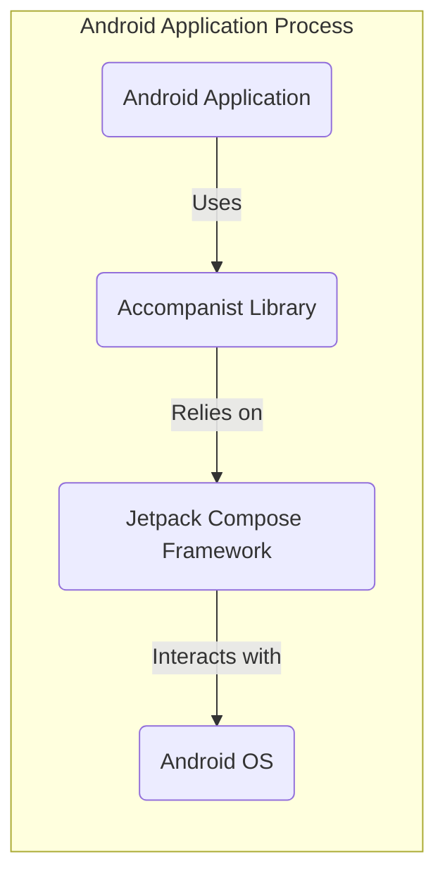

# Project Design Document: Accompanist Library

**Version:** 1.1
**Date:** October 26, 2023
**Author:** AI Software Architect

## 1. Introduction

This document provides an enhanced and more detailed design overview of the Accompanist library, a collection of utility libraries for Jetpack Compose. This document serves as a robust foundation for subsequent threat modeling activities, offering a clear understanding of the architecture, components, and interactions within the library and its operational environment.

## 2. Goals

*   Present a comprehensive and refined architectural overview of the Accompanist library.
*   Clearly define the responsibilities and functionalities of each key component.
*   Elaborate on the interactions between components, the hosting application, and external systems.
*   Establish a precise and detailed understanding of the library's functionality specifically for security analysis and threat identification.

## 3. Scope

This document encompasses the design of the Accompanist library within the context of an Android application utilizing Jetpack Compose. It focuses on the library's internal structure, its interactions with the Android operating system, the Jetpack Compose framework, and the hosting application. The document does not delve into the intricate implementation details of the Android framework itself or the specific business logic of applications integrating Accompanist.

## 4. Target Audience

This document is primarily intended for:

*   Security engineers tasked with performing threat modeling, security assessments, and penetration testing.
*   Software developers actively contributing to the development, maintenance, and extension of the Accompanist library.
*   Software architects responsible for designing systems and applications that integrate with the Accompanist library.

## 5. Architectural Overview

The Accompanist library is structured as a suite of independent, focused modules, each designed to provide specific enhancements and utility functions for Jetpack Compose development. It is intended for direct integration into an Android application as a standard dependency.

**Description:**

*   **Android Application:** The host application that integrates and leverages the functionalities provided by the Accompanist library. This is where the Accompanist library is instantiated and utilized.
*   **Accompanist Library:** The central focus of this design document, comprising various independent utility modules designed to augment Jetpack Compose development.
*   **Jetpack Compose Framework:** Google's declarative UI toolkit for building native Android UIs. Accompanist is built upon and extends the capabilities of this framework.
*   **Android OS:** The underlying operating system that provides access to device resources, system services, and hardware functionalities. Accompanist modules often interact with OS-level APIs.

## 6. Component Design

Accompanist is organized into a set of distinct and self-contained modules. Key modules and their functionalities are detailed below:

*   **System UI Controller:**
    *   **Functionality:** Provides developers with programmatic control over the Android system UI elements, specifically the status bar and navigation bar.
    *   **Details:** Allows customization of colors, visibility (e.g., making the status bar translucent), and behavior (e.g., setting light/dark content appearance). Directly interacts with Android system APIs related to window management and decor.
    *   **Example Use:** Setting the status bar color to match the application's toolbar.
*   **Navigation Material:**
    *   **Functionality:** Facilitates seamless integration of Material Design's bottom navigation and navigation drawer components within Jetpack Compose applications.
    *   **Details:** Manages the state, visibility, and interactions associated with these navigation elements. It relies on and extends Compose's navigation components (`androidx.navigation:navigation-compose`).
    *   **Example Use:** Implementing a bottom navigation bar that switches between different screens in the app.
*   **Permissions:**
    *   **Functionality:** Simplifies the process of requesting and managing Android runtime permissions within a Compose-based UI.
    *   **Details:** Offers composable APIs for initiating permission requests and observing the current permission state (granted, denied, etc.). It acts as a wrapper around Android's standard permission request APIs, providing a more Compose-friendly interface.
    *   **Example Use:** Requesting camera permission when the user attempts to access the camera feature.
*   **Pager:**
    *   **Functionality:** Implements a high-performance and customizable pager component for displaying a sequence of horizontally scrollable content (like view pagers).
    *   **Details:** Manages the state of the pager (current page, scroll position), handles animations during page transitions, and manages user interactions (swiping). Built using Compose's layout and animation APIs.
    *   **Example Use:** Displaying a series of onboarding screens or image galleries.
*   **Insets:**
    *   **Functionality:** Provides utilities for handling system UI insets, which are areas obscured by system UI elements like the status bar, navigation bar, and IME (Input Method Editor). Ensures application content is displayed correctly without being overlapped.
    *   **Details:** Offers composables and modifiers that allow developers to consume and apply these insets to their layouts, adding appropriate padding or margin. Interacts with Android's `WindowInsets` APIs.
    *   **Example Use:** Ensuring that content scrolls behind the translucent status bar without being clipped.
*   **Flow Layouts:**
    *   **Functionality:** Offers various flow layout implementations, such as chip layouts and staggered grid layouts, for arranging composable elements in a flexible manner.
    *   **Details:** Manages the layout and positioning of child composables based on available space and layout constraints. Built using Compose's foundational layout primitives.
    *   **Example Use:** Displaying a list of tags or filters as chips that wrap onto the next line when they don't fit.
*   **Swipe Refresh:**
    *   **Functionality:** Provides a composable implementation of the swipe-to-refresh interaction pattern, allowing users to trigger a refresh of content by swiping down on a list or view.
    *   **Details:** Manages the refresh state (idle, refreshing), displays the refresh indicator, and triggers the provided refresh action. Relies on Compose's gesture detection and animation APIs.
    *   **Example Use:** Implementing pull-to-refresh functionality in a list of news articles.
*   **Web:**
    *   **Functionality:** Offers composable wrappers around Android's `WebView` component, enabling the embedding and interaction with web content directly within a Compose UI.
    *   **Details:** Provides a way to integrate web pages and web applications into native Android apps built with Compose. Delegates rendering and interaction to the underlying `WebView` implementation.
    *   **Example Use:** Displaying a terms of service page or embedding a web-based video player.
*   **Drawable Painter:**
    *   **Functionality:** Provides utilities for working with Android `Drawable` objects within the Compose world.
    *   **Details:** Allows rendering traditional Android `Drawable` resources as Compose content, bridging the gap between the older drawable system and Compose's modern painting APIs.
    *   **Example Use:** Displaying a custom vector drawable loaded from resources.
*   **Material:**
    *   **Functionality:** Offers extensions, utility functions, and customisations related to Material Design components within Jetpack Compose.
    *   **Details:** Provides helper functions and composables to simplify working with Material theming, typography, and components.
    *   **Example Use:** Applying a custom Material Design shape to a button.

## 7. Data Flow and Interactions

The Accompanist library acts as an intermediary, facilitating interactions primarily between the Android application's user interface (constructed with Jetpack Compose) and the underlying Android system or other components within the application.

**Common Data Flow Patterns:**

*   **User Interaction -> Accompanist -> System API:** A user action within the Compose UI triggers an event handled by an Accompanist module, which then interacts with relevant Android system APIs. *Example: A user toggles the visibility of the navigation bar via a control provided by the `System UI Controller` module, which then calls Android OS APIs to effect the change.*
*   **System State Change -> Accompanist -> UI Update:** Changes in the Android system state are observed by Accompanist modules, which then trigger updates in the Compose UI to reflect these changes. *Example: The system reports a change in the available screen insets. The `Insets` module captures this and provides updated inset values to the composables, causing them to re-layout.*
*   **Application Logic -> Accompanist -> UI Manipulation:** Application logic utilizes Accompanist modules to control UI elements or manage system interactions in a declarative manner. *Example: The application's view model uses the `Permissions` module to initiate a permission request flow based on a user action.*
*   **UI Event -> Accompanist -> Application Logic Callback:** User interactions with Accompanist components can trigger callbacks or events that are handled by the application's business logic. *Example: A user swipes to refresh a list managed by the `Swipe Refresh` module. This triggers a callback to the application's data fetching logic.*

**Specific Data Flow Examples:**

*   **System UI Controller:** The application's UI code calls a function in the `SystemUiController` module to set the status bar color. This call internally interacts with Android's `Window` and `View` APIs to modify the system UI.
*   **Permissions:** When the application uses `rememberPermissionState()` from the `Permissions` module to request a permission, it triggers an intent to the Android permission management system. The result of the permission request (granted or denied) is then communicated back to the composable through the `PermissionState` object.
*   **Pager:** When a user swipes on a `Pager` component, the component's internal state (current page) is updated. This state change triggers a recomposition of the composables within the pager, displaying the new page.

## 8. Security Considerations (Detailed)

While Accompanist primarily focuses on UI enhancements, several potential security considerations arise from its functionalities and interactions:

*   **Permission Handling Vulnerabilities:**
    *   **Issue:** Incorrect implementation or usage of the `Permissions` module might lead to scenarios where sensitive permissions are not properly requested or checked, potentially granting unauthorized access to device resources (camera, location, etc.).
    *   **Threat:** Privilege escalation, unauthorized data access.
*   **WebView Security Risks:**
    *   **Issue:** The `Web` module, if not used with caution, can introduce vulnerabilities inherent to `WebView`, such as Cross-Site Scripting (XSS) if loading untrusted web content, or potential data leakage if handling sensitive information within the web view.
    *   **Threat:** XSS attacks, data exfiltration, man-in-the-middle attacks if not using HTTPS.
*   **System UI Manipulation Exploits:**
    *   **Issue:** While intended for customization, improper or malicious use of the `System UI Controller` could lead to deceptive UI patterns, potentially tricking users into performing unintended actions.
    *   **Threat:** UI spoofing, phishing attacks.
*   **Dependency Chain Vulnerabilities:**
    *   **Issue:** Accompanist relies on various Jetpack Compose and Android KTX libraries. Vulnerabilities in these underlying dependencies could indirectly affect applications using Accompanist.
    *   **Threat:** Exploitation of known vulnerabilities in dependencies. Regular dependency updates and security scanning are crucial.
*   **Data Exposure through UI Components:**
    *   **Issue:** Care must be taken when displaying sensitive data within composables managed by Accompanist modules. Improper handling or logging of data could lead to unintended exposure.
    *   **Threat:** Information disclosure, data breaches.
*   **Input Validation (Less Common but Possible):**
    *   **Issue:** While less frequent, if Accompanist components accept user input or parameters that influence their behavior, insufficient input validation could lead to vulnerabilities like injection attacks.
    *   **Threat:** Code injection, denial of service.

These security considerations will form the basis for a more in-depth threat model, where specific threats, vulnerabilities, and mitigations will be analyzed.

## 9. Dependencies

Accompanist depends on a range of Jetpack Compose libraries and potentially other Android KTX libraries to function correctly. Key dependency categories include:

*   **Jetpack Compose UI Libraries:**
    *   `androidx.compose.ui:ui`
    *   `androidx.compose.material:material`
    *   `androidx.compose.runtime:runtime`
    *   `androidx.compose.foundation:foundation`
    *   `androidx.compose.animation:animation`
*   **Jetpack Lifecycle Libraries:**
    *   `androidx.lifecycle:lifecycle-runtime-ktx`
    *   `androidx.lifecycle:lifecycle-viewmodel-compose`
*   **Jetpack Navigation Libraries (for `navigation-material`):**
    *   `androidx.navigation:navigation-compose`
*   **Android KTX Libraries (as needed by specific modules):**
    *   Potentially `androidx.core:core-ktx` and others.

The precise list of dependencies for each module can be found in the respective `build.gradle` files within the Accompanist project.

## 10. Deployment

The Accompanist library is distributed as individual Android library modules through Maven Central. Developers integrate Accompanist into their Android projects by declaring the desired module dependencies within their application's `build.gradle` (or `build.gradle.kts`) files.

## 11. Future Considerations

Potential future developments and changes that could influence the architecture and security posture of the Accompanist library include:

*   **Expansion with New Modules:** The addition of new modules providing functionalities in areas such as media handling, advanced layout techniques, or integration with other Android system services.
*   **Adaptation to Jetpack Compose Updates:** Modifications to align with new features, API changes, or performance improvements in the underlying Jetpack Compose framework.
*   **Refactoring and Optimization:** Internal refactoring of existing modules to enhance performance, improve code maintainability, or address identified issues.
*   **Introduction of New Features within Existing Modules:** Enhancements to the functionality of current modules, potentially introducing new APIs or customization options.
*   **Adoption of New Security Best Practices:** Incorporating new security guidelines and practices as they emerge in the Android and Kotlin development landscape.

This document represents the current design of the Accompanist library and will be subject to updates and revisions as the library evolves and new considerations arise.