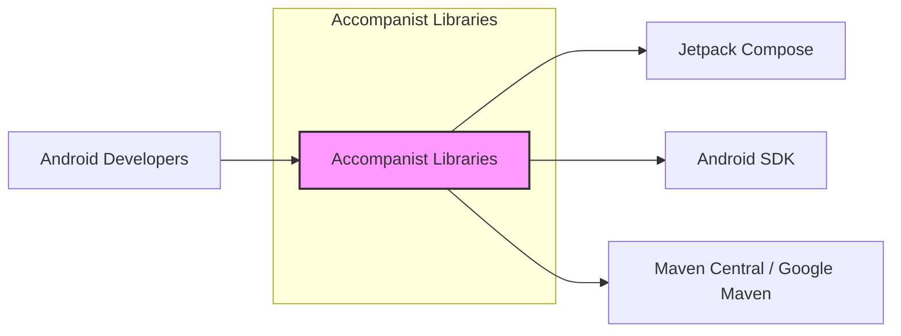
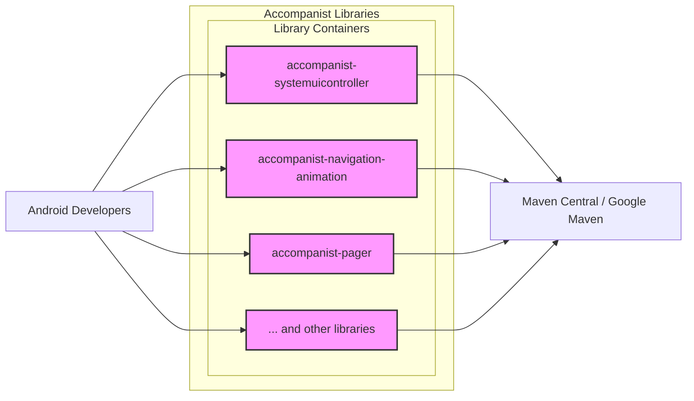
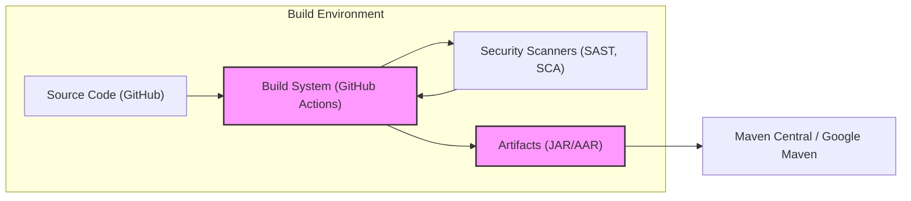
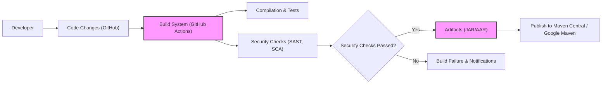

# BUSINESS POSTURE

This project, known as Accompanist, is a suite of Jetpack Compose libraries. Its primary business goal is to enhance the Android development ecosystem by providing supplementary functionalities and utilities that are not yet natively available in Jetpack Compose. By offering these libraries, the project aims to improve developer productivity, simplify common UI development tasks, and encourage wider adoption of Jetpack Compose.

Business Priorities:
- Enhance Jetpack Compose developer experience.
- Provide reusable and high-quality UI components and utilities for Jetpack Compose.
- Promote the adoption and usage of Jetpack Compose within the Android development community.
- Maintain and expand the library set based on community needs and Jetpack Compose evolution.

Business Risks:
- Risk of reduced developer adoption if the libraries are not perceived as useful, reliable, or well-maintained.
- Risk of security vulnerabilities within the libraries that could impact applications using them, potentially damaging developer trust.
- Risk of feature overlap or conflict with future native Jetpack Compose functionalities, leading to obsolescence or rework.
- Risk of insufficient community contribution or maintenance, potentially leading to stagnation or security issues not being addressed promptly.

# SECURITY POSTURE

Existing Security Controls:
- security control: Open Source Development - The project is developed openly on GitHub, allowing for community review of code and identification of potential issues. Implemented in: GitHub repository and development process.
- security control: Version Control - Git and GitHub are used for version control, providing history and traceability of changes. Implemented in: GitHub repository.
- security control: Issue Tracking - GitHub Issues are used for bug reports, feature requests, and discussions, allowing for community reporting of potential security concerns. Implemented in: GitHub repository.
- security control: Community Contributions - External contributions are accepted via pull requests, potentially bringing in diverse perspectives and code review. Implemented in: GitHub contribution process.

Accepted Risks:
- accepted risk: Reliance on Community Security Review - Security relies partly on the open-source community to identify and report vulnerabilities, which may not be as comprehensive as dedicated security testing.
- accepted risk: Third-Party Dependencies - The libraries may depend on third-party libraries, inheriting their potential vulnerabilities.
- accepted risk: Open Source Supply Chain Risks - Potential risks associated with the open-source supply chain, although mitigated by being a Google project and hosted on GitHub.

Recommended Security Controls:
- security control: Automated Security Scanning - Implement automated Static Application Security Testing (SAST) and Dependency Scanning in the CI/CD pipeline to detect potential vulnerabilities in code and dependencies.
- security control: Regular Security Audits - Conduct periodic security audits, potentially by internal Google security teams or external security experts, to proactively identify and address security weaknesses.
- security control: Vulnerability Disclosure Policy - Establish a clear vulnerability disclosure policy to provide a channel for security researchers to report vulnerabilities responsibly.
- security control: Security Champions - Designate security champions within the development team to promote security awareness and best practices.
- security control: Software Composition Analysis (SCA) - Implement SCA tools to continuously monitor and manage open source components, ensuring awareness of known vulnerabilities and license compliance.

Security Requirements:
- Authentication:
  - Requirement: For contributors, GitHub authentication is required to contribute code.
  - Requirement: For users, no direct authentication is required as it's a library consumed by applications.
- Authorization:
  - Requirement: GitHub's role-based access control manages contributor permissions to the repository (read, write, admin).
  - Requirement: Library usage within applications is governed by Android application permissions, not directly by the library itself.
- Input Validation:
  - Requirement: Libraries should implement robust input validation to prevent common vulnerabilities like injection attacks or denial-of-service when processing data within applications.
  - Requirement: Validate inputs from application developers and potentially external sources if the libraries interact with external data.
- Cryptography:
  - Requirement: If any libraries handle sensitive data or require secure communication, appropriate and well-vetted cryptographic libraries and practices must be used. (Assess if cryptography is needed based on library functionalities).
  - Requirement: Ensure proper key management if cryptographic operations are performed.

# DESIGN

## C4 CONTEXT

Context Diagram Elements:

- Element:
  - Name: Android Developers
  - Type: Person
  - Description: Developers who build Android applications using Jetpack Compose and utilize Accompanist libraries to enhance their applications.
  - Responsibilities: Use Accompanist libraries to build Android applications, report issues and contribute to the project.
  - Security controls: Rely on the security of their development environments and application development practices.

- Element:
  - Name: Accompanist Libraries
  - Type: Software System
  - Description: A collection of Jetpack Compose libraries providing supplementary functionalities and utilities for Android UI development.
  - Responsibilities: Provide reusable UI components and utilities, maintain code quality and security, publish libraries to package repositories.
  - Security controls: Input validation within libraries, secure coding practices, vulnerability scanning, dependency management.

- Element:
  - Name: Jetpack Compose
  - Type: Software System
  - Description: Google's modern UI toolkit for building native Android apps. Accompanist libraries are designed to work with and extend Jetpack Compose.
  - Responsibilities: Provide core UI framework for Android, maintain API stability and security.
  - Security controls: Jetpack Compose's own security measures and development practices.

- Element:
  - Name: Android SDK
  - Type: Software System
  - Description: The Android Software Development Kit, providing tools, libraries, and APIs necessary for Android development. Accompanist libraries are built using the Android SDK.
  - Responsibilities: Provide platform APIs and tools for Android development, maintain platform security.
  - Security controls: Android platform security features and SDK development practices.

- Element:
  - Name: Maven Central / Google Maven
  - Type: Software System
  - Description: Repositories where Accompanist libraries are published and distributed for developers to include in their Android projects.
  - Responsibilities: Host and distribute software libraries, ensure availability and integrity of packages.
  - Security controls: Repository security measures, package signing and verification.

## C4 CONTAINER

Container Diagram Elements:

- Element:
  - Name: accompanist-systemuicontroller
  - Type: Library Container
  - Description: A specific Accompanist library focused on controlling the system UI aspects like status bar and navigation bar in Android applications.
  - Responsibilities: Provide APIs for developers to manage system UI elements, ensure compatibility with different Android versions and devices.
  - Security controls: Input validation for API parameters, secure coding practices to prevent UI-related vulnerabilities.

- Element:
  - Name: accompanist-navigation-animation
  - Type: Library Container
  - Description: A specific Accompanist library providing animated navigation transitions for Jetpack Compose Navigation.
  - Responsibilities: Implement smooth and customizable navigation animations, ensure correct navigation behavior and state management.
  - Security controls: Secure state management to prevent navigation-related vulnerabilities, input validation for animation parameters.

- Element:
  - Name: accompanist-pager
  - Type: Library Container
  - Description: A specific Accompanist library offering pager components similar to ViewPager for Jetpack Compose.
  - Responsibilities: Provide efficient and customizable pager UI components, handle user interactions and data loading.
  - Security controls: Input validation for data displayed in pager, secure handling of user input and gestures.

- Element:
  - Name: ... and other libraries
  - Type: Library Container
  - Description: Represents other individual libraries within the Accompanist suite, each providing specific functionalities.
  - Responsibilities: Each library has its own specific responsibilities based on its functionality, all contributing to the overall goals of Accompanist.
  - Security controls: Security controls are applied individually to each library based on its specific functionalities and potential risks.

- Element:
  - Name: Maven Central / Google Maven
  - Type: Package Repository
  - Description:  The distribution platform for Accompanist libraries, making them available to Android developers.
  - Responsibilities: Securely host and distribute library artifacts, ensure integrity and availability of packages.
  - Security controls: Repository security measures, package signing and verification to ensure authenticity.

- Element:
  - Name: Android Developers
  - Type: Person
  - Description: Developers who integrate Accompanist libraries into their Android applications.
  - Responsibilities: Properly integrate and utilize libraries in their applications, follow secure coding practices in their own application development.
  - Security controls: Application-level security controls, secure usage of libraries.

## DEPLOYMENT

Deployment Architecture: Library Distribution

Deployment Diagram Elements:

- Element:
  - Name: Build System (GitHub Actions)
  - Type: CI/CD System
  - Description: Automated build and deployment pipeline using GitHub Actions. Responsible for compiling code, running tests, performing security scans, and publishing artifacts.
  - Responsibilities: Automate build process, execute tests, perform security checks, build artifacts, and publish to repositories.
  - Security controls: Secure build environment, access control to CI/CD pipelines, secrets management for repository credentials, automated security scanning integration.

- Element:
  - Name: Source Code (GitHub)
  - Type: Code Repository
  - Description: GitHub repository hosting the source code of Accompanist libraries.
  - Responsibilities: Store and manage source code, version control, track changes, manage contributions.
  - Security controls: Access control to repository, branch protection, code review process, vulnerability scanning on code.

- Element:
  - Name: Security Scanners (SAST, SCA)
  - Type: Security Tool
  - Description: Static Application Security Testing (SAST) and Software Composition Analysis (SCA) tools integrated into the build pipeline to automatically detect security vulnerabilities in code and dependencies.
  - Responsibilities: Identify potential security vulnerabilities in source code and dependencies during the build process.
  - Security controls: Regularly updated vulnerability databases, accurate scanning results, integration with build pipeline for automated checks.

- Element:
  - Name: Artifacts (JAR/AAR)
  - Type: Build Artifact
  - Description: Compiled library artifacts (JAR/AAR files) produced by the build system. These are the distributable packages of Accompanist libraries.
  - Responsibilities: Package compiled code and resources, ensure integrity of build artifacts.
  - Security controls: Artifact signing to ensure authenticity and integrity, secure storage of build artifacts before publishing.

- Element:
  - Name: Maven Central / Google Maven
  - Type: Package Repository
  - Description: Public repositories where the compiled Accompanist library artifacts are published and made available for download by Android developers.
  - Responsibilities: Host and distribute library artifacts, ensure availability and integrity of packages, manage package versions.
  - Security controls: Repository security measures, package signing and verification, access control to publishing process.

## BUILD

Build Process Diagram:

Build Process Description:

1. Developer: Developers write code and commit changes to the GitHub repository.
2. Code Changes (GitHub): Code changes are pushed to the GitHub repository, triggering the build process.
3. Build System (GitHub Actions): GitHub Actions workflow is triggered automatically on code changes (e.g., push, pull request).
4. Compilation & Tests: The build system compiles the source code and runs automated unit and integration tests to ensure code quality and functionality.
5. Security Checks (SAST, SCA): Automated security checks are performed using SAST and SCA tools to scan the code and dependencies for potential vulnerabilities.
6. Security Checks Passed?: The build process checks if security scans have passed without critical or high severity findings.
7. Artifacts (JAR/AAR): If security checks and tests pass, the build system packages the compiled code into JAR/AAR artifacts.
8. Build Failure & Notifications: If security checks or tests fail, the build process fails, and notifications are sent to developers to address the issues.
9. Publish to Maven Central / Google Maven: Upon successful build and security checks, the artifacts are published to Maven Central and/or Google Maven repositories, making them available for developers to use.

Build Security Controls:
- security control: Automated Build Process - GitHub Actions automates the build process, reducing manual errors and ensuring consistent builds.
- security control: Source Code Management - Git and GitHub provide version control and track changes to the codebase, enhancing traceability and accountability.
- security control: Automated Testing - Unit and integration tests are run automatically during the build process to ensure code quality and catch regressions.
- security control: Static Application Security Testing (SAST) - SAST tools are integrated into the build pipeline to automatically scan the source code for potential security vulnerabilities.
- security control: Software Composition Analysis (SCA) - SCA tools are used to analyze project dependencies and identify known vulnerabilities in third-party libraries.
- security control: Build Artifact Signing - Build artifacts are signed to ensure authenticity and integrity, preventing tampering after publication.
- security control: Access Control to Build System - Access to modify build configurations and pipelines is restricted to authorized personnel.
- security control: Secrets Management - Sensitive credentials used in the build process (e.g., repository publishing keys) are securely managed using GitHub Secrets or similar mechanisms.

# RISK ASSESSMENT

Critical Business Processes:
- Providing valuable and reliable Jetpack Compose libraries to the Android developer community.
- Maintaining the integrity and security of the Accompanist libraries to ensure developer trust and prevent harm to applications using them.
- Ensuring the availability and accessibility of the libraries through package repositories.

Data Sensitivity:
- Source Code: Publicly available on GitHub. Sensitivity: Low (public). Integrity and availability are important.
- Build Artifacts (JAR/AAR): Publicly available on Maven Central/Google Maven. Sensitivity: Low (public). Integrity and availability are important.
- Dependency Information: Publicly available in project files. Sensitivity: Low (public).
- Security Scan Results: Potentially contain vulnerability information. Sensitivity: Medium (internal, developers). Confidentiality and integrity are important.
- Build System Credentials: Secrets for publishing and accessing repositories. Sensitivity: High (internal, build team). Confidentiality and integrity are critical.

# QUESTIONS & ASSUMPTIONS

Questions:
- What is the process for handling vulnerability reports for Accompanist libraries? Is there a dedicated security team or contact?
- Are there specific security guidelines or secure coding training followed by the developers contributing to Accompanist?
- What is the frequency of security scans and audits for the project?
- Is there a process for security review of external contributions (pull requests)?
- What are the criteria for failing a build based on security scan results?

Assumptions:
- Google has internal security best practices and guidelines that are generally followed for open-source projects like Accompanist.
- The primary goal of Accompanist is to provide useful and high-quality libraries, and security is considered an important aspect of quality.
- The project benefits from Google's infrastructure and resources, including security tools and expertise.
- The target audience for Accompanist libraries is broad, encompassing a wide range of Android developers and applications.
- The project is actively maintained and will continue to evolve alongside Jetpack Compose.