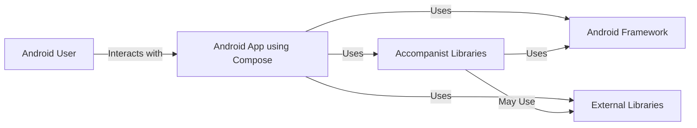
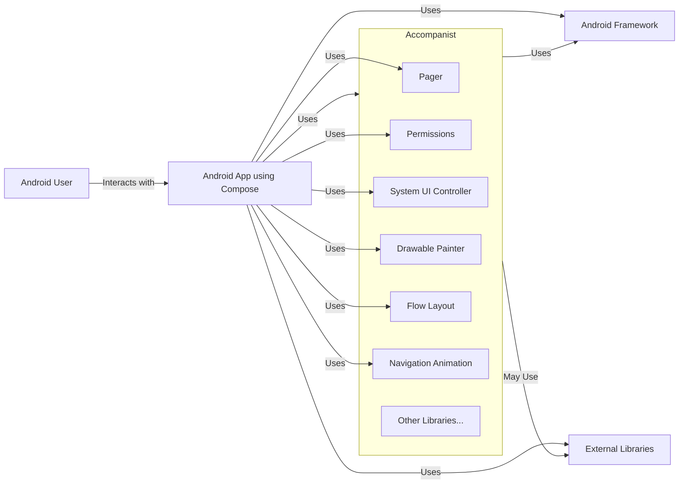
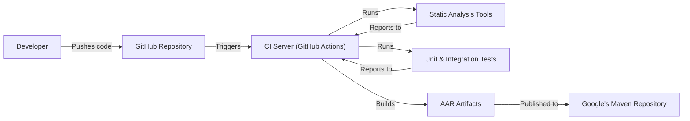

Okay, let's create a design document for the Accompanist project.

# BUSINESS POSTURE

Accompanist is a collection of extension libraries for Jetpack Compose, a modern toolkit for building native Android UI.  It aims to provide powerful, well-tested, and idiomatic features that are not yet available in the core Compose libraries.  The project is open-source and maintained by Google, but it's positioned as experimental and subject to change.

Priorities:

*   Provide developers with easy-to-use, high-quality APIs to enhance their Compose applications.
*   Bridge the gap between existing Android APIs and the new Compose paradigm.
*   Incubate features that may eventually be incorporated into the core Compose libraries.
*   Maintain a high level of code quality and test coverage.
*   Foster a community around Compose development.

Goals:

*   Increase adoption of Jetpack Compose by making it easier to build complex UI features.
*   Reduce boilerplate code for common tasks in Compose development.
*   Provide a playground for experimenting with new Compose APIs and patterns.

Business Risks:

*   API Instability: Since Accompanist is experimental, frequent API changes could break existing applications that depend on it. This is the most significant risk.
*   Lack of Long-Term Support: There's no guarantee that all Accompanist libraries will be maintained indefinitely or migrated into the core Compose libraries.
*   Dependency Conflicts: As a collection of libraries, there's a potential for dependency conflicts with other libraries used in a project.
*   Security Vulnerabilities: While unlikely given Google's involvement, vulnerabilities in Accompanist libraries could impact the security of applications using them.
*   Community Adoption: If the libraries are not widely adopted, the community support and contribution might be limited.

# SECURITY POSTURE

Existing Security Controls:

*   security control: Code Reviews: All code changes go through a code review process on GitHub. (Implicit in the open-source nature and Google's development practices).
*   security control: Static Analysis: Likely use of static analysis tools like Android Lint and potentially other internal Google tools to identify potential code quality and security issues. (Assumed based on Google's standard practices).
*   security control: Testing: Extensive unit and integration tests are present to ensure the correctness and stability of the libraries. (Visible in the repository structure).
*   security control: Open Source: The open-source nature of the project allows for community scrutiny and contributions, potentially identifying and fixing security issues faster.
*   security control: Dependency Management: Dependencies are managed through Gradle, allowing for version control and updates. (Visible in the build.gradle files).

Accepted Risks:

*   accepted risk: API Instability: The experimental nature of the libraries means that breaking changes are expected and accepted.
*   accepted risk: Limited Security Auditing: While code reviews and static analysis are likely, dedicated security audits may be less frequent compared to core Android components.

Recommended Security Controls:

*   security control: Regular Security Audits: Conduct periodic security audits, even if lightweight, to identify potential vulnerabilities.
*   security control: Fuzz Testing: Implement fuzz testing to identify edge cases and potential vulnerabilities related to input handling.
*   security control: Dependency Scanning: Integrate automated dependency scanning tools (e.g., OWASP Dependency-Check) into the build process to identify known vulnerabilities in third-party libraries.
*   security control: Supply Chain Security: Implement measures to ensure the integrity of the build pipeline and prevent malicious code injection. This could involve signing artifacts and using trusted build environments.

Security Requirements:

*   Authentication: Not directly applicable, as Accompanist is a set of UI libraries, not an authentication service.
*   Authorization: Not directly applicable, as Accompanist doesn't handle user roles or permissions.
*   Input Validation: Libraries that handle user input (e.g., text fields) should perform appropriate input validation to prevent injection attacks (e.g., cross-site scripting in WebView-related components). This is crucial for any UI component.
*   Cryptography: If any libraries handle sensitive data or cryptographic operations, they should use well-established cryptographic algorithms and best practices.  This is less likely to be a core concern for UI libraries, but it's important to consider.
*   Data Handling: If any libraries handle sensitive data, they should follow secure data handling practices, including proper storage and transmission protocols.

# DESIGN

## C4 CONTEXT

C4 Context Element List:

*   Element:
    *   Name: Android User
    *   Type: Person
    *   Description: The end-user of an Android application that utilizes Jetpack Compose and potentially Accompanist libraries.
    *   Responsibilities: Interacts with the user interface of the Android application.
    *   Security controls: N/A - The user is external to the system.

*   Element:
    *   Name: Android App using Compose
    *   Type: Software System
    *   Description: An Android application built using Jetpack Compose, potentially leveraging Accompanist for additional UI features.
    *   Responsibilities: Provides the core functionality of the application to the user.
    *   Security controls: Implements application-specific security controls, including input validation, data handling, and potentially authentication/authorization.

*   Element:
    *   Name: Accompanist Libraries
    *   Type: Software System
    *   Description: A collection of extension libraries for Jetpack Compose.
    *   Responsibilities: Provides additional UI components and utilities to simplify Compose development.
    *   Security controls: Code reviews, static analysis, testing, open-source nature.

*   Element:
    *   Name: Android Framework
    *   Type: Software System
    *   Description: The underlying Android operating system and framework.
    *   Responsibilities: Provides core OS services and APIs, including UI rendering, resource management, and security features.
    *   Security controls: Extensive security controls built into the Android OS, including sandboxing, permission system, and regular security updates.

*   Element:
    *   Name: External Libraries
    *   Type: Software System
    *   Description: Third-party libraries used by the Android application or Accompanist.
    *   Responsibilities: Provide specific functionality not available in the Android Framework or Accompanist.
    *   Security controls: Dependent on the specific library; developers should choose well-maintained libraries with good security practices.

## C4 CONTAINER

Since Accompanist is a collection of libraries, the container diagram is essentially an extension of the context diagram, showing the individual libraries as containers within the "Accompanist Libraries" system.

C4 Container Element List:

* Elements from C4 Context are inherited and still valid.

*   Element:
    *   Name: Pager
    *   Type: Library
    *   Description: Provides components for creating horizontal and vertical pagers.
    *   Responsibilities: Manages the display and scrolling of paged content.
    *   Security controls: Input validation (e.g., handling touch events securely).

*   Element:
    *   Name: Permissions
    *   Type: Library
    *   Description: Simplifies handling runtime permissions in Compose.
    *   Responsibilities: Provides a declarative way to request and manage permissions.
    *   Security controls: Relies on the underlying Android permission system.

*   Element:
    *   Name: System UI Controller
    *   Type: Library
    *   Description: Allows controlling system UI elements like the status bar and navigation bar.
    *   Responsibilities: Provides APIs to modify system UI appearance.
    *   Security controls: Relies on the underlying Android system UI security mechanisms.

*   Element:
    *   Name: Drawable Painter
    *   Type: Library
    *   Description: Provides utilities for working with Drawables in Compose.
    *   Responsibilities: Bridges the gap between traditional Android Drawables and Compose.
    *   Security controls: Input validation if handling external images.

*   Element:
    *   Name: Flow Layout
    *   Type: Library
    *   Description: Provides a flow layout implementation for Compose.
    *   Responsibilities: Arranges child composables in a flowing layout.
    *   Security controls: General UI security best practices.

*   Element:
    *   Name: Navigation Animation
    *   Type: Library
    *   Description: Provides animations for Jetpack Navigation Compose.
    *   Responsibilities: Enhances navigation transitions with animations.
    *   Security controls: General UI security best practices.

*   Element:
    *   Name: Others
    *   Type: Library
    *   Description: Represents other Accompanist libraries.
    *   Responsibilities: Varies depending on the specific library.
    *   Security controls: Varies depending on the specific library.

## DEPLOYMENT

Accompanist libraries are deployed as standard Android library artifacts (AARs) through Maven repositories (likely Google's Maven repository).  Developers include these libraries as dependencies in their projects' build.gradle files.

Possible Deployment Solutions:

1.  **Google's Maven Repository:** The most likely and standard approach for distributing Android libraries.
2.  **JitPack:**  A popular alternative for publishing open-source libraries. Less likely for a Google-maintained project.
3.  **Local Build:** Developers could clone the repository and build the libraries locally, but this is not the typical deployment method.

Chosen Solution (Google's Maven Repository):

```mermaid
graph LR
    DevMachine["Developer Machine"]
    BuildServer["Build Server (CI)"]
    MavenRepo["Google's Maven Repository"]
    AppProject["App Project (build.gradle)"]
    AndroidDevice["Android Device"]

    DevMachine -- Pushes code to --> BuildServer
    BuildServer -- Builds and publishes --> MavenRepo
    AppProject -- Declares dependency on --> MavenRepo
    MavenRepo -- Provides AAR to --> AppProject
    AppProject -- Builds APK including AAR --> AndroidDevice

```

Deployment Element List:

*   Element:
    *   Name: Developer Machine
    *   Type: Workstation
    *   Description: The developer's local machine where code is written and modified.
    *   Responsibilities: Code development, testing, and pushing changes to the repository.
    *   Security controls: Standard developer workstation security practices (e.g., OS updates, antivirus).

*   Element:
    *   Name: Build Server (CI)
    *   Type: Server
    *   Description: A continuous integration server (e.g., GitHub Actions, Jenkins) that builds and tests the Accompanist libraries.
    *   Responsibilities: Automates the build, test, and publishing process.
    *   Security controls: Secure build environment, access controls, dependency scanning.

*   Element:
    *   Name: Google's Maven Repository
    *   Type: Artifact Repository
    *   Description: Google's repository for hosting Android library artifacts.
    *   Responsibilities: Stores and serves AAR files to developers.
    *   Security controls: Access controls, integrity checks, vulnerability scanning (likely).

*   Element:
    *   Name: App Project (build.gradle)
    *   Type: Configuration File
    *   Description: The build.gradle file of an Android application that uses Accompanist.
    *   Responsibilities: Declares dependencies, including Accompanist libraries.
    *   Security controls: Dependency version management, potentially using dependency locking.

*   Element:
    *   Name: Android Device
    *   Type: Mobile Device
    *   Description: The end-user's Android device where the application is installed.
    *   Responsibilities: Runs the Android application.
    *   Security controls: Android OS security features.

## BUILD

The build process for Accompanist is likely automated using a CI/CD system, probably GitHub Actions, given the project's location on GitHub.

Build Process Description:

1.  **Code Push:** A developer pushes code changes to the Accompanist repository on GitHub.
2.  **CI Trigger:** The push triggers a build on the CI server (GitHub Actions).
3.  **Static Analysis:** Static analysis tools (e.g., Android Lint, ktlint) are run to check for code quality and potential issues.
4.  **Testing:** Unit and integration tests are executed to ensure the code functions correctly.
5.  **Build Artifacts:** If the static analysis and tests pass, the build process creates the AAR artifacts for each library.
6.  **Publish Artifacts:** The AAR artifacts are published to Google's Maven Repository.
7.  **Dependency Scanning:** (Recommended) A dependency scanning tool (e.g., OWASP Dependency-Check) is run to identify known vulnerabilities in third-party libraries.

Security Controls in Build Process:

*   security control: Automated Build: The build process is automated, reducing the risk of manual errors.
*   security control: Static Analysis: Static analysis tools help identify potential code quality and security issues early in the development process.
*   security control: Testing: Automated tests ensure code correctness and help prevent regressions.
*   security control: Dependency Scanning (Recommended): Identifies known vulnerabilities in third-party libraries.
*   security control: Secure Build Environment (Assumed): The CI server is likely configured with appropriate security measures to prevent unauthorized access and code tampering.
*   security control: Artifact Signing (Recommended): Signing the AAR artifacts would provide assurance of their integrity and origin.

# RISK ASSESSMENT

Critical Business Processes:

*   Providing stable and reliable UI components for Jetpack Compose developers.
*   Maintaining the reputation of Google as a provider of high-quality developer tools.
*   Facilitating the adoption of Jetpack Compose.

Data to Protect:

*   Source Code: The source code of the Accompanist libraries is publicly available, so confidentiality is not a primary concern. However, integrity is crucial to prevent malicious code injection. Sensitivity: Low (Public).
*   Build Artifacts (AARs): The integrity of the AAR files is critical to ensure that developers are using the intended code. Sensitivity: Medium (Integrity).
*   Developer Credentials (for CI/CD): Access credentials for the CI/CD system and Maven repository must be protected to prevent unauthorized access and malicious deployments. Sensitivity: High.
*   User Data: Accompanist libraries themselves generally do not handle sensitive user data directly. However, if misused or if vulnerabilities exist, they could potentially be exploited to access or manipulate user data within the context of an application that uses them. Sensitivity: Dependent on the application using Accompanist.

# QUESTIONS & ASSUMPTIONS

Questions:

*   What specific static analysis tools are used in the Accompanist build process?
*   Are there any plans for formal security audits of the Accompanist libraries?
*   What is the process for handling reported security vulnerabilities?
*   Are there any specific security guidelines or best practices for developers using Accompanist?
*   Is artifact signing implemented or planned for the AAR artifacts?

Assumptions:

*   BUSINESS POSTURE: Assumed that Google's internal development practices and standards apply to the Accompanist project.
*   SECURITY POSTURE: Assumed that basic security measures like code reviews and static analysis are in place. Assumed that the CI/CD environment is reasonably secure.
*   DESIGN: Assumed that the deployment process uses Google's Maven Repository. Assumed that the build process is automated using GitHub Actions.