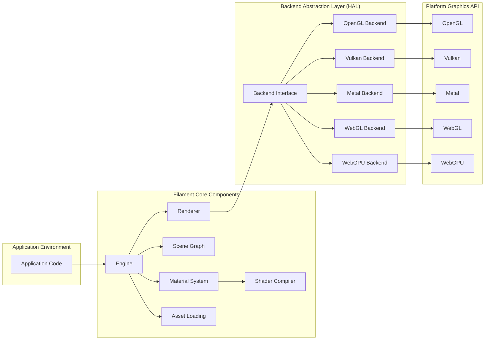
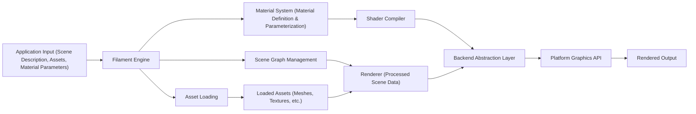

## Project Design Document: Filament Rendering Engine

**1. Introduction**

This document details the architecture of the Filament rendering engine, an open-source, physically based rendering (PBR) engine designed for cross-platform use across Android, iOS, Linux, macOS, Windows, and web environments (WebGL/WebGPU). It serves as a foundation for subsequent threat modeling activities by outlining key components, data flows, and underlying technologies.

**2. Goals**

* To provide a clear and comprehensive architectural overview of the Filament rendering engine.
* To identify and describe the key components and their interactions within the system.
* To illustrate the flow of data throughout the rendering pipeline.
* To list the core technologies and dependencies upon which Filament relies.
* To establish a basis for identifying potential security threats and vulnerabilities during the threat modeling process.

**3. Scope**

This document encompasses the core architectural elements of the Filament rendering engine, specifically focusing on:

* The main rendering pipeline stages and their functions.
* Key internal components such as the Renderer, Scene Graph, Material System, Asset Loading mechanisms, and the Shader Compiler.
* The Backend Abstraction Layer and its role in supporting various graphics APIs.
* The flow of data from application input to the final rendered output.
* Interactions with platform-specific graphics APIs (OpenGL, Vulkan, Metal, WebGL, WebGPU).
* The process of shader compilation and its place in the pipeline.

This document does *not* include:

* In-depth implementation details of specific classes, functions, or algorithms.
* Performance tuning strategies or optimization techniques.
* Specific application integration patterns or use case scenarios.
* Detailed explanations of the build system or development environment setup.
* Comprehensive testing procedures or results.

**4. High-Level Architecture**

Filament employs a modular architecture with a platform-agnostic core and specialized backends for different graphics APIs. This design promotes code reusability and simplifies porting to new platforms.

**5. Detailed Component Breakdown**

* **Application Code:** This represents the user's application code that interacts with the Filament API to define scenes, load assets, configure rendering parameters, and initiate the rendering process.
* **Engine:** The central management component of Filament. It oversees the lifecycle of other components, provides the main API entry points, and coordinates the overall rendering workflow.
* **Renderer:** Responsible for the core rendering logic. It processes scene data and material information to generate the final rendered image. Key responsibilities include:
    * View management (camera setup, viewport configuration, rendering passes).
    * Visibility culling to optimize rendering performance.
    * Shadow map generation and application.
    * Lighting calculations based on light sources and material properties.
    * Implementation of post-processing effects.
* **Scene Graph:**  A hierarchical data structure that organizes the objects within the scene. It manages:
    * Entities: Unique identifiers for all objects in the scene.
    * Components: Data associated with entities, such as transform information, renderable geometry, light sources, and cameras.
    * Transformations:  Representing the position, rotation, and scale of objects in the scene.
* **Material System:** Defines the visual appearance of surfaces. This involves:
    * A Material Definition Language for specifying material properties and shading models.
    * Generation of platform-specific shader code based on material definitions.
    * Mechanisms for binding material parameters at runtime.
* **Asset Loading:** Handles the process of loading external resources required for rendering, including:
    * 3D mesh data representing object geometry.
    * Texture data used for surface color, normals, and other properties.
    * Predefined material configurations.
    * Entire scene descriptions.
* **Shader Compiler:**  Responsible for compiling shader code generated by the Material System into a format that can be understood and executed by the target graphics API. This often involves utilizing external compiler tools like `glslang`.
* **Backend Abstraction Layer (HAL):** Provides a consistent interface to different underlying graphics APIs, allowing the core Filament logic to remain platform-independent.
    * **Backend Interface:** Defines the abstract methods and data structures for interacting with graphics APIs.
    * **OpenGL Backend:** Implements the Backend Interface using the OpenGL API.
    * **Vulkan Backend:** Implements the Backend Interface using the Vulkan API.
    * **Metal Backend:** Implements the Backend Interface using Apple's Metal API.
    * **WebGL Backend:** Implements the Backend Interface using the WebGL API for web browsers.
    * **WebGPU Backend:** Implements the Backend Interface using the modern WebGPU API for web browsers.
* **Platform Graphics API:** The underlying graphics API (OpenGL, Vulkan, Metal, WebGL, WebGPU) used for the actual rendering operations on the target platform.

**6. Data Flow**

The typical flow of data within Filament during the rendering process can be visualized as follows:

1. **Application Input:** The application provides scene descriptions (geometry, lights, cameras), asset paths, and material parameters to the Filament Engine.
2. **Filament Engine:** The Engine receives this input and orchestrates the rendering process by coordinating other components.
3. **Scene Graph Management:** The Engine updates and manages the Scene Graph based on the application's scene description.
4. **Material System (Material Definition & Parameterization):** The application defines materials, and the Material System prepares them for rendering, including handling parameter updates.
5. **Shader Compiler:** The Material System invokes the Shader Compiler to translate material definitions into GPU-executable shader code.
6. **Backend Abstraction Layer:** The compiled shaders and rendering commands are passed to the appropriate Backend Abstraction Layer implementation based on the target platform.
7. **Asset Loading:** The Engine utilizes the Asset Loading component to load necessary resources like meshes and textures from storage.
8. **Loaded Assets:** Loaded assets are made available to the Renderer for use in the rendering process.
9. **Renderer (Processed Scene Data):** The Renderer receives processed scene data from the Scene Graph and asset data.
10. **Platform Graphics API:** The Backend Abstraction Layer translates Filament's rendering commands into API calls specific to the underlying graphics API (OpenGL, Vulkan, Metal, WebGL, WebGPU).
11. **Rendered Output:** The Platform Graphics API performs the actual rendering operations, producing the final image on the screen or a render target.

**7. Key Technologies and Dependencies**

* **C++:** The primary programming language used for developing the Filament core and backend implementations.
* **OpenGL:** A widely adopted cross-platform graphics API.
* **Vulkan:** A modern, low-overhead graphics API offering fine-grained control over the GPU.
* **Metal:** Apple's proprietary, low-overhead graphics API for iOS and macOS.
* **WebGL:** A JavaScript API for rendering interactive 2D and 3D graphics within any compatible web browser.
* **WebGPU:** A modern web graphics API that exposes more advanced GPU features and offers improved performance compared to WebGL.
* **glslang:** The Khronos Group's reference compiler for GLSL (OpenGL Shading Language), used for compiling shaders.
* **SPIRV-Tools:** A collection of tools for processing SPIR-V (Standard Portable Intermediate Representation) shaders, commonly used with Vulkan.
* **CMake:** A cross-platform build system used to manage the compilation and linking process for Filament across different platforms.
* **Android NDK (Native Development Kit):** Required for building Filament for the Android platform.
* **iOS SDK (Software Development Kit):** Required for building Filament for the iOS platform.

**8. Deployment Model**

Filament is typically deployed as a library that is integrated into a host application. The application links against the appropriate Filament library for the target platform and utilizes its API for rendering. Common deployment scenarios include:

* **Desktop Applications (Windows, macOS, Linux):** Filament is linked as a shared or static library, and the necessary runtime dependencies are distributed with the application.
* **Mobile Applications (Android, iOS):** Filament is included within the application package, and the application interacts with it through its native API.
* **Web Applications:** Filament can be used via its WebGL or WebGPU backend. This often involves compiling the C++ codebase to WebAssembly using tools like Emscripten, and the application interacts with Filament through JavaScript bindings.

**9. Security Considerations (Pre-Threat Modeling)**

Before a formal threat modeling exercise, several potential security considerations can be identified based on Filament's architecture:

* **Malicious Shader Code Injection:** If an attacker can influence the material definitions or inject arbitrary shader code, it could lead to arbitrary code execution on the GPU, potentially causing denial of service or information disclosure.
* **Resource Exhaustion Attacks:**  Crafted scenes or assets with excessive complexity (e.g., extremely high polygon counts, large textures) could consume excessive GPU or system memory, leading to application crashes or system instability.
* **Vulnerabilities in Asset Loading:**  If asset loading mechanisms do not properly validate input data, vulnerabilities like buffer overflows or path traversal could be exploited by providing malicious asset files.
* **Third-Party Dependency Vulnerabilities:** Security flaws in external libraries like `glslang` or platform-specific SDKs could indirectly impact Filament's security.
* **API Misuse Leading to Security Issues:** Incorrect or insecure usage of the Filament API by the integrating application could introduce vulnerabilities, such as improper handling of user input or insecure data storage.
* **Graphics Driver Vulnerabilities:**  Bugs or vulnerabilities in the underlying graphics drivers (OpenGL, Vulkan, Metal, etc.) could be exploited through Filament, although this is generally outside of Filament's direct control.
* **Integer Overflows/Underflows in Rendering Calculations:** Potential vulnerabilities could arise from integer overflow or underflow issues in rendering calculations, potentially leading to unexpected behavior or exploitable conditions.
* **Cross-Site Scripting (XSS) in WebGL/WebGPU Contexts:** If Filament is used in a web context, improper handling of user-provided data could lead to XSS vulnerabilities if rendered content is not properly sanitized.

**10. Out of Scope**

This document intentionally excludes the following details:

* Line-by-line code explanations or detailed algorithm descriptions.
* Specific performance metrics or benchmarking results.
* User interface design considerations for applications that utilize Filament.
* Detailed configuration options for the Filament build system.
* Comprehensive testing methodologies, test cases, or testing results.
* Detailed explanations of specific rendering algorithms or techniques implemented within Filament.

This design document provides a necessary architectural foundation for conducting a thorough threat modeling process on the Filament rendering engine. By understanding the components, data flows, and dependencies outlined here, potential security vulnerabilities can be more effectively identified and addressed.