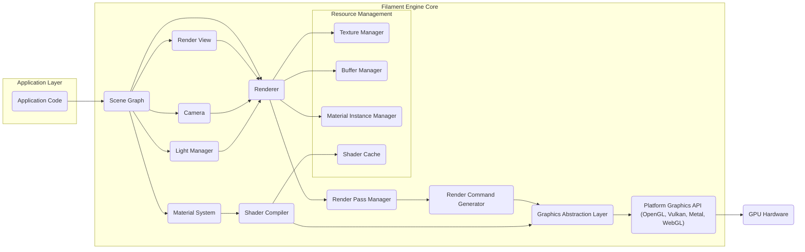

## Project Design Document: Google Filament Rendering Engine (Improved)

**1. Introduction**

This document provides an enhanced architectural overview of the Google Filament rendering engine, specifically tailored for threat modeling purposes. It builds upon the previous version by providing more granular detail on component interactions, data transformations, and potential security vulnerabilities. The focus remains on the core rendering engine and its immediate dependencies, excluding higher-level application integration details unless directly relevant to the engine's security posture.

**2. Project Overview**

Filament is a production-ready, physically based rendering (PBR) engine designed for a wide range of platforms, including Android, iOS, Linux, macOS, Windows, and WebGL. Its architecture emphasizes performance and efficiency while offering a comprehensive suite of modern rendering features. The engine is primarily implemented in C++ and exposes platform-specific APIs for integration.

**3. Goals**

* Deliver a refined and more detailed architectural description of the Filament rendering engine.
* Provide a deeper understanding of the responsibilities and interactions of key components.
* Offer a more granular breakdown of the data flow within the engine, highlighting transformation points.
* Strengthen the initial security considerations, making them more actionable for threat modeling exercises.

**4. Scope**

This document encompasses the core rendering engine components of Filament, with a particular emphasis on areas relevant to security. The scope includes:

* Scene management and organization.
* The comprehensive material system, including shader generation and management.
* Both forward and deferred rendering pipelines, detailing their stages.
* Resource management for various asset types (textures, buffers, shaders, etc.).
* The platform abstraction layer and its role in interfacing with underlying graphics APIs.
* Integration with MaterialX for shader definition and its security implications.

This document explicitly excludes:

* Detailed implementation specifics of application integrations (e.g., platform-specific windowing or input handling).
* The intricacies of the build system and development environment setup.
* External tools and asset pipeline details beyond their direct interaction with the engine's loading and processing stages.
* Highly specific rendering algorithms unless they present unique security considerations.

**5. System Architecture**

**6. Key Components (Detailed)**

* **Application Code:** The user-developed application that interacts with the Filament API. This code is responsible for scene creation, asset loading initiation, and controlling the rendering process. Security vulnerabilities here could stem from improper API usage.
* **Scene Graph:**  Organizes the 3D scene hierarchically, managing entities, components (renderables, lights, cameras), and their transformations. Vulnerabilities could arise from malformed scene data leading to crashes or unexpected behavior.
* **Renderer:** The central orchestrator of the rendering process. It determines which objects need to be rendered, manages the rendering pipeline, and submits commands to the graphics API. Bugs here could lead to incorrect rendering or security issues.
* **Render View:** Configures the rendering process, defining parameters like viewport, clear flags, post-processing effects, and rendering passes to be executed. Improper configuration could lead to unintended information disclosure.
* **Camera:** Defines the viewpoint and projection parameters for rendering. While seemingly simple, incorrect camera parameters could be exploited in specific scenarios.
* **Light Manager:** Manages all light sources in the scene, including their properties (color, intensity, shadows). Maliciously crafted light data could potentially impact performance or visual integrity.
* **Material System:** A complex subsystem responsible for defining the visual appearance of surfaces. It handles material properties, shader generation (through MaterialX), and binding resources. This is a critical area for security due to shader compilation and resource handling.
* **Render Pass Manager:** Organizes and executes different rendering passes (e.g., depth pre-pass, shadow mapping, color pass). The order and configuration of these passes are crucial for correct rendering and could be a point of attack if misconfigured.
* **Render Command Generator:** Translates the high-level rendering instructions from the Renderer into a low-level command stream suitable for the graphics API. Bugs in this component could lead to invalid API calls.
* **Graphics Abstraction Layer:** Provides a platform-independent interface to interact with the underlying graphics APIs (OpenGL, Vulkan, Metal, WebGL). This layer is crucial for portability but also a potential point of vulnerability if not implemented securely.
* **Shader Compiler:** Compiles shaders defined in MaterialX into platform-specific shader languages (GLSL, SPIR-V, MSL). This process needs to be robust against malicious shader code injection.
* **Resource Management:**
    * **Texture Manager:** Handles the loading, caching, and management of textures. Vulnerabilities could arise from parsing malformed image files or excessive memory allocation.
    * **Buffer Manager:** Manages vertex buffers, index buffers, and other GPU-accessible data buffers. Buffer overflows are a potential risk here.
    * **Material Instance Manager:** Manages instances of materials with specific parameter overrides. Improper handling could lead to unexpected visual results or crashes.
    * **Shader Cache:** Caches compiled shaders to improve performance. The integrity of the shader cache is important to prevent the loading of malicious shaders.
* **Platform Graphics API:** The native graphics API used by the system. Filament relies on the security of these APIs.
* **GPU Hardware:** The physical graphics processing unit that executes the rendering commands. Hardware vulnerabilities are generally outside the scope of Filament's direct control but should be considered in a broader security context.

**7. Data Flow (Granular)**

The data flow within Filament involves several stages of transformation and transfer:

* **Asset Loading:** The Application Code initiates the loading of assets (meshes, textures, materials) from disk or network. These assets are parsed and validated by the respective resource managers (Texture Manager, Buffer Manager, Material Instance Manager). *Potential Threat:* Maliciously crafted assets could exploit parsing vulnerabilities or cause resource exhaustion.
* **Scene Population:** The Application Code uses the Filament API to populate the Scene Graph with entities and components, referencing the loaded assets. *Potential Threat:*  Malformed scene data could lead to crashes or unexpected behavior within the Scene Graph.
* **Frame Preparation:** Before rendering each frame, the Application Code updates dynamic scene elements (e.g., object transformations, light properties). The Render View and Camera are configured.
* **Visibility Determination:** The Renderer determines which objects are visible to the camera based on frustum culling and other visibility techniques.
* **Render Pass Setup:** The Render Pass Manager configures the rendering passes to be executed for the current frame. This involves setting up framebuffers, render targets, and other rendering parameters.
* **Command Generation:** For each render pass, the Renderer iterates through the visible objects and their materials. The Material System provides the necessary shaders and material properties. The Render Command Generator translates this information into a stream of low-level graphics commands. *Potential Threat:*  Exploiting vulnerabilities in the Material System or Render Command Generator could lead to the generation of malicious graphics commands.
* **Graphics API Submission:** The Graphics Abstraction Layer receives the command stream and translates it into API-specific calls (e.g., OpenGL draw calls, Vulkan command buffers). *Potential Threat:*  Bugs in the Graphics Abstraction Layer could lead to incorrect API calls, potentially causing crashes or security vulnerabilities in the underlying graphics driver.
* **GPU Execution:** The platform graphics API submits the commands to the GPU for execution. The GPU processes the commands, performing vertex shading, fragment shading, and other rendering operations.
* **Framebuffer Output:** The rendered image is written to a framebuffer.
* **Post-Processing (Optional):**  The rendered image may undergo post-processing effects as defined in the Render View.
* **Presentation:** The final rendered image is presented to the display.

**8. Security Considerations (Actionable for Threat Modeling)**

This section provides more specific and actionable security considerations for threat modeling:

* **Malicious Asset Injection:**
    * **Attack Vector:**  An attacker provides a crafted 3D model (e.g., glTF) containing excessively large meshes, invalid data, or triggers parser vulnerabilities.
    * **Potential Impact:** Denial of service (resource exhaustion), crashes, or potentially arbitrary code execution if parser vulnerabilities are severe.
    * **Mitigation Strategies:** Implement robust input validation and sanitization for all asset formats. Use well-tested and regularly updated parsing libraries. Implement resource limits and error handling.
* **Shader Code Injection:**
    * **Attack Vector:** An attacker provides a malicious MaterialX definition or exploits vulnerabilities in the Shader Compiler to inject arbitrary shader code.
    * **Potential Impact:**  Information disclosure (reading from arbitrary memory), denial of service (infinite loops in shaders), or potentially even GPU takeover.
    * **Mitigation Strategies:**  Strictly validate MaterialX inputs. Implement sandboxing or isolation for the shader compilation process. Employ static analysis tools to detect potentially malicious shader code.
* **API Abuse and Improper State Management:**
    * **Attack Vector:** An application using the Filament API makes incorrect sequence of API calls or sets up rendering states improperly.
    * **Potential Impact:**  Unexpected rendering behavior, crashes, or potentially exploitable states in the underlying graphics API.
    * **Mitigation Strategies:**  Provide clear and comprehensive API documentation with security best practices. Implement runtime checks and assertions within Filament to detect improper API usage.
* **Memory Corruption Vulnerabilities:**
    * **Attack Vector:** Exploiting buffer overflows, use-after-free, or other memory management errors within Filament's C++ codebase.
    * **Potential Impact:**  Crashes, denial of service, or potentially arbitrary code execution.
    * **Mitigation Strategies:**  Employ secure coding practices, including careful memory management. Utilize memory safety tools (e.g., AddressSanitizer, MemorySanitizer) during development and testing. Conduct regular code reviews and penetration testing.
* **Graphics Driver Exploitation:**
    * **Attack Vector:**  Filament generates valid but unusual sequences of graphics API calls that trigger vulnerabilities in specific graphics drivers.
    * **Potential Impact:**  Driver crashes, system instability, or potentially GPU takeover.
    * **Mitigation Strategies:**  Test Filament on a wide range of graphics drivers. Report any driver-specific issues to the driver vendors. Consider implementing workarounds for known driver bugs.
* **Shader Cache Poisoning:**
    * **Attack Vector:** An attacker replaces legitimate compiled shaders in the Shader Cache with malicious ones.
    * **Potential Impact:**  Loading and execution of malicious shader code, leading to information disclosure or denial of service.
    * **Mitigation Strategies:**  Implement integrity checks (e.g., cryptographic signatures) for cached shaders. Secure the storage location of the shader cache.

**9. Dependencies**

Filament relies on the following external libraries and systems, which introduce their own potential security considerations:

* **C++ Standard Library:**  Security vulnerabilities in the standard library implementation could affect Filament.
* **glTF-Sample-Viewer (Optional):**  If used, vulnerabilities in its asset loading and parsing code could be a concern.
* **MaterialX:**  The security of the MaterialX library and its parsing mechanisms is crucial.
* **SPIRV-Tools (Optional):**  If used for shader manipulation, vulnerabilities in SPIRV-Tools could be a concern.
* **Platform-Specific SDKs (Android SDK, iOS SDK, Vulkan SDK, etc.):** Filament relies on the security of these SDKs and their associated libraries.
* **Build Tools (CMake, etc.):** While not directly runtime dependencies, vulnerabilities in build tools could compromise the build process.

**10. Future Considerations**

* **Advanced Rendering Techniques (Ray Tracing, Path Tracing):**  The introduction of more complex rendering techniques may introduce new attack surfaces and security considerations related to data structures and algorithms.
* **Increased Compute Shader Usage:**  Greater reliance on compute shaders for tasks like post-processing or simulation could introduce vulnerabilities related to data sharing and synchronization between CPU and GPU.
* **WebGPU Adoption:**  Transitioning to or supporting WebGPU will introduce new security considerations specific to the WebGPU API and its security model within web browsers.

This improved design document provides a more detailed and security-focused overview of the Google Filament rendering engine. It aims to facilitate a more comprehensive and effective threat modeling process by highlighting key components, data flows, and potential attack vectors.