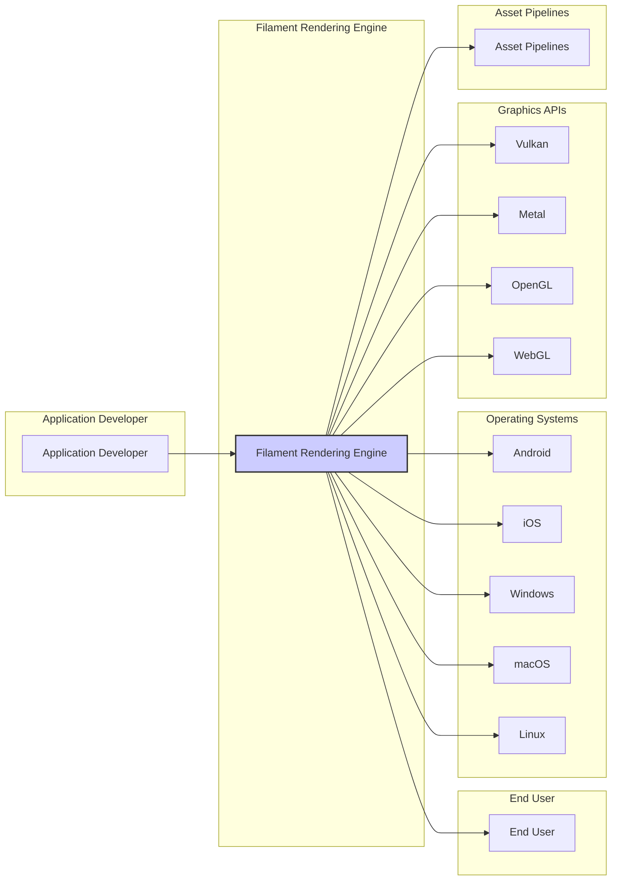
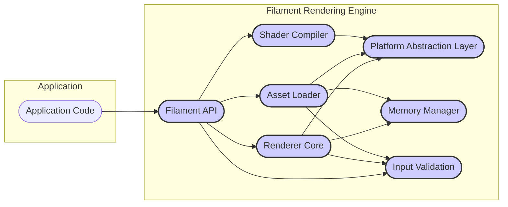

# BUSINESS POSTURE

Filament is a real-time physically based rendering engine for Android, iOS, Windows, macOS, Linux, WebGL, Vulkan, Metal, and OpenGL. The primary business goal for Filament is to provide a high-quality, cross-platform rendering solution that can be used in a variety of applications, potentially both internally within Google and externally by the wider developer community.

Business priorities for Filament are likely to include:

*   Performance: Rendering needs to be fast and efficient across all supported platforms.
*   Quality: The rendering engine should produce visually appealing and physically accurate results.
*   Cross-platform compatibility:  Filament must function correctly and consistently on all target platforms and graphics APIs.
*   Feature richness:  Providing a comprehensive set of rendering features to meet the needs of diverse applications.
*   Developer experience:  The API should be well-documented, easy to use, and integrate smoothly into existing development workflows.
*   Open Source Adoption: Encouraging a community around Filament to drive adoption, contributions, and improvements.

Key business risks associated with Filament include:

*   Performance bottlenecks: Inefficient rendering could lead to poor user experiences in applications using Filament.
*   Rendering inaccuracies: Visual defects or physically incorrect rendering could negatively impact the quality of applications.
*   Platform compatibility issues: Bugs or inconsistencies across platforms could limit Filament's usability and adoption.
*   Security vulnerabilities:  Security flaws in the rendering engine could be exploited by malicious actors in applications using Filament, potentially leading to crashes, data breaches, or other security incidents.
*   Lack of adoption: If Filament fails to meet developer needs or faces strong competition, it may not achieve widespread adoption, reducing its business value.
*   Maintenance burden:  Maintaining a complex, cross-platform rendering engine requires significant ongoing effort and resources.

# SECURITY POSTURE

Filament, being an open-source project hosted on GitHub, likely incorporates standard open-source development security practices.

Existing security controls:

*   security control: Code reviews are implicitly part of the development process through GitHub pull requests. This is standard practice for collaborative software development and helps to catch potential issues, including security vulnerabilities, before code is merged. Implemented in: GitHub Pull Request workflow.
*   security control: Static analysis tools are likely used by developers locally and potentially integrated into pre-commit hooks or CI pipelines, although not explicitly documented. These tools help identify potential code quality and security issues early in the development cycle. Implemented in: Developer local environment, potentially CI pipelines.
*   security control: Dependency scanning is likely used, potentially through GitHub Dependabot or similar tools, to monitor dependencies for known vulnerabilities. This helps to manage the risk of using vulnerable third-party libraries. Implemented in: GitHub Dependabot or similar dependency scanning services.
*   security control: Open source licensing (Apache 2.0) promotes transparency and community scrutiny, which can indirectly contribute to security by allowing wider review and identification of potential issues. Implemented in: Project licensing.

Accepted risks:

*   accepted risk: Reliance on community contributions for security vulnerability identification and patching. The open-source model relies on the community to report and contribute fixes for security issues. The speed and completeness of these responses can vary.
*   accepted risk: Potential vulnerabilities in third-party dependencies. Filament, like most software projects, relies on external libraries. Vulnerabilities in these dependencies can introduce security risks. While dependency scanning helps, it's not a complete solution, and zero-day vulnerabilities can still pose a risk.

Recommended security controls:

*   security control: Implement automated Static Application Security Testing (SAST) in the Continuous Integration (CI) pipeline. This will automatically scan code changes for security vulnerabilities before they are merged, providing an additional layer of security beyond code reviews and local static analysis.
*   security control: Conduct regular Dynamic Application Security Testing (DAST) or fuzzing of the rendering engine. This involves testing the running application with various inputs, including potentially malicious ones, to identify vulnerabilities that might not be apparent through static analysis.
*   security control: Establish a clear vulnerability reporting and response process. This includes having a security policy that outlines how security vulnerabilities should be reported and how the project will respond to and fix them.
*   security control: Generate and maintain a Software Bill of Materials (SBOM) for each release. This provides a comprehensive list of all components used in Filament, including dependencies, which is crucial for vulnerability management and supply chain security.
*   security control: Implement code signing for release artifacts. This helps ensure the integrity and authenticity of Filament releases, protecting users from potentially malicious modifications.

Security requirements:

*   Authentication: Not directly applicable to a rendering engine library. Filament itself does not handle user authentication. Applications using Filament are responsible for their own authentication mechanisms.
*   Authorization: Not directly applicable to a rendering engine library. Filament does not enforce authorization. Applications using Filament are responsible for their own authorization logic and access control.
*   Input Validation: Critical. Filament must perform robust input validation on all data it processes, including 3D models, textures, shaders, and rendering commands. This is essential to prevent vulnerabilities such as buffer overflows, injection attacks, and denial-of-service attacks that could arise from processing maliciously crafted input data. Input validation should be implemented at the API boundaries of Filament, ensuring that all external data is checked before being used by the rendering engine.
*   Cryptography:  Potentially relevant for features like secure asset loading or content protection, but not a core requirement for the rendering engine itself in its basic functionality. If cryptographic operations are used, they must be implemented using well-vetted cryptographic libraries and best practices to avoid introducing vulnerabilities through weak or incorrect cryptography.

# DESIGN

Filament is designed as a modular, cross-platform rendering engine. It provides a comprehensive suite of rendering features while abstracting away the complexities of different graphics APIs and operating systems.

## C4 CONTEXT



Context Diagram Elements:

*   Element:
    *   Name: Application Developer
    *   Type: Person
    *   Description: Software developers who integrate the Filament Rendering Engine into their applications.
    *   Responsibilities: Utilize the Filament API to create 3D graphics applications, provide input data (models, textures, shaders) to Filament.
    *   Security controls: Responsible for secure usage of the Filament API, proper handling of user input within their applications, and ensuring the overall security of the applications they build using Filament.

*   Element:
    *   Name: End User
    *   Type: Person
    *   Description: Users who run applications that utilize the Filament Rendering Engine.
    *   Responsibilities: Interact with applications powered by Filament, consume rendered graphics.
    *   Security controls: Indirectly affected by Filament's security. Relies on application developers and Filament developers to ensure the security of the rendering pipeline to prevent exploits that could impact their systems.

*   Element:
    *   Name: Filament Rendering Engine
    *   Type: Software System
    *   Description: A real-time physically based rendering engine that provides APIs for rendering 3D graphics across multiple platforms and graphics APIs.
    *   Responsibilities:  Receive rendering commands and data from applications, perform rendering calculations, interact with underlying graphics APIs and operating systems, output rendered images.
    *   Security controls: Input validation, secure memory management, protection against shader vulnerabilities, adherence to secure coding practices, vulnerability scanning, and security testing.

*   Element:
    *   Name: Operating Systems (Android, iOS, Windows, macOS, Linux)
    *   Type: Software System
    *   Description: The operating systems on which Filament-powered applications run.
    *   Responsibilities: Provide system resources to Filament and applications, manage hardware, handle system-level security.
    *   Security controls: Operating system level security controls, such as process isolation, memory protection, and access control, which indirectly protect Filament and applications running on them.

*   Element:
    *   Name: Graphics APIs (Vulkan, Metal, OpenGL, WebGL)
    *   Type: Software System
    *   Description: Low-level graphics APIs that Filament utilizes to interact with the GPU and perform rendering operations.
    *   Responsibilities: Execute rendering commands from Filament, manage GPU resources, provide hardware acceleration for graphics operations.
    *   Security controls: Graphics API driver security, protection against API misuse, and hardware-level security features of the GPU.

*   Element:
    *   Name: Asset Pipelines
    *   Type: Software System
    *   Description: Tools and processes used to create and prepare 3D models, textures, and other assets that are used by Filament.
    *   Responsibilities: Generate and optimize assets for use in Filament, ensure asset integrity and validity.
    *   Security controls: Asset validation and sanitization to prevent malicious assets from being introduced into the rendering pipeline.

## C4 CONTAINER



Container Diagram Elements:

*   Element:
    *   Name: Filament API
    *   Type: Library/API
    *   Description: Public API exposed by Filament for application developers to interact with the rendering engine. Provides functions for scene management, rendering commands, asset loading, and configuration.
    *   Responsibilities:  Provide a well-defined and documented interface for applications, handle API calls, route requests to other internal components, enforce API usage constraints.
    *   Security controls: Input validation at the API boundary to sanitize and validate all data received from applications. Rate limiting to prevent abuse. API documentation to guide developers on secure usage.

*   Element:
    *   Name: Renderer Core
    *   Type: Component
    *   Description: The core rendering engine component responsible for performing the actual rendering calculations. Implements rendering algorithms, manages rendering pipeline state, and interacts with the Platform Abstraction Layer to utilize graphics APIs.
    *   Responsibilities:  Execute rendering commands, perform complex mathematical computations for rendering, manage rendering state, optimize rendering performance.
    *   Security controls: Secure memory management to prevent buffer overflows and memory corruption vulnerabilities. Protection against shader vulnerabilities. Implementation of secure rendering algorithms.

*   Element:
    *   Name: Asset Loader
    *   Type: Component
    *   Description: Responsible for loading and processing various asset types, such as 3D models, textures, and materials, from different file formats.
    *   Responsibilities:  Parse asset files, validate asset data, convert assets into Filament's internal representation, manage asset caching.
    *   Security controls: Robust input validation and sanitization of asset files to prevent vulnerabilities from malicious or malformed assets. Secure file handling practices. Protection against path traversal vulnerabilities.

*   Element:
    *   Name: Platform Abstraction Layer
    *   Type: Component
    *   Description:  Abstracts away the differences between various operating systems and graphics APIs. Provides a consistent interface for the Renderer Core and other components to interact with the underlying platform.
    *   Responsibilities:  Handle platform-specific API calls, manage graphics contexts, handle windowing and input events, provide platform-independent access to system resources.
    *   Security controls: Secure interaction with operating system and graphics API functions. Proper error handling for platform-specific operations.

*   Element:
    *   Name: Shader Compiler
    *   Type: Component
    *   Description: Compiles shaders written in shading languages (e.g., GLSL, Metal Shading Language) into GPU-executable code.
    *   Responsibilities:  Parse shader code, optimize shaders for target GPUs, generate GPU bytecode, validate shader syntax and semantics.
    *   Security controls: Shader code validation to prevent injection attacks or malicious shader code. Protection against shader compiler vulnerabilities.

*   Element:
    *   Name: Memory Manager
    *   Type: Component
    *   Description: Manages memory allocation and deallocation within the Filament engine.
    *   Responsibilities:  Allocate and free memory efficiently, track memory usage, prevent memory leaks, optimize memory layout.
    *   Security controls: Secure memory allocation and deallocation practices to prevent memory corruption vulnerabilities. Protection against double-free and use-after-free vulnerabilities.

*   Element:
    *   Name: Input Validation
    *   Type: Component
    *   Description: Centralized component responsible for validating all external inputs to Filament, including API calls, asset data, and rendering commands.
    *   Responsibilities:  Implement validation rules for different input types, sanitize input data, log validation errors, prevent invalid data from reaching core components.
    *   Security controls: Comprehensive input validation rules covering all API inputs and data formats. Regular updates to validation rules to address new threats.

## DEPLOYMENT

Filament is a library, so its deployment is inherently linked to the deployment of the applications that use it. Filament itself is built and distributed as platform-specific libraries (e.g., shared libraries, DLLs, JavaScript modules).

Deployment Architecture Options:

1.  **Native Application Deployment:** Filament libraries are linked directly into native applications (e.g., Android apps, Windows desktop applications). The application and Filament library are deployed together as a single package to the target platform.
2.  **Web Application Deployment (WebGL):** Filament is compiled to WebAssembly and JavaScript and deployed as part of a web application. The Filament code is served from a web server and executed within the user's web browser.

Detailed Deployment Diagram (Native Application Deployment - Android Example):

```mermaid
flowchart LR
    subgraph "Developer Environment"
        DEV_WS([Developer Workstation])
    end
    subgraph "Build System"
        CI([CI/CD Pipeline])
    end
    subgraph "Android Device"
        AD[Android Device]
        subgraph "Android OS"
            Android_App([Application Package (.apk)])
            Filament_Lib([Filament Library (.so)])
        end
    end
    DEV_WS --> CI
    CI --> Android_App
    CI --> Filament_Lib
    Android_App -- includes --> Filament_Lib
    AD --> Android_App
    style DEV_WS fill:#eee,stroke:#333
    style CI fill:#eee,stroke:#333
    style AD fill:#eee,stroke:#333
    style Android_App fill:#ccf,stroke:#333,stroke-width:2px
    style Filament_Lib fill:#ccf,stroke:#333,stroke-width:2px
```

Deployment Diagram Elements (Native Application Deployment - Android Example):

*   Element:
    *   Name: Developer Workstation
    *   Type: Environment
    *   Description: The development machine used by application developers to write code, build applications, and integrate Filament.
    *   Responsibilities: Code development, local testing, building application packages.
    *   Security controls: Developer workstation security practices, including OS security, endpoint protection, and secure development tools.

*   Element:
    *   Name: CI/CD Pipeline
    *   Type: Environment
    *   Description: Automated build and deployment system that compiles Filament and application code, creates application packages, and potentially handles distribution.
    *   Responsibilities: Automated building, testing, packaging, and potentially deployment of Filament libraries and applications.
    *   Security controls: Secure CI/CD pipeline configuration, access control to CI/CD system, build process security, artifact signing, and secure artifact storage.

*   Element:
    *   Name: Android Device
    *   Type: Environment
    *   Description: Target Android device where the application and Filament library are deployed and executed.
    *   Responsibilities: Run the application, execute Filament rendering code, display rendered graphics.
    *   Security controls: Android OS security features, application sandboxing, user permissions, and device security settings.

*   Element:
    *   Name: Application Package (.apk)
    *   Type: Software Artifact
    *   Description: Android application package containing the application code and necessary resources, including the Filament library.
    *   Responsibilities:  Installable application package for Android devices.
    *   Security controls: Application signing, package integrity checks, Android security model.

*   Element:
    *   Name: Filament Library (.so)
    *   Type: Software Artifact
    *   Description: Shared library containing the compiled Filament rendering engine code for Android. Included within the application package.
    *   Responsibilities: Provide rendering functionality to the application at runtime.
    *   Security controls: Code signing (if implemented in build process), library integrity.

## BUILD

The build process for Filament involves compiling the C++ source code for various target platforms and graphics APIs.  A typical build process would involve using build systems like CMake and platform-specific compilers (e.g., Clang for Android/iOS, MSVC for Windows, GCC for Linux).

Build Process Diagram:

```mermaid
flowchart LR
    subgraph "Developer"
        DEV[Developer]
    end
    subgraph "GitHub Repository"
        GitRepo[GitHub Repository]
    end
    subgraph "CI/CD System (GitHub Actions)"
        CI_Actions[GitHub Actions]
        subgraph "Build Environment"
            Compiler[Compiler (Clang, GCC, MSVC)]
            BuildTools[Build Tools (CMake, Ninja)]
            SAST_Tool[SAST Scanner]
            DependencyScanner[Dependency Scanner]
        end
    end
    subgraph "Build Artifacts"
        Artifacts[Build Artifacts (Libraries, Headers)]
    end

    DEV --> GitRepo
    GitRepo --> CI_Actions
    CI_Actions --> Compiler
    CI_Actions --> BuildTools
    CI_Actions --> SAST_Tool
    CI_Actions --> DependencyScanner
    CI_Actions --> Artifacts
    style GitRepo fill:#eee,stroke:#333
    style CI_Actions fill:#eee,stroke:#333
    style Artifacts fill:#ccf,stroke:#333,stroke-width:2px
    style Compiler fill:#eee,stroke:#333
    style BuildTools fill:#eee,stroke:#333
    style SAST_Tool fill:#eee,stroke:#333
    style DependencyScanner fill:#eee,stroke:#333
```

Build Process Security Controls:

*   Supply Chain Security:
    *   security control: Use of a trusted and reputable code repository (GitHub).
    *   security control: Dependency management using version control and dependency scanning to detect vulnerable dependencies.
    *   security control: SBOM generation to track all components and dependencies.
*   Build Automation:
    *   security control: Automated build process using CI/CD (GitHub Actions) to ensure consistent and repeatable builds, reducing the risk of manual errors and inconsistencies.
    *   security control: Infrastructure-as-Code for build environments to ensure consistent and secure build environments.
*   Security Checks During Build:
    *   security control: Static Application Security Testing (SAST) integrated into the CI pipeline to automatically scan code for security vulnerabilities during the build process.
    *   security control: Dependency scanning integrated into the CI pipeline to check for known vulnerabilities in dependencies.
    *   security control: Code linters and formatters to enforce code quality and consistency, which can indirectly improve security.
*   Artifact Security:
    *   security control: Secure storage of build artifacts.
    *   security control: Code signing of build artifacts to ensure integrity and authenticity.
    *   security control: Access control to build artifacts to prevent unauthorized access and modification.

# RISK ASSESSMENT

Critical business process we are trying to protect:

*   Secure and correct rendering of 3D graphics in applications using Filament.  This is critical because vulnerabilities in the rendering engine could be exploited to compromise applications, leading to crashes, data breaches, or other security incidents. Incorrect rendering could lead to application malfunction and poor user experience.

Data we are trying to protect and their sensitivity:

*   Filament Source Code: Sensitivity: Publicly available (open source), but integrity and availability are important to ensure the project's continued development and trustworthiness. Modifications by unauthorized parties or introduction of malicious code would be a significant risk.
*   Build Artifacts (Libraries, Headers): Sensitivity: Publicly distributed, but integrity and authenticity are crucial. Compromised build artifacts could be distributed to users, leading to widespread security issues in applications using Filament.
*   User Data (Indirectly): Filament itself does not directly handle user data. However, applications using Filament will handle user data. Vulnerabilities in Filament could potentially be exploited to indirectly access or compromise user data within those applications. The sensitivity of user data depends on the specific application using Filament.
*   Rendering Assets (Models, Textures, Shaders): Sensitivity: Varies depending on the application and the nature of the assets. Some assets might be proprietary or contain sensitive information. Filament needs to handle assets securely to prevent unauthorized access or modification within the rendering pipeline.

# QUESTIONS & ASSUMPTIONS

BUSINESS POSTURE:

*   Assumption: Filament is intended to be a widely adopted rendering engine, used both internally and externally.
*   Question: What are the key performance indicators (KPIs) for Filament's success? Is it adoption rate, performance benchmarks, developer satisfaction, or other metrics?
*   Question: What is the long-term roadmap for Filament? Are there plans for new features, platform support, or specific industry focus areas?

SECURITY POSTURE:

*   Assumption: Security is a significant concern for Filament, given its potential use in diverse applications and the risks associated with rendering engine vulnerabilities.
*   Question: Are there specific security compliance requirements or industry standards that Filament needs to adhere to (e.g., for use in regulated industries)?
*   Question: What is the current process for handling security vulnerability reports? Is there a dedicated security team or point of contact?

DESIGN:

*   Assumption: Filament is designed with modularity and extensibility in mind to support a wide range of features and platforms.
*   Question: What are the key extension points in Filament's architecture? How can developers extend or customize Filament for their specific needs?
*   Question: What are the performance considerations for different parts of the Filament architecture? Are there any known performance bottlenecks or areas for optimization?
*   Question: What are the testing strategies employed for Filament? Are there unit tests, integration tests, performance tests, and security tests in place?