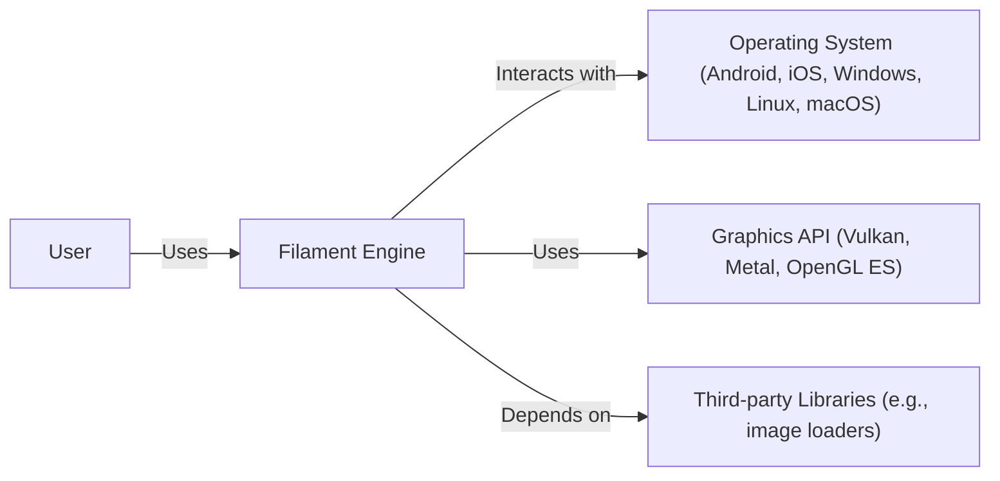
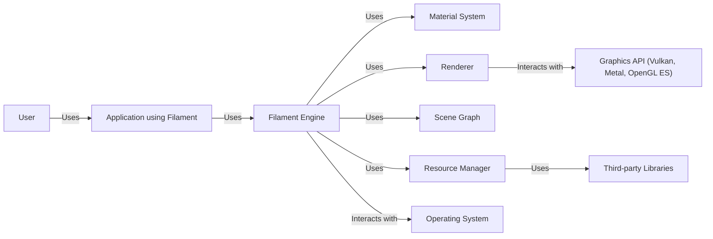
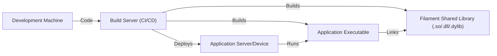
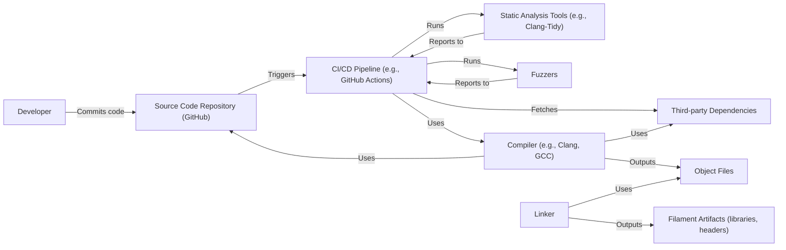

Okay, let's create a design document for the Filament project, focusing on aspects relevant to threat modeling.

# BUSINESS POSTURE

Filament is a physically based rendering (PBR) engine designed for real-time applications, particularly on Android.  It's developed by Google and is open-source.  The business priorities and goals appear to be:

*   Provide a high-quality, performant, and portable rendering engine:  The core value proposition is a rendering engine that delivers visually impressive results without sacrificing performance, especially on mobile platforms.  Portability across different platforms (Android, iOS, Windows, Linux, macOS) is crucial for broad adoption.
*   Enable developers to create visually appealing applications: Filament aims to simplify the process of integrating realistic rendering into applications, making it accessible to a wider range of developers.
*   Foster an open-source community:  By being open-source, Filament encourages community contributions, improvements, and wider adoption. This also implies a commitment to transparency and collaboration.
*   Support modern graphics APIs:  Filament supports Vulkan, Metal, and OpenGL ES, indicating a focus on leveraging the latest graphics technologies for optimal performance.

Based on these priorities, the most important business risks are:

*   Performance degradation:  Any changes that significantly impact rendering performance, especially on target platforms like Android, would directly undermine the core value proposition.
*   Security vulnerabilities:  Exploitable vulnerabilities in the engine could lead to application crashes, data breaches (if texture data or other assets are sensitive), or even device compromise. Given its use in potentially numerous applications, the impact of a widespread vulnerability could be significant.
*   Lack of portability:  Failure to maintain compatibility across supported platforms would limit adoption and fragment the user base.
*   Community stagnation:  If the open-source project fails to attract and retain contributors, development could slow down, and the engine might fall behind competing solutions.
*   Inability to keep up with evolving graphics standards:  The graphics technology landscape changes rapidly.  Failure to adapt to new APIs, hardware capabilities, and rendering techniques could render Filament obsolete.

# SECURITY POSTURE

Filament's security posture is primarily defined by its open-source nature, its use of memory-safe languages (primarily C++17), and its focus on performance, which often indirectly leads to more robust code.

*   security control:  Use of C++17:  Modern C++ features, when used correctly, can help mitigate some common memory safety issues (e.g., smart pointers, containers). Described in the repository's README and build instructions.
*   security control:  Code Reviews:  Being an open-source project under Google's umbrella, it's highly likely that code reviews are a standard part of the development process. This is implied by the contribution guidelines and the presence of multiple contributors.
*   security control:  Static Analysis:  The project likely uses static analysis tools to identify potential bugs and vulnerabilities. This is a common practice in large C++ projects, especially those focused on performance and security. Evidence of this can be found in the build scripts and CI configuration.
*   security control:  Fuzzing:  Given the complexity of rendering engines and the potential for input-related vulnerabilities (e.g., processing malformed model files), fuzzing is a likely security practice.
*   accepted risk:  Third-party dependencies:  Filament depends on several third-party libraries (e.g., for image loading, math operations).  Vulnerabilities in these dependencies could impact Filament's security. The project's documentation and build system list these dependencies.
*   accepted risk:  Complexity of rendering code:  Rendering engines are inherently complex, increasing the likelihood of subtle bugs that could have security implications.
*   accepted risk:  Focus on performance:  While performance optimizations can sometimes improve security, they can also introduce complexity and potential vulnerabilities if not handled carefully.

Recommended Security Controls (High Priority):

*   security control:  Regular Security Audits:  Conduct periodic security audits, both internal and external, to identify potential vulnerabilities.
*   security control:  Dependency Management System:  Implement a robust dependency management system to track and update third-party libraries, ensuring timely patching of known vulnerabilities.
*   security control:  Fuzzing Integration into CI/CD:  Integrate fuzzing into the continuous integration/continuous delivery pipeline to automatically test for vulnerabilities with each new build.
*   security control:  Content Security Policy (CSP) (if applicable):  If Filament is used in a context where it interacts with web content, implement a CSP to mitigate cross-site scripting (XSS) vulnerabilities.

Security Requirements:

*   Authentication:  Not directly applicable to the core rendering engine itself. However, if Filament is integrated into an application that requires authentication, the application is responsible for implementing appropriate authentication mechanisms.
*   Authorization:  Similarly, authorization is typically handled at the application level, not within the rendering engine itself. Filament might need to respect access controls for resources (e.g., textures, models) if they are managed by the application.
*   Input Validation:  Crucial. Filament must rigorously validate all inputs, including:
    *   Model file formats (e.g., glTF, OBJ):  Malformed files could lead to crashes or potentially exploitable vulnerabilities.
    *   Texture data:  Invalid image data could cause similar issues.
    *   Shader code:  If Filament allows custom shaders, it must ensure they are validated and sandboxed to prevent malicious code execution.
    *   API parameters:  All API calls should be validated to prevent unexpected behavior or crashes.
*   Cryptography:  Not directly applicable to the core rendering engine. However, if Filament is used to display encrypted assets, the application is responsible for decryption. Filament should not store or transmit sensitive data without appropriate encryption.

# DESIGN

## C4 CONTEXT

Element Descriptions:

*   Element:
    *   Name: User
    *   Type: Person
    *   Description: A person interacting with an application that uses the Filament rendering engine.
    *   Responsibilities: Interacts with the application's UI, triggering rendering operations.
    *   Security controls: None (handled at the application level).

*   Element:
    *   Name: Filament Engine
    *   Type: Software System
    *   Description: The core physically based rendering engine.
    *   Responsibilities: Rendering 3D scenes, managing resources (textures, models), interacting with the graphics API.
    *   Security controls: Input validation, static analysis, fuzzing (likely), code reviews.

*   Element:
    *   Name: Operating System
    *   Type: Software System
    *   Description: The underlying operating system (Android, iOS, Windows, Linux, macOS).
    *   Responsibilities: Providing system resources, managing processes, handling hardware interactions.
    *   Security controls: OS-level security mechanisms (e.g., sandboxing, memory protection).

*   Element:
    *   Name: Graphics API
    *   Type: Software System
    *   Description: The graphics API used for rendering (Vulkan, Metal, OpenGL ES).
    *   Responsibilities: Providing a low-level interface to the GPU.
    *   Security controls: Driver-level security mechanisms.

*   Element:
    *   Name: Third-party Libraries
    *   Type: Software System
    *   Description: External libraries used by Filament (e.g., for image loading, math operations).
    *   Responsibilities: Providing specific functionalities not implemented within Filament itself.
    *   Security controls: Dependent on the specific library; Filament should use well-maintained and secure libraries.

## C4 CONTAINER

Element Descriptions:

*   Element:
    *   Name: User
    *   Type: Person
    *   Description: A person interacting with the application.
    *   Responsibilities: Interacts with application.
    *   Security controls: None.

*   Element:
    *   Name: Application using Filament
    *   Type: Software System
    *   Description: An application that integrates the Filament rendering engine.
    *   Responsibilities: Managing application logic, user input, and interacting with Filament.
    *   Security controls: Application-specific security controls (e.g., authentication, authorization).

*   Element:
    *   Name: Filament Engine
    *   Type: Container
    *   Description: The top-level container for the Filament rendering engine.
    *   Responsibilities: Orchestrating the rendering process, managing resources, and providing an API for applications.
    *   Security controls: Input validation, static analysis, fuzzing (likely), code reviews.

*   Element:
    *   Name: Material System
    *   Type: Container
    *   Description: Handles materials and shaders.
    *   Responsibilities: Defining the appearance of objects, managing shader code.
    *   Security controls: Shader validation and sandboxing (if custom shaders are allowed).

*   Element:
    *   Name: Renderer
    *   Type: Container
    *   Description: Performs the actual rendering calculations.
    *   Responsibilities: Drawing objects to the screen, interacting with the graphics API.
    *   Security controls: Input validation (for rendering parameters).

*   Element:
    *   Name: Scene Graph
    *   Type: Container
    *   Description: Represents the hierarchical structure of the 3D scene.
    *   Responsibilities: Organizing objects and their transformations.
    *   Security controls: Input validation (for scene data).

*   Element:
    *   Name: Resource Manager
    *   Type: Container
    *   Description: Manages resources like textures and models.
    *   Responsibilities: Loading, caching, and unloading resources.
    *   Security controls: Input validation (for resource data), secure handling of external resources.

*   Element:
    *   Name: Operating System
    *   Type: Software System
    *   Description: The underlying operating system.
    *   Responsibilities: Providing system resources.
    *   Security controls: OS-level security.

*   Element:
    *   Name: Graphics API
    *   Type: Software System
    *   Description: The graphics API used for rendering.
    *   Responsibilities: Low-level interface to GPU.
    *   Security controls: Driver-level security.

*   Element:
    *   Name: Third-party Libraries
    *   Type: Software System
    *   Description: External libraries used by Filament.
    *   Responsibilities: Providing specific functionalities.
    *   Security controls: Dependent on the specific library.

## DEPLOYMENT

Filament, as a library, can be deployed in several ways:

1.  **Statically linked library:** The Filament library is compiled and linked directly into the application executable.
2.  **Dynamically linked library:** The Filament library is compiled as a separate shared library (e.g., .so, .dll, .dylib) and loaded at runtime.
3.  **Integrated via a package manager:** Filament could be distributed through a package manager (e.g., vcpkg, Conan) and integrated into the build process.

We'll describe the dynamically linked library approach, as it's common for cross-platform development:

Element Descriptions:

*   Element:
    *   Name: Development Machine
    *   Type: Infrastructure Node
    *   Description: The developer's workstation.
    *   Responsibilities: Writing and testing code.
    *   Security controls: Standard development environment security practices.

*   Element:
    *   Name: Build Server (CI/CD)
    *   Type: Infrastructure Node
    *   Description: A server that automates the build and deployment process.
    *   Responsibilities: Compiling Filament and the application, running tests, deploying artifacts.
    *   Security controls: Secure configuration, access controls, vulnerability scanning of the build environment.

*   Element:
    *   Name: Application Server/Device
    *   Type: Infrastructure Node
    *   Description: The server or device where the application is deployed.
    *   Responsibilities: Running the application.
    *   Security controls: OS-level security, application-specific security controls.

*   Element:
    *   Name: Filament Shared Library (.so/.dll/.dylib)
    *   Type: Software Artifact
    *   Description: The compiled Filament library.
    *   Responsibilities: Providing rendering functionality.
    *   Security controls: Built with security flags, code signing (if applicable).

*   Element:
    *   Name: Application Executable
    *   Type: Software Artifact
    *   Description: The compiled application that uses Filament.
    *   Responsibilities: Running the application logic.
    *   Security controls: Built with security flags, code signing (if applicable).

## BUILD

The build process for Filament is crucial for ensuring the security and integrity of the library.  It likely involves a CI/CD pipeline, potentially using GitHub Actions or a similar system.

Build Process Description:

1.  **Code Commit:** A developer commits code changes to the GitHub repository.
2.  **CI/CD Trigger:** The commit triggers the CI/CD pipeline (e.g., GitHub Actions).
3.  **Dependency Fetching:** The pipeline fetches necessary third-party dependencies.
4.  **Static Analysis:** Static analysis tools (e.g., Clang-Tidy, Coverity) are run on the source code to identify potential bugs and vulnerabilities.
5.  **Fuzzing:** Fuzzers are used to test the engine with various inputs, looking for crashes or unexpected behavior.
6.  **Compilation:** The source code is compiled using a compiler (e.g., Clang, GCC) with appropriate security flags (e.g., stack protection, address sanitization).
7.  **Linking:** The compiled object files are linked together to create the Filament library (either static or dynamic).
8.  **Artifact Generation:** The build process produces the Filament library artifacts (libraries, headers).
9.  **Reporting:** The results of static analysis, fuzzing, and compilation are reported back to the CI/CD pipeline.  Failed checks would typically block the build.

Security Controls in the Build Process:

*   security control:  Automated Build System:  Using a CI/CD pipeline ensures consistency and repeatability in the build process.
*   security control:  Static Analysis:  Identifies potential vulnerabilities early in the development cycle.
*   security control:  Fuzzing:  Tests for input-related vulnerabilities.
*   security control:  Compiler Security Flags:  Enables compiler-level security features to mitigate common exploits.
*   security control:  Dependency Management:  Tracks and manages third-party dependencies to ensure they are up-to-date and secure.
*   security control:  Code Signing (Potentially):  The Filament library could be code-signed to ensure its authenticity and integrity.

# RISK ASSESSMENT

*   **Critical Business Processes:**
    *   Real-time rendering of 3D graphics with high fidelity and performance.
    *   Providing a stable and reliable rendering engine for application developers.
    *   Maintaining a healthy and active open-source community.

*   **Data to Protect and Sensitivity:**
    *   **Model Data (Low to Medium Sensitivity):**  While 3D models themselves might not always be sensitive, in some applications, they could represent proprietary designs or intellectual property.  Compromise could lead to IP theft.
    *   **Texture Data (Low to Medium Sensitivity):**  Similar to model data, textures might contain sensitive information in certain applications (e.g., medical imaging, confidential designs).
    *   **Shader Code (Low to Medium Sensitivity):**  Custom shaders could contain proprietary algorithms or techniques.
    *   **User Data (Handled by the Application, Not Filament Directly):**  Filament itself doesn't directly handle user data. However, applications using Filament might process sensitive user data, and vulnerabilities in Filament could indirectly expose this data.
    *   **Engine Internals (Low Sensitivity):** The internal workings of the engine are largely public due to its open-source nature.

# QUESTIONS & ASSUMPTIONS

*   **Questions:**
    *   What specific static analysis tools are used in the Filament build process?
    *   What is the fuzzing strategy for Filament? What tools are used, and what parts of the engine are fuzzed?
    *   Are there any plans to formally verify parts of the Filament codebase?
    *   What is the process for handling reported security vulnerabilities?
    *   Are there any specific security certifications or compliance requirements that Filament aims to meet?
    *   Does Filament support or plan to support any form of shader sandboxing?
    *   How are third-party dependencies managed and updated? Is there a specific policy or tool used?

*   **Assumptions:**
    *   **BUSINESS POSTURE:** We assume that Google's reputation and the success of Android are strong motivators for maintaining a high level of security and quality in Filament.
    *   **SECURITY POSTURE:** We assume that standard secure coding practices are followed, given Google's experience in software development. We assume code reviews are mandatory. We assume that some form of static analysis and fuzzing is used, although the specifics are unknown.
    *   **DESIGN:** We assume that the core components of Filament are designed with modularity and separation of concerns in mind, which can aid in security. We assume that the build process is automated and uses a CI/CD pipeline.