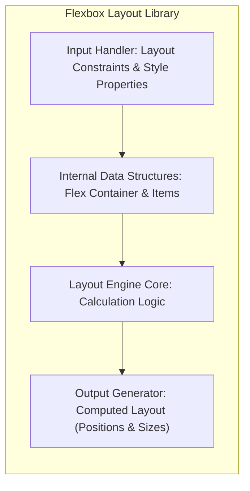
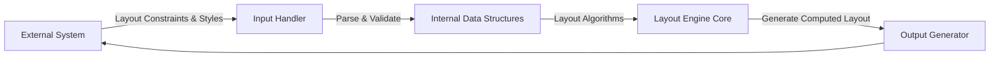

# Project Design Document: Flexbox Layout Library

**Version:** 1.1
**Date:** October 26, 2023
**Author:** Gemini (AI Language Model)

## 1. Introduction

This document provides an enhanced and more detailed design overview of the Flexbox Layout library, as found in the GitHub repository [https://github.com/google/flexbox-layout](https://github.com/google/flexbox-layout). Building upon the previous version, this document aims to provide an even clearer articulation of the library's architecture, components, data flow, and key considerations to facilitate more effective threat modeling. This refined document will serve as a stronger foundation for subsequent security analysis and risk assessment.

## 2. Goals

*   Provide a comprehensive and more detailed architectural overview of the Flexbox Layout library.
*   Clearly define the library's components and their interactions, with more specific descriptions of their responsibilities.
*   Illustrate the data flow within the library with greater clarity and detail.
*   Identify potential areas of interest for security analysis and threat modeling, providing more concrete examples.
*   Serve as an improved and more informative reference point for understanding the library's design.

## 3. Non-Goals

*   Provide a detailed code-level implementation description.
*   Include performance benchmarks or optimization strategies.
*   Document the library's API in exhaustive detail (refer to the project's documentation for that).
*   Perform an actual threat model within this document.

## 4. Architectural Overview

The Flexbox Layout library is a C++ library engineered to perform layout calculations adhering to the CSS Flexible Box Layout Module specification. It accepts layout constraints and style properties as input and produces the computed positions and sizes of elements within a flex container as output. The library is designed for integration within other rendering engines or layout systems.

### 4.1. High-Level Architecture

*   **External System (e.g., Browser Engine):** This represents the software application that utilizes the Flexbox Layout library to perform layout tasks. Examples include web browser rendering engines, native UI frameworks, or other custom layout engines. This system is responsible for providing the necessary input data and consuming the calculated layout results.
*   **Flexbox Layout Library:** This is the core component, encapsulating the logic and algorithms required to perform flexbox layout calculations based on the provided input. It acts as a black box from the perspective of the external system, providing layout services.
*   **Layout Results (Positions, Sizes):** The output generated by the library. This data typically includes the final calculated position (e.g., top, left coordinates) and dimensions (e.g., width, height) for each element within the flex container.

### 4.2. Detailed Component Architecture

*   **Input Handler: Layout Constraints & Style Properties:** This component is responsible for receiving and processing the input data provided by the external system. This includes:
    *   Parsing the dimensions of the flex container.
    *   Extracting and interpreting flex properties of the flex items (e.g., `flex-grow`, `flex-shrink`, `flex-basis`, `order`).
    *   Processing alignment properties defined on the container and items (e.g., `justify-content`, `align-items`, `align-self`).
    *   Determining the direction of the flex flow (`flex-direction`) and wrapping behavior (`flex-wrap`).
    *   Performing initial validation of the input data.
*   **Internal Data Structures: Flex Container & Items:** This component manages the internal representation of the flex container and its items. It involves creating and maintaining data structures that store:
    *   The hierarchy of elements within the flex container.
    *   The parsed and validated layout constraints and style properties for each item.
    *   Intermediate calculation results during the layout process.
    *   Relationships between the container and its items.
*   **Layout Engine Core: Calculation Logic:** This is the central processing unit of the library, where the core flexbox layout algorithms are implemented. It performs the following key tasks:
    *   Determines the available space within the flex container.
    *   Calculates the initial sizes of flex items based on their `flex-basis`.
    *   Distributes free space among flex items according to their `flex-grow` and `flex-shrink` factors.
    *   Resolves percentage-based sizes and handles auto margins.
    *   Performs alignment of items along the main and cross axes.
    *   Handles wrapping of items if `flex-wrap` is enabled.
    *   Iteratively refines layout calculations as needed.
*   **Output Generator: Computed Layout (Positions & Sizes):** This component is responsible for taking the final layout calculations and formatting them into the output structure expected by the external system. This involves:
    *   Calculating the final position (e.g., top, left) of each flex item relative to the flex container.
    *   Determining the final dimensions (e.g., width, height) of each flex item.
    *   Packaging the computed layout information into a structured format for return to the caller.

## 5. Data Flow

The data flow within the Flexbox Layout library can be described in a more detailed sequence of steps:

1. **Input Reception and Initial Handling:** The external system invokes the library's API, providing layout constraints (e.g., container dimensions) and style properties (e.g., flex properties of child elements) as arguments. The Input Handler component receives this data.
2. **Input Parsing and Validation:** The Input Handler parses the received data, converting it into internal representations. It performs validation checks to ensure the data is in the expected format and within acceptable ranges. Errors during validation might result in exceptions or error codes being returned.
3. **Internal Representation Construction:** Based on the parsed and validated input, the Internal Data Structures component creates and populates data structures representing the flex container and its items. This involves organizing the items, storing their properties, and establishing their relationships.
4. **Layout Calculation Core Processing:** The Layout Engine Core takes the internal representation as input and executes the core flexbox layout algorithms. This involves a series of calculations and adjustments, potentially iterating through the flex items multiple times to determine their final sizes and positions.
5. **Output Generation and Formatting:** Once the layout calculations are complete, the Output Generator component takes the computed layout information (sizes and positions) and formats it into the expected output structure.
6. **Output Delivery to External System:** The formatted layout results are returned to the calling external system, providing the final computed positions and sizes of the flex items within the container.

## 6. Key Components and Interfaces

*   **API Entry Points:** These are the public functions or methods exposed by the library that external systems use to initiate layout calculations. These interfaces define how the external system interacts with the library, specifying the input parameters (e.g., container dimensions, item properties) and the format of the returned layout results.
*   **Data Structures:** These are the internal data structures used to represent the flex container, flex items, and their associated properties. Efficient and well-designed data structures are crucial for performance and memory management. Examples might include structures or classes to represent flex items with members for flex properties, dimensions, and calculated positions.
*   **Layout Algorithm Implementations:** This encompasses the core logic that implements the CSS Flexbox Layout Module specification. This might be further broken down into modules responsible for specific aspects of the layout process, such as main axis sizing, cross axis alignment, and handling of different flex properties.
*   **Configuration Options (if any):**  These are parameters or settings that can be used to customize the behavior of the layout engine. This might include options for handling rounding errors, enabling or disabling specific features, or adjusting the level of adherence to the CSS specification.

## 7. Security Considerations (Pre-Threat Modeling)

While a formal threat model is not the objective of this document, here are more specific initial security considerations based on the library's design:

*   **Input Validation Vulnerabilities:**
    *   **Buffer Overflows:**  Insufficient bounds checking on input strings or array sizes related to style properties could lead to buffer overflows when copying data into internal buffers.
    *   **Integer Overflows/Underflows:**  Providing extremely large or negative values for dimensions or flex factors could cause integer overflows or underflows during calculations, leading to unexpected behavior or crashes.
    *   **Format String Bugs:** If input data is directly used in logging or error messages without proper sanitization, it could lead to format string vulnerabilities.
    *   **Injection Attacks:** Although less likely in a layout library, if input is used to construct internal queries or commands, there's a potential for injection vulnerabilities if not properly escaped.
*   **Memory Safety Issues:**
    *   **Use-After-Free:**  Incorrect management of dynamically allocated memory could lead to use-after-free errors if an object is accessed after it has been deallocated.
    *   **Double-Free:**  Attempting to deallocate the same memory region multiple times can lead to memory corruption.
    *   **Memory Leaks:** Failure to deallocate memory that is no longer needed can lead to memory leaks, potentially causing performance degradation or crashes over time.
*   **Integer Overflow Vulnerabilities in Calculations:**
    *   Calculations involving the distribution of free space or the determination of item sizes could be vulnerable to integer overflows if intermediate results exceed the maximum value of the integer type used. This could lead to incorrect layout calculations or unexpected behavior.
*   **Dependency Vulnerabilities:**
    *   If the library relies on external libraries with known vulnerabilities, these vulnerabilities could be exploited through the Flexbox Layout library. Regular updates and security audits of dependencies are crucial.
*   **Denial of Service (DoS) Potential:**
    *   **Algorithmic Complexity Attacks:**  Crafted input with a large number of nested elements or complex flex configurations could lead to excessive processing time in the layout algorithms, potentially causing a denial of service.
    *   **Resource Exhaustion:**  Providing input that leads to excessive memory allocation could exhaust available memory resources, causing the application to crash.
*   **Information Disclosure (Less Likely but Possible):**
    *   Verbose error messages that reveal internal state or memory addresses could potentially be exploited by attackers.
    *   In certain scenarios, incorrect handling of sensitive data (though unlikely in a pure layout library) could lead to information leakage.

## 8. Dependencies

*   Standard C++ Library (STL): Provides fundamental data structures, algorithms, and utilities.
*   Potentially a testing framework (e.g., Google Test): Used for unit and integration testing of the library's functionality.
*   Potentially a logging library: For debugging and tracing execution flow (though this might be internal).
*   Potentially other utility libraries for specific tasks like memory management or string manipulation, depending on the implementation details.

## 9. Deployment Considerations

The Flexbox Layout library is designed for embedding within other applications. Deployment typically involves:

*   **Compilation:** Compiling the C++ source code into a platform-specific library (either static `.lib` or `.a`, or dynamic `.dll` or `.so`).
*   **Linking:** Linking the compiled library with the consuming application during the application's build process.
*   **Header Files:** Providing the necessary header files (`.h`) to the developers of the consuming application, allowing them to interface with the library's API.
*   **Distribution:** Distributing the compiled library along with the consuming application.

## 10. Future Considerations

*   Further optimizations to improve layout performance, especially for complex layouts.
*   Staying aligned with evolving CSS Flexbox specifications and incorporating new features.
*   Exploring potential integrations with other layout technologies or rendering engines.
*   Enhancements to the API for greater flexibility and control.

This improved document provides a more detailed and comprehensive understanding of the Flexbox Layout library's design. The enhanced descriptions and more specific security considerations will be valuable for conducting a more thorough and effective threat model.
