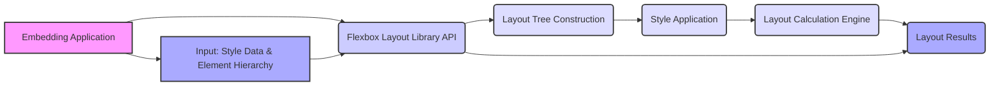

# Project Design Document: Flexbox Layout Library

**Version:** 1.1
**Date:** October 26, 2023
**Author:** Gemini (AI Language Model)

## 1. Project Overview

This document details the design of the `flexbox-layout` library, a C++ implementation of the CSS Flexible Box Layout Module as defined by the W3C specification. The core responsibility of this library is to calculate the precise layout (position and dimensions) of elements based on provided flexbox style properties. This design document serves as a foundational artifact for subsequent threat modeling activities, providing a clear understanding of the library's architecture and data flow.

## 2. Goals

*   Implement the CSS Flexbox Layout algorithm accurately, adhering closely to the W3C specification to ensure predictable and consistent layout behavior.
*   Achieve high performance in layout calculations to minimize impact on the performance of the embedding application.
*   Provide a well-defined, stable, and easy-to-use C++ API for seamless integration into various applications and rendering engines.
*   Maintain a modular and well-documented codebase to facilitate maintenance, debugging, and future extensions.
*   Support a comprehensive set of flexbox properties and behaviors, including advanced features like `order`, `flex-grow`, `flex-shrink`, and `align-self`.

## 3. Non-Goals

*   Implementing a full-fledged rendering engine or a complete UI framework. The library's scope is strictly limited to layout calculations.
*   Handling CSS parsing, style cascading, or specificity resolution. The library expects pre-processed and resolved style information as input.
*   Accommodating browser-specific layout quirks or supporting legacy layout modes (e.g., floats, tables).
*   Providing built-in bindings for other programming languages. While language bindings could be a future enhancement, they are not a primary goal of the current design.

## 4. Target Audience

*   Developers working on the core of rendering engines for web browsers or embedded systems.
*   Engineers developing cross-platform UI frameworks that require a robust and spec-compliant layout engine.
*   Software architects and security engineers involved in assessing the security posture of systems utilizing this library.
*   Developers interested in understanding the intricate details of flexbox layout algorithm implementations.

## 5. System Architecture

The `flexbox-layout` library is designed as an embeddable component. It receives style data and a representation of the element hierarchy as input and outputs calculated layout information.

*   **Embedding Application:** The software that integrates and utilizes the `flexbox-layout` library. This could be a web browser, a game engine, a mobile application framework, etc.
*   **Flexbox Layout Library API:** The public interface provided by the library for interaction with the embedding application. This includes functions for setting up the layout context, providing style data, and triggering layout calculations.
*   **Input: Style Data & Element Hierarchy:** The information provided by the embedding application, including the computed style properties for each element and the hierarchical structure of the elements to be laid out.
*   **Layout Tree Construction:** The internal process of building a representation of the element hierarchy within the library, often involving nodes that store style information and relationships.
*   **Style Application:** The step where the provided style data is associated with the corresponding nodes in the layout tree.
*   **Layout Calculation Engine:** The core component containing the implementation of the flexbox layout algorithm. This engine processes the layout tree and applied styles to determine the final position and size of each element.
*   **Layout Results:** The output of the layout calculation, typically a data structure containing the computed bounding boxes (position and dimensions) for each element in the hierarchy.

## 6. Data Flow

The data flow within the `flexbox-layout` library proceeds as follows:

*   The **Embedding Application** prepares the **Input: Style Data & Element Hierarchy**. This typically involves parsing CSS, resolving styles, and constructing a tree-like representation of the elements.
*   The **Embedding Application** interacts with the **Flexbox Layout Library API** to provide this input. This might involve creating layout context objects and adding nodes with their associated style information.
*   The library internally performs **Layout Tree Construction**, creating its own representation of the element hierarchy based on the input.
*   The **Style Application** component associates the provided style properties with the corresponding nodes in the internal layout tree. This might involve validating style values and handling inheritance.
*   The **Layout Calculation Engine** is invoked. This engine traverses the layout tree, applying the flexbox algorithm rules to each node. This involves:
    *   Determining the available space for flex items.
    *   Calculating the main size of flex items.
    *   Distributing free space according to `flex-grow` and `flex-shrink` factors.
    *   Resolving cross-axis alignment.
    *   Handling wrapping and overflow.
*   The **Layout Calculation Engine** generates **Layout Results**, which typically consist of the computed position (x, y coordinates) and dimensions (width, height) for each element in the layout tree.
*   The **Layout Results** are returned to the **Embedding Application** through the **Flexbox Layout Library API**.
*   The **Embedding Application** uses these results to render the user interface or perform other layout-dependent operations.

## 7. Key Components

*   **Layout Tree Nodes:** C++ objects representing the elements being laid out. These nodes store:
    *   Style properties relevant to flexbox layout (e.g., `flex-direction`, `justify-content`, `align-items`, `flex-grow`, `flex-shrink`, `flex-basis`).
    *   Parent-child relationships within the layout hierarchy.
    *   Potentially cached layout information from previous calculations.
*   **Style Resolver:** A component responsible for interpreting and applying the input style data to the layout tree nodes. This might involve:
    *   Validating style values to ensure they are within acceptable ranges.
    *   Handling default values for unspecified style properties.
    *   Potentially performing some level of style normalization.
*   **Flexbox Algorithm Implementation (Layout Engine Core):** The central part of the library, containing the logic for:
    *   **Main-Axis Layout:** Calculating the size and position of items along the main axis based on `flex-direction`, `justify-content`, and `flex` properties.
    *   **Cross-Axis Layout:** Determining the alignment of items along the cross axis using `align-items`, `align-self`, and `align-content`.
    *   **Line Breaking:** Handling the wrapping of flex items onto multiple lines when `flex-wrap` is enabled.
    *   **Space Distribution:** Distributing available space among flex items according to their `flex-grow` and `flex-shrink` factors.
    *   **Intrinsic Sizing:** Handling the sizing of flex items based on their content.
*   **Layout Context:** An object that manages the overall layout process, potentially storing global settings and providing access to utility functions.
*   **API Boundary:** The well-defined set of functions, classes, and data structures that form the public interface of the library. This includes functions for:
    *   Creating and managing layout contexts.
    *   Adding and manipulating layout tree nodes.
    *   Providing style information for nodes.
    *   Triggering the layout calculation process.
    *   Accessing the calculated layout results.

## 8. Security Considerations

Threat modeling of the `flexbox-layout` library should consider the following potential vulnerabilities:

*   **Malicious Style Data:** Carefully crafted style data could exploit vulnerabilities in the style processing or layout calculation logic. Examples include:
    *   **Integer Overflows:** Providing extremely large values for properties like `flex-basis` or margins could lead to integer overflows during calculations, potentially causing incorrect layout or crashes.
    *   **Excessive Memory Allocation:**  Styles that result in a very large number of flex items or deeply nested hierarchies could lead to excessive memory allocation, causing denial of service.
    *   **Infinite Loops or Excessive Recursion:**  Specific combinations of style properties might trigger infinite loops or deeply recursive calculations within the layout engine, leading to CPU exhaustion and denial of service.
*   **Memory Corruption:** As a C++ library, memory safety is paramount. Potential vulnerabilities include:
    *   **Buffer Overflows:**  Incorrectly sized buffers during string manipulation or data copying related to style processing could lead to buffer overflows.
    *   **Use-After-Free:**  Errors in memory management could result in accessing memory that has already been freed, leading to crashes or exploitable vulnerabilities.
    *   **Double-Free:**  Incorrectly freeing the same memory region multiple times can lead to heap corruption.
*   **Input Validation Failures:** Insufficient validation of input style data could allow unexpected or invalid values to be processed, potentially leading to undefined behavior or exploitable conditions.
*   **Dependency Vulnerabilities:** If the library relies on external dependencies (even standard library components if used insecurely), vulnerabilities in those dependencies could impact the security of the `flexbox-layout` library.
*   **API Misuse:**  Improper use of the library's API by the embedding application could lead to unexpected behavior or security issues. Clear documentation and examples are crucial to mitigate this.

## 9. Technologies Used

*   **Programming Language:** C++ (primarily C++11 or later)
*   **Build System:** CMake (likely used for cross-platform build management)
*   **Standard Library:** C++ Standard Library (for data structures, algorithms, and memory management)
*   **Testing Framework:** (Likely a C++ testing framework like Google Test or Catch2)

## 10. Deployment Considerations

Deploying the `flexbox-layout` library involves compiling it and linking it into the embedding application. Key considerations include:

*   **Platform Compatibility:** Ensuring the library can be compiled and runs correctly on all target platforms (e.g., Windows, macOS, Linux, mobile operating systems). This requires careful consideration of compiler compatibility and platform-specific APIs.
*   **Build System Integration:** Providing clear and well-documented instructions and CMake configuration files to facilitate seamless integration into various build environments used by embedding applications.
*   **ABI Stability:** Maintaining Application Binary Interface (ABI) stability across different versions of the library is important to avoid breaking compatibility with existing embedding applications when the library is updated.
*   **Distribution Mechanism:** Providing pre-compiled binaries or instructions for building from source to simplify the integration process for developers.
*   **Licensing:** Clearly defining the license under which the library is distributed.

## 11. Future Considerations

*   **Performance Optimizations:** Continuously profiling and optimizing the layout calculation algorithms to further improve performance, especially for complex layouts.
*   **Support for CSS Grid Layout:** Exploring the possibility of extending the library to support the CSS Grid Layout Module.
*   **Improved Debugging and Profiling Tools:** Developing or integrating with tools that allow developers to easily debug and profile layout performance issues.
*   **Formal Verification:** Investigating the use of formal verification techniques to mathematically prove the correctness and safety of critical parts of the layout algorithm.
*   **WebAssembly (Wasm) Compilation:** Exploring the possibility of compiling the library to WebAssembly to enable its use in web browsers without native compilation.

This improved design document provides a more detailed and comprehensive overview of the `flexbox-layout` library, enhancing its value as a basis for threat modeling and further development.
