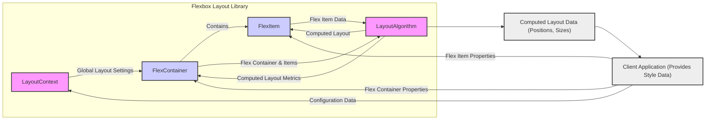

# Project Design Document: Flexbox Layout Library

**Version:** 1.1
**Date:** October 26, 2023
**Author:** AI Software Architect

## 1. Introduction

This document provides an enhanced and more detailed design overview of the Flexbox Layout library, as found on GitHub at [https://github.com/google/flexbox-layout](https://github.com/google/flexbox-layout). This revised document aims to provide a clearer and more comprehensive articulation of the library's architecture, components, and data flow, specifically tailored to facilitate more effective and granular threat modeling. It will serve as an improved foundational resource for security analysis and risk assessment.

## 2. Goals

*   Provide a highly detailed architectural overview of the Flexbox Layout library, emphasizing aspects relevant to security.
*   Clearly identify key components, their specific responsibilities, and the nature of their interactions.
*   Thoroughly describe the data flow within the library, highlighting potential transformation and validation points.
*   Pinpoint potential areas of security concern with greater specificity to enable targeted threat modeling activities.
*   Serve as a precise and informative reference for developers, security analysts, and testers.

## 3. Overview

The Flexbox Layout library is a robust C++ implementation of the CSS Flexible Box Layout Module (Flexbox) specification. Its primary function is to programmatically calculate the precise layout (position and size) of elements within a container based on Flexbox principles. This library is explicitly designed for embedding within other applications, particularly rendering engines (like web browsers or UI frameworks), where accurate and performant layout calculations are essential. It operates as a foundational, non-interactive component.

## 4. Architectural Design

The library's architecture is structured around distinct components that collaborate to perform layout calculations. Understanding these components and their interactions is crucial for identifying potential attack surfaces.

### 4.1. Key Components

*   **`LayoutContext`:** This component encapsulates the global context required for a layout calculation. It holds information such as:
    *   The available width and height for the layout.
    *   The layout direction (row or column, and its reverse).
    *   The writing mode (horizontal or vertical).
    *   Potentially, accessibility-related settings.
*   **`FlexItem`:** Represents an individual element participating in the Flexbox layout. Each `FlexItem` stores properties derived from CSS styles, including:
    *   `flex-grow`:  Determines how much the item will grow relative to other flex items.
    *   `flex-shrink`: Determines how much the item will shrink relative to other flex items.
    *   `flex-basis`: The initial main size of the item.
    *   `order`:  Controls the order in which items appear in the flex container.
    *   Margins, padding, and explicit width/height.
*   **`FlexContainer`:** Represents the parent element that establishes the Flexbox formatting context for its children (`FlexItem`s). It stores properties that govern the layout of its children:
    *   `flex-direction`:  The direction in which flex items are placed in the flex container.
    *   `justify-content`:  How flex items are aligned along the main axis of the container.
    *   `align-items`: How flex items are aligned along the cross axis of the container.
    *   `flex-wrap`: Whether the flex items should wrap onto multiple lines.
    *   `align-content`: How lines of flex items are aligned in the flex container.
*   **`LayoutAlgorithm`:** This is the core computational engine of the library. It takes a `FlexContainer` and its associated `FlexItem`s as input and performs the complex calculations required to determine the final positions and sizes of each item. This process likely involves:
    *   **Initial sizing:** Determining the initial size of each flex item based on its `flex-basis` and content.
    *   **Free space distribution:** Distributing the available space among the flex items according to their `flex-grow` and `flex-shrink` factors.
    *   **Alignment:** Applying the `justify-content` and `align-items` properties to position the items within the container.
    *   **Line wrapping (if enabled):**  Breaking items onto new lines if they don't fit on a single line.
*   **`StyleResolver` (Implicit Interface):**  While not a distinct, explicitly named component within the library's core, an interface or mechanism is necessary to translate external style information (e.g., CSS properties from a rendering engine) into the internal representation used by the library (setting properties on `FlexItem` and `FlexContainer`). This responsibility typically lies with the client application or a dedicated adapter layer.
*   **Memory Management Subsystem:**  Given that the library is implemented in C++, robust memory management is essential. This implicit subsystem handles the allocation, deallocation, and lifetime management of `FlexItem`, `FlexContainer`, and other internal data structures.

### 4.2. Component Interactions

*   The **Client Application** acts as the primary driver, providing style data that configures the `LayoutContext`, `FlexContainer`, and individual `FlexItem`s.
*   The **`LayoutContext`** provides global layout settings and constraints to the **`FlexContainer`**.
*   The **`FlexContainer`** manages and contains a collection of **`FlexItem`** objects, representing the elements to be laid out.
*   The **`LayoutAlgorithm`** receives the **`FlexContainer`** and its associated **`FlexItem`**s as input.
*   The **`LayoutAlgorithm`** processes the properties of the **`FlexContainer`** and **`FlexItem`**s to perform the layout calculations according to the Flexbox specification.
*   The **`LayoutAlgorithm`** updates the **`FlexItem`** objects with their computed layout (position and size).
*   The **`LayoutAlgorithm`** also potentially updates the **`FlexContainer`** with computed metrics (e.g., total size).
*   Finally, the **`LayoutAlgorithm`** returns the **Computed Layout Data** (positions and sizes of each item) back to the **Client Application**.

## 5. Data Flow

The data flow within the library involves the transformation of style information into concrete layout dimensions.

```mermaid
graph LR
    A["Client Application Provides Style Data (CSS Properties)"] --> B["Style Resolver (Client-Side or Adapter) Translates Styles to Library's Internal Representation"]
    B --> C["Library Creates/Updates FlexContainer and FlexItem Objects with Resolved Properties"]
    C --> D["LayoutAlgorithm Receives FlexContainer and FlexItems"]
    D --> E["LayoutAlgorithm Performs Layout Calculations (Iterative Process of Sizing, Space Distribution, Alignment)"]
    E --> F["LayoutAlgorithm Updates FlexItem Objects with Computed Positions and Sizes"]
    F --> G["Library Returns Computed Layout Data to Client Application"]
    style A fill:#eee,stroke:#333,stroke-width:2px
    style B fill:#ddd,stroke:#333,stroke-width:2px
    style C fill:#ccf,stroke:#333,stroke-width:2px
    style D fill:#f9f,stroke:#333,stroke-width:2px
    style E fill:#f9f,stroke:#333,stroke-width:2px
    style F fill:#ccf,stroke:#333,stroke-width:2px
    style G fill:#eee,stroke:#333,stroke-width:2px
```

1. The **Client Application** provides style data, typically in the form of CSS properties, relevant to Flexbox layout.
2. A **Style Resolver** (which may be part of the client application or an adapter layer) translates these CSS properties into the internal representation understood by the Flexbox Layout library.
3. The **Library** uses the resolved properties to create or update the internal state of `FlexContainer` and `FlexItem` objects.
4. The **`LayoutAlgorithm`** is invoked with the configured `FlexContainer` and its `FlexItem`s.
5. The **`LayoutAlgorithm`** performs the core layout calculations. This is often an iterative process involving multiple passes to determine the final sizes and positions, considering factors like content size, available space, and flex factors.
6. The **`LayoutAlgorithm`** updates the `FlexItem` objects with their computed positions and sizes.
7. The **Library** returns the computed layout data (e.g., the final bounding boxes of each flex item) back to the **Client Application**, which can then use this information for rendering or further processing.

## 6. Security Considerations (For Threat Modeling)

This section outlines potential security concerns with a focus on specific attack vectors and vulnerabilities that should be considered during threat modeling:

*   **Input Validation Vulnerabilities (via Client Application):**
    *   **Malicious Property Values:** The client application might provide extremely large, negative, or otherwise invalid values for Flexbox properties (e.g., `flex-grow: -10000`, excessively large dimensions). The library needs to handle these gracefully to prevent crashes, unexpected behavior, or integer overflows during calculations.
    *   **Type Confusion:** If the interface for setting properties allows for incorrect data types, it could lead to unexpected behavior or memory corruption.
    *   **Injection Attacks (Indirect):** While the library doesn't directly parse strings, vulnerabilities in the client application's style parsing logic could lead to the injection of malicious values that are then passed to the library.
*   **Memory Safety Issues (C++ Specific):**
    *   **Buffer Overflows:**  If internal buffers used during layout calculations are not sized correctly based on the number of items or complexity of the layout, it could lead to buffer overflows.
    *   **Use-After-Free:** Improper management of the lifetime of `FlexItem` and `FlexContainer` objects could result in use-after-free vulnerabilities if the `LayoutAlgorithm` accesses deallocated memory.
    *   **Double-Free:** Errors in deallocating memory could lead to double-free vulnerabilities, potentially causing crashes or exploitable conditions.
    *   **Memory Leaks:** Failure to deallocate memory used by `FlexItem`s, `FlexContainer`s, or internal data structures could lead to memory leaks, potentially causing denial of service over time.
*   **Denial of Service (DoS):**
    *   **Algorithmic Complexity Attacks:**  Crafting specific layout configurations with a large number of nested flex containers or items with specific flex properties could lead to exponential increases in computation time, causing the `LayoutAlgorithm` to consume excessive CPU resources.
    *   **Resource Exhaustion:** Providing an extremely large number of flex items could exhaust available memory, leading to a crash or denial of service.
*   **Integer Overflow/Underflow:**
    *   Calculations involving sizes, offsets, and flex factors could potentially lead to integer overflows or underflows if intermediate results exceed the maximum or minimum values of the integer types used. This could lead to incorrect layout calculations or even crashes.
*   **Integration Vulnerabilities:**
    *   **Exposure of Internal Data:** If the library exposes internal data structures or memory regions to the client application, it could create opportunities for exploitation.
    *   **Incorrect Handling of Computed Layout:** Vulnerabilities in the client application's logic for handling the computed layout data (e.g., using it for rendering) could be indirectly caused by or exacerbated by the layout library.
*   **Side-Channel Attacks (Less Likely but Possible):**
    *   In highly sensitive environments, variations in the execution time of the `LayoutAlgorithm` based on the layout configuration could potentially leak information about the structure or content being laid out.

## 7. Dependencies

The Flexbox Layout library primarily relies on standard C++ libraries (e.g., STL for data structures and algorithms). A thorough review of the project's build system and source code would be necessary to identify any external dependencies beyond the standard library. Based on the provided GitHub repository, there are no explicitly declared external library dependencies in the project's core structure.

## 8. Deployment

The Flexbox Layout library is designed for deployment as an embedded component within other applications. This typically involves:

*   **Compilation:** The library's source code is compiled into a static or dynamic library.
*   **Linking:** The compiled library is linked with the client application's executable.
*   **Runtime Integration:** The client application then utilizes the library's API to perform layout calculations as needed.

The specific deployment context will vary depending on the nature of the client application (e.g., a web browser engine, a mobile application framework, a desktop UI toolkit).

## 9. Future Considerations

*   **Performance Enhancements:** Continuous optimization of the `LayoutAlgorithm` for improved performance, especially with complex layouts.
*   **Support for Emerging CSS Features:**  Adapting the library to support new or evolving features within the CSS Flexbox specification.
*   **Enhanced Testing and Fuzzing:** Implementing more comprehensive unit tests, integration tests, and fuzzing strategies to proactively identify potential bugs and vulnerabilities.
*   **Security Audits:** Regular security audits by external experts to identify and address potential security weaknesses.

This enhanced design document provides a more detailed and security-focused overview of the Flexbox Layout library. The specific security considerations outlined here are intended to serve as a starting point for a comprehensive threat modeling exercise.