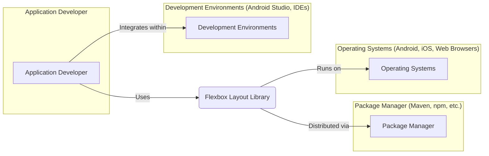
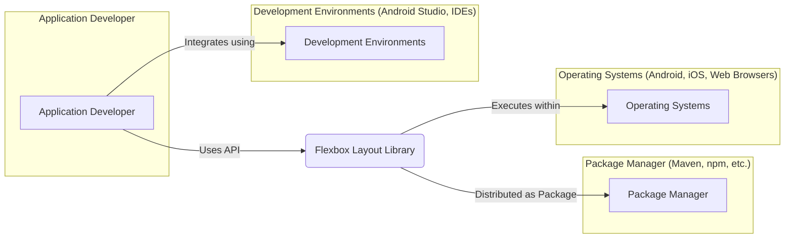
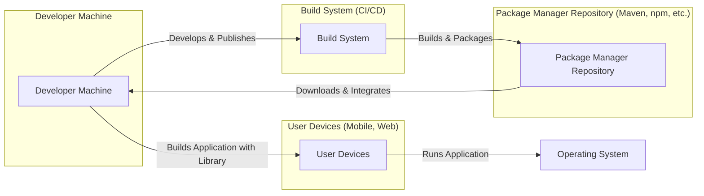

# BUSINESS POSTURE

This project provides a flexible layout library, aiming to simplify the creation of complex user interfaces across different platforms. The primary business priority is to empower developers to build sophisticated and responsive UIs more efficiently, reducing development time and improving UI consistency. This can lead to faster product iterations and a better user experience for applications utilizing the library.

Key business goals include:
- Increasing developer productivity in UI development.
- Enabling creation of more adaptable and responsive user interfaces.
- Reducing UI development complexity and maintenance overhead.
- Fostering innovation in UI design by providing a powerful layout tool.

The most important business risks associated with this project are:
- Security vulnerabilities in the library could be exploited in applications using it, leading to data breaches or application malfunctions.
- Performance issues within the layout library could negatively impact the performance of applications, resulting in poor user experience and potential user churn.
- Compatibility problems with different platforms or devices could lead to inconsistent UI rendering or application crashes, damaging user trust and brand reputation.
- Lack of adoption by the developer community would negate the benefits of the library and represent a wasted investment.

# SECURITY POSTURE

Existing security controls:
- security control: Public code repository on GitHub, allowing for community security review. Implemented in: GitHub platform.
- security control: Google's internal code review processes before code is published. Implemented in: Google's internal development workflow.
- security control: Use of standard build tools and potentially CI/CD pipelines with basic security checks (linters, static analysis). Implemented in: Project's build and release process (details not publicly available).
- accepted risk: Open-source nature implies reliance on community for vulnerability discovery and reporting, which might have delays.
- accepted risk:  Potential for supply chain vulnerabilities if dependencies are not carefully managed.

Recommended security controls:
- security control: Implement automated dependency scanning to identify and address vulnerable dependencies.
- security control: Conduct regular security audits and penetration testing of the library, even as an open-source project.
- security control: Establish a clear vulnerability reporting and patching process, with public communication of security advisories.
- security control: Integrate static application security testing (SAST) tools into the CI/CD pipeline to automatically detect potential code-level vulnerabilities.

Security requirements:
- Authentication: Not directly applicable to a layout library itself. Authentication is the responsibility of applications using the library.
- Authorization: Not directly applicable to a layout library itself. Authorization is the responsibility of applications using the library.
- Input validation: While the library primarily deals with layout specifications, ensure robust input validation for any configuration parameters or APIs that accept external input to prevent unexpected behavior or vulnerabilities. Focus on validating layout properties and style attributes.
- Cryptography: Cryptography is not a core requirement for a layout library. However, if the library were to handle or process any sensitive data (which is not expected in a layout library), appropriate cryptographic measures would be necessary in those specific areas.

# DESIGN

## C4 CONTEXT



Context Diagram Elements:

- Name: Application Developer
  - Type: Person
  - Description: Software developers who use the Flexbox Layout Library to build user interfaces for their applications.
  - Responsibilities: Integrate the library into their projects, define layouts using the library's API, and test the UI implementation.
  - Security controls: Responsible for secure coding practices in their applications, including proper usage of the layout library and handling of application data.

- Name: Package Manager (Maven, npm, etc.)
  - Type: System
  - Description: Package repositories used to distribute and manage the Flexbox Layout Library as a dependency for application development projects.
  - Responsibilities: Host and distribute the library packages, manage versions, and provide dependency resolution for developers.
  - Security controls: Package managers implement security controls to ensure package integrity and prevent malicious package distribution (e.g., checksum verification, package signing).

- Name: Operating Systems (Android, iOS, Web Browsers)
  - Type: System
  - Description: Target platforms where applications using the Flexbox Layout Library are deployed and executed. This includes mobile operating systems like Android and iOS, as well as web browsers.
  - Responsibilities: Provide the runtime environment for applications, render user interfaces, and manage system resources.
  - Security controls: Operating systems and browsers implement a wide range of security controls to protect applications and user data, including sandboxing, permission management, and memory protection.

- Name: Development Environments (Android Studio, IDEs)
  - Type: System
  - Description: Integrated Development Environments used by application developers to write, build, and test applications that utilize the Flexbox Layout Library.
  - Responsibilities: Provide tools for code editing, compilation, debugging, and integration with package managers and target platforms.
  - Security controls: Development environments offer features like code analysis, linting, and debugging tools that can help developers identify and address potential security issues in their code.

- Name: Flexbox Layout Library
  - Type: System
  - Description: The Flexbox Layout Library itself, providing functionalities for creating flexible and responsive user interface layouts.
  - Responsibilities: Implement the flexbox layout algorithm, provide APIs for developers to define layouts, and render UI elements according to the specified layout.
  - Security controls: Security controls for the library itself include secure coding practices during development, code reviews, static analysis, dependency management, and vulnerability management.

## C4 CONTAINER



Container Diagram Elements:

- Name: Application Developer
  - Type: Person
  - Description: Software developers who use the Flexbox Layout Library to build user interfaces for their applications.
  - Responsibilities: Integrate the library into their projects, define layouts using the library's API, and test the UI implementation.
  - Security controls: Responsible for secure coding practices in their applications, including proper usage of the layout library and handling of application data.

- Name: Package Manager (Maven, npm, etc.)
  - Type: Container
  - Description: Package repositories (like Maven Central for Java/Android, npm registry for JavaScript) that host and distribute the Flexbox Layout Library.
  - Responsibilities: Host and distribute the library packages, manage versions, and provide dependency resolution for developers.
  - Security controls: Package managers implement security controls to ensure package integrity and prevent malicious package distribution (e.g., checksum verification, package signing).

- Name: Operating Systems (Android, iOS, Web Browsers)
  - Type: Container
  - Description: The runtime environments provided by operating systems and web browsers where applications using the Flexbox Layout Library are executed.
  - Responsibilities: Provide the runtime environment for applications, render user interfaces, and manage system resources.
  - Security controls: Operating systems and browsers implement a wide range of security controls to protect applications and user data, including sandboxing, permission management, and memory protection.

- Name: Development Environments (Android Studio, IDEs)
  - Type: Container
  - Description: Integrated Development Environments used by application developers to write, build, and test applications that utilize the Flexbox Layout Library.
  - Responsibilities: Provide tools for code editing, compilation, debugging, and integration with package managers and target platforms.
  - Security controls: Development environments offer features like code analysis, linting, and debugging tools that can help developers identify and address potential security issues in their code.

- Name: Flexbox Layout Library
  - Type: Container
  - Description: The Flexbox Layout Library, a software component providing flexbox layout functionalities. It's distributed as a package and integrated into applications.
  - Responsibilities: Implement the flexbox layout algorithm, provide APIs for developers to define layouts, and render UI elements according to the specified layout.
  - Security controls: Security controls for the library itself include secure coding practices during development, code reviews, static analysis, dependency management, and vulnerability management.

## DEPLOYMENT

Deployment Architecture: Library Distribution via Package Managers



Deployment Diagram Elements:

- Name: Developer Machine
  - Type: Infrastructure
  - Description: The local computer used by developers to write code, build applications, and integrate the Flexbox Layout Library.
  - Responsibilities: Development environment for writing and testing code, managing dependencies, and building applications.
  - Security controls: Developer machines should have security controls like endpoint protection, strong passwords, and access controls to protect development environment and code.

- Name: Package Manager Repository (Maven, npm, etc.)
  - Type: Infrastructure
  - Description: Central repository that hosts and distributes the Flexbox Layout Library packages. Examples include Maven Central, npm registry, etc.
  - Responsibilities: Store and serve library packages, manage versions, and ensure package availability and integrity.
  - Security controls: Package repositories implement security measures to protect against malicious package uploads, ensure package integrity (checksums, signing), and control access to packages.

- Name: User Devices (Mobile, Web)
  - Type: Infrastructure
  - Description: End-user devices such as smartphones, tablets, and computers where applications using the Flexbox Layout Library are deployed and run.
  - Responsibilities: Execute applications, render user interfaces, and provide user interaction.
  - Security controls: User devices rely on operating system and browser security controls to protect applications and user data.

- Name: Build System (CI/CD)
  - Type: Infrastructure
  - Description: Automated build and continuous integration/continuous deployment system used to build, test, and package the Flexbox Layout Library before publishing to package repositories.
  - Responsibilities: Automate the build process, run tests, perform security checks (linters, SAST), package the library, and publish to package repositories.
  - Security controls: Build systems should implement security controls to protect the build pipeline, secure build artifacts, and prevent unauthorized access or modifications. This includes access control, secure configuration, and audit logging.

- Name: Operating System
  - Type: Software
  - Description: Operating system running on User Devices, providing runtime environment for applications.
  - Responsibilities: Execute applications, manage resources, enforce security policies.
  - Security controls: OS level security controls like sandboxing, permissions, memory protection.

## BUILD

Build Process Diagram:

```mermaid
flowchart LR
    subgraph "Developer"
        DEV[Developer]
    end
    subgraph "Version Control (GitHub)"
        VC[Version Control]
    end
    subgraph "Build System (CI/CD - e.g., GitHub Actions)"
        BS[Build System]
    end
    subgraph "Package Repository (Maven, npm, etc.)"
        PR[Package Repository]
    end

    DEV -->|Code Commit| VC
    VC -->|Webhook Trigger| BS
    BS -->|Checkout Code| VC
    BS -->|Dependency Resolution| DM[Dependency Manager]
    BS -->|Build & Test| BT[Build Tools]
    BS -->|Security Checks (SAST, Linters, Dependency Scan)| SC[Security Checks]
    BS -->|Package Artifact| PA[Package Artifact]
    BS -->|Publish Artifact| PR
```

Build Process Description:

1. Developer commits code changes to the Version Control system (GitHub).
2. A webhook in Version Control triggers the Build System (e.g., GitHub Actions).
3. Build System checks out the latest code from Version Control.
4. Build System resolves dependencies using a Dependency Manager (e.g., Maven, npm).
5. Build System compiles and tests the code using Build Tools (e.g., Gradle, npm scripts).
6. Build System performs Security Checks, including Static Application Security Testing (SAST), linters, and dependency scanning to identify potential vulnerabilities.
7. Build System packages the build artifacts into distributable packages.
8. Build System publishes the Package Artifacts to the Package Repository (e.g., Maven Central, npm registry).

Security Controls in Build Process:

- security control: Version Control (GitHub): Securely stores source code, tracks changes, and provides access control. Implemented in: GitHub platform.
- security control: Build System (CI/CD): Automates build process, enforces consistent builds, and integrates security checks. Implemented in: CI/CD pipeline configuration.
- security control: Dependency Manager: Manages external libraries and dependencies, can be configured to use secure repositories and verify package integrity. Implemented in: Build system configuration and dependency management tools.
- security control: Build Tools: Compile and package the code, should be from trusted sources and securely configured. Implemented in: Build system configuration.
- security control: Security Checks (SAST, Linters, Dependency Scan): Automated tools integrated into the build pipeline to detect code vulnerabilities, style issues, and vulnerable dependencies. Implemented in: CI/CD pipeline configuration, security scanning tools.
- security control: Package Artifact Signing: Sign build artifacts to ensure integrity and authenticity, preventing tampering after publication. Implemented in: Build system and package publishing process.
- security control: Access Control: Restrict access to the build system, version control, and package repositories to authorized personnel. Implemented in: Platform access control configurations.
- security control: Audit Logging: Log all build activities, security checks, and deployments for auditing and security monitoring. Implemented in: CI/CD platform and logging systems.

# RISK ASSESSMENT

Critical business process we are trying to protect:
- Secure and reliable distribution of the Flexbox Layout Library to developers.
- Maintaining the integrity and availability of the library to ensure developers can build applications effectively.
- Protecting applications that use the library from vulnerabilities originating from the library itself.

Data we are trying to protect and their sensitivity:
- Source code of the Flexbox Layout Library: Intellectual property, public but modifications should be controlled. Sensitivity: Medium.
- Build artifacts (packages):  Should be protected from tampering to ensure integrity for developers using the library. Sensitivity: Medium.
- Vulnerability reports: Information about security weaknesses in the library. Should be handled confidentially until patches are released. Sensitivity: High (initially), Medium (after patch).

# QUESTIONS & ASSUMPTIONS

Questions:
- What are the target platforms for the Flexbox Layout Library (Android, Web, iOS, other)?
- What are the performance benchmarks and requirements for the library?
- Are there any specific security certifications or compliance requirements for this library?
- What is the process for reporting and patching vulnerabilities in the library?
- What is the intended scope of input validation for the library's APIs?

Assumptions:
- BUSINESS POSTURE: The primary goal is to provide a useful and reliable layout library for developers to improve UI development efficiency and quality. The library is intended for broad use in various applications.
- SECURITY POSTURE: The project follows secure software development lifecycle principles. Google provides some level of security oversight for open-source projects. The community plays a role in security through code review and vulnerability reporting.
- DESIGN: The library is distributed as a package through standard package managers. Developers integrate the library into their applications. The build process is automated and includes basic security checks.