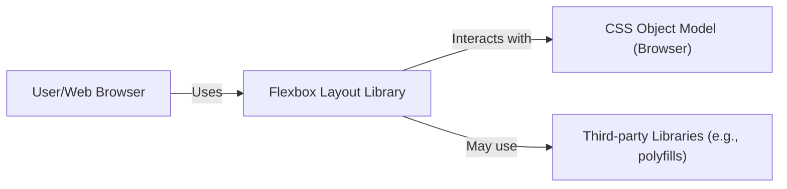
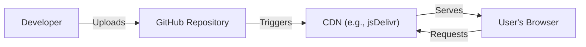
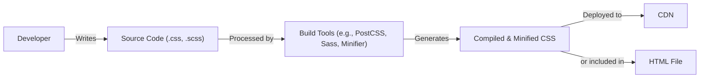

# BUSINESS POSTURE

Business Priorities and Goals:

*   Provide a robust and flexible CSS layout system (Flexbox) that simplifies web development.
*   Offer a cross-browser compatible solution, reducing development time and effort.
*   Maintain a lightweight and performant library to minimize impact on website loading times.
*   Provide clear and comprehensive documentation to facilitate easy adoption and usage.
*   Foster a community-driven project with active maintenance and support.

Business Risks:

*   Inconsistent behavior across different browsers could lead to layout issues and increased development costs.
*   Performance bottlenecks in the library could negatively impact website loading times and user experience.
*   Lack of proper documentation or support could hinder adoption and lead to developer frustration.
*   Security vulnerabilities, although unlikely in a CSS layout library, could potentially be exploited if present.
*   Lack of updates and maintenance could lead to the library becoming obsolete and incompatible with future web standards.

# SECURITY POSTURE

Existing Security Controls:

*   security control: The library itself is primarily focused on layout and presentation, and does not directly handle sensitive data or user authentication. Therefore, inherent security risks are minimal.
*   security control: The project is hosted on GitHub, which provides a secure platform for code hosting, version control, and collaboration. (Described in GitHub documentation)
*   security control: The project likely benefits from Google's internal code review and security testing processes, although this is not explicitly stated in the repository. (Assumed based on Google's general security practices)
*   accepted risk: The library does not implement specific security controls related to authentication, authorization, or input validation, as these are not within its scope.

Recommended Security Controls:

*   security control: Regularly update dependencies to address any potential security vulnerabilities in third-party libraries.
*   security control: Implement a Content Security Policy (CSP) to mitigate the risk of cross-site scripting (XSS) attacks, although the library's direct exposure to XSS is low.
*   security control: Conduct periodic security audits and code reviews to identify and address any potential security concerns.

Security Requirements:

*   Authentication: Not applicable, as the library does not handle user authentication.
*   Authorization: Not applicable, as the library does not manage user permissions or access control.
*   Input Validation: Not applicable, as the library does not directly process user input.
*   Cryptography: Not applicable, as the library does not handle encryption or decryption.

# DESIGN

## C4 CONTEXT

Context Diagram Element List:

*   User/Web Browser
    *   Name: User/Web Browser
    *   Type: Person/External System
    *   Description: Represents the end-user accessing a website that utilizes the Flexbox Layout Library.
    *   Responsibilities: Renders the web page, interprets HTML and CSS, and executes JavaScript.
    *   Security controls: Browser-level security controls (e.g., sandboxing, same-origin policy).

*   Flexbox Layout Library
    *   Name: Flexbox Layout Library
    *   Type: System
    *   Description: The core component, providing the Flexbox layout functionality.
    *   Responsibilities: Provides a set of CSS classes and properties to create flexible and responsive layouts.
    *   Security controls: Limited direct security controls, as it primarily deals with layout. Relies on browser security and secure coding practices.

*   CSS Object Model (CSSOM)
    *   Name: CSS Object Model (CSSOM)
    *   Type: External System
    *   Description: The browser's internal representation of the CSS styles applied to a web page.
    *   Responsibilities: Provides an API for manipulating CSS styles programmatically.
    *   Security controls: Browser-level security controls.

*   Third-party Libraries (e.g., polyfills)
    *   Name: Third-party Libraries
    *   Type: External System
    *   Description: External libraries that may be used to enhance functionality or provide cross-browser compatibility.
    *   Responsibilities: Provide specific functionality not natively supported by all browsers.
    *   Security controls: Dependent on the security of the specific third-party library. Regular updates are crucial.

## C4 CONTAINER

Since Flexbox is a CSS library, the container diagram is essentially the same as the context diagram. It doesn't have separate deployable units in the traditional sense.

Container Diagram Element List:

*   User/Web Browser
    *   Name: User/Web Browser
    *   Type: Person/External System
    *   Description: Represents the end-user accessing a website that utilizes the Flexbox Layout Library.
    *   Responsibilities: Renders the web page, interprets HTML and CSS, and executes JavaScript.
    *   Security controls: Browser-level security controls (e.g., sandboxing, same-origin policy).

*   Flexbox Layout Library
    *   Name: Flexbox Layout Library
    *   Type: System
    *   Description: The core component, providing the Flexbox layout functionality. This is a library, not a separate container.
    *   Responsibilities: Provides a set of CSS classes and properties to create flexible and responsive layouts.
    *   Security controls: Limited direct security controls, as it primarily deals with layout. Relies on browser security and secure coding practices.

*   CSS Object Model (CSSOM)
    *   Name: CSS Object Model (CSSOM)
    *   Type: External System
    *   Description: The browser's internal representation of the CSS styles applied to a web page.
    *   Responsibilities: Provides an API for manipulating CSS styles programmatically.
    *   Security controls: Browser-level security controls.

*   Third-party Libraries (e.g., polyfills)
    *   Name: Third-party Libraries
    *   Type: External System
    *   Description: External libraries that may be used to enhance functionality or provide cross-browser compatibility.
    *   Responsibilities: Provide specific functionality not natively supported by all browsers.
    *   Security controls: Dependent on the security of the specific third-party library. Regular updates are crucial.

## DEPLOYMENT

Deployment Options:

1.  Direct Inclusion: Include the Flexbox CSS file directly in the HTML of the website.
2.  Content Delivery Network (CDN): Link to the Flexbox CSS file hosted on a CDN.
3.  Package Manager: Install the library using a package manager like npm or yarn.

Chosen Deployment (CDN):

Deployment Diagram Element List:

*   Developer
    *   Name: Developer
    *   Type: Person
    *   Description: The developer who writes and maintains the code.
    *   Responsibilities: Develops, tests, and deploys the library.
    *   Security controls: Secure coding practices, access control to the repository.

*   GitHub Repository
    *   Name: GitHub Repository
    *   Type: System
    *   Description: The source code repository hosted on GitHub.
    *   Responsibilities: Stores the code, manages versions, and facilitates collaboration.
    *   Security controls: GitHub's built-in security features, access control, branch protection rules.

*   CDN (e.g., jsDelivr)
    *   Name: CDN (e.g., jsDelivr)
    *   Type: External System
    *   Description: A content delivery network that hosts the compiled CSS file.
    *   Responsibilities: Distributes the CSS file globally for fast access.
    *   Security controls: CDN's security measures (e.g., DDoS protection, HTTPS).

*   User's Browser
    *   Name: User's Browser
    *   Type: External System
    *   Description: The end-user's web browser.
    *   Responsibilities: Downloads and renders the website, including the Flexbox CSS.
    *   Security controls: Browser-level security controls.

## BUILD

The build process for Flexbox is relatively simple, primarily involving compilation and minification of the CSS.  The repository doesn't specify a build system, but common tools for this type of project would include tools like PostCSS, Sass, or simply a minifier.  There is no automated build system visible in the repository.

Build Process Security:

*   security control: Use of reputable build tools (PostCSS, Sass, etc.) that are regularly updated.
*   security control: Minification of the CSS reduces the attack surface by removing unnecessary characters and comments.
*   security control: If a package manager (npm, yarn) is used, regularly audit and update dependencies to mitigate supply chain risks.
*   security control: Implement linting (e.g., Stylelint) to enforce coding standards and identify potential issues.

# RISK ASSESSMENT

Critical Business Processes:

*   Website rendering and layout: The library is directly responsible for the visual presentation of websites. Any issues with the library can directly impact the user experience.

Data Protection:

*   Data Sensitivity: The library itself does not handle any sensitive data. It primarily deals with CSS layout rules. Therefore, data protection is not a primary concern *for the library itself*. However, websites *using* the library may handle sensitive data, and the overall security of the website is crucial.

# QUESTIONS & ASSUMPTIONS

Questions:

*   Are there any specific performance requirements or benchmarks for the library?
*   What is the intended level of browser support (specific versions)?
*   Are there any plans to integrate with specific JavaScript frameworks or libraries?
*   Is there a formal process for handling security vulnerabilities reported by external researchers?
*   What is process of updating library?
*   What is process of testing library?

Assumptions:

*   BUSINESS POSTURE: The primary goal is to provide a reliable and efficient CSS layout solution.
*   BUSINESS POSTURE: Google's internal security practices are applied to the project, even if not explicitly documented in the repository.
*   SECURITY POSTURE: The library does not directly handle sensitive data or user authentication.
*   SECURITY POSTURE: Developers using the library are responsible for implementing appropriate security measures in their own applications.
*   DESIGN: The library is primarily used by including the compiled CSS file in web pages.
*   DESIGN: The build process involves compilation and minification of CSS.
*   DESIGN: No specific CI/CD pipeline is defined in the public repository.