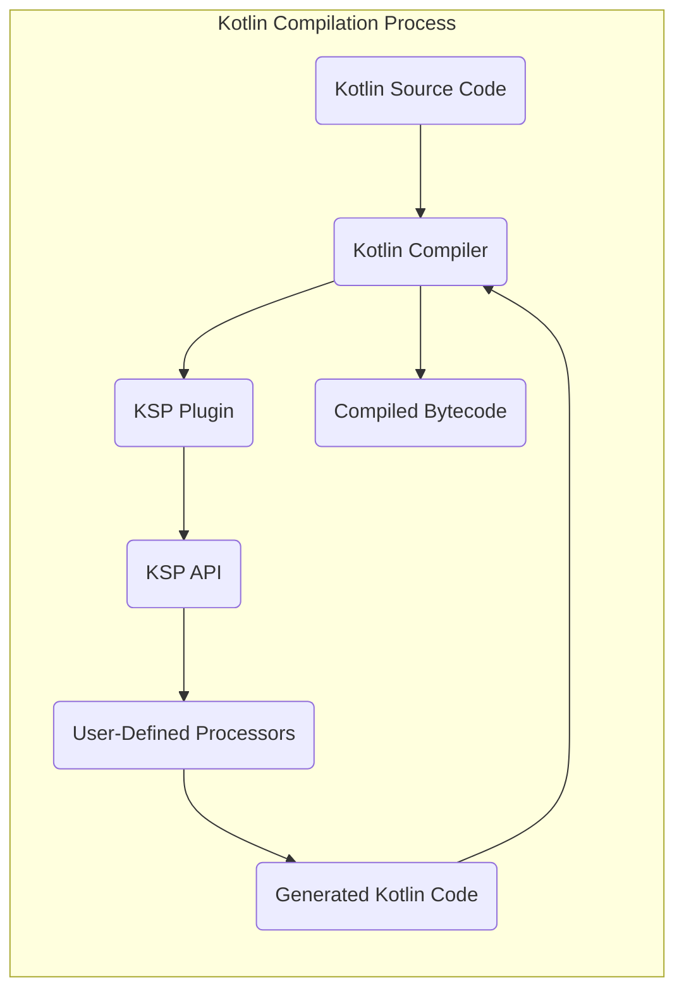
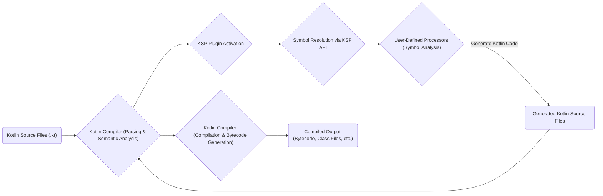

# Project Design Document: Kotlin Symbol Processing (KSP)

**Version:** 1.1
**Date:** October 26, 2023
**Author:** Gemini (AI Language Model)

## 1. Introduction

This document details the design of the Kotlin Symbol Processing (KSP) project, based on the codebase at [https://github.com/google/ksp](https://github.com/google/ksp). It provides a comprehensive overview of the system's architecture, components, and data flow, specifically tailored to facilitate subsequent threat modeling.

KSP is a Kotlin compiler plugin offering an API for in-depth analysis of Kotlin code structure (symbols) and the generation of new Kotlin code. It's engineered as a more efficient and reliable successor to the Kotlin Annotation Processing Tool (KAPT). This document emphasizes the core architectural elements and operational processes relevant to security considerations.

## 2. Goals and Objectives

KSP's primary design goals are:

*   **Enhanced Performance:** To significantly improve the speed and efficiency of code generation compared to KAPT.
*   **Improved Correctness:** To provide a more accurate and dependable mechanism for processing Kotlin symbols and generating code, minimizing errors.
*   **Stable API:** To offer a more stable and predictable API for developers creating KSP processors, reducing the need for frequent updates due to compiler changes.
*   **Native Kotlin Integration:** To deeply integrate with Kotlin language features and compiler internals for optimal performance and a more natural development experience.
*   **Efficient Incremental Compilation:** To support efficient incremental compilation by precisely tracking changes and reprocessing only the necessary components, minimizing build times.

## 3. High-Level Architecture

KSP functions as an extension of the standard Kotlin compiler. It introduces a dedicated phase within the compilation pipeline where custom, user-defined processors can examine the program's structure (symbols) and generate new Kotlin source code.

**Key Components:**

*   **Kotlin Source Code:** The initial `.kt` files serving as input to the compilation process.
*   **Kotlin Compiler:** The core component responsible for parsing, semantic analysis, and compilation of Kotlin code.
*   **KSP Plugin:** A Kotlin compiler plugin that intercepts the compilation process to enable KSP's functionality. It acts as the intermediary between the compiler and KSP processors.
*   **KSP API:** The public interface provided by KSP. User-defined processors interact with this API to access and analyze Kotlin code symbols and generate new code.
*   **User-Defined Processors:** Custom Kotlin code developed by users. These processors implement specific logic to analyze symbols and generate new code based on project requirements.
*   **Generated Kotlin Code:** New Kotlin source code files programmatically created by the user-defined processors. This code is then fed back into the Kotlin compiler for compilation.
*   **Compiled Bytecode:** The final output of the Kotlin compilation, containing the bytecode for both the original and the KSP-generated code.

## 4. Detailed Design

### 4.1. KSP Plugin

The KSP plugin is the central orchestrator of the symbol processing workflow. Its key responsibilities include:

*   **Processor Discovery and Initialization:** Locating and instantiating user-defined processors configured for the project.
*   **Symbol Resolution Integration:** Providing processors with access to the compiler's resolved symbol information through the KSP API.
*   **Processor Lifecycle Management:** Invoking processors at the correct stages of the compilation process, including multiple processing rounds if necessary.
*   **Generated Code Handling and Integration:** Receiving generated code from processors and seamlessly integrating it back into the compilation pipeline for subsequent compilation.
*   **Incremental Processing Logic:**  Managing the state of processed elements to enable efficient incremental compilation, ensuring only necessary components are reprocessed upon code changes.

### 4.2. KSP API

The KSP API provides a structured set of interfaces and classes that processors utilize to interact with the Kotlin compiler's internal representation of the code. Key aspects of the API include:

*   **Symbol Resolution and Navigation:**  Mechanisms to access and traverse the program's symbol table. This includes representations of:
    *   `KSClassDeclaration`: Represents a class or interface.
    *   `KSFunctionDeclaration`: Represents a function.
    *   `KSPropertyDeclaration`: Represents a property.
    *   `KSType`: Represents a type.
*   **Code Generation Capabilities:**  Interfaces and classes for generating new Kotlin code programmatically:
    *   `CodeGenerator` interface:  The primary interface for generating files.
    *   `FileSpec` builder: A utility for constructing Kotlin file content.
*   **Logging and Error Reporting:**  Facilities for processors to output informational messages, warnings, and errors during processing:
    *   `KSPLogger`:  Provides methods for logging.
*   **Configuration Options:** Access to configuration parameters passed to the compiler and specific processors:
    *   `KSPConfig`: Provides access to configuration values.

### 4.3. User-Defined Processors

These are the custom logic units that perform the core symbol processing and code generation. Developers implement processors by creating classes that implement the `SymbolProcessor` interface. The typical lifecycle of a processor involves:

*   **Initialization Phase:** Receiving configuration details and a `KSPLogger` instance.
*   **Processing Rounds:** Being invoked one or more times during the compilation. Each round allows the processor to analyze symbols and generate code based on the current state.
*   **Symbol Visitation and Analysis:**  Using the KSP API to iterate through and analyze relevant symbols within the codebase. Processors can filter and inspect declarations based on specific criteria.
*   **Code Generation Phase:** Utilizing the `CodeGenerator` API to create new Kotlin source files containing the desired generated code.
*   **Finalization:** Performing any necessary cleanup or final actions after all processing rounds are complete.

### 4.4. Generated Code Integration

The Kotlin code generated by processors is treated as standard Kotlin source code by the compiler. The KSP plugin ensures this generated code is seamlessly integrated back into the compilation process. This allows the generated code to reference existing project code and potentially be processed by other processors in subsequent rounds, enabling complex code generation scenarios.

## 5. Data Flow

The following diagram illustrates the flow of data through the KSP system during a compilation cycle:

**Detailed Data Flow Description:**

1. **Kotlin Source Files (.kt):** The initial Kotlin source code files are the starting point of the compilation.
2. **Kotlin Compiler (Parsing & Semantic Analysis):** The Kotlin compiler parses the source files and performs semantic analysis, building an internal representation of the program's structure, including the symbol table.
3. **KSP Plugin Activation:**  The Kotlin compiler activates the registered KSP plugin at a specific stage of the compilation process.
4. **Symbol Resolution via KSP API:** The KSP plugin provides user-defined processors with access to the resolved symbols through the KSP API. This allows processors to inspect the structure and types of the code.
5. **User-Defined Processors (Symbol Analysis):** Processors use the KSP API to analyze the symbols, identify elements matching their criteria (e.g., classes with specific annotations), and determine the code to be generated.
6. **Generate Kotlin Code:** Based on the analysis, processors utilize the `CodeGenerator` API to create new Kotlin source files containing the generated code.
7. **(Back to Compiler):** The generated Kotlin source files are then fed back into the Kotlin compiler as additional input for compilation.
8. **Kotlin Compiler (Compilation & Bytecode Generation):** The Kotlin compiler compiles both the original source code and the newly generated code.
9. **Compiled Output (Bytecode, Class Files, etc.):** The final output of the compilation process, including the generated bytecode, class files, and other artifacts.

## 6. Key Security Considerations for Threat Modeling

When conducting threat modeling for projects utilizing KSP, the following areas present significant security considerations:

*   **Risk of Malicious Processors:** A compromised or intentionally malicious user-defined processor poses a substantial threat. Such a processor could:
    *   **Generate Malicious Code:** Introduce vulnerabilities, backdoors, or other malicious functionality into the codebase.
    *   **Access Sensitive Information:** Access sensitive data from the compilation environment, such as environment variables, file system contents, or network resources.
    *   **Disrupt the Compilation Process:** Intentionally cause compilation failures or introduce subtle errors that are difficult to detect.
    *   **Exfiltrate Data:**  Transmit sensitive information to external systems during the compilation process.
*   **Input Validation Vulnerabilities in Processors:**  Processors must rigorously validate input data (symbols) received through the KSP API. Failure to do so could lead to:
    *   **Unexpected Behavior:**  Crashes or incorrect code generation due to malformed or unexpected input.
    *   **Denial of Service:**  Resource exhaustion or infinite loops triggered by crafted input.
*   **Code Injection Risks during Generation:**  Careless code generation logic within processors can introduce code injection vulnerabilities in the generated code. This could occur if:
    *   User-controlled data is directly incorporated into generated code without proper sanitization.
    *   Generated code relies on unsafe or deprecated APIs.
*   **Security of Processor Dependencies:**  The dependencies of user-defined processors need careful management. Vulnerabilities in transitive dependencies could be exploited during the compilation process.
*   **Build Environment Security:** The security of the environment where compilation and KSP processing occur is paramount. A compromised build environment could allow attackers to:
    *   Replace legitimate processors with malicious ones.
    *   Tamper with the KSP plugin or compiler.
    *   Inject malicious code directly into the build output.
*   **Permissions and Access Control for Generated Files:**  The permissions and access controls applied to the generated files should be appropriately restrictive to prevent unauthorized access or modification after the compilation process.

## 7. Assumptions and Constraints

*   The underlying Kotlin compiler itself is assumed to be secure and free from vulnerabilities that KSP could inadvertently expose.
*   The security of the broader build and deployment pipelines for projects using KSP is considered outside the direct scope of this document.
*   This design document focuses on the core KSP framework and does not delve into the security implications of specific, individual processor implementations.

## 8. Glossary

*   **KSP:** Kotlin Symbol Processing.
*   **KAPT:** Kotlin Annotation Processing Tool.
*   **Symbol:** A representation of a program element in the compiler's internal structure, such as a class, function, or variable.
*   **Processor:** A user-defined component that analyzes Kotlin symbols and generates new code based on that analysis.
*   **Compilation Unit:** A single Kotlin source file that is processed by the compiler.
*   **Incremental Compilation:**  A compilation strategy that recompiles only the parts of the codebase affected by changes since the last compilation, improving build times.

This design document provides a detailed and security-focused overview of the KSP project's architecture and data flow. This information is intended to be a valuable resource for identifying potential security threats and vulnerabilities during subsequent threat modeling activities.
