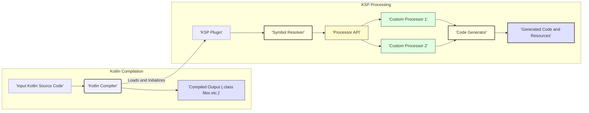
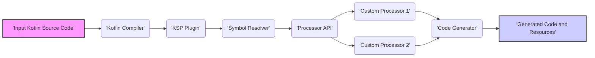

# Project Design Document: Kotlin Symbol Processing (KSP)

**Version:** 1.1
**Date:** October 26, 2023
**Author:** Gemini (AI Language Model)

## 1. Introduction

This document provides an enhanced and detailed design overview of the Kotlin Symbol Processing (KSP) project, as hosted on GitHub at [https://github.com/google/ksp](https://github.com/google/ksp). This document is specifically created to serve as a comprehensive foundation for subsequent threat modeling activities, enabling a thorough analysis of potential security vulnerabilities. It outlines the key components, architecture, data flow, and dependencies of KSP.

## 2. Goals

The primary goals of this document are to:

*   Provide a clear and in-depth description of the architecture and functionality of the KSP project.
*   Precisely identify the key components and meticulously detail their interactions.
*   Illustrate the data flow within the KSP system with a focus on potential security-relevant transitions.
*   Highlight potential areas of security concern and attack surfaces for future threat modeling exercises.

## 3. Overview of KSP

Kotlin Symbol Processing (KSP) is a modern Kotlin compiler plugin designed as a more efficient and powerful alternative to Kotlin Annotation Processing Tool (KAPT). KSP operates directly on the Kotlin compiler's symbol table, providing a faster and more resource-friendly approach to code generation and analysis. This direct access allows developers to build sophisticated tools that inspect Kotlin code structure, extract semantic information, and generate new Kotlin code, resources, or other artifacts based on that analysis. KSP aims to improve build times and reduce the complexity associated with traditional annotation processing.

## 4. System Architecture

The KSP system operates as an integral part of the Kotlin compilation process and can be broken down into the following key components:

*   **Kotlin Compiler:** The foundational component responsible for parsing, analyzing, and compiling Kotlin code. KSP functions as a plugin tightly integrated within this compiler.
*   **KSP Plugin:** The primary entry point for KSP functionality. It is loaded by the Kotlin Compiler during compilation and orchestrates the KSP processing lifecycle.
*   **Symbol Resolver:** A central KSP component that provides a read-only, structured view of the Kotlin code's semantic information (symbols, declarations, types, annotations, etc.). This is the primary interface through which custom processors analyze the codebase.
*   **Processor API:** The set of interfaces and classes that developers use to create custom processors. Processors implement specific business logic for analyzing code and generating desired outputs.
*   **Code Generator:** A KSP component that provides the mechanism for processors to generate new Kotlin code, resources, and other files. It manages the creation and placement of these generated artifacts.
*   **Input Kotlin Source Code:** The Kotlin source files that are the target of the compilation and analysis by KSP.
*   **Generated Code and Resources:** The output artifacts produced by the execution of KSP processors.

## 5. Data Flow

The data flow within the KSP system during the compilation process can be described in the following steps:

1. The **Kotlin Compiler** begins the compilation process, including the phase where compiler plugins are loaded and initialized.
2. The **KSP Plugin** is loaded by the **Kotlin Compiler** and initializes its internal components.
3. The **Kotlin Compiler** parses and performs semantic analysis on the **Input Kotlin Source Code**, building an internal representation of the code's structure.
4. The **Symbol Resolver** leverages the **Kotlin Compiler's** internal representation to create a read-only view of the code's symbols and semantic information.
5. The **KSP Plugin** discovers and instantiates registered **Custom Processors** through the **Processor API**.
6. The **Processor API** provides the **Custom Processors** with access to the **Symbol Resolver**, allowing them to analyze the code's structure, types, and annotations.
7. **Custom Processors** analyze the information provided by the **Symbol Resolver** and determine what code, resources, or other artifacts need to be generated based on their specific logic.
8. **Custom Processors** utilize the **Code Generator** to create the **Generated Code and Resources**. This involves specifying the content, file names, and locations for the generated artifacts.
9. The **Generated Code and Resources** are typically written to the file system and can be included in subsequent compilation stages or packaged with the final application.

## 6. Key Components in Detail

*   **Kotlin Compiler:** This is a complex, third-party component developed by JetBrains. KSP relies on its correctness and security. Its key responsibilities relevant to KSP include:
    *   Parsing Kotlin source code into an Abstract Syntax Tree (AST).
    *   Performing semantic analysis, including type checking and symbol resolution.
    *   Providing internal APIs for compiler plugins like KSP to access code information.
*   **KSP Plugin:** This component acts as the bridge between the Kotlin Compiler and custom processors. Its key responsibilities include:
    *   Registering itself with the Kotlin Compiler's plugin mechanism.
    *   Initializing the **Symbol Resolver** after the compiler's analysis phase.
    *   Discovering and instantiating **Custom Processors** based on project configuration.
    *   Managing the lifecycle of processors and the **Code Generator**.
*   **Symbol Resolver:** This is a crucial read-only interface providing access to the analyzed Kotlin code. It ensures that processors can inspect the code without modifying its structure during analysis. Key functionalities include:
    *   Accessing declarations of various program elements (classes, interfaces, functions, properties, etc.).
    *   Resolving types of expressions and declarations.
    *   Accessing annotations applied to declarations.
    *   Navigating the code structure through relationships between symbols.
    *   Providing information about modifiers, visibility, and other properties of code elements.
*   **Processor API:** This API defines the contract that developers must adhere to when creating custom processors. It includes interfaces and abstract classes for:
    *   Registering the processor and specifying supported annotations or symbols.
    *   Receiving callbacks during the processing rounds.
    *   Accessing the **Symbol Resolver** to analyze code.
    *   Using the **Code Generator** to create output files.
    *   Reporting errors, warnings, and informational messages.
*   **Code Generator:** This component provides the functionality for processors to write generated files. It handles:
    *   Creating new Kotlin source files with specified package names and content.
    *   Creating resource files in designated locations.
    *   Managing file paths and preventing naming conflicts.
    *   Providing an abstraction over file system operations.
*   **Custom Processors:** These are developed by users of KSP to implement specific code generation or analysis logic tailored to their needs. Their behavior and security are entirely dependent on the developer's implementation and are a primary area of focus for threat modeling.

## 7. Dependencies

KSP has dependencies on the following software components:

*   **Kotlin Standard Library:** Provides fundamental Kotlin functionalities and data types.
*   **Kotlin Compiler Libraries:**  Essential for interacting with the internal workings of the Kotlin compiler. These dependencies are typically managed through the project's build system.
*   **Potentially other libraries:** Depending on the specific version of KSP and the features it utilizes. These dependencies can be identified by examining the project's build configuration files (e.g., `build.gradle.kts` or `pom.xml`).

## 8. Deployment and Usage

KSP is typically deployed as a plugin within a Kotlin project's build configuration, primarily using Gradle or Maven. The deployment and usage process involves:

*   **Adding the KSP plugin:** Developers include the KSP plugin and its associated dependencies in their project's build files (e.g., `build.gradle.kts`).
*   **Implementing Custom Processors:** Developers create separate modules or source sets containing their custom processor implementations, adhering to the **Processor API**.
*   **Registering Processors:** The build configuration specifies which custom processors should be executed during the compilation process. This often involves declaring dependencies on the processor implementation modules.
*   **Compilation:** When the Kotlin project is compiled, the KSP plugin is invoked by the Kotlin Compiler. The registered custom processors are then executed, analyzing the source code and generating output as configured.

## 9. Security Considerations (Detailed for Threat Modeling)

Based on the architecture and data flow, the following security considerations are crucial for threat modeling the KSP project:

*   **Malicious Custom Processors:** This is a significant threat vector. A compromised or intentionally malicious custom processor could:
    *   Generate arbitrary and potentially harmful code that gets compiled and executed.
    *   Access sensitive information from the compilation environment or the source code being processed.
    *   Modify existing source files or introduce new malicious files.
    *   Disrupt the build process, leading to denial of service.
    *   Exfiltrate data from the build environment.
*   **Input Validation Vulnerabilities in Processors:** Custom processors must robustly handle potentially unexpected or malformed code structures encountered during analysis. Insufficient input validation could lead to:
    *   Crashes or unexpected termination of the processor or the compilation process.
    *   Incorrect code generation, potentially introducing vulnerabilities in the final application.
    *   Exploitable logic errors within the processor itself.
*   **Code Injection via Code Generation:** If not implemented carefully, the code generation logic within custom processors could be vulnerable to code injection attacks. This could occur if:
    *   Data from the analyzed source code is directly incorporated into generated code without proper sanitization or escaping.
    *   External data sources influence the generated code without adequate validation.
*   **Dependency Vulnerabilities:**  Vulnerabilities present in KSP's dependencies (Kotlin compiler, standard library, or other libraries used by processors) could indirectly impact the security of projects using KSP. This highlights the importance of:
    *   Keeping KSP and its dependencies up-to-date.
    *   Scanning dependencies for known vulnerabilities.
*   **Information Disclosure:**  Care must be taken within custom processors to avoid unintentionally exposing sensitive information in generated code, log files, or during the processing phase. This could include:
    *   Accidentally including API keys, secrets, or internal implementation details in generated code.
    *   Logging sensitive data during processor execution.
*   **Resource Exhaustion (Denial of Service):**  Malicious or poorly written processors could potentially consume excessive resources (CPU, memory, disk space) during compilation, leading to denial of service. This could be achieved through:
    *   Infinite loops or computationally expensive operations within the processor.
    *   Generating an extremely large number of files.
*   **Tampering with Generated Code:** While KSP itself doesn't inherently provide mechanisms for verifying the integrity of generated code, the possibility of tampering with generated artifacts before or during deployment should be considered in the overall security posture.
*   **Trust Model for Custom Processors:**  The security of the KSP ecosystem heavily relies on the trust placed in the developers of custom processors. Mechanisms for verifying the authenticity and integrity of processors could be beneficial.

## 10. Future Considerations

This design document reflects the current understanding of the KSP project. Future development and enhancements may introduce new components, data flows, and dependencies, necessitating updates to this document and further threat modeling. Potential areas for future consideration include:

*   **Enhanced Processor API features:** New capabilities in the API could introduce new attack surfaces or require different security considerations.
*   **Changes to the Symbol Resolver's functionality or data access patterns:** Modifications could impact how processors interact with code information and potentially introduce new vulnerabilities.
*   **Integration with other build tools or IDEs:** Expanding KSP's reach could introduce new deployment scenarios and associated security risks.
*   **Performance optimizations that involve caching or data sharing:** These optimizations might introduce new avenues for information leakage or manipulation.
*   **Mechanisms for sandboxing or isolating custom processors:**  Future versions might explore ways to limit the capabilities of processors to mitigate the risks associated with malicious code.

This enhanced document provides a more detailed and comprehensive foundation for conducting a thorough threat model of the Kotlin Symbol Processing project. The identified components, data flows, and detailed security considerations will be crucial for identifying potential vulnerabilities, assessing their impact, and designing appropriate mitigation strategies.