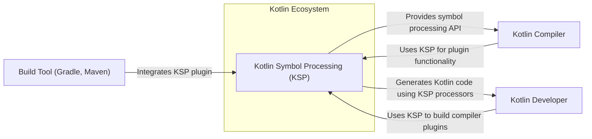
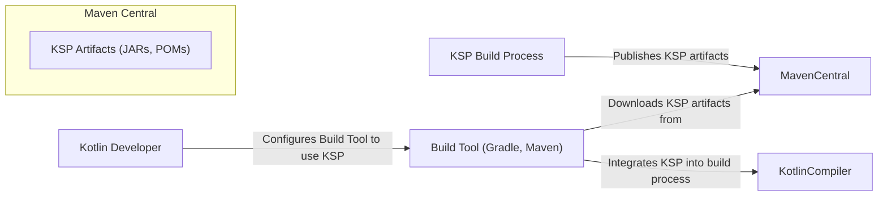

# BUSINESS POSTURE

This project, Kotlin Symbol Processing (KSP), aims to provide a simplified API for Kotlin compiler plugins. It focuses on improving the developer experience by offering a more efficient and easier-to-use alternative to Kotlin Annotation Processing (KAPT). The primary business goal is to enhance the Kotlin ecosystem, making it more attractive for developers by enabling faster compilation, cleaner code generation, and better code analysis tools.

Business priorities:
- Improve Kotlin compilation speed and efficiency.
- Simplify the development of Kotlin compiler plugins.
- Enhance the Kotlin developer experience.
- Foster a vibrant ecosystem of Kotlin compiler plugins.

Business risks:
- Risk of adoption failure if KSP does not provide significant advantages over existing solutions like KAPT.
- Risk of performance issues if KSP introduces bottlenecks or inefficiencies.
- Risk of security vulnerabilities in KSP itself, potentially affecting all projects using it.
- Risk of compatibility issues with different Kotlin versions or build environments.
- Risk of community fragmentation if KSP and KAPT ecosystems diverge significantly.

# SECURITY POSTURE

Existing security controls:
- security control: Github repository with access control for contributors. Implemented in Github repository settings.
- security control: Version control using Git. Implemented in Github repository.
- security control: Publicly accessible repository for transparency and community contributions. Implemented in Github repository settings.
- accepted risk: Reliance on open-source community for security contributions and vulnerability reporting.
- accepted risk: Potential for vulnerabilities to be introduced by community contributions.

Recommended security controls:
- security control: Implement automated dependency scanning to identify vulnerabilities in third-party libraries used by KSP.
- security control: Integrate static application security testing (SAST) tools into the build pipeline to detect potential code-level vulnerabilities.
- security control: Establish a clear process for security vulnerability reporting and response.
- security control: Perform regular security code reviews, especially for critical components and contributions from external sources.
- security control: Implement build process hardening to ensure the integrity of build artifacts.

Security requirements:
- Authentication: Not directly applicable to KSP itself as a library. Authentication is relevant for contributors to the KSP project (handled by Github).
- Authorization: Access control to the KSP Github repository and related resources. Implemented by Github repository permissions.
- Input validation: KSP processors should perform input validation on data they receive from the Kotlin compiler to prevent unexpected behavior or vulnerabilities in generated code.
- Cryptography: Not directly applicable to the core functionality of KSP. Cryptographic considerations might be relevant for specific KSP processors if they handle sensitive data, but this is outside the scope of KSP itself.

# DESIGN

## C4 CONTEXT



### C4 CONTEXT Elements

- Name: Kotlin Developer
  - Type: Person
  - Description: Software developers who use Kotlin programming language and want to extend the Kotlin compiler functionality.
  - Responsibilities: Develop Kotlin applications and compiler plugins using KSP.
  - Security controls: Local development environment security, secure coding practices when developing KSP processors.

- Name: Build Tool (Gradle, Maven)
  - Type: Software System
  - Description: Build automation tools commonly used in Kotlin projects to manage dependencies, compile code, and package applications.
  - Responsibilities: Integrate KSP plugin into the build process, manage KSP dependencies, and execute KSP processors during compilation.
  - Security controls: Build tool configuration security, dependency management security, secure plugin resolution.

- Name: Kotlin Compiler
  - Type: Software System
  - Description: The core component of the Kotlin language toolchain responsible for compiling Kotlin code into bytecode.
  - Responsibilities: Invoke KSP during compilation, provide necessary information to KSP for symbol processing, and integrate generated code.
  - Security controls: Compiler security, input validation of processed symbols, secure interaction with KSP API.

- Name: Kotlin Symbol Processing (KSP)
  - Type: Software System
  - Description: A library that provides an API for building Kotlin compiler plugins, simplifying the process of code generation and analysis.
  - Responsibilities: Provide a user-friendly API for symbol processing, efficiently process Kotlin code symbols, generate code based on processor logic, and integrate with the Kotlin compiler and build tools.
  - Security controls: Input validation of compiler data, secure API design, protection against malicious processors, build process security, dependency management security.

## C4 CONTAINER

```mermaid
flowchart LR
    subgraph Kotlin Symbol Processing (KSP)
        subgraph KSP Core
            KSPAPI["KSP API"]
            KSPCoreLib["KSP Core Library"]
        end
        subgraph KSP Plugins
            KSPGradlePlugin["KSP Gradle Plugin"]
            KSPMavenPlugin["KSP Maven Plugin"]
        end
    end

    KotlinCompiler -->|Uses KSP API| KSPAPI
    KSPAPI -->|Implements core logic| KSPCoreLib
    KSPGradlePlugin -->|Integrates with Gradle| KSPCoreLib
    KSPMavenPlugin -->|Integrates with Maven| KSPCoreLib
    BuildTool -->|Uses KSP Plugins| KSPPlugins
    Developer -->|Uses KSP API in processors| KSPAPI
```

### C4 CONTAINER Elements

- Name: KSP API
  - Type: Library
  - Description: Publicly exposed API that Kotlin compiler plugins and KSP processors use to interact with KSP for symbol processing.
  - Responsibilities: Define the interface for symbol processing, provide access to Kotlin code metadata, and facilitate code generation.
  - Security controls: API design security, input validation, rate limiting (if applicable), documentation security.

- Name: KSP Core Library
  - Type: Library
  - Description: Contains the core logic of KSP, including symbol resolution, processing algorithms, and code generation functionalities.
  - Responsibilities: Implement the core symbol processing logic, manage internal data structures, and ensure efficient and secure processing.
  - Security controls: Secure coding practices, input validation, memory management, vulnerability scanning, code review.

- Name: KSP Gradle Plugin
  - Type: Plugin
  - Description: Gradle plugin that integrates KSP into the Gradle build system, allowing developers to use KSP processors in Gradle-based Kotlin projects.
  - Responsibilities: Configure KSP within Gradle, manage KSP dependencies, execute KSP processors during Gradle builds, and provide Gradle-specific configurations.
  - Security controls: Plugin configuration security, secure dependency resolution, input validation of Gradle configurations, secure communication with KSP Core Library.

- Name: KSP Maven Plugin
  - Type: Plugin
  - Description: Maven plugin that integrates KSP into the Maven build system, enabling the use of KSP processors in Maven-based Kotlin projects.
  - Responsibilities: Configure KSP within Maven, manage KSP dependencies, execute KSP processors during Maven builds, and provide Maven-specific configurations.
  - Security controls: Plugin configuration security, secure dependency resolution, input validation of Maven configurations, secure communication with KSP Core Library.

## DEPLOYMENT

KSP is primarily deployed as a library and build tool plugins. The deployment process involves publishing the KSP artifacts to public repositories like Maven Central, which allows developers to easily include KSP in their Kotlin projects using build tools like Gradle and Maven.

Deployment Architecture: Public Artifact Repository (Maven Central)



### DEPLOYMENT Elements

- Name: Maven Central
  - Type: Artifact Repository
  - Description: A public repository for Java and Kotlin libraries and plugins, widely used for distributing open-source and commercial software components.
  - Responsibilities: Host KSP artifacts, provide access to developers and build tools for downloading KSP, ensure artifact integrity and availability.
  - Security controls: Repository security, access control for publishing artifacts, artifact signing, vulnerability scanning of hosted artifacts.

- Name: KSP Artifacts (JARs, POMs)
  - Type: Software Artifacts
  - Description: Compiled JAR files of KSP libraries and plugins, along with POM files containing metadata and dependency information, ready for deployment to artifact repositories.
  - Responsibilities: Package KSP code into deployable artifacts, include necessary metadata for dependency management, ensure artifact integrity and security.
  - Security controls: Build process security, artifact signing, vulnerability scanning before deployment.

- Name: KSP Build Process
  - Type: Automated Process
  - Description: The automated process that compiles KSP code, runs tests, packages artifacts, and publishes them to Maven Central.
  - Responsibilities: Build KSP from source code, ensure build reproducibility, perform security checks during build, and securely publish artifacts.
  - Security controls: Build environment security, access control to build systems, secure artifact publishing, build pipeline security.

## BUILD

The KSP build process is likely automated using CI/CD pipelines, potentially leveraging GitHub Actions, given it's a GitHub repository. The process would involve compiling Kotlin code, running unit and integration tests, performing static analysis, and packaging the artifacts for deployment. Security in the build process is crucial to ensure the integrity and trustworthiness of the distributed KSP artifacts.

```mermaid
flowchart LR
    Developer["Developer"] -->|Code changes, commits, pushes| SourceCodeRepository["Source Code Repository (GitHub)"]
    SourceCodeRepository -->|Triggers build on code changes| CI_CD_System["CI/CD System (GitHub Actions)"]
    CI_CD_System -->|Build KSP code, run tests, SAST, dependency scan| BuildEnvironment["Build Environment"]
    BuildEnvironment -->|Produce build artifacts (JARs, POMs)| ArtifactStorage["Artifact Storage"]
    ArtifactStorage -->|Sign artifacts| SigningProcess["Signing Process"]
    SigningProcess -->|Publish signed artifacts| ArtifactRepository["Artifact Repository (Maven Central)"]
```

### BUILD Elements

- Name: Source Code Repository (GitHub)
  - Type: Version Control System
  - Description: Git repository hosted on GitHub, used to store and manage the KSP source code and track changes.
  - Responsibilities: Version control, code collaboration, trigger CI/CD pipelines on code changes.
  - Security controls: Access control, branch protection, commit signing, vulnerability scanning of repository configurations.

- Name: CI/CD System (GitHub Actions)
  - Type: Automation System
  - Description: Automated system for building, testing, and deploying KSP, likely using GitHub Actions workflows defined in the repository.
  - Responsibilities: Automate build process, run tests, perform security checks, and orchestrate artifact publishing.
  - Security controls: Workflow security, access control to CI/CD configurations, secret management, secure build environment provisioning.

- Name: Build Environment
  - Type: Computing Environment
  - Description: Isolated and controlled environment where the KSP code is compiled and tested during the build process.
  - Responsibilities: Provide necessary tools and dependencies for building KSP, ensure build reproducibility and isolation, and execute build steps securely.
  - Security controls: Environment hardening, access control, vulnerability scanning of build tools and dependencies, secure configuration management.

- Name: Artifact Storage
  - Type: Storage System
  - Description: Temporary storage location for build artifacts (JARs, POMs) before they are signed and published.
  - Responsibilities: Securely store build artifacts, ensure artifact integrity, and provide access to signing process.
  - Security controls: Access control, encryption at rest, integrity checks.

- Name: Signing Process
  - Type: Cryptographic Process
  - Description: Process of digitally signing the KSP artifacts to ensure their authenticity and integrity, preventing tampering and verifying the publisher.
  - Responsibilities: Generate and apply digital signatures to artifacts using private keys, ensure secure key management, and verify signatures during artifact consumption.
  - Security controls: Key management security, secure signing process, timestamping, signature verification.

- Name: Artifact Repository (Maven Central)
  - Type: Artifact Repository
  - Description: Public repository where signed KSP artifacts are published and made available for download by developers and build tools.
  - Responsibilities: Host and distribute KSP artifacts, ensure artifact availability and integrity, and provide secure access for downloading artifacts.
  - Security controls: Repository security, access control for publishing, artifact verification, vulnerability scanning of hosted artifacts.

# RISK ASSESSMENT

Critical business process:
- Development and distribution of Kotlin compiler plugins. KSP aims to simplify and improve this process, making it more efficient and secure. Disruption to KSP development or distribution would impact the Kotlin plugin ecosystem.
- Kotlin project builds relying on KSP. If KSP artifacts are compromised or unavailable, builds might fail, impacting developer productivity and project timelines.

Data we are trying to protect:
- KSP Source code: Publicly available, but integrity is crucial to prevent malicious modifications. Sensitivity: Public, Integrity: High.
- KSP Build artifacts (JARs, POMs): Publicly distributed, but integrity and authenticity are paramount to prevent supply chain attacks. Sensitivity: Public, Integrity: Critical, Authenticity: Critical.
- KSP Signing keys: Private keys used to sign artifacts. Confidentiality and integrity are critical to maintain trust in KSP artifacts. Sensitivity: Confidential, Integrity: Critical.

# QUESTIONS & ASSUMPTIONS

Questions:
- What is the intended target audience for KSP? Is it primarily for Google internal projects, or is it intended for the wider Kotlin community?
- Are there specific security requirements or compliance standards that KSP needs to adhere to?
- Is there an existing security vulnerability reporting process for KSP?
- What is the expected lifespan and maintenance plan for KSP?
- Are there any specific performance benchmarks or scalability requirements for KSP?

Assumptions:
- KSP is intended to be an open-source project and community-driven.
- KSP will be distributed through public artifact repositories like Maven Central.
- Security and performance are important considerations for the KSP project.
- The KSP build process is automated and utilizes CI/CD practices.
- KSP aims to improve upon existing Kotlin compiler plugin solutions like KAPT in terms of performance and developer experience.