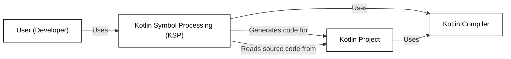
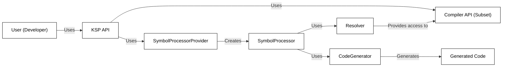
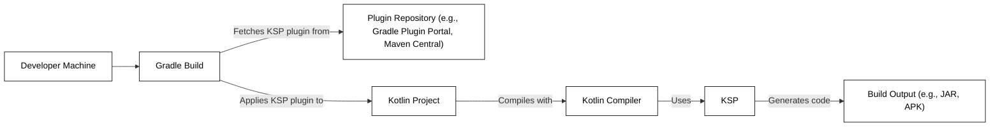
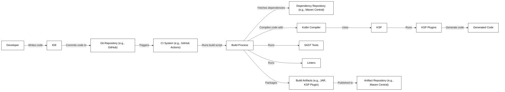

# BUSINESS POSTURE

Business Priorities and Goals:

*   Provide a simplified compiler plugin API for Kotlin, reducing the learning curve and maintenance effort compared to traditional compiler plugins.
*   Improve build performance by minimizing code generation and leveraging incremental compilation.
*   Enable cross-platform development by supporting Kotlin/JVM, Kotlin/JS, and Kotlin/Native.
*   Offer a stable and well-maintained API, ensuring compatibility with future Kotlin compiler versions.
*   Facilitate the development of code analysis, code generation, and other compiler-related tools.

Business Risks:

*   Incompatibility with future Kotlin compiler versions, breaking existing plugins.
*   Performance issues arising from inefficient plugin implementations or API limitations.
*   Security vulnerabilities introduced by malicious or poorly written plugins.
*   Limited adoption due to lack of awareness or perceived complexity.
*   Competition from alternative solutions or built-in compiler features.

# SECURITY POSTURE

Existing Security Controls:

*   security control: KSP is designed to operate within the secure sandbox of the Kotlin compiler. It does not have direct access to the file system or network, except what's provided by the compiler. (Described in KSP documentation and source code).
*   security control: KSP leverages the Kotlin compiler's existing security mechanisms for parsing and type checking, reducing the risk of vulnerabilities related to input handling. (Described in KSP documentation and source code).
*   security control: Code generated by KSP is subject to the same security checks and compilation processes as regular Kotlin code. (Described in KSP documentation and source code).

Accepted Risks:

*   accepted risk: KSP plugins, being user-provided code, can potentially introduce security vulnerabilities if not carefully developed and reviewed.
*   accepted risk: Bugs or limitations in the KSP API could potentially be exploited to compromise the build process or generate malicious code.

Recommended Security Controls:

*   security control: Implement a mechanism for signing and verifying KSP plugins to ensure their authenticity and integrity.
*   security control: Provide guidelines and tools for developers to perform security reviews of their KSP plugins.
*   security control: Consider sandboxing the execution of KSP plugins further, limiting their access to compiler internals and resources.

Security Requirements:

*   Authentication: Not directly applicable to KSP itself, as it operates within the context of the build system. However, any external services or resources accessed by KSP plugins should implement appropriate authentication mechanisms.
*   Authorization: KSP plugins should operate with the least privilege necessary to perform their tasks. The API should restrict access to sensitive compiler features and data.
*   Input Validation: KSP should validate the input it receives from the compiler and from user-provided configurations to prevent injection attacks or other vulnerabilities.
*   Cryptography: If KSP plugins handle sensitive data, they should use appropriate cryptographic techniques for storage and transmission. KSP itself does not inherently require cryptography, but plugins might.

# DESIGN

## C4 CONTEXT

Element Descriptions:

*   Element:
    *   Name: User (Developer)
    *   Type: Person
    *   Description: A software developer who uses KSP to create compiler plugins.
    *   Responsibilities: Writes KSP plugins, configures KSP in the build system, and uses the generated code.
    *   Security controls: Follows secure coding practices when developing KSP plugins.

*   Element:
    *   Name: Kotlin Symbol Processing (KSP)
    *   Type: Software System
    *   Description: An API for creating lightweight compiler plugins in Kotlin.
    *   Responsibilities: Provides an API for analyzing Kotlin code and generating new code, interacts with the Kotlin compiler, manages plugin execution.
    *   Security controls: Operates within the compiler sandbox, leverages compiler's security mechanisms, validates input.

*   Element:
    *   Name: Kotlin Compiler
    *   Type: Software System
    *   Description: The official Kotlin compiler.
    *   Responsibilities: Compiles Kotlin code, provides information to KSP, integrates generated code.
    *   Security controls: Standard compiler security measures, input validation, secure code generation.

*   Element:
    *   Name: Kotlin Project
    *   Type: Software System
    *   Description: A Kotlin project that uses KSP.
    *   Responsibilities: Contains source code, build configuration, and KSP plugins.
    *   Security controls: Depends on the security practices followed in the project.

## C4 CONTAINER

Element Descriptions:

*   Element:
    *   Name: User (Developer)
    *   Type: Person
    *   Description: A software developer who uses KSP to create compiler plugins.
    *   Responsibilities: Writes KSP plugins, configures KSP in the build system, and uses the generated code.
    *   Security controls: Follows secure coding practices when developing KSP plugins.

*   Element:
    *   Name: KSP API
    *   Type: API
    *   Description: The public API of KSP, used by developers to create plugins.
    *   Responsibilities: Provides interfaces for SymbolProcessorProvider, SymbolProcessor, Resolver, and CodeGenerator.
    *   Security controls: Input validation, access control to compiler internals.

*   Element:
    *   Name: SymbolProcessorProvider
    *   Type: Interface
    *   Description: An interface implemented by plugin developers to create SymbolProcessors.
    *   Responsibilities: Creates instances of SymbolProcessor.
    *   Security controls: User-provided code, should follow secure coding practices.

*   Element:
    *   Name: SymbolProcessor
    *   Type: Interface
    *   Description: An interface implemented by plugin developers to define the processing logic.
    *   Responsibilities: Analyzes code, generates code, interacts with the Resolver and CodeGenerator.
    *   Security controls: User-provided code, should follow secure coding practices.

*   Element:
    *   Name: Resolver
    *   Type: Interface
    *   Description: Provides access to compiler symbols and type information.
    *   Responsibilities: Resolves types, symbols, and declarations.
    *   Security controls: Provides a controlled view of the compiler API.

*   Element:
    *   Name: CodeGenerator
    *   Type: Interface
    *   Description: Provides methods for generating new code files.
    *   Responsibilities: Creates new source files, resources, and class files.
    *   Security controls: Limits file system access to designated output directories.

*   Element:
    *   Name: Compiler API (Subset)
    *   Type: API
    *   Description: A limited subset of the Kotlin compiler API exposed to KSP.
    *   Responsibilities: Provides information about the code being compiled.
    *   Security controls: Restricted access to prevent misuse.

*   Element:
    *   Name: Generated Code
    *   Type: Code
    *   Description: The code generated by KSP plugins.
    *   Responsibilities: Varies depending on the plugin.
    *   Security controls: Subject to the same security checks as regular Kotlin code.

## DEPLOYMENT

Deployment Solutions:

1.  Gradle Plugin: KSP integrates seamlessly with Gradle, the primary build system for Kotlin projects.
2.  Maven Plugin: KSP also provides a Maven plugin for projects using Maven.
3.  Command-line Tool: KSP can be used as a standalone command-line tool, although this is less common.

Chosen Solution (Gradle Plugin):

Element Descriptions:

*   Element:
    *   Name: Developer Machine
    *   Type: Infrastructure
    *   Description: The machine where the developer writes and builds the code.
    *   Responsibilities: Hosts the development environment, build tools, and source code.
    *   Security controls: Standard developer machine security measures.

*   Element:
    *   Name: Gradle Build
    *   Type: Process
    *   Description: The Gradle build process.
    *   Responsibilities: Manages dependencies, compiles code, runs tests, packages the application.
    *   Security controls: Secure configuration of Gradle, dependency verification.

*   Element:
    *   Name: Plugin Repository
    *   Type: Infrastructure
    *   Description: A repository that hosts KSP plugins (e.g., Gradle Plugin Portal, Maven Central).
    *   Responsibilities: Stores and serves plugin artifacts.
    *   Security controls: Repository security measures, access control, integrity checks.

*   Element:
    *   Name: Kotlin Project
    *   Type: Software System
    *   Description: The Kotlin project being built.
    *   Responsibilities: Contains source code, build configuration, and KSP plugins.
    *   Security controls: Depends on the security practices followed in the project.

*   Element:
    *   Name: Kotlin Compiler
    *   Type: Software System
    *   Description: The Kotlin compiler.
    *   Responsibilities: Compiles Kotlin code, invokes KSP.
    *   Security controls: Standard compiler security measures.

*   Element:
    *   Name: KSP
    *   Type: Software System
    *   Description: Kotlin Symbol Processing.
    *   Responsibilities: Processes code, generates new code.
    *   Security controls: Operates within the compiler sandbox.

*   Element:
    *   Name: Build Output
    *   Type: Artifact
    *   Description: The output of the build process (e.g., JAR, APK).
    *   Responsibilities: Contains the compiled code and generated code.
    *   Security controls: Depends on how the build output is handled and deployed.

## BUILD

Build Process Description:

1.  Developer writes code in an IDE and commits it to a Git repository (e.g., GitHub).
2.  The commit triggers a CI system (e.g., GitHub Actions).
3.  The CI system runs a build script.
4.  The build process fetches dependencies from a dependency repository (e.g., Maven Central).
5.  The build process compiles the code using the Kotlin compiler.
6.  The Kotlin compiler invokes KSP.
7.  KSP runs the configured KSP plugins.
8.  KSP plugins generate code.
9.  The build process runs SAST tools and linters to check for security vulnerabilities and code quality issues.
10. The build process packages the compiled code and generated code into build artifacts (e.g., JAR, KSP Plugin).
11. The build artifacts are published to an artifact repository (e.g., Maven Central).

Security Controls in Build Process:

*   Dependency Verification: The build system should verify the integrity of dependencies using checksums or signatures.
*   SAST (Static Application Security Testing): SAST tools should be integrated into the build process to identify potential security vulnerabilities in the code.
*   Linters: Linters should be used to enforce coding standards and identify potential code quality issues.
*   Secure Build Environment: The CI system should run in a secure environment with limited access and permissions.
*   Artifact Signing: Build artifacts should be signed to ensure their authenticity and integrity.
*   Supply Chain Security: Measures should be taken to secure the entire software supply chain, from code commit to artifact deployment.

# RISK ASSESSMENT

Critical Business Processes:

*   Compilation of Kotlin code: KSP is deeply integrated with the Kotlin compilation process. Any failure or vulnerability in KSP can directly impact the ability to build Kotlin applications.
*   Code Generation: KSP is used for code generation, which is a critical part of many development workflows. Incorrect or malicious code generation can lead to application defects or security vulnerabilities.
*   Plugin Ecosystem: KSP enables a plugin ecosystem. The security and reliability of these plugins are crucial for the overall health of the KSP ecosystem.

Data Sensitivity:

*   Source Code: KSP processes Kotlin source code, which may contain sensitive business logic, intellectual property, or security-related information. The sensitivity level depends on the specific project.
*   Generated Code: The code generated by KSP may also contain sensitive information, depending on the nature of the plugin and the input code.
*   Compiler Symbols: KSP has access to compiler symbols, which represent the structure and types of the code. While not directly user data, this information could potentially be used to infer sensitive details about the application.
*   Build Artifacts: KSP plugins and the resulting build artifacts (JARs, etc.) are not typically considered to contain *user* data. However, they could contain proprietary code or be targets for supply chain attacks.

# QUESTIONS & ASSUMPTIONS

Questions:

*   What specific types of Kotlin projects will be using KSP (e.g., Android, backend, multiplatform)? This will influence the deployment and security considerations.
*   What is the expected level of expertise of developers writing KSP plugins? This will impact the need for security guidelines and training.
*   Are there any specific regulatory or compliance requirements that need to be considered?
*   What is the process for reviewing and approving KSP plugins before they are used in production builds?
*   What mechanisms are in place to monitor the performance and security of KSP plugins during runtime?

Assumptions:

*   BUSINESS POSTURE: The primary goal is to provide a stable and efficient API for Kotlin compiler plugins, prioritizing developer productivity and build performance.
*   SECURITY POSTURE: The Kotlin compiler and build system provide a baseline level of security. KSP plugins are assumed to be potentially untrusted and require careful review.
*   DESIGN: The Gradle plugin is the primary deployment mechanism. The build process includes standard security checks like SAST and linters. The CI system is assumed to be securely configured.